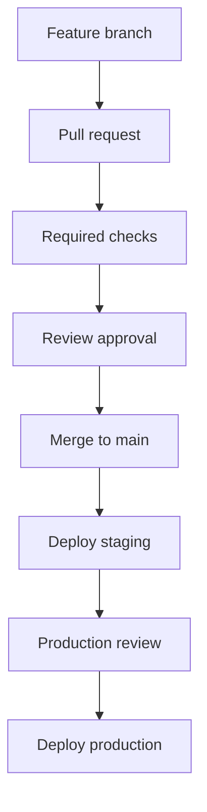

## Table of Contents

1. [Two Gates in the Same Delivery Path](#two-gates-in-the-same-delivery-path)
2. [The Operating Model for devpolaris-orders-api](#the-operating-model-for-devpolaris-orders-api)
3. [Trust Boundaries in the Workflow](#trust-boundaries-in-the-workflow)
4. [Evidence Review During a Pull Request](#evidence-review-during-a-pull-request)
5. [Diagnostic Path When the Check Fails](#diagnostic-path-when-the-check-fails)
6. [Common Failure Modes](#common-failure-modes)
7. [Engineering Tradeoffs](#engineering-tradeoffs)
8. [Operational Checklist](#operational-checklist)

## Two Gates in the Same Delivery Path

A production release begins before the deploy job, because code first has to enter the branch the pipeline trusts. The repository is a Node.js orders service with pull request checks, a main branch release workflow, and production deployment through GitHub Actions. The security control only matters when it changes that path in a way a reviewer can see.

The concept fits between source control and production. It does not replace code review, tests, or runtime monitoring. It gives the team evidence before a risky change gets merged, packaged, or deployed. In this article the same service appears in every example so the checks stay connected to real work instead of floating as separate rules.

```yaml
name: pipeline-security

on:
  pull_request:
  push:
    branches: [main]

permissions:
  contents: read

jobs:
  test:
    runs-on: ubuntu-latest
    steps:
      - uses: actions/checkout@v4
      - uses: actions/setup-node@v4
        with:
          node-version-file: .nvmrc
          cache: npm
      - run: npm ci
      - run: npm test
```

## The Operating Model for devpolaris-orders-api

The team treats the pipeline as a small production system. It has inputs, permissions, logs, artifacts, and failure states. A workflow file is reviewed like application code because it decides which commands run, which tokens are available, and which output becomes trusted.

The useful mental model is a chain of custody. Source code enters from a branch, checks run on a runner, evidence is uploaded, and a deploy job changes an environment. If one link is too broad or too quiet, the team loses the ability to explain what happened later.

```text
Branch: main
Required pull request reviews: 1
Dismiss stale approvals: enabled
Required checks: unit-test, npm-audit, codeql
Require branches to be up to date: enabled
Allow force pushes: disabled
```

## Trust Boundaries in the Workflow

A trust boundary is the line between work the team has reviewed and work it has not reviewed yet. Pull request code is lower trust than code merged to main. A production deployment job is higher impact than a unit test job. Good pipeline security keeps those differences visible in YAML and repository settings.

For this service, pull request jobs should not receive production secrets, write package releases, or run on production network runners. Release jobs can receive more access, but only after the earlier evidence exists. The boundary is not about distrusting developers. It is about limiting what a mistake or compromised dependency can do.

```text
Pull request #533
Merge blocked
Required status check "unit-test" was not reported.
Recent checks reported:
  test-node: success
  npm-audit: success
  codeql: success
```

## Evidence Review During a Pull Request

A security check is only useful if humans know how to read its output. Reviewers should look for the field that proves the claim: a package path, an alert rule, a runner label, a token scope, an environment name, a checksum, or a digest. Without that field, the result becomes a red or green badge with little teaching value.

The devpolaris-orders-api team keeps the review question concrete: does this change increase what untrusted code can touch, and does the evidence show the exact file, job, or artifact involved? That question works for most pipeline controls in this module.

```yaml
jobs:
  deploy-production:
    needs: deploy-staging
    runs-on: ubuntu-latest
    environment: production
    steps:
      - run: ./scripts/deploy.sh production
```

## Diagnostic Path When the Check Fails

Start diagnosis with the smallest artifact that names the failure. In GitHub Actions that is often the failed job, step, exit code, and first meaningful log line. After that, move to the source file or repository setting that controls the behavior. Reading every log line first wastes time because pipeline failures usually point to one missing permission, one changed path, or one blocked gate.

The fix direction should change the system, not only silence the symptom. If a scanner reports a real issue, update the dependency or code path. If a deployment waits for approval, review the environment rule. If a checksum fails, stop the deployment and rebuild from trusted source.

```text
Deployment review: production
Workflow: release.yml
Commit: 4fd19ab
Environment: production
Status: waiting
Required reviewers: platform-oncall
Staging smoke test: passed
```

## Common Failure Modes

Failure modes are patterns that repeat across teams. A job can run with a broader token than it needs. A pull request can trigger work on a trusted runner. A scanner can fail closed and block a merge, or fail open because nobody made it required. An artifact can be rebuilt in deploy instead of verified from build output.

The right response is specific to the failure. Broad permissions need a narrower `permissions:` block. Missing evidence needs a workflow change. Noisy alerts need triage rules, not deletion. A bypass needs an owner and a record because future reviewers need to know why the normal path was not used.

| Symptom | Gate | Inspect | Fix direction |
| :--- | :--- | :--- | :--- |
| Merge button disabled | Branch protection | PR checks and rule | Fix check or rule name |
| Job says waiting | Environment | Deployment review panel | Approve or reject |
| Secret missing | Environment | Job environment value | Use correct scope |

## Engineering Tradeoffs

Every control has a cost. Hosted runners reduce operational burden, but may not reach private networks. Self-hosted runners can deploy inside a network, but they need isolation and cleanup. Strict scan thresholds catch risk earlier, but they can slow urgent fixes. Protected environments create a useful pause, but they require reviewers who understand the evidence.

Good teams make those tradeoffs explicit. For devpolaris-orders-api, the default is strict on production paths and practical on development paths. Pull requests get fast checks with no secrets. Main branch builds create durable evidence. Production deployment waits for a reviewer only after staging has passed.



## Operational Checklist

The checklist at the end of a pipeline-security article should not be a substitute for thought. It is a memory aid for review and incident response. When the pipeline changes, each item asks whether the trusted path is still clear.

Use the checklist while reading workflow diffs. If the answer is not obvious from YAML, repository settings, or a log artifact, add the missing evidence before production depends on it.

- Protect `main` from direct pushes.
- Keep required check names stable.
- Scope production secrets to the production environment.
- Require evidence review before production approval.

- Review note: source protection and deployment protection should produce reviewable evidence before production changes.

- Review note: source protection and deployment protection should produce reviewable evidence before production changes.

- Review note: source protection and deployment protection should produce reviewable evidence before production changes.

- Review note: source protection and deployment protection should produce reviewable evidence before production changes.

- Review note: source protection and deployment protection should produce reviewable evidence before production changes.

- Review note: source protection and deployment protection should produce reviewable evidence before production changes.

- Review note: source protection and deployment protection should produce reviewable evidence before production changes.

- Review note: source protection and deployment protection should produce reviewable evidence before production changes.

- Review note: source protection and deployment protection should produce reviewable evidence before production changes.

- Review note: source protection and deployment protection should produce reviewable evidence before production changes.

- Review note: source protection and deployment protection should produce reviewable evidence before production changes.

- Review note: source protection and deployment protection should produce reviewable evidence before production changes.

- Review note: source protection and deployment protection should produce reviewable evidence before production changes.

- Review note: source protection and deployment protection should produce reviewable evidence before production changes.

- Review note: source protection and deployment protection should produce reviewable evidence before production changes.

- Review note: source protection and deployment protection should produce reviewable evidence before production changes.

- Review note: source protection and deployment protection should produce reviewable evidence before production changes.

- Review note: source protection and deployment protection should produce reviewable evidence before production changes.

- Review note: source protection and deployment protection should produce reviewable evidence before production changes.

- Review note: source protection and deployment protection should produce reviewable evidence before production changes.

- Review note: source protection and deployment protection should produce reviewable evidence before production changes.

- Review note: source protection and deployment protection should produce reviewable evidence before production changes.

- Review note: source protection and deployment protection should produce reviewable evidence before production changes.

- Review note: source protection and deployment protection should produce reviewable evidence before production changes.

- Review note: source protection and deployment protection should produce reviewable evidence before production changes.

- Review note: source protection and deployment protection should produce reviewable evidence before production changes.

- Review note: source protection and deployment protection should produce reviewable evidence before production changes.

- Review note: source protection and deployment protection should produce reviewable evidence before production changes.

- Review note: source protection and deployment protection should produce reviewable evidence before production changes.

- Review note: source protection and deployment protection should produce reviewable evidence before production changes.

- Review note: source protection and deployment protection should produce reviewable evidence before production changes.

- Review note: source protection and deployment protection should produce reviewable evidence before production changes.

- Review note: source protection and deployment protection should produce reviewable evidence before production changes.

- Review note: source protection and deployment protection should produce reviewable evidence before production changes.

- Review note: source protection and deployment protection should produce reviewable evidence before production changes.

- Review note: source protection and deployment protection should produce reviewable evidence before production changes.

- Review note: source protection and deployment protection should produce reviewable evidence before production changes.

- Review note: source protection and deployment protection should produce reviewable evidence before production changes.

- Review note: source protection and deployment protection should produce reviewable evidence before production changes.

- Review note: source protection and deployment protection should produce reviewable evidence before production changes.

- Review note: source protection and deployment protection should produce reviewable evidence before production changes.

- Review note: source protection and deployment protection should produce reviewable evidence before production changes.

- Review note: source protection and deployment protection should produce reviewable evidence before production changes.

- Review note: source protection and deployment protection should produce reviewable evidence before production changes.

- Review note: source protection and deployment protection should produce reviewable evidence before production changes.

- Review note: source protection and deployment protection should produce reviewable evidence before production changes.

- Review note: source protection and deployment protection should produce reviewable evidence before production changes.

- Review note: source protection and deployment protection should produce reviewable evidence before production changes.

- Review note: source protection and deployment protection should produce reviewable evidence before production changes.

- Review note: source protection and deployment protection should produce reviewable evidence before production changes.

- Review note: source protection and deployment protection should produce reviewable evidence before production changes.

- Review note: source protection and deployment protection should produce reviewable evidence before production changes.

- Review note: source protection and deployment protection should produce reviewable evidence before production changes.

- Review note: source protection and deployment protection should produce reviewable evidence before production changes.

- Review note: source protection and deployment protection should produce reviewable evidence before production changes.

- Review note: source protection and deployment protection should produce reviewable evidence before production changes.

- Review note: source protection and deployment protection should produce reviewable evidence before production changes.

- Review note: source protection and deployment protection should produce reviewable evidence before production changes.

- Review note: source protection and deployment protection should produce reviewable evidence before production changes.

- Review note: source protection and deployment protection should produce reviewable evidence before production changes.

- Review note: source protection and deployment protection should produce reviewable evidence before production changes.

- Review note: source protection and deployment protection should produce reviewable evidence before production changes.

- Review note: source protection and deployment protection should produce reviewable evidence before production changes.

- Review note: source protection and deployment protection should produce reviewable evidence before production changes.

- Review note: source protection and deployment protection should produce reviewable evidence before production changes.

- Review note: source protection and deployment protection should produce reviewable evidence before production changes.

- Review note: source protection and deployment protection should produce reviewable evidence before production changes.

- Review note: source protection and deployment protection should produce reviewable evidence before production changes.

- Review note: source protection and deployment protection should produce reviewable evidence before production changes.

- Review note: source protection and deployment protection should produce reviewable evidence before production changes.

- Review note: source protection and deployment protection should produce reviewable evidence before production changes.

- Review note: source protection and deployment protection should produce reviewable evidence before production changes.

- Review note: source protection and deployment protection should produce reviewable evidence before production changes.

- Review note: source protection and deployment protection should produce reviewable evidence before production changes.

- Review note: source protection and deployment protection should produce reviewable evidence before production changes.

- Review note: source protection and deployment protection should produce reviewable evidence before production changes.

- Review note: source protection and deployment protection should produce reviewable evidence before production changes.

- Review note: source protection and deployment protection should produce reviewable evidence before production changes.

- Review note: source protection and deployment protection should produce reviewable evidence before production changes.

---

**References**

- [GitHub protected branches](https://docs.github.com/en/repositories/configuring-branches-and-merges-in-your-repository/managing-protected-branches/about-protected-branches) - Official documentation for branch protection behavior and limits.
- [GitHub environments](https://docs.github.com/en/actions/deployment/targeting-different-environments/using-environments-for-deployment) - Official documentation for deployment environments, reviewers, and secrets.
- [GitHub Actions security hardening](https://docs.github.com/en/actions/security-guides/security-hardening-for-github-actions) - Official guidance for permissions, environments, and secure workflow design.
- [OpenSSF Scorecard](https://github.com/ossf/scorecard) - Canonical project that evaluates repository branch protection practices.
