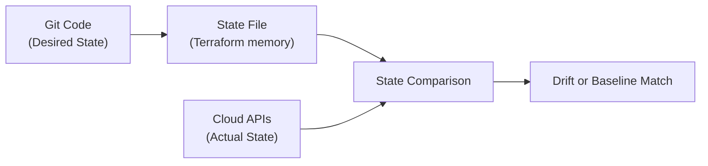
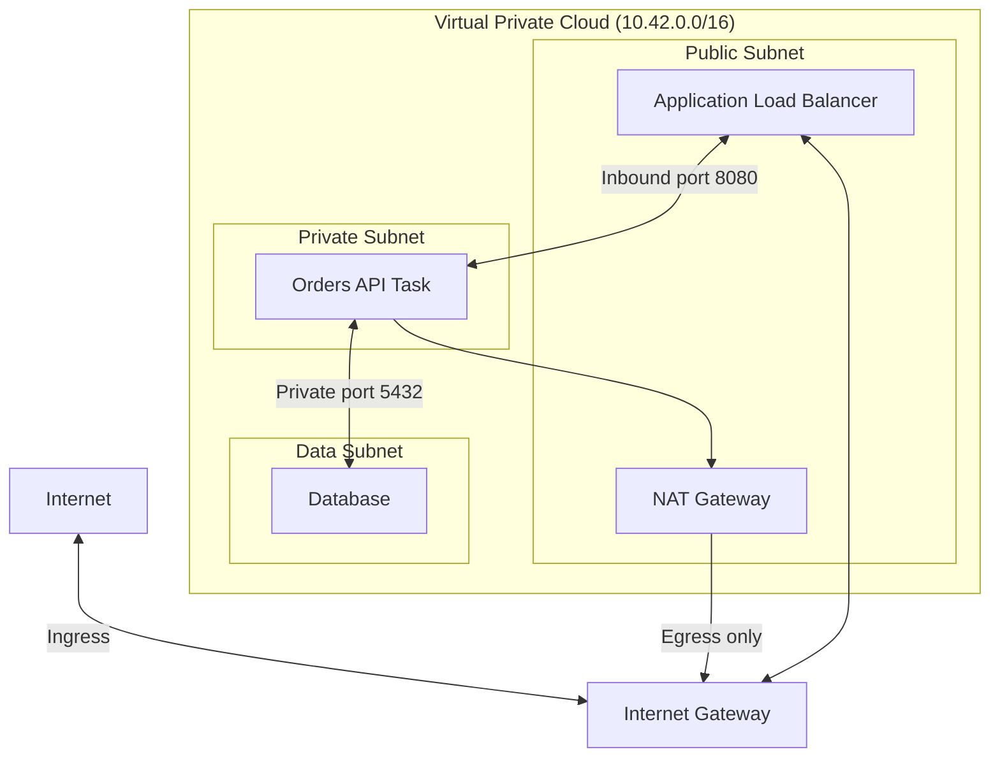

## Table of Contents

1. [The Mirage of the Clean Repository](#the-mirage-of-the-clean-repository)
2. [Understanding Desired State vs. Actual State](#understanding-desired-state-vs-actual-state)
3. [Detecting Drift: The Refresh-Only Planning Loop](#detecting-drift-the-refresh-only-planning-loop)
4. [Revert, Import, or Codify: Handling Discovered Drift](#revert-import-or-codify-handling-discovered-drift)
5. [VPC Network Perimeters: Routing and Gateway Isolation](#vpc-network-perimeters-routing-and-gateway-isolation)
6. [Security Group References vs. Raw CIDR Ranges](#security-group-references-vs-raw-cidr-ranges)
7. [Incident Forensic Auditing: Tracing CloudTrail Logs](#incident-forensic-auditing-tracing-cloudtrail-logs)
8. [Putting It All Together](#putting-it-all-together)

## The Mirage of the Clean Repository

When an engineering team adopts Infrastructure as Code (IaC) and Policy as Code, they establish powerful gates. Every pull request is statically scanned, every Rego policy is executed, and every configuration is peer-reviewed before it merges. The team is confident; their Git repository is clean, encrypted, and compliant.

However, a clean repository can create a dangerous security mirage. The repository represents the **Desired State**—what *should* exist. It does not represent the **Actual State**—what *currently* exists in the live cloud environment. If an engineer logs directly into the cloud provider's web console and manually adds a public firewall rule to resolve a temporary incident, the Git repository remains completely clean. The manual change bypasses all static scans, reviews, and Rego policies.

This difference between code definitions and the active cloud configuration is called **Configuration Drift**. Drift creates silent, undocumented security holes. If manual modifications go unnoticed, your security posture degrades, future deployments inherit stale assumptions, and auditors work from inaccurate records. To secure our cloud perimeters, we must continuously audit the actual environment to detect and reconcile this drift.

## Understanding Desired State vs. Actual State

To operationalize drift detection, we must define the three distinct records that represent our infrastructure:
* **The Code (Desired State)**: The declarative HCL or YAML files committed to your Git repository. This is the peer-reviewed blueprint of your architecture.
* **The State File (Terraform State)**: The machine-readable record that Terraform uses to map resources in your code to real objects in the cloud. It acts as Terraform's historical memory, recording what it last knew about the resources it manages.
* **The Active Cloud (Actual State)**: The running resources currently configured inside your cloud provider's datacenters, queried dynamically via the provider's APIs.



Drift occurs when a resource's actual state disagrees with the desired state or state file. This typically happens for one of four reasons:
* **Manual Console Interventions**: An engineer bypasses pipelines to make urgent, console-based changes during a live operational incident.
* **Ad-Hoc Scripts**: Out-of-band automation or legacy deployment scripts modify resources directly.
* **Provider Default Upgrades**: A cloud provider changes a default attribute setting (like encryption or audit logging) on an existing resource during an API upgrade.
* **Unauthorized Intrusions**: An attacker compromises credentials and manually modifies network rules or creates new, unmanaged compute resources.

Drift detection is the process of continuously comparing these three records, highlighting discrepancies so they can be immediately reconciled.

## Detecting Drift: The Refresh-Only Planning Loop

We detect configuration drift programmatically by running automated, scheduled audits inside our pipelines. The standard method for this is the **Refresh-Only Planning Loop**.

A refresh-only plan asks the cloud provider's APIs for the exact, current state of all managed resources. It updates Terraform's state memory to match the live cloud objects, and compares those values against your repository's code, showing you exactly what changed outside of the standard CI/CD apply path without actually taking any action to modify remote resources:

```bash
$ terraform plan -refresh-only
```

If the actual environment has drifted, the command outputs a detailed diff of the out-of-band modifications:

```text
Note: Objects have changed outside of Terraform

Terraform detected the following changes made outside of Terraform since the last "terraform apply":

  # aws_security_group_rule.orders_admin_ingress has changed
  ~ resource "aws_security_group_rule" "orders_admin_ingress" {
      ~ cidr_blocks = [
          - "10.40.20.0/24",
          + "0.0.0.0/0",
        ]
        from_port   = 9000
        protocol    = "tcp"
        to_port     = 9000
        type        = "ingress"
    }
```

This diff documents the exact security drift: the source `cidr_blocks` was widened from the private corporate VPN range (`10.40.20.0/24`) to the public internet (`0.0.0.0/0`).

It is critical to remember that applying a refresh-only plan merely updates your state file to match the remote objects; it does *not* repair the remote resource. If the console modification is unsafe, applying a refresh-only plan silently records that unsafe configuration in your state file, effectively hiding the vulnerability from standard state audits. To resolve the security hole, we must take deliberate action to reconcile the drift.

## Revert, Import, or Codify: Handling Discovered Drift

Once drift is detected, the platform engineering and security teams must collaborate to investigate *why* the change occurred. After the context is understood, the team takes one of three structured reconciliation actions:

The first action is **Revert**. If the manual change was a mistake, an unapproved test, or a temporary incident workaround that is no longer required, we must restore our secure baseline. We execute a standard pipeline apply, which instructs Terraform to override the cloud API values and force the remote resources back to the reviewed, desired state declared in Git.

The second action is **Codify**. If the manual change was a valid, permanent improvement (such as a network range migration), we must bring the desired state into alignment. We write a pull request updating our repository's Terraform files to match the new cloud values, run it through our standard review and scanning pipeline, and apply it, establishing the new secure baseline.

The third action is **Import**. If an emergency intervention resulted in the creation of an entirely new, unmanaged resource (such as a diagnostic log group or temporary backup bucket), we must bring the object under code management. We use the import command to map the untracked resource's physical ID directly into our Terraform state:

```bash
$ terraform import aws_cloudwatch_log_group.orders_emergency /aws/ecs/orders-api/emergency
```

Importing teaches Terraform about the existing object. The team must then immediately add the matching resource code to their repository and review it, preventing the new resource from remaining an untracked, unmonitored target in the cloud.

## VPC Network Perimeters: Routing and Gateway Isolation

Detecting configuration drift secures the integrity of our code promises. However, we must also design our physical network perimeters to be inherently resilient, isolating internal workloads even if a firewall rule is accidentally drifted or misconfigured. We achieve this by structuring a highly restricted **Virtual Private Cloud (VPC)** topology.

A VPC partitions your cloud network into isolated subnets with distinct routing tables:
* **Public Subnets**: Subnets whose routing tables contain a default route (`0.0.0.0/0`) pointing directly to an **Internet Gateway (IGW)**. Resources in these subnets can receive a public IP address and communicate directly with the internet. We restrict public subnets exclusively to front-door Application Load Balancers (ALBs) or NAT gateways.
* **Private Subnets**: Subnets whose routing tables are completely isolated from the Internet Gateway. To access the public internet (such as downloading patches), processes in these subnets must route traffic through a **NAT Gateway** located in a public subnet. Application containers run exclusively in these private subnets, ensuring they are physically unreachable from direct inbound internet connections.
* **Data Subnets**: Subnets that have no internet routing tables whatsoever (no IGW, no NAT). We reserve these subnets exclusively for databases, ensuring complete data tier isolation.



This structural topology is a powerful defense-in-depth boundary. If a developer accidentally drifts a database's security group to allow ingress from `0.0.0.0/0`, the database remains completely unreachable from the public internet. Because the database resides in a private data subnet with no route to an internet gateway, the public network packets cannot find a physical path to the target, neutralizing the firewall misconfiguration at the routing layer.

## Security Group References vs. Raw CIDR Ranges

When configuring firewalls (Security Groups) inside our VPC, a common beginner mistake is to define access rules using raw, static IP address ranges (CIDRs), such as allowing ingress from `10.42.8.0/24`. While private ranges are safer than the public internet, they are highly fragile. Subnets can scale, IP allocations can shift, and anyone who acquires an IP in that range automatically inherits the path.

To build a resilient firewall boundary, we must configure rules that reference other **Security Groups** rather than raw CIDRs. In cloud-native networks, a security group is a dynamic logical resource that can be referenced directly as a source or destination:

```hcl
resource "aws_security_group_rule" "orders_from_alb" {
  type                     = "ingress"
  security_group_id        = aws_security_group.orders_api.id
  from_port                = 8443
  to_port                  = 8443
  protocol                 = "tcp"
  source_security_group_id = aws_security_group.public_alb.id
}
```

The key argument is `source_security_group_id`. This rule does not bind access to a specific private IP range. Instead, it instructs the cloud hypervisor's virtual firewall to accept traffic on port 8443 *only* if the sending network interface is explicitly associated with the `public_alb` security group. 

For a security reviewer, this completely simplifies the audit. The rule expresses a clear logical relationship: "the load balancer can reach the application." If application tasks scale, migrate across subnets, or change their private IPs, the firewall automatically maintains the secure boundary without requiring manual IP edits or exposing the system to private subnet IP creep.

## Incident Forensic Auditing: Tracing CloudTrail Logs

If a drift sweep reveals an unauthorized or suspicious configuration change in production, the security team must immediately execute a forensic audit to trace *who* made the modification and *how* the boundary was bypassed. We achieve this by analyzing our cloud audit logs, such as AWS CloudTrail.

CloudTrail records every single API operation executed against your cloud account, documenting the identity, the call parameters, the source IP address, and the timestamp. When investigating a security group drift, the team searches for events like `AuthorizeSecurityGroupIngress`:

```json
{
  "eventTime": "2026-05-19T08:31:44Z",
  "eventSource": "ec2.amazonaws.com",
  "eventName": "AuthorizeSecurityGroupIngress",
  "userIdentity": {
    "type": "AssumedRole",
    "arn": "arn:aws:sts::111122223333:assumed-role/break-glass-network-admin/maya-dev"
  },
  "requestParameters": {
    "groupId": "sg-0ordersadmin",
    "ipPermissions": [
      {
        "fromPort": 9000,
        "toPort": 9000,
        "ipRanges": [{"cidrIp": "0.0.0.0/0"}]
      }
    ]
  },
  "sourceIPAddress": "203.0.113.24",
  "userAgent": "console.amazonaws.com",
  "responseElements": {
    "securityGroupRuleSet": {
      "items": [{"securityGroupRuleId": "sgr-0815"}]
    }
  }
}
```

This CloudTrail record provides complete forensic evidence:
* **The Timestamp**: `eventTime` records the exact second the breach occurred.
* **The Operation**: `eventName` confirms that a security group rule was added.
* **The Actor**: `userIdentity.arn` identifies the exact user session (`maya-dev`) that assumed the `break-glass-network-admin` role, connecting the change to a real human account.
* **The Source IP**: `sourceIPAddress` logs the network origin of the API call, while `userAgent` confirms the modification was executed via the web console interface.
* **The Parameters**: `requestParameters` details the exact vulnerability introduced: allowing public ingress on port 9000.

An audit trail like this changes the security conversation. Instead of guessing whether a change was a mistake or an intrusion, the response team can immediately trace the event back to an active incident ticket, verify the authorization, confirm the session's expiry, and safely execute a revert plan to restore the secure baseline.

## Putting It All Together

Securing our cloud perimeters requires constant vigilance over both the blueprints we write and the live environments we operate. By continuously detecting configuration drift through refresh-only planning loops, implementing a structured revert/codify/import reconciliation workflow, structuring highly restricted VPC subnet routing, and auditing account activity with forensic CloudTrail logs, we eliminate the security mirage and protect our perimeters.

When securing your cloud networks and auditing configuration drift, ensure you maintain these six core practices:

First, implement scheduled, automated drift detection sweeps. Run refresh-only planning checks in your pipelines daily, alerting security teams immediately if the active cloud configuration disagrees with your repository.

Second, establish clear reconciliation workflows for all discovered drift. Investigate the operational context of every console change, immediately reverting unapproved modifications and codifying verified improvements through a pull request.

Third, enforce strict VPC subnet isolation. Deploy application containers in private subnets with no route to internet gateways, and restrict database tiers to private data subnets, protecting resources from raw public routing paths.

Fourth, reference security groups dynamically rather than using raw IP CIDR ranges. Bind your firewall rules to logical cloud resources, ensuring that service-to-service communication remains secure as workloads scale.

Fifth, ensure that all cloud API operations are fully recorded in secure, tamper-proof audit logs. Enable CloudTrail across all regions, locking down access permissions to ensure log files cannot be deleted or modified by unauthorized accounts.

Sixth, integrate forensic log auditing into your incident response runbooks. Train your response teams to trace CloudTrail records immediately when drift or perimeter anomalies are discovered, mapping every out-of-band modification to a verified human identity and ticket.


*This summary connects desired state, actual state, refresh checks, drift, perimeter controls, and audit logs.*

