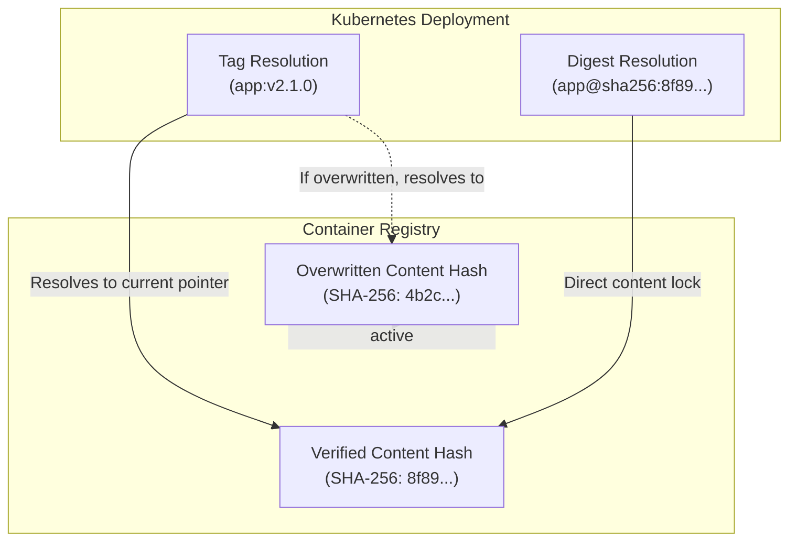

## Table of Contents

1. [The Mutable Tag Vulnerability](#the-mutable-tag-vulnerability)
2. [Enforcing Tag Immutability](#enforcing-tag-immutability)
3. [Digest-Based Resolution](#digest-based-resolution)
4. [Registry Network Isolation](#registry-network-isolation)
5. [Common Registry Failures](#common-registry-failures)
6. [Putting It All Together](#putting-it-all-together)
7. [What's Next](#whats-next)

## The Mutable Tag Vulnerability

In containerized application architectures, deployment systems pull compiled software by referencing a dynamic version tag, such as `v1.0.0` or `latest`. While these tags simplify release tracking, they are simply mutable pointers. If an engineer pushes a new container image using an existing active tag, the registry accepts the push and quietly slides the tag pointer to reference the new image's cryptographic hash.

Consider a Payment Gateway Service that processes thousands of credit card transactions per second. The production deployment manifest instructs the Kubernetes cluster to pull the container image using the `payment-gateway:v2.1.0` tag. An attacker manages to steal push credentials from a junior developer's workstation. They compile a malicious version of the Payment Gateway that logs credit card numbers to an external server and push it to the registry using the exact same `v2.1.0` tag.

```hcl
resource "aws_ecr_repository" "payment_gateway" {
  name                 = "payment-gateway"
  image_tag_mutability = "IMMUTABLE"

  image_scanning_configuration {
    scan_on_push = true
  }

  encryption_configuration {
    encryption_type = "KMS"
  }
}
```

The next time a pod restarts or scales out during a traffic spike, the production cluster pulls the newly pushed image. Because the cluster relies entirely on the mutable tag name, it has no mechanism to recognize that the underlying software has changed. It executes the tampered container without warning, establishing a silent data exfiltration pipeline deep inside the production network.

## Enforcing Tag Immutability

To prevent attackers from silently replacing stable releases, platform teams must configure tag immutability policies at the registry level. This policy acts as a write-once lock. It guarantees that once a version tag is published and bound to a specific container image digest, it remains locked to that exact digest forever.

When a continuous integration pipeline attempts to push a hotfix container using the tag `v2.1.0` to an immutable registry, the registry API intercepts the request. It verifies that the tag is already bound to a previous image, and immediately rejects the push with a `409 Conflict` error. The engineer is forced to increment the version tag to `v2.1.1` to publish the update.

Enforcing tag immutability protects production environments from both deliberate spoofing attacks and accidental human error. It guarantees that the exact code audited during code reviews and compiled by the secure build pipeline remains the exact code executing in the cluster.

## Digest-Based Resolution

While tag immutability secures the storage registry, digest-based resolution secures the cluster runtime. A digest is a cryptographic SHA-256 hash generated by compiling the container's layer tarballs, providing an absolute, tamper-proof identifier for the image content.

To eliminate the risks associated with mutable tags entirely, advanced deployment pipelines bypass tags completely. When the pipeline compiles a container, the compiler registers the image digest. The pipeline then writes this exact digest hash directly into the pod specification manifest instead of the tag name.



During the deployment handshake, the container runtime passes the cryptographic digest to the registry to request the specific image. Once the registry returns the layers, the container runtime recalculates the SHA-256 hash locally on the host node. If the calculated hash matches the digest defined in the deployment manifest, the container launches. If even a single byte of the image has changed, the hashes will not match, and the runtime immediately blocks execution.

## Registry Network Isolation

Beyond protecting the image tags, organizations must secure the network perimeter surrounding the container registries. Leaving a registry accessible via public IP addresses exposes the system to continuous brute-force credential attacks and data scraping attempts.

Platform engineers must disable public internet ingress on the registry. They configure the registry to use private virtual network endpoints, such as a VPC Endpoint or Private Link. This architecture routes all pull and push traffic over the cloud provider's internal, isolated backbone network, ensuring that no sensitive container layers or authentication packets ever traverse the public internet.

With the network perimeter secured, teams apply granular Identity and Access Management (IAM) policies directly to the registry resource. They restrict pull privileges exclusively to the dedicated service accounts used by the production clusters, and restrict push privileges strictly to the OpenID Connect (OIDC) workload identity assigned to the automated release pipeline.

## Common Registry Failures

When securing container registries, platform teams frequently encounter severe operational bottlenecks during high-stress scenarios.

The most disruptive failure occurs during emergency rollbacks. If a critical production bug requires an immediate rollback, an inexperienced engineer might attempt to re-publish an older, stable version of the code under the active tag. Because the registry enforces tag immutability, the push is rejected, and the rollback stalls. Platform teams must decouple rollbacks from the image publishing process. Instead of pushing old code to a new tag, teams execute rollbacks by updating the Kubernetes deployment manifest to reference the previously compiled, existing image digest.

Orphaned images create a different class of problem. Over time, pipelines push thousands of images to dynamic, non-production tags like `latest` or `staging` in unprotected development registries. As these tags are overwritten, the older images remain in storage without any tags pointing to them. These orphaned images consume massive amounts of storage space, dramatically increasing cloud infrastructure costs. Teams must configure automated lifecycle rules to permanently prune untagged images after a specified retention window.

Finally, pull-through cache limits threaten operational availability. When clusters pull common third-party images—such as database proxies or monitoring agents—directly from public hubs, they are vulnerable to public API rate limits and external hub outages. If the public hub experiences downtime, the cluster cannot pull the required images, causing scaling operations to fail. Platform teams must route all public pulls through internal, private pull-through cache proxies to guarantee availability regardless of external network conditions.

## Putting It All Together

Securing container registries requires replacing vulnerable public endpoints and mutable tags with rigorous network isolation and cryptographic immutability. The mutable tag vulnerability demonstrates how an attacker can leverage simple version pointers to replace stable production software with backdoored payloads.

By enforcing tag immutability, organizations ensure that a published version remains locked forever. Transitioning to digest-based resolution guarantees that the container runtime executes the exact cryptographic artifact approved by the continuous integration pipeline. Finally, routing all registry traffic through private network endpoints and enforcing strict IAM policies protects the image storage system from external credential scanning and brute-force attacks.

## What's Next

Securing container registries and tag boundaries protects compiled software artifacts from dynamic tampering prior to launch. However, we must also secure the host kernels and namespaces running these containers. In the next module, **Runtime Platform Security**, we will explore cloud infrastructure, starting with Kubernetes API server hardening and role-based access control perimeters.


*This summary shows how immutable tags, digests, push policy, pull tokens, network scope, and audit logs protect registries.*

