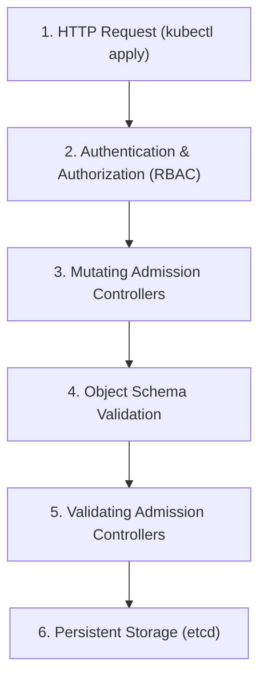

## Table of Contents

1. [The API Gatekeeper: Where Admission Control Operates](#the-api-gatekeeper-where-admission-control-operates)
2. [Anatomy of a Non-Compliant Manifest Release](#anatomy-of-a-non-compliant-manifest-release)
3. [The Request Lifecycle inside the API Server](#the-request-lifecycle-inside-the-api-server)
4. [Built-In Guards: ValidatingAdmissionPolicies and CEL](#built-in-guards-validatingadmissionpolicies-and-cel)
5. [Binding Policies: Scoping Ingress and Defining Actions](#binding-policies-scoping-ingress-defining-actions)
6. [Tuned Rollouts: Warn, Audit, and Deny Pipelines](#tuned-rollouts-warn-audit-and-deny-pipelines)
7. [Third-Party Webhook Engines: OPA Gatekeeper vs. Kyverno](#third-party-webhook-engines-opa-gatekeeper-vs-kyverno)
8. [Putting It All Together](#putting-it-all-together)

## The API Gatekeeper: Where Admission Control Operates

In a mature engineering organization, security teams establish dozens of operational guidelines: containers must never run in privileged mode, images must be pinned to immutable digest hashes, and every deployment must carry a valid owner tag. Traditionally, teams tried to enforce these rules through manual pull request reviews or static Git repository scans.

However, relying entirely on static pre-provision checks leaves a massive loophole. If an operator accesses the cluster directly via their command line, or if a dynamic controller spawns resources at runtime, these external changes bypass all repository checks. To establish absolute compliance, the cluster must enforce security rules programmatically at the final gateway: the API Server.

Kubernetes structures this gatekeeper tier through **Admission Controllers**. An admission controller is a software plugin that intercepts requests to the API Server after the caller is successfully authenticated and authorized, but *before* the submitted object is written to the persistent etcd storage database. 

By running at this critical boundary, admission control acts as the ultimate gatekeeper, evaluating incoming YAML definitions dynamically and rejecting non-compliant objects before they can ever become cluster state.

## Anatomy of a Non-Compliant Manifest Release

To understand why admission control is a critical boundary control, we must trace how a non-compliant manifest reaches production in an unmonitored cluster. Consider a common operations scenario.

An organization establishes a strict security rule: no workload in the production namespace may mount the node's physical host directories using `hostPath` volumes, as this allows containers to read and overwrite files on the underlying host operating system. The platform team documents this rule on an internal wiki and adds it to their onboarding training checklist.

During a critical, high-severity database outage, an on-call support engineer needs to inspect low-level container performance logs. Working under pressure to resolve the incident quickly, they bypass the standard Git repository pipelines. They write an ad-hoc, temporary pod manifest on their laptop, configure it with a `hostPath` volume mounting the host's root system directory (`/`), and apply it directly to the cluster using their administrative credentials:

```bash
$ kubectl apply -f emergency-debug-pod.yaml -n orders-prod
```

Because the engineer carries administrative privileges, the API Server's authorization checks (RBAC) succeed. In the absence of an automated admission control gate, the API Server accepts the manifest, writes it to etcd, and schedules the pod to a node. The container immediately launches, mounting the host's root system directory, exposing raw node files, and creating a massive security hole inside the production cluster.

This operational compromise demonstrates that the primary architectural failure was not the engineer's mistake, but the lack of an active admission control gate. Had the cluster been configured with an admission policy blocking hostPath volumes, the API Server would have intercepted and rejected the command instantly at the API boundary, protecting the node from exposure.

## The Request Lifecycle inside the API Server

To write and debug admission policies, we must understand exactly where the admission engine executes within the API Server's request lifecycle. When an HTTP request targeting a resource modification (such as `CREATE`, `UPDATE`, or `DELETE`) arrives at the API Server, it proceeds through five distinct request stages:



This request lifecycle operates through six systematic steps:

First, the API Server receives the incoming HTTP request.

Second, the **Authentication and Authorization** engines evaluate the connection, verifying the caller's identity (such as a ServiceAccount) and checking RBAC policies to ensure they carry permission to perform the requested verb on the target resource.

Third, the **Mutating Admission Controllers** execute. Mutating controllers can actively modify the incoming object before it is validated. For example, a mutating controller might automatically inject default security settings, inject sidecar logging containers, or apply standard environment tags to pod templates.

Fourth, the API Server runs **Object Schema Validation**, verifying that the submitted JSON or YAML conforms strictly to the structural requirements of the target Kubernetes resource schema.

Fifth, the **Validating Admission Controllers** execute. Validating controllers are read-only checks. They inspect the fully compiled object (after mutating controllers have completed their changes) and evaluate it against active compliance rules, returning an immediate allow or deny response.

Sixth, if all validating admission checks succeed, the API Server writes the finalized object to the **Persistent Storage (etcd)** database. Only after this write is completed does the scheduler or controllers react to place and run the workload.

By running validating checks *after* mutating checks and *before* storage, Kubernetes guarantees that the final, active state of every resource is fully audited, blocking non-compliant definitions before they can ever execute on your physical nodes.

## Built-In Guards: ValidatingAdmissionPolicies and CEL

Historically, enforcing custom validation rules required deploying, operating, and maintaining complex third-party webhook servers. If a webhook server crashed or suffered network latency, the API Server would either block all deployments or fail open, bypassing security checks.

To eliminate this operational overhead, modern Kubernetes clusters introduce built-in **ValidatingAdmissionPolicies**. This native API allows platform teams to write custom validation rules directly in YAML manifests, executed in-process by the API Server without relying on external webhooks.

ValidatingAdmissionPolicies evaluate incoming configurations using **Common Expression Language (CEL)**. CEL is a lightweight, non-Turing-complete declarative language designed specifically for fast, secure expression evaluation.

Consider a ValidatingAdmissionPolicy designed to block application containers from setting privileged mode inside Deployments:

```yaml
apiVersion: admissionregistration.k8s.io/v1
kind: ValidatingAdmissionPolicy
metadata:
  name: block-privileged-containers
spec:
  failurePolicy: Fail
  matchConstraints:
    resourceRules:
      - apiGroups: ["apps"]
        apiVersions: ["v1"]
        operations: ["CREATE", "UPDATE"]
        resources: ["deployments"]
  validations:
    - expression: "object.spec.template.spec.containers.all(c, !has(c.securityContext) || !has(c.securityContext.privileged) || c.securityContext.privileged == false)"
      message: "Production application containers must not set securityContext.privileged=true"
```

This policy defines three core blocks:
* **The Failure Strategy**: `failurePolicy: Fail` enforces a strict gate. If an internal evaluation error occurs, the request is immediately blocked, preventing unsafe configurations from slipping through due to system glitches.
* **The Scope**: `matchConstraints` scopes the policy exclusively to Deployments inside the `apps/v1` API group during creation and modification (`CREATE` and `UPDATE`) operations, ensuring the policy does not evaluate unrelated resources.
* **The CEL Expression**: The `expression` block traverses the incoming `object` schema. It uses the `all` collection evaluator to verify that every container in the pod template does not set the `privileged` attribute to `true`. If any container violates this condition, the validation fails, and the custom `message` is returned to the user.

## Binding Policies: Scoping Ingress and Defining Actions

A `ValidatingAdmissionPolicy` defines the validation logic, but it does not actively audit or block any resources until it is bound using a **ValidatingAdmissionPolicyBinding**.

Decoupling policies from bindings is a powerful architectural pattern. It allows security teams to write a single, standardized policy rule and bind it with different scopes, modes, and parameters across different namespaces.

Consider a binding designed to enforce our privileged container check exclusively inside the production orders namespace:

```yaml
apiVersion: admissionregistration.k8s.io/v1
kind: ValidatingAdmissionPolicyBinding
metadata:
  name: block-privileged-containers-orders-prod
spec:
  policyName: block-privileged-containers
  validationActions:
    - Deny
  matchResources:
    namespaceSelector:
      matchLabels:
        kubernetes.io/metadata.name: orders-prod
```

This binding manifest structures the policy gate using three core definitions:
* **The Policy Reference**: `policyName` binds the rules declared inside our `block-privileged-containers` manifest.
* **The Action**: `validationActions` determines what occurs on validation failure. The `Deny` action instructs the API Server to actively block the request and return the policy's custom message.
* **The Scope**: `matchResources.namespaceSelector` maps the boundary exclusively to namespaces carrying the metadata label `kubernetes.io/metadata.name: orders-prod`, leaving other development or system namespaces unaffected.

By managing bindings independently, you can deploy policies in a disabled state, bind them as simple warnings to staging environments, and enforce them as strict deny gates in production, ensuring a controlled, low-risk rollout pipeline.

## Tuned Rollouts: Warn, Audit, and Deny Pipelines

Enforcing a new security policy immediately as a blocking deny gate across a busy production cluster represents a severe operational risk. If an existing, critical background workload violates the new rule, the policy will block future hotfixes or automated scaling events, potentially causing a major production outage.

To prevent this, platform teams must execute a **Tuned Rollout** using three progressive validation actions:

```yaml
validationActions:
  - Warn
  - Audit
```

By configuring the binding with `Warn` and `Audit` actions initially, you deploy the policy without blocking any deployments:
* **The Warn Action**: The API Server evaluates the incoming manifest. If the manifest violates the policy, the API Server allows the deployment to succeed, but returns a highly visible warning block directly in the user's terminal or CI/CD runner logs.
* **The Audit Action**: The API Server logs the policy violation in the cluster's central audit database, providing security teams with precise evidence of which active workloads currently violate the standard.

Security teams utilize this audit evidence to collaborate with application teams, updating non-compliant manifests and remediating legacy workloads at a controlled pace. Only after the audit logs confirm a zero violation rate across the cluster does the team update the binding's `validationActions` to `Deny`, completing the secure rollout pipeline without incurring operational downtime.

## Third-Party Webhook Engines: OPA Gatekeeper vs. Kyverno

Built-in CEL ValidatingAdmissionPolicies are highly efficient and ideal for standard, object-level validations. However, some complex enterprise compliance rules require advanced logic that built-in CEL cannot easily express, such as querying external databases, validating values across different namespaces, or executing dynamic mutations.

For these advanced use cases, organizations deploy third-party, webhook-backed admission engines. The two industry standards are **OPA Gatekeeper** and **Kyverno**.

### OPA Gatekeeper

OPA Gatekeeper integrates the Open Policy Agent engine into Kubernetes. It maps compliance rules using **ConstraintTemplates** and **Constraints**, executing policies written in the declarative **Rego** language.

OPA Gatekeeper is highly suited for large, heterogeneous environments. If your organization already utilizes OPA to secure cloud perimeters (IaC scans) and application routes, OPA Gatekeeper allows you to reuse the same Rego policies inside your Kubernetes cluster. However, writing custom Rego rules introduces a significant learning curve for application teams.

### Kyverno

Kyverno is a Kubernetes-native policy engine designed specifically for platform operators. Rather than requiring a custom programming language, Kyverno policies are written as standard Kubernetes custom resources, using familiar YAML structures.

Kyverno is highly suited for Kubernetes-first teams. Beyond basic validations, Kyverno excels at complex mutations (such as automatically injecting environment parameters) and generation rules (such as automatically creating a default NetworkPolicy every time a developer provisions a new namespace), simplifying cluster governance.

When designing your architecture, begin with built-in CEL ValidatingAdmissionPolicies to handle standard, low-overhead validations. If your rules require dynamic mutations, cross-namespace lookups, or unified multi-platform compliance, adopt Kyverno or OPA Gatekeeper as your secondary control tier.

## Putting It All Together

Securing your cluster at the API Server boundary represents the ultimate line of defense for Kubernetes infrastructure. By intercepting requests during the admission lifecycle, writing native validating admission policies using CEL expressions, executing controlled warn-and-audit rollout pipelines, and selecting the appropriate policy engine, you automate compliance guardrails and protect your running environments.

When configuring and auditing your admission control systems, ensure you enforce these five core practices:

First, implement validating admission checks for all critical security standards. Do not rely entirely on repository gates; programmatically enforce policies at the API boundary to block direct, ad-hoc console modifications.

Second, utilize built-in CEL ValidatingAdmissionPolicies for standard validations. Eliminate the operational overhead and failure risks of external webhook servers by running policies in-process inside the API Server.

Third, write descriptive, actionable error messages. Ensure that when a manifest is blocked, the validation message tells the developer the exact field, the rule breached, and a clear fix direction.

Fourth, execute a tuned rollout pipeline. Deploy new policies initially in `Warn` and `Audit` modes, using audit evidence to remediate legacy workloads before updating the binding to `Deny`.

Fifth, select the right policy engine for your compliance complexity. Leverage built-in CEL for performance-critical, object-level rules, adopting Kyverno or OPA Gatekeeper when policies require mutations, generations, or multi-platform Rego alignments.

---

**References**

- [Kubernetes Admission Controllers Overview](https://kubernetes.io/docs/reference/access-authn-authz/admission-controllers/) - Detailed guide on the API Server request lifecycle and default admission plugins.
- [Kubernetes ValidatingAdmissionPolicy Reference](https://kubernetes.io/docs/reference/access-authn-authz/validating-admission-policy/) - Official guide on writing built-in admission rules using CEL expressions.
- [Kyverno Policy Engine Documentation](https://kyverno.io/docs/) - Kubernetes-native policy validation, mutation, and generation guide.
- [OPA Gatekeeper Concepts](https://open-policy-agent.github.io/gatekeeper/website/docs/howto/) - Comprehensive guide on writing ConstraintTemplates and OPA validation constraints in Rego.
- [NIST SP 800-190 Application Container Security Guide](https://csrc.nist.gov/pubs/sp/800/190/final) - NIST recommendations on automated orchestrator boundary gates and declarative policy enforcement.
