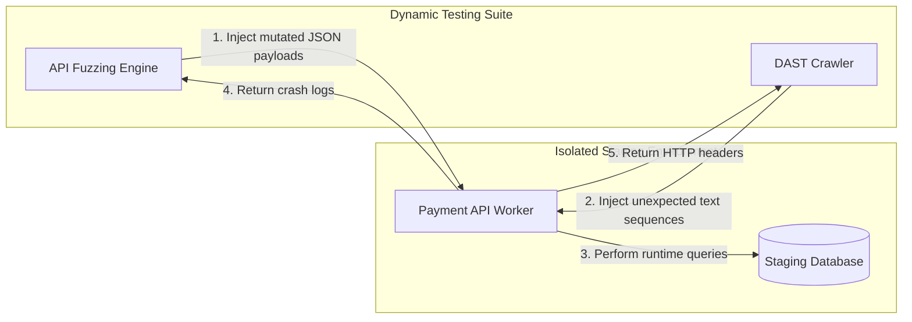

## Table of Contents

1. [The Runtime Execution Gap](#the-runtime-execution-gap)
2. [Dynamic Application Security Testing](#dynamic-application-security-testing)
3. [Schema-Driven API Fuzzing](#schema-driven-api-fuzzing)
4. [Active Scanning Environments](#active-scanning-environments)
5. [Managing Scan Overhead and State](#managing-scan-overhead-and-state)
6. [Putting It All Together](#putting-it-all-together)
7. [What's Next](#whats-next)

## The Runtime Execution Gap

Static analysis tools excel at identifying syntax errors and hardcoded credentials by reading raw source code files. However, static tools parse inactive text. They cannot observe how an application behaves when it connects to a database, resolves configuration parameters, or responds to live network requests. 

Consider a Payment Gateway API that receives JSON transaction requests and stores the data in a relational database. A static code scanner might confirm that the SQL query strings use parameterized functions. However, if the active staging environment loads a legacy configuration file that disables parameterization, the running application becomes vulnerable to SQL injection. Because the static scanner only reads the codebase repository and never inspects the running server environment, it completely misses the exposure. 

```yaml
name: API Dynamic Security Scan

on:
  deployment_status:

jobs:
  dast-scan:
    if: github.event.deployment_status.state == 'success'
    runs-on: ubuntu-latest
    steps:
      - name: Run OWASP ZAP API Scan
        uses: zaproxy/action-api-scan@v0.9.0
        with:
          target: https://staging-api.devpolaris.com/openapi.json
          format: openapi
          rules_file_name: zap-api-rules.conf
```

To close this execution gap, engineering teams deploy active system probes that inspect the application after it is fully compiled, deployed, and listening on a network socket. These active probes test the entire integration stack, including the web server configuration, the transport layer security handshake, and the database response behavior.

## Dynamic Application Security Testing

Dynamic Application Security Testing (DAST) is an automated inspection process that treats your web application as a black box. Instead of reading the source code, a DAST tool interacts with the application exactly as a browser or a malicious user would. It systematically crawls through every link, form input, and route, injecting unusual text sequences to see if the application leaks data or executes unauthorized commands.

When a DAST tool targets the Payment Gateway API, it first maps the web surface to discover routes like the `/process-transaction` endpoint. It then submits a transaction request where the payment amount field contains a carefully crafted database syntax string, such as `' OR '1'='1`. The tool observes the HTTP response headers and the returned HTML body. If the application returns raw database error logs or accepts the malformed query without validation, the DAST tool flags the route as vulnerable.

This dynamic approach tests the system in its fully integrated state. If a cloud load balancer strips security headers before traffic reaches the application, a static source code scanner will never notice. The DAST crawler, interacting with the system from the outside network, will immediately detect the missing headers in the HTTP response.

## Schema-Driven API Fuzzing

While DAST is designed to crawl interconnected browser-based web applications, API fuzzing targets headless microservices. Fuzzing is the technique of generating thousands of semi-valid, mutated request payloads and firing them at an API endpoint to identify memory leaks, input sanitization gaps, and unhandled exception crashes.

Modern REST APIs use OpenAPI or GraphQL schemas to define their routing structures. This schema acts as a technical blueprint, detailing every available route, the required HTTP verbs, and the exact data types expected in the request body. The fuzzing engine parses this blueprint to generate highly structured tests. 

If the schema defines a `transactionId` parameter as a positive integer, the fuzzing engine generates test cases that input negative numbers, extremely large integers designed to trigger buffer overflows, and null values. The scanner then monitors the target server's response. If the API returns a standard `400 Bad Request`, the input was handled safely. If the server drops the connection, times out, or returns a `500 Internal Server Error`, the fuzzing engine flags the endpoint for failing to enforce boundary limits.



## Active Scanning Environments

Because dynamic scanners actively probe endpoints and submit malformed data, running these scans against a live production environment is extremely hazardous. An active SQL injection probe or an aggressive fuzzing sequence can corrupt transaction tables, trigger rate limits, or overwhelm the database engine. Platform teams must isolate these scans inside dedicated staging sandboxes.

The target environment must be a replica of production, complete with web servers and databases, but loaded strictly with synthetic mock data. The scanning engine must also authenticate to internal routes to perform deep testing. Hardcoding high-privilege administrative credentials into the scanner configuration creates a credential theft risk. Instead, teams provision low-privilege service accounts specifically for the scanner, ensuring that the tokens are automatically rotated or revoked when the scan completes.

Finally, the staging environment targeted by the scanner must be excluded from the organization's primary performance dashboards. A high-velocity API fuzzing run generates thousands of error codes per minute. If the alerting system does not recognize the source IP as a friendly scanner, it will trigger denial-of-service alarms and unnecessarily page the on-call responder team.

## Managing Scan Overhead and State

When integrating dynamic security gates into the delivery pipeline, engineering teams must manage the significant time overhead and data state corruption caused by active testing.

Static code checks typically complete in seconds, allowing them to run on every commit. A comprehensive DAST crawl combined with an API fuzzing run can take hours to map and test a large application. Forcing a developer to wait for a full dynamic scan on every pull request will choke the delivery pipeline. To prevent bottlenecks, teams schedule deep dynamic scans to run out-of-band, such as during nightly batch jobs or immediately after a successful deployment to the staging environment. 

Database state corruption also severely impacts scan reliability. If the DAST scanner interacts with a destructive endpoint—like an administrative route that drops a database table—it will destroy the staging dataset in the first few minutes. All subsequent scan requests will return `404 Not Found` errors because the underlying data is gone, rendering the rest of the test useless. Teams mitigate this by configuring the scanner rules to block HTTP `DELETE` verbs, or by implementing automated database restore hooks that quickly reset the staging dataset to a clean state after each test phase completes.

## Putting It All Together

Securing application runtimes requires deploying active probes that evaluate the system from the outside. The runtime execution gap demonstrates that static code checks cannot detect vulnerabilities caused by misconfigured infrastructure, missing security headers, or integration failures. 

Dynamic Application Security Testing addresses this gap by interacting with the compiled web application just as a malicious user would, injecting unexpected data and analyzing the HTTP responses. For headless microservices, schema-driven API fuzzing leverages OpenAPI blueprints to automatically generate boundary-testing payloads, identifying unhandled crashes and memory leaks. Because these active probes manipulate system data, teams must restrict dynamic testing to isolated staging environments loaded with synthetic data, while managing the substantial time overhead and database state corruption that heavy scanning introduces.

## What's Next

DAST crawls and API fuzzing runs generate complex vulnerability reports that require engineering review. However, not every alert represents a genuine security threat to the business. In the next article, we will examine finding triage and dismissal evidence, exploring how to aggregate security alerts using standardized formats and document auditable false-positive waivers without halting the delivery queue.
