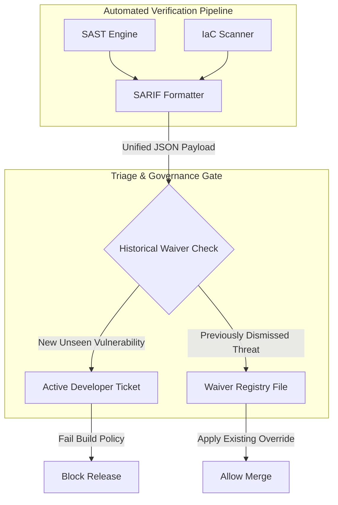

## Table of Contents

1. [The Scanner Fatigue Problem](#the-scanner-fatigue-problem)
2. [Unifying Formats with SARIF](#unifying-formats-with-sarif)
3. [The Triage Pipeline](#the-triage-pipeline)
4. [Codified Dismissal Evidence](#codified-dismissal-evidence)
5. [Common Triage Failures](#common-triage-failures)
6. [Putting It All Together](#putting-it-all-together)
7. [What's Next](#whats-next)

## The Scanner Fatigue Problem

Security scanners are designed to identify potential vulnerabilities, but they lack human context. As a result, they frequently generate false positive alerts for deliberate design decisions or internal testing configurations. 

Consider a Health Records API that requires multiple security scanners—dependency checkers, static analysis, dynamic web crawling, and infrastructure-as-code linting—to run on every pull request. If the infrastructure templates define an internal testing database that listens on a non-standard port, the infrastructure scanner might flag this as a severe misconfiguration. However, because this database is deployed strictly inside a private subnet with no internet route, the engineering team knows it poses zero risk.

```json
{
  "$schema": "https://json.schemastore.org/sarif-2.1.0-rtm.5.json",
  "version": "2.1.0",
  "runs": [
    {
      "tool": {
        "driver": {
          "name": "CustomPortScanner"
        }
      },
      "results": [
        {
          "ruleId": "ERR-PORT-DB-OPEN",
          "message": {
            "text": "Internal database port 5432 is exposed in configuration template."
          },
          "locations": [
            {
              "physicalLocation": {
                "artifactLocation": {
                  "uri": "infra/terraform/db.tf"
                },
                "region": {
                  "startLine": 12
                }
              }
            }
          ],
          "suppressions": [
            {
              "kind": "external",
              "status": "accepted",
              "justification": "Database port is restricted to private VPC application subnets; no public ingress route exists."
            }
          ]
        }
      ]
    }
  ]
}
```

If the pipeline blocks the deployment every time this known, acceptable risk is detected, developers will quickly experience scanner fatigue. They will start ignoring alerts or temporarily disabling the scanners to push critical feature updates. To prevent this security degradation, engineering teams must unify their scanner outputs and establish a formal process for logging authorized dismissals that persist across subsequent pipeline runs.

## Unifying Formats with SARIF

The primary obstacle to effective triage is the lack of standardized reporting. Every security vendor formats their scanner output differently. One tool might produce an XML document, another a proprietary JSON payload, and a third a bloated PDF file. This diversity makes it impossible to build a central dashboard that tracks all pipeline vulnerabilities.

The Static Analysis Results Interchange Format (SARIF) solves this by providing a universal, standardized JSON schema for security findings. It acts as a common translation layer. Instead of forcing developers to log into five different proprietary security portals, platform teams configure all their command-line scanners to export their results in the SARIF format. 

The repository hosting platform ingests these unified SARIF files at the end of the pipeline run. Because the format is standardized, the platform can parse the `results` block, extract the file path and line number, and inject the security warning directly into the developer's pull request interface alongside their code diff. By standardizing on SARIF, organizations decouple their security rules from specific vendors, allowing them to swap underlying scanning engines without breaking their central triage workflows.

## The Triage Pipeline

To manage security alerts without halting delivery, organizations build structured triage pipelines that intercept findings before they reach the human developer. 

The process begins in the continuous integration environment. The various scanning engines complete their execution and output their raw results. A formatting script converts these diverse results into standardized SARIF documents.

Next, the repository orchestrator reads the SARIF files and compares the new findings against the repository's historical waiver registry. This registry acts as a database of previously accepted risks.



If the alert is entirely new, the orchestrator triggers the pipeline failure policy. It flags the commit, blocks the pull request merge gate, and assigns a review ticket to the development team. If the alert matches a previously triaged and authorized waiver, the orchestrator applies the suppression metadata to the finding, marking it as safely ignored, and allows the deployment to proceed without human intervention.

## Codified Dismissal Evidence

When an engineering team determines that a finding is a false positive, or when they apply a compensating control that mitigates the risk, they must document that decision. Compliance auditors require proof that a bypassed security alert was the result of a deliberate, authorized engineering review rather than a developer taking a shortcut.

Storing this evidence in a manager's email inbox or an external ticketing system creates a disconnected audit trail. Instead, teams codify their dismissal evidence directly alongside the source code in a version-controlled file, typically a signed JSON or YAML waiver registry like `.security/waivers.json`.

A robust waiver entry must include four explicit attributes. First, the specific vulnerability rule ID or fingerprint. Second, the exact location in the codebase where the issue resides. Third, a detailed technical justification explaining why the risk is acceptable or mitigated by external controls. Fourth, the cryptographic signature or approved identity of the security lead who authorized the dismissal. 

## Common Triage Failures

When establishing finding triage systems, engineering organizations frequently encounter several operational pitfalls.

A widespread mistake is failing to enforce strict expiration dates on waivers. Vulnerability waivers are often granted as temporary exemptions to unblock a deployment while the team schedules a permanent code fix. If the waiver registry does not enforce hard expiration timestamps, these temporary exemptions drift into permanent bypasses. The pipeline must be configured to automatically reject expired waivers and block the build until the security team re-evaluates the risk.

Location shifting presents another challenge. Scanners traditionally track vulnerabilities using physical file paths and line numbers. If a developer refactors a file and shifts a vulnerable function down by ten lines, the scanner treats the shifted code as a brand-new vulnerability. This completely bypasses the historical waiver and unnecessarily blocks the build. To prevent this, advanced triage systems use structural syntax fingerprints instead of fragile line numbers to anchor their waivers.

Finally, allowing a developer to unilaterally dismiss their own code findings introduces severe insider threat vulnerabilities. A developer could write a malicious bypass, waive the security check, and push the change directly to production. Modifications to the waiver registry file must always be protected by repository branch rules that mandate independent peer review and approval from a designated security owner.

## Putting It All Together

Managing security findings at scale requires replacing disconnected scanner portals with unified data flows and codified evidence trails. 

The scanner fatigue problem highlights why human developers cannot manually sort thousands of pipeline alerts on every pull request. Standardizing output formats using SARIF solves the aggregation challenge, allowing diverse tools to communicate findings in a single, predictable structure. The automated triage pipeline leverages this structure to automatically suppress known, accepted risks, reducing noise and developer friction. When new false positives require dismissal, teams codify their decisions directly in the repository as version-controlled waiver files, providing auditors with explicit, signed evidence of compliance.

## What's Next

Standardizing vulnerability triage keeps the development pipeline flowing while maintaining rigorous compliance checks. However, custom application code is only one component of the delivery system. In the next submodule, we will transition into the Software Supply Chain, exploring the security challenges of importing open-source packages, generating Software Bill of Materials (SBOMs), and tracking vulnerability reachability.
