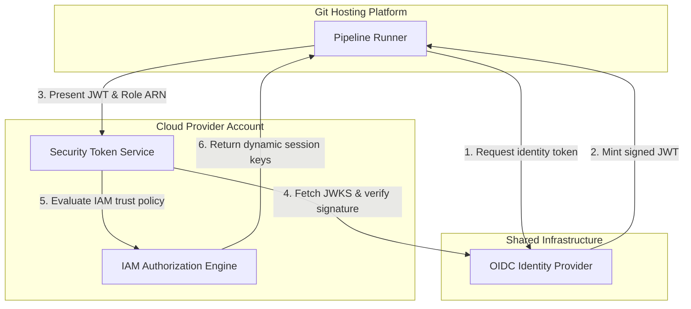

## Table of Contents

1. [The Pipeline Credential Problem](#the-pipeline-credential-problem)
2. [The Static Key Vulnerability](#the-static-key-vulnerability)
3. [Workload Identity Federation](#workload-identity-federation)
4. [The Token Exchange Handshake](#the-token-exchange-handshake)
5. [Enforcing Scope Boundaries](#enforcing-scope-boundaries)
6. [Putting It All Together](#putting-it-all-together)
7. [What's Next](#whats-next)

## The Pipeline Credential Problem

A pipeline runner is an ephemeral compute environment that executes code integration and deployment scripts on behalf of your team. Because this runner needs to manage cloud resources like compute instances, databases, or object storage, it must authenticate with your cloud provider using authorized credentials.

Consider an automated billing deployment pipeline. When a developer merges a code change to the main branch, the pipeline runner spins up, reads the source code, and needs to update an AWS Lambda function and an Amazon DynamoDB table. The runner itself has no inherent identity in AWS. It requires a set of credentials to prove it has the authority to modify the billing infrastructure.

```yaml
name: Secure Billing Deployment

on:
  push:
    branches:
      - main

permissions:
  id-token: write
  contents: read

jobs:
  deploy:
    runs-on: ubuntu-latest
    steps:
      - name: Checkout Source
        uses: actions/checkout@v4
      - name: Authenticate to Cloud Provider
        uses: aws-actions/configure-aws-credentials@v4
        with:
          role-to-assume: arn:aws:iam::123456789012:role/billing-pipeline-role
          aws-region: us-east-1
      - name: Deploy Serverless Infrastructure
        run: npm run deploy
```

The fundamental security challenge is determining how to provide these credentials to the runner without exposing them to unauthorized access. If an attacker gains control over the credentials used by the billing pipeline, they can modify the Lambda function to redirect payments or exfiltrate customer data from the DynamoDB table.

## The Static Key Vulnerability

The traditional approach to providing runner credentials is to generate a long-lived Access Key and Secret Key pair in the cloud provider console, and then store that pair in the continuous integration platform's secret vault. The runner platform injects these keys into the execution environment as environment variables.

A static access key remains valid indefinitely until a human administrator explicitly revokes it. This creates a permanent risk window. If a malicious third-party dependency is installed during the build process, it can execute a script that reads the environment variables and transmits the access keys to an external server. Because the keys are static, the attacker can use them from their own laptop on the public internet, completely bypassing the pipeline platform.

Teams often grant these static keys broad administrative permissions to ensure that the pipeline does not fail when developers add new types of resources to their deployment templates. This broad scope amplifies the damage of a leak. A single compromised access key can lead to the destruction of the entire cloud environment.

## Workload Identity Federation

Workload identity federation is an authentication model that allows a continuous integration platform and a cloud provider to establish cryptographic trust without sharing any permanent secret keys. You can think of it as a specialized passport verification system. The cloud provider agrees to accept temporary digital passports issued by the integration platform, provided those passports meet specific, pre-agreed conditions.

When the billing pipeline needs to update the DynamoDB table, it does not use a stored password. Instead, it asks the integration platform to generate a temporary identity document called a JSON Web Token (JWT). This token contains metadata about the current execution context, including the repository name, the branch that triggered the run, and the specific workflow filename.

The pipeline runner sends this token to the cloud provider. The cloud provider verifies the digital signature on the token, checks the metadata against a strict policy, and then issues a temporary set of session keys valid only for a short duration, typically one hour. There are no static keys stored in the pipeline platform, meaning there are no permanent secrets for an attacker to steal from the environment variables.

## The Token Exchange Handshake

To understand why this system is secure without a shared secret, we must trace the low-level data exchange using the OpenID Connect (OIDC) protocol. OIDC relies on public key cryptography and standardized discovery endpoints.

First, the pipeline runner begins its deployment job. It sends an HTTP request to its local link-local metadata service at the loopback address `169.254.169.254` to request an identity token. The integration platform generates a JWT containing the repository claim (`repo:my-org/billing-service`) and the branch claim (`ref:refs/heads/main`), and cryptographically signs it using its private key.

Second, the runner contacts the cloud provider's Security Token Service and presents this signed JWT along with the identifier for the specific cloud role it wants to assume.

Third, the Security Token Service must verify the token's authenticity. It reads the issuer address from the token header and makes an unauthenticated web request to the issuer's public OpenID configuration endpoint (such as `https://token.actions.githubusercontent.com/.well-known/openid-configuration`). From there, it locates the JSON Web Key Set (JWKS) endpoint and downloads the integration platform's public keys. The cloud provider uses these public keys to prove mathematically that the token was signed by the legitimate integration platform and has not been altered in transit.



Fourth, the Security Token Service compares the validated token claims against the cloud role's trust policy. If the trust policy explicitly requires the token to originate from the `my-org/billing-service` repository on the `main` branch, and the token matches those requirements, the service generates the temporary session keys and returns them to the runner.

## Enforcing Scope Boundaries

Keyless federation replaces static keys with ephemeral sessions, but it does not inherently limit what the runner can do once the session is active. A secure pipeline requires strict boundaries on both the trust policy and the execution permissions.

The trust policy acts as the front door. You must configure the cloud role to require exact, specific claims in the incoming token. A common misconfiguration is to use wildcard characters in the repository or branch claims, allowing any branch in the organization to assume the production deployment role. This allows developers to execute code against the live database from unreviewed feature branches. Always specify the exact repository and the exact target branch in the trust policy.

The execution policy limits what the active session can modify. The temporary role should only possess the specific permissions needed for its intended tasks. An application code deployment pipeline needs permissions to push container images to a registry, but it does not need permissions to modify the virtual network routing tables or delete database backups.

When implementing these boundaries, you must be aware of default permission behaviors in your integration platform. In many platforms, explicitly declaring the OIDC identity permission block (`id-token: write`) automatically revokes all other default permissions. If you do not also explicitly declare repository read permissions (`contents: read`), the runner will fail to check out the source code, causing the build to fail immediately.

## Putting It All Together

Protecting cloud resources from compromised deployment platforms requires eliminating static secrets and enforcing strict operational limits on the automated runner.

* **The Pipeline Credential Problem**: Automated runners require authorized credentials to deploy infrastructure, making them high-value targets for credential theft.
* **The Static Key Vulnerability**: Long-lived access keys stored as pipeline secrets create permanent risk windows. If the execution environment is scraped, attackers gain unbounded access to the cloud account.
* **Workload Identity Federation**: Replaces stored secrets with dynamic token exchange. The pipeline runner proves its identity using a signed JWT, which the cloud provider trades for short-lived session keys.
* **The Token Exchange Handshake**: Relies on OIDC and public key cryptography. The cloud provider fetches public keys from a standardized endpoint to verify the token signature without needing a pre-shared master password.
* **Enforcing Scope Boundaries**: Securing the federation path requires strict trust policies that reject wildcards, demanding specific repository and branch names before issuing tokens. Execution policies must then restrict the temporary session to the minimum required actions.

## What's Next

Securing the authentication path ensures that the pipeline runner can safely receive temporary cloud credentials. However, we must also control what code is allowed to trigger those deployment pipelines in the first place. In the next article, we will examine protected branches and environment gates, exploring how to enforce code review requirements and manual approval steps before any deployment logic executes.


*This summary shows why short-lived OIDC token exchange replaces static keys and keeps cloud access scoped.*

