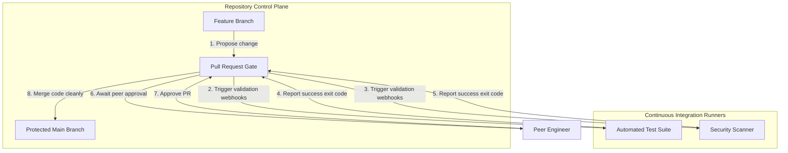

## Table of Contents

1. [The Unreviewed Push Problem](#the-unreviewed-push-problem)
2. [Branch Protection Policies](#branch-protection-policies)
3. [Automated Status Checks](#automated-status-checks)
4. [Environment Review Gates](#environment-review-gates)
5. [Common Gate Configuration Failures](#common-gate-configuration-failures)
6. [Putting It All Together](#putting-it-all-together)
7. [What's Next](#whats-next)

## The Unreviewed Push Problem

Source control repositories are designed to track changes and facilitate collaboration. By default, most Git platforms allow any authorized contributor to push commits directly to any branch. This open model is dangerous when a specific branch is wired directly to an automated deployment pipeline. 

Consider an Image Processing Microservice that automatically resizes and crops user-uploaded profile pictures. The deployment pipeline is configured to automatically build and deploy any code that lands on the `main` branch. If a developer accidentally pushes an incomplete commit with a syntax error directly to `main`, the pipeline runner will obediently trigger the deployment process, crashing the live service within minutes. 

```yaml
name: Image Processing Deployment

on:
  push:
    branches:
      - main

jobs:
  build-and-test:
    runs-on: ubuntu-latest
    steps:
      - name: Checkout Source
        uses: actions/checkout@v4
      - name: Run Test Suite
        run: npm test

  deploy-production:
    needs: build-and-test
    runs-on: ubuntu-latest
    environment:
      name: production
      url: https://image-processor.devpolaris.com
    steps:
      - name: Deploy Transformation Engine
        run: npm run deploy
```

The problem is not just operational mistakes. If an attacker gains access to a single developer's repository account, they can push a malicious script directly to the primary branch. Without mandatory quality firewalls, the pipeline will deploy the attacker's code into the production cloud account, leveraging the pipeline's own federated credentials. To prevent this, teams must enforce strict branch protections and environment approval gates.

## Branch Protection Policies

A branch protection policy serves as a strict access control list that blocks direct writes to critical branches. Instead of allowing developers to run a simple `git push origin main` command, the policy forces them to propose their changes through a pull request from a separate branch.

When a team member wants to add a new compression algorithm to the Image Processing Microservice, they create a `feature-compression` branch. After pushing their code to this feature branch, they open a pull request targeting `main`. The branch protection policy intercepts the merge action and enforces a set of pre-configured rules before allowing the code to be integrated.

The most fundamental rule is requiring manual peer review. The policy blocks the merge until at least one independent engineer has inspected the code and explicitly approved the pull request. This distributed trust model ensures that no single developer possesses the authority to unilaterally modify production code. 

## Automated Status Checks

Human review is necessary but insufficient to catch subtle logic errors or security flaws. Status checks are automated pipeline jobs that execute unit tests, static analysis, and security scanners. Branch protection policies integrate with these checks to form a non-bypassable quality firewall.

When a pull request is created, the repository platform orchestrates a series of validation jobs. These jobs run on ephemeral runner containers, executing the test suite and reporting their exit codes back to the repository's API via webhook events. 

If the image processing unit tests fail because the new compression algorithm handles transparency incorrectly, the testing job exits with a non-zero status code. The repository platform receives this failure signal and immediately disables the merge button. This prevents human reviewers from accidentally approving a change that breaks core functionality, guaranteeing that the primary branch remains in a deployable state.



## Environment Review Gates

Branch protections secure the source code repository, but highly sensitive deployment targets require an additional layer of defense. An environment gate is an execution block that pauses a pipeline job immediately before it interacts with a specific cloud environment, requiring manual intervention before proceeding.

When the pipeline reaches the `deploy-production` job, it requests access to the `production` environment context defined in the repository. The continuous integration engine detects that this environment is protected by a review gate. It suspends the job execution and prevents the runner from accessing the environment's specific secrets, such as production database credentials.

The system places the pipeline in a pending state and alerts the designated release managers. Once a release manager reviews the pending deployment and clicks approve, the orchestrator releases the execution lock, injects the production secrets into the runner, and allows the deployment commands to execute. This ensures that even if bad code makes it past the pull request reviewers, a final human checkpoint exists before live infrastructure is modified.

## Common Gate Configuration Failures

When configuring these protection layers, engineering teams frequently make critical implementation errors that undermine the entire security model.

The most dangerous mistake is failing to enforce branch policies on repository administrators. By default, many platforms exempt organization owners from branch protection rules to prevent administrative lockouts. This exemption means an administrator's compromised account can bypass all peer reviews and push code directly to `main`. You must explicitly configure the policy to apply to administrators.

Another frequent issue involves stale pull request approvals. If a pull request receives an approval and the original author subsequently pushes new commits to fix a minor typo, some platforms preserve the original approval status. This allows a developer to slip unreviewed changes into the merge queue after the peer review has closed. Policies must be configured to dismiss approvals automatically whenever new commits are added to the pull request.

Finally, race conditions can occur if status checks are not configured as strictly mandatory. If a developer can merge a pull request while the security scanners are still executing, they can introduce a vulnerability before the scanner has a chance to block the merge. You must enforce mandatory status check completion to ensure no code is merged blindly.

## Putting It All Together

Securing repository branches and production environments requires replacing direct developer pushes with orchestrated pull request workflows, automated status checks, and manual environment gates.

The pipeline credential problem demonstrated how automated runners need authorized access to deploy infrastructure. Branch protection policies solve the subsequent challenge of controlling which code is allowed to trigger those runners. By distributing trust across peer reviews and halting deployments until explicit approvals are received, teams eliminate single-developer compromise pathways. Implementing mandatory status checks ensures that automated quality standards are met before human reviewers even look at the code. Finally, environment gates provide a crucial last line of defense, isolating production secrets until a designated release manager gives explicit consent.

## What's Next

Protected branches and environment gates ensure that only verified, approved commits enter the primary codebase. However, pipelines rely heavily on external tools and pre-packaged actions to execute these verification steps. In the next article, we will examine third-party actions and plugin risk, exploring the security challenges of importing community-maintained code and explaining how to mitigate that risk using commit hashing and local execution forks.


*This summary shows how branch rules, status checks, reviewers, environments, scoped secrets, and audit trails form a release gate.*

