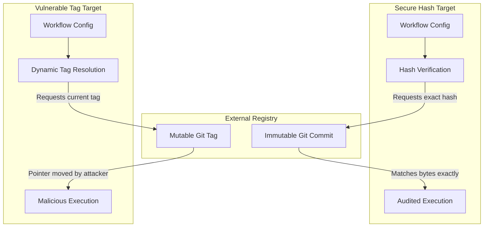

## Table of Contents

1. [The External Dependency Danger](#the-external-dependency-danger)
2. [The Mutable Tag Vulnerability](#the-mutable-tag-vulnerability)
3. [Commit SHA-256 Pinning](#commit-sha-256-pinning)
4. [Execution Context Mechanics](#execution-context-mechanics)
5. [Local Repository Forks](#local-repository-forks)
6. [Putting It All Together](#putting-it-all-together)
7. [What's Next](#whats-next)

## The External Dependency Danger

Modern continuous integration engines do not require you to write every build script from scratch. Instead, they allow you to import pre-packaged actions or plugins from public marketplaces to handle common tasks like formatting code, running security scanners, or authenticating with cloud providers. 

Consider a Data Engineering Pipeline that processes daily customer transaction logs. To format the raw SQL queries and check for syntax errors before deploying them to the data warehouse, the pipeline imports a popular open-source SQL linter action. The workflow file simply calls the action by name and passes the directory path as an argument. 

```yaml
name: Secure Data Pipeline Deployment

on:
  push:
    branches:
      - main

jobs:
  lint-and-deploy:
    runs-on: ubuntu-latest
    steps:
      - name: Checkout Repository
        uses: actions/checkout@11bd71901bbe5b1630ceea73d27597364c9af683 # v4.2.2
      - name: Lint SQL Files
        uses: public-org/sql-linter-action@v2
      - name: Authenticate Cloud
        uses: aws-actions/configure-aws-credentials@e3dd1a4c35189035062d1140268d038bb59afb40 # v4.0.2
        with:
          role-to-assume: arn:aws:iam::123456789012:role/data-warehouse-role
          aws-region: us-east-1
```

By adding that single `uses:` line, you are instructing the pipeline runner to download a remote script from the internet and execute it inside your build environment. If the remote script is compromised, the pipeline runner will execute malicious code with full access to your source code and whatever cloud credentials the runner holds. 

## The Mutable Tag Vulnerability

When configuring these imports, the standard practice is to reference the external action by a version tag, such as `v2`. This approach simplifies maintenance because the pipeline will automatically pull minor bug fixes whenever the action's maintainer updates the tag. However, relying on tags introduces a severe supply-chain vulnerability.

Git tags are simply mutable pointers to a specific commit. A repository maintainer, or a malicious actor who gains control of the maintainer's account, can delete an existing tag and recreate it pointing to a completely different commit history. 

If an attacker compromises the `sql-linter-action` repository, they can push a malicious commit containing a script that quietly harvests environment variables. They then forcefully move the `v2` tag to point to this new malicious commit. The next time the Data Engineering Pipeline runs, the continuous integration engine resolves the `v2` tag, downloads the compromised code, and executes it. The runner is immediately compromised without a single change to the pipeline's own configuration file.

## Commit SHA-256 Pinning

To prevent tag spoofing, you must lock the pipeline dependency to a specific, immutable block of code. Commit SHA-256 pinning replaces the mutable tag reference with the exact cryptographic hash of the commit object you want to execute.

When you specify a commit hash like `11bd71901bbe5b1630ceea73d27597364c9af683`, the pipeline runner will only execute the code if the downloaded repository's contents mathematically hash to that exact value. Because the Git SHA-256 hash is generated from the file contents and the repository history, it is computationally impossible to alter the code without changing the resulting hash. Even if an attacker compromises the external repository and modifies the files, your pipeline will refuse to run the modified code because the hashes will no longer match.

To retain human readability while enforcing cryptographic immutability, developers append the target release tag as an inline comment, such as `# v4.2.2`. This convention allows security teams to verify the execution hash while providing engineers with the context of which version the hash represents.

## Execution Context Mechanics

Understanding the risk of third-party actions requires looking at how the runner executes them under the hood. 

When the pipeline engine processes a `uses` directive, it downloads the target repository into a local cache directory on the runner host. If the action is a Node-based plugin, the runner executes the action's `main` JavaScript file using the runner's own host Node runtime. The script runs with the same file system permissions as the runner itself, meaning it can read the workspace directory, access the `.git` folder, and read any environment variables injected into the step.

If the action is a Docker-based plugin, the runner compiles the provided Dockerfile and starts the container. Crucially, to allow the container to operate on the source code, the runner mounts the active workspace directory as a volume inside the container. This mounting process grants the containerized script direct access to the repository contents. 



In both execution modes, the external action gains access to the runner's temporary API token. If the pipeline configuration relies on default write-all permissions, the compromised action can use this token to approve its own pull requests, modify repository settings, or publish backdoored packages to your organization's registry. Stripping these default permissions is a mandatory prerequisite for running third-party actions safely.

## Local Repository Forks

For high-security environments, cryptographic pinning is necessary but still insufficient for absolute control. If the maintainer of a public action decides to delete their repository entirely, any pipeline that pins a commit from that repository will immediately fail during the fetch phase, halting all automated deployments.

To guarantee availability and establish a hard perimeter, platform teams implement local repository forks. The security team clones the required external action into a private, internal repository hosted within the organization's own source control system. The pipeline workflows are then updated to point exclusively to this internal mirror.

When a new version of the upstream action is released, the platform team audits the changes locally, merges the updates into the internal fork, and updates the pinned hashes across the organization's pipelines. This pattern completely isolates the build infrastructure from sudden upstream deletions or forced repository takeovers.

## Putting It All Together

Securing continuous integration pipelines requires shifting from blind trust in external dependencies to verified, immutable execution paths. 

The external dependency danger arises because pipelines import and execute remote code automatically. Relying on mutable release tags exposes the runner to supply-chain injection if the upstream repository is compromised. Commit SHA-256 pinning mitigates this risk by locking the execution target to a mathematically verified hash, ensuring the runner only executes code that has been explicitly approved. 

Understanding the execution context reveals why this protection is necessary: third-party actions run with direct access to the runner's filesystem and API tokens, making them potent vectors for credential theft. Finally, establishing local repository forks insulates the delivery pipeline from upstream availability issues, ensuring that the deployment process remains operational even if the original open-source project disappears.

## What's Next

Securing third-party plugins protects the build runner host from runtime exfiltration attempts. However, once the code runs safely, we must verify the security posture of the application code itself. In the next submodule, we will transition into Application Security Testing, starting with static analysis tools that intercept code vulnerabilities and hardcoded credentials before they reach deployment.
