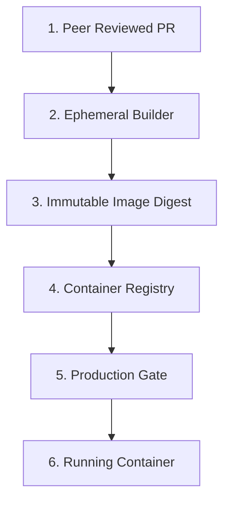

## Table of Contents

1. [The Problem of Blind Trust](#the-problem-of-blind-trust)
2. [What Is a Delivery Trust Model?](#what-is-a-delivery-trust-model)
3. [The Delivery Verification Path](#the-delivery-verification-path)
4. [Workflows and Token Boundaries](#workflows-and-token-boundaries)
5. [What Is Threat Modeling?](#what-is-threat-modeling)
6. [The Four Questions in Action](#the-four-questions-in-action)
7. [Analyzing Threats with STRIDE](#analyzing-threats-with-stride)
8. [Putting It All Together](#putting-it-all-together)
9. [What's Next](#whats-next)

## The Problem of Blind Trust

Every software release takes a journey. A developer writes code on their laptop. A pull request is created. Automated tests run. A build pipeline packages the code into a container image. A deployment script sends that image to production.

In a traditional setup, production accepts that image blindly. The deployment server assumes that because a script triggered the update, the container is safe to run. But this blind trust leaves massive blind spots. Consider these three scenarios:

* An attacker compromises a developer's personal account and commits a backdoor directly to the repository.
* A third-party dependency gets hijacked, replacing a safe helper library with one that steals customer passwords during the build step.
* A malicious pull request modifies a workflow file, forcing the builder machine to leak production database secrets.

If we only check if the automated tests were green, we miss all of these attacks. A successful DevSecOps practice starts by removing blind trust from the delivery path. We must be able to verify exactly where the software came from, who reviewed it, what machine compiled it, and that it was not secretly altered along the way.

## What Is a Delivery Trust Model?

A delivery trust model is a systematic way to prove the safety of a software release. Instead of assuming the release journey was secure, each step must provide verified evidence before the next step grants it any power.

Think of it as a secure chain of custody. If a bank moves cash in an armored car, the guards do not hand the money to anyone who opens the back door. They verify the receiver's identity, check the logbook, and sign a receipt. The delivery trust model applies this discipline to code:

**Unverified Path**:
Developer commits &rarr; Builder compiles &rarr; Server runs image

**Verifiable Chain of Custody**:
Peer review &rarr; Ephemeral build &rarr; Logged image digest &rarr; Deployer verification &rarr; Validated production runtime

For a typical API service, this model raises concrete questions:

* Can a pull request from an external fork run basic tests without getting access to publish packages?
* Can the builder machine compile the application without having the power to delete production servers?
* Can we prove that the exact image running in production matches the code that was peer-reviewed?

The delivery trust model is not a specific program you install. It is a set of rules that governs who can make changes, what resources those changes can touch, and what proof they must leave behind.

## The Delivery Verification Path

The release journey moves from human intent to a running service. To make this visible, we trace the delivery path:



Each step in this path represents a boundary:

1. **Peer Reviewed PR**: Human intention is captured in a pull request. We require at least one other engineer to review and approve the change before it merges.
2. **Ephemeral Builder**: The build machine compiles the code. To prevent persistent attacks, we use isolated, single-use environments that are destroyed immediately after the job finishes.
3. **Immutable Image Digest**: A container image is identified by a digest (a long cryptographic hash like `sha256:...`), not a mutable tag like `latest`. While tags can be moved to point to different images, a digest is tied to the exact bytes of the build. If the image changes by even one character, the digest changes completely.
4. **Container Registry**: The registry stores the image securely, acting as the distribution point.
5. **Production Gate**: The deployment environment verifies that the target image digest matches the provenance records signed by the builder.
6. **Running Container**: The runtime environment executes the hardened container under tight operational limits.

By breaking the pipeline into these distinct blocks, we can check the safety of each transition. If an attacker tries to swap the container image after it has been built, the production gate detects that the image digest does not match the builder's record and blocks the deployment.

## Workflows and Token Boundaries

Automation platforms like GitHub Actions use workflow files to define the delivery journey. These files are stored in the repository (e.g., under `.github/workflows/`), making them reviewable code.

Workflows execute commands using a temporary token. If a workflow file is configured with excessive permissions, any code executed by that workflow inherits those privileges. Consider this safe starting layout:

```yaml
name: secure-pipeline

on:
  pull_request:
    branches: ["main"]
  push:
    branches: ["main"]

permissions:
  contents: read

jobs:
  test:
    runs-on: ubuntu-latest
    steps:
      - uses: actions/checkout@v4
      - run: npm ci
      - run: npm test

  deploy:
    needs: test
    if: github.ref == 'refs/heads/main'
    environment: production
    permissions:
      contents: read
      id-token: write
    runs-on: ubuntu-latest
    steps:
      - uses: actions/checkout@v4
      - run: ./scripts/deploy.sh
```

Notice the security choices made in this file:

* **Default Read-Only**: The top-level `permissions: contents: read` block restricts the temporary token. If a test script is compromised, it cannot write to the repository or access other workflows.
* **Separation of Concerns**: The high-power `deploy` job only runs on the protected `main` branch after tests have passed (`needs: test`). It explicitly declares that it needs `id-token: write` to request short-lived deployment keys, a permission the `test` job is denied.
* **Environment Gate**: By declaring `environment: production`, the workflow forces the runner to wait for any required peer approvals or deployment windows before executing the deploy script.

Compare this with a dangerous configuration:

```yaml
on:
  pull_request_target:
    branches: ["main"]

permissions: write-all

jobs:
  untrusted-test:
    runs-on: ubuntu-latest
    steps:
      - uses: actions/checkout@v4
        with:
          ref: ${{ github.event.pull_request.head.sha }}
      - run: npm ci
      - run: npm test
```

This configuration introduces a critical vulnerability. The `pull_request_target` event runs in the context of the main branch, which gives it access to write tokens (`permissions: write-all`). However, the checkout step pulls in the untrusted code from the external fork. If the pull request code contains a malicious package install script, it will execute on the runner with full write access to the repository.

The primary rule of secure pipelines is structural: untrusted code validation must always run in isolated, low-power environments, while high-power privileges are reserved for reviewed code on protected branches.

## What Is Threat Modeling?

We cannot secure a delivery path if we do not know how it can be attacked. Threat modeling is the practice of looking at a system design before or while we build it to identify where it could fail, what the consequences are, and what we will do to prevent them.

Think of it like reviewing the architectural plans for a house. If the blueprint shows a ground-floor window with no lock, it costs nothing to draw a lock on the paper. But if we wait until the house is fully constructed and the window has been jimmied open by an intruder, the fix is expensive, disruptive, and late.

Threat modeling brings this preventative discipline to software design. It is not a massive compliance report; it is an active security conversation that turns design risks into normal, trackable engineering tasks.

## The Four Questions in Action

A practical threat modeling session does not require complex security degrees. It simply requires a team to sit down and answer four plain-English questions:

1. **What are we building?** (Draw the architecture and data flows).
2. **What could go wrong?** (Brainstorm how someone could misuse or attack the system).
3. **What are we going to do about it?** (Decide on mitigations and engineering fixes).
4. **Did we do a good job?** (Verify that the fixes were implemented correctly).

Let us apply this to the orders API search feature:

| Question | Engineering Focus | Practical Example |
| :--- | :--- | :--- |
| **What are we building?** | Tracing the request path from client to database | The browser sends a search query (`GET /orders/search?status=open`) to the API server, which queries the database and returns a list of orders. |
| **What could go wrong?** | Identifying vulnerabilities and abuse vectors | A customer edits the request parameters to read another user's private orders. An attacker inserts SQL commands into the search bar. The server logs leak private customer details. |
| **What will we do?** | Selecting concrete technical mitigations | Implement server-side ownership checks to verify the customer owns the requested orders. Use parameterized SQL queries to block injection. Redact sensitive fields before logging. |
| **Did it work?** | Verifying the security controls landed | Write automated authorization tests. Run static analysis (SAST) to confirm SQL queries are parameterized. Audit logging outputs. |

By answering these four questions, the team changes security from a vague anxiety (*"is our app secure?"*) into clear, actionable tasks (*"use a parameterized query on line 42"*).

### Threat Modeling a CI/CD Pipeline

To see how this works in a delivery system, let us model a real workflow addition. An engineer wants to add automated benchmark testing to pull requests, and drafts this initial workflow configuration:

```yaml
# .github/workflows/dangerous-benchmark.yml
name: benchmark-pr

on:
  pull_request_target:
    branches: ["main"]

permissions:
  contents: write
  packages: write

jobs:
  run-benchmark:
    runs-on: ubuntu-latest
    steps:
      - uses: actions/checkout@v4
        with:
          ref: ${{ github.event.pull_request.head.sha }}
      - run: npm ci
      - run: npm run benchmark
      - run: ./scripts/publish-benchmark-results.sh
```

Let us run this draft through our threat model questions:

1. **What are we building?** A pipeline job that triggers on pull requests, downloads the PR author's code branch (`head.sha`), installs dependencies via `npm ci`, executes benchmark tests, and publishes the output.
2. **What could go wrong?** 
   * **The Target Event**: `pull_request_target` runs in the security context of the base repository. This means it has access to the repository's secret vault and carries elevated permissions (`packages: write`).
   * **The Checkout step**: By checking out `github.event.pull_request.head.sha`, the runner downloads unreviewed code from a potentially malicious external fork.
   * **The Execution Step**: `npm ci` executes the package's lifecycle scripts (like `preinstall` or `postinstall`). If an attacker creates a fork, modifies `package.json` to include a postinstall script that steals repository secret keys, and opens a pull request, the runner will execute that script with elevated permissions, leaking the keys.
3. **What will we do?** We split the workflow into two separate files to enforce a strict security boundary:
   * Run the untrusted benchmark code in a low-power workflow that is completely denied write permissions and secret access.
   * Run the high-power publishing step in a separate workflow that only triggers when reviewed code is successfully merged into the `main` branch.

Here is the secure mitigation implemented in our configuration:

```yaml
# .github/workflows/secure-benchmark-test.yml
# Runs on every pull request, but is completely sandboxed
name: test-benchmark-pr

on:
  pull_request:
    branches: ["main"]

permissions:
  contents: read

jobs:
  test:
    runs-on: ubuntu-latest
    steps:
      - uses: actions/checkout@v4
      - run: npm ci --ignore-scripts # Blocks malicious lifecycle scripts
      - run: npm run benchmark
```

```yaml
# .github/workflows/secure-benchmark-publish.yml
# Only runs from the trusted main branch after peer approval
name: publish-benchmark-main

on:
  push:
    branches: ["main"]

permissions:
  contents: read
  packages: write

jobs:
  publish:
    runs-on: ubuntu-latest
    steps:
      - uses: actions/checkout@v4
      - run: npm ci
      - run: ./scripts/publish-benchmark-results.sh
```

4. **Did we do a good job?** We verify that the pull request tests pass, that `ignore-scripts` is enforced on untrusted code, and that the `publish` workflow only runs in our cloud environment on push events to `main`.

## Analyzing Threats with STRIDE

To help teams brainstorm what could go wrong without relying on luck, we use a structured framework called **STRIDE**. Originally developed by Microsoft, STRIDE categorizes threats into six distinct types:

* **S - Spoofing**: Pretending to be someone else. An attacker uses a stolen authentication token to masquerade as another user.
* **T - Tampering**: Modifying data or code without authorization. An attacker edits a deploy script inside a pull request to bypass checks.
* **R - Repudiation**: Denying that an action was taken. An operator deletes production data but claims they did not do it, and there are no logs to prove otherwise.
* **I - Information Disclosure**: Exposing private data to unauthorized eyes. Server error messages leak database connection strings in public logs.
* **D - Denial of Service**: Making the service unavailable to legitimate users. An attacker floods the search API with expensive database queries, crashing the database.
* **E - Elevation of Privilege**: Gaining more power than intended. A normal customer alters their session cookie to reach an administrative control panel.

Using STRIDE keeps our threat analysis structured. Instead of wondering generally what might happen, we ask specific questions: *How could someone spoof an identity here? Where could tampering occur? How do we prevent repudiation?* The answers dictate our design mitigations before we write a single line of production code.

## Putting It All Together

Securing a software delivery system is a physical discipline, not a theoretical one. The Delivery Trust Model establishes the secure path, the temporary workflows define the boundaries, and active threat modeling identifies the weak joints before they are exploited.

When auditing or planning any pipeline, follow this healthy verification checklist:

* **Code Ownership**: sensitive paths (like workflows and build scripts) are protected by a `CODEOWNERS` map and require peer reviews to merge.
* **Minimum Privilege**: Workflow jobs default to read-only access, requesting temporary, scoped permissions only when necessary.
* **Ephemerality**: Builders and runners are short-lived, single-use sandboxes that are destroyed after a single execution.
* **Immutability**: Images and artifacts are referenced and deployed using unique cryptographic digests rather than mutable tags.
* **Trackable Mitigation**: Threat models are written down as normal engineering tickets with clear owners, code fixes, and passing tests.

## What's Next

Establishing the secure path is the first layer of defense. In the next article, we will go deeper into **Least Privilege and Secrets**, learning how to limit access permissions to the bare minimum needed for workloads to run, and how to safely store and rotate the credentials they use.

---

**References**

- [GitHub Security Guides - Securing GitHub Actions](https://docs.github.com/en/actions/how-tos/security-for-github-actions/security-guides/using-githubs-security-features-to-secure-your-use-of-github-actions) - GitHub's official guidelines on managing workflow tokens, third-party action risks, and secure pinning.
- [GitHub Actions - About Hardening Workflows with OIDC](https://docs.github.com/en/actions/deployment/security-hardening-your-deployments/about-security-hardening-with-openid-connect) - Explains how workflows can authenticate directly to cloud providers using temporary token exchange instead of persistent keys.
- [SLSA (Supply-chain Levels for Software Artifacts) Specification](https://slsa.dev/spec/v1.0/provenance) - The industry standard framework for generating secure build provenance and verifying artifact integrity.
- [OWASP Threat Modeling Cheat Sheet](https://cheatsheetseries.owasp.org/cheatsheets/Threat_Modeling_Cheat_Sheet.html) - Standard industry guidance on practical threat modeling processes, diagrams, and mitigations.
- [NIST SP 800-218 Secure Software Development Framework](https://csrc.nist.gov/pubs/sp/800/218/final) - NIST guidelines for secure development practices, mapping to chain of custody, pipeline trust, and evidence collection.
