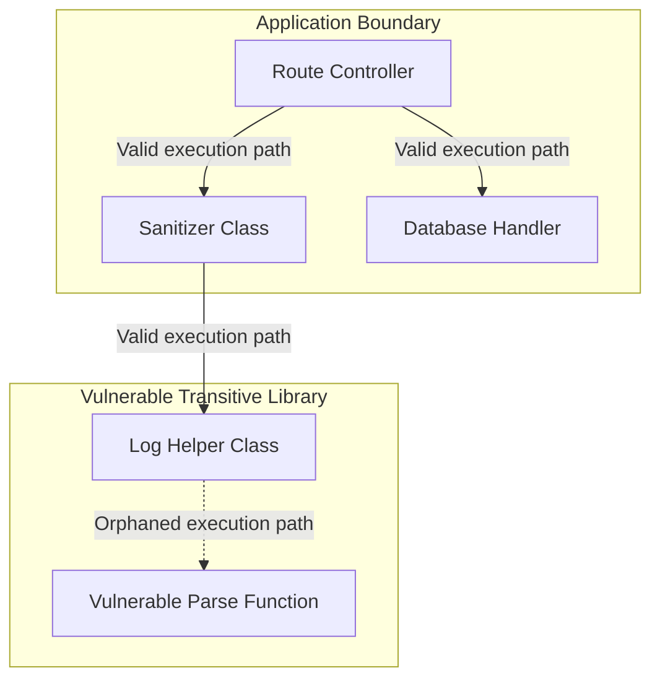

## Table of Contents

1. [The Transitive Vulnerability Problem](#the-transitive-vulnerability-problem)
2. [Software Bill of Materials](#software-bill-of-materials)
3. [CycloneDX and SPDX Standards](#cyclonedx-and-spdx-standards)
4. [Call-Graph Reachability Checks](#call-graph-reachability-checks)
5. [Common Reachability Failures](#common-reachability-failures)
6. [Putting It All Together](#putting-it-all-together)
7. [What's Next](#whats-next)

## The Transitive Vulnerability Problem

Modern web applications do not build every utility function from scratch. Developers import third-party packages to handle logging, database connections, and string formatting. However, when you import a single top-level library, that library frequently imports dozens of secondary helper libraries.

Consider a Payment Orchestrator API that imports a popular open-source `payment-logger` package to format its server logs. The developer adds `payment-logger` to the `package.json` file. Unbeknownst to the developer, `payment-logger` relies on a deeply nested transitive dependency called `string-parser-util`. A security researcher discovers a remote code execution vulnerability (CVE) in `string-parser-util` and publishes the finding. 

```json
{
  "bomFormat": "CycloneDX",
  "specVersion": "1.5",
  "serialNumber": "urn:uuid:3e6b8c8f-2a31-4e78-90b9-1234567890ab",
  "version": 1,
  "metadata": {
    "component": {
      "name": "payment-orchestrator",
      "version": "1.0.0",
      "type": "application"
    }
  },
  "components": [
    {
      "name": "string-parser-util",
      "version": "2.1.4",
      "type": "library",
      "purl": "pkg:npm/string-parser-util@2.1.4",
      "hashes": [
        {
          "alg": "SHA-256",
          "content": "8f89e81b672776e6a10058b8f888f8e8f888f8e8f888f8e8f888f8e8f888f8e8"
        }
      ]
    }
  ]
}
```

Standard automated vulnerability scanners parse the final compiled artifact, detect the presence of the vulnerable `string-parser-util`, and immediately flag the Payment Orchestrator API as compromised. However, the Payment Orchestrator API only uses the logging feature of `payment-logger` and never actually triggers the code path that relies on the vulnerable string parsing function. If the security team forces the developers to halt feature work and patch every reported vulnerability blindly, the team will drown in alert noise for threats that cannot realistically be executed.

## Software Bill of Materials

Before a team can triage vulnerabilities, they must establish an accurate inventory of their compiled software. A Software Bill of Materials (SBOM) acts as a digital ingredients manifest for an application. It provides a structured, machine-readable list of every direct and transitive library, framework, and binary packaged inside a software artifact.

When the deployment pipeline builds the Payment Orchestrator API, an SBOM generation tool scans the final compiled binary and outputs a comprehensive JSON document. This document details the exact package names, version strings, source author metadata, and cryptographic SHA-256 hashes of every included component. 

By producing SBOMs systematically on every release build, organizations maintain an auditable historical log of their software supply chain. If an auditor asks whether the production environment is vulnerable to a newly announced exploit in a specific library version, the security team queries the central SBOM registry. They can confirm the exact presence of the vulnerable component across thousands of microservices in seconds, without requiring access to the raw source code repositories.

## CycloneDX and SPDX Standards

When generating SBOMs, platform teams adopt structured data standards to ensure their manifests are readable by external scanners and third-party customers. The two primary industry specifications are CycloneDX and SPDX.

CycloneDX is a lightweight JSON schema optimized for high-speed automated pipelines and vulnerability scanning. Developed by the OWASP foundation, it focuses explicitly on identifying software components, tracking vulnerabilities, and documenting the dependency graph. Because it is highly structured and fast to parse, engineering teams default to CycloneDX for their internal continuous integration gates and automated security dashboards.

SPDX, developed by the Linux Foundation, is a highly detailed format optimized for intellectual property reviews and strict legal compliance. An SPDX manifest tracks package versions, but it also records exact file-level copyrights, binary provenance origins, and complex open-source licensing trees. Teams generating software for external enterprise distribution or government compliance audits use SPDX to satisfy strict regulatory requirements.

## Call-Graph Reachability Checks

While an SBOM proves that a vulnerable package is present in the artifact, it does not prove that the vulnerability poses a runtime risk. To filter out benign alerts, security teams deploy call-graph reachability checks.

Reachability analysis is an advanced static code validation process that evaluates the compiled application's execution pathways. The static analysis engine parses the application source code along with all imported libraries, converting the raw instructions into an Abstract Syntax Tree (AST). It then traces the execution paths starting from the application's public entry points down through the imported modules.



If the engine determines that the fuzzed or vulnerable library function is orphaned from the main entry path, the compiled application will never route traffic to it. The reachability analysis marks the vulnerability alert as unreachable. This automated validation allows security leads to confidently deprioritize the finding, focusing their patching efforts on vulnerabilities that exist in active, executable code paths.

## Common Reachability Failures

When integrating reachability checks into delivery pipelines, platform teams encounter significant technical challenges that can lead to false negative security reports.

The most dangerous challenge involves dynamic code execution. Many modern programming languages allow applications to load classes and invoke methods dynamically at runtime using reflection APIs or string-based route lookups. Because these specific execution paths are resolved in memory while the program is running, static call-graph analyzers cannot trace them. The analyzer might mark a vulnerable function as statically unreachable, even though the application triggers the vulnerability dynamically.

Configuration drift presents another major failure point. Build compilers occasionally shadow or swap package versions during the final bundling phase to resolve transitive dependency conflicts. If the static reachability engine analyzes the raw source code repository instead of the final compiled artifact, the analysis will not match the code that actually runs in production. Reachability verifications must anchor their analysis on the final release package.

Finally, compiling an AST and tracing execution pathways across hundreds of thousands of lines of library code requires substantial computational overhead. Running a full reachability analysis on every developer pull request can choke the delivery pipeline. Platform teams typically reserve full reachability checks for final release candidate builds or nightly asynchronous batch jobs.

## Putting It All Together

Securing the software supply chain requires more than just listing dependencies; it demands analyzing their runtime execution risk. The transitive vulnerability problem demonstrates how a single application can inherit hundreds of unvetted packages, triggering massive alert storms for harmless code.

By standardizing on Software Bill of Materials using lightweight CycloneDX or exhaustive SPDX formats, organizations gain an auditable, machine-readable inventory of their exact software ingredients. Call-graph reachability checks then analyze this inventory, tracing execution pathways from the application's entry points down into the transitive libraries. When the analysis confirms that a vulnerable function is statically orphaned, teams can safely ignore the alert, preserving delivery speed without compromising security.

## What's Next

Compiling SBOMs and filtering alerts via reachability checks ensures that the third-party ingredients inside an application are safe. However, we must also prove that the build process itself was secure and untampered by attackers. In the next article, we will examine build provenance and attestations, exploring how to use the SLSA framework and cryptographically signed logs to secure the build execution trail.


*This summary shows how SBOM components, CVEs, call graphs, reachability, and prioritization work together.*

