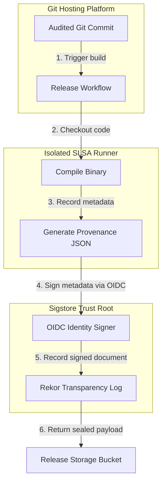

## Table of Contents

1. [The Tampered Artifact Threat](#the-tampered-artifact-threat)
2. [The SLSA Framework](#the-slsa-framework)
3. [The Mechanics of Build Provenance](#the-mechanics-of-build-provenance)
4. [Ephemeral Keyless Signing](#ephemeral-keyless-signing)
5. [Common Provenance Failures](#common-provenance-failures)
6. [Putting It All Together](#putting-it-all-together)
7. [What's Next](#whats-next)

## The Tampered Artifact Threat

Traditional software security focuses heavily on the code review phase. Engineers mandate branch protections, require multiple peer approvals, and run exhaustive unit tests before merging pull requests. However, once the code merges, the resulting compiled binary is often treated as implicitly trustworthy, without any proof of where or how it was built. 

Consider a Gateway Service that routes traffic for a microservices cluster. After a developer merges a clean, peer-reviewed pull request, the deployment pipeline compiles the Go source code into a binary and uploads it to an internal registry. If an attacker compromises the underlying continuous integration runner host or the temporary compilation workspace, they can replace the official compiler with a compromised version. The compromised compiler quietly injects a backdoor into the Gateway Service binary during the build step. 

```json
{
  "_type": "https://in-toto.io/Statement/v0.1",
  "subject": [
    {
      "name": "gateway-service-agent",
      "digest": {
        "sha256": "4b89e81b672776e6a10058b8f888f8e8f888f8e8f888f8e8f888f8e8f888f8e8"
      }
    }
  ],
  "predicateType": "https://slsa.dev/provenance/v0.2",
  "predicate": {
    "builder": {
      "id": "https://github.com/Attestations/GitHubHostedActions"
    },
    "buildType": "https://slsa.dev/github-actions-build/v1",
    "invocation": {
      "configSource": {
        "uri": "git+https://github.com/devpolaris/gateway-service.git",
        "digest": {
          "sha1": "5c6b8c8f2a314e7890b91234567890ab12345678"
        },
        "entryPoint": ".github/workflows/release.yml"
      }
    },
    "materials": [
      {
        "uri": "git+https://github.com/devpolaris/gateway-service.git",
        "digest": {
          "sha1": "5c6b8c8f2a314e7890b91234567890ab12345678"
        }
      }
    ]
  }
}
```

Because the resulting binary carries the expected version tag and name, downstream deployment tools pull and execute it without suspicion. The security controls that protected the source code repository are completely bypassed. To prevent this, engineering teams must generate unforgeable build provenance records that cryptographically prove a binary was compiled inside a secure, monitored enclave.

## The SLSA Framework

To standardize how build environments are secured, the industry developed the Supply chain Levels for Software Artifacts (SLSA) framework. SLSA acts as a manufacturing safety checklist, ensuring that every step of the software compilation process is fully isolated, documented, and verifiable.

The framework divides build security into incremental levels. A basic SLSA implementation requires the build system to automatically generate a provenance document detailing the build inputs. Higher SLSA levels mandate isolated build enclaves where compilation steps cannot access the internet, preventing malicious code from phoning home or fetching unverified remote payloads during the build process.

When a pipeline adheres to SLSA standards, it guarantees that the compiled artifact is a direct, untampered translation of the specific Git commit hash that the developers actually reviewed.

## The Mechanics of Build Provenance

A build provenance record is a structured metadata document—often formatted using the in-toto specification—that answers exactly who, what, when, and how a software artifact was created. 

To generate reliable provenance, the pipeline runner must document the compilation process from the inside of a secure, ephemeral workspace. The runner begins by recording the exact cryptographic commit hash of the checked-out source code, providing an unbroken link back to the audited Git revision. It then documents the build environment itself, capturing the runner machine specifications, the exact continuous integration workflow file executed, and any environment variables passed to the compiler.



Crucially, the runner calculates the SHA-256 hash of the final compiled binary file and writes this hash directly into the subject block of the provenance document. This securely binds the certificate to that exact compiled file. If an attacker replaces the binary in the storage bucket, the file's hash will change, immediately invalidating the provenance certificate.

## Ephemeral Keyless Signing

An unforgeable provenance document requires a cryptographic signature. However, storing a permanent private signing key inside the pipeline secrets manager reintroduces the risk of key theft. If an attacker steals the private key, they can sign their own malicious provenance documents, defeating the entire SLSA framework.

Modern pipelines mitigate this risk using Sigstore keyless signing. Instead of a long-lived private key, the pipeline runner uses its temporary OpenID Connect (OIDC) identity token, which is minted automatically by the Git platform. 

The runner presents this temporary token to the Sigstore certificate authority. The authority verifies the token and issues a short-lived signing certificate valid only for a few minutes. The runner signs the build provenance attestation using the corresponding private key, and the certificate metadata is permanently recorded in the Rekor public transparency log. Once the build job finishes, the temporary signing key is deleted. Because no permanent keys are ever stored, there are no keys for an attacker to steal.

## Common Provenance Failures

When implementing build provenance checks, platform teams face significant operational challenges. 

The most common hurdle is non-reproducible builds. If an application compilation process fetches dynamic external libraries or embeds time-dependent timestamps during the build, two compilations of the exact same commit hash will produce slightly different binaries with mismatched SHA-256 signatures. Engineering teams must enforce deterministic builds where all dependencies are strictly pinned, ensuring that compilations remain perfectly repeatable and auditable.

Another critical failure point is the security of the attestation signer itself. If the continuous integration runner host is compromised, an attacker can modify the compiler binary before the attestation tool runs. The scanner will blindly generate a perfectly valid, cryptographically signed attestation for a backdoored binary. To prevent this, teams must run the attestation tool in a segregated, read-only host namespace that the build container cannot access or manipulate.

Finally, multi-stage Docker builds frequently obscure provenance data. In many container configurations, the final image is created by copying compiled artifacts from a temporary builder stage. If the provenance tool only scans the final, stripped image layer, it misses the compilation details of the builder stage entirely. Provenance generation tools must be configured to capture the entire lifecycle of all compilation stages to maintain an unbroken audit trail.

## Putting It All Together

Securing the software supply chain requires treating the build environment as a hostile network. The tampered artifact threat demonstrates that even perfectly audited source code can be compromised if the compilation process is insecure. 

The SLSA framework establishes rigorous standards for build isolation, while provenance records document the exact inputs, environment variables, and commit hashes used to create an artifact. Binding these records to the binary's cryptographic hash ensures that the artifact cannot be swapped post-compilation. By leveraging Sigstore's keyless signing and ephemeral OIDC tokens, platform teams can cryptographically seal these provenance documents without the risk of managing permanent private keys.

## What's Next

Generating build provenance cryptographically verifies that a binary was compiled inside a secure, monitored environment. However, generating the signature is only half the battle; we must also verify that signature and block the execution of unsigned code. In the next article, we will examine artifact signing and verification, exploring how to use Sigstore's Cosign utility to enforce signature checks directly at the deployment gate.
