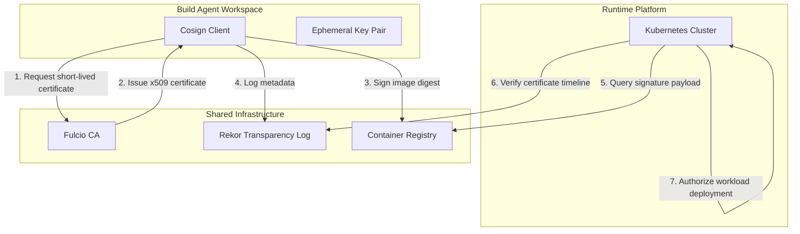

## Table of Contents

1. [The Image Swapping Threat](#the-image-swapping-threat)
2. [Keyless Signing with Sigstore](#keyless-signing-with-sigstore)
3. [The Signature Handshake](#the-signature-handshake)
4. [Admission Controller Gates](#admission-controller-gates)
5. [Common Verification Failures](#common-verification-failures)
6. [Putting It All Together](#putting-it-all-together)
7. [What's Next](#whats-next)

## The Image Swapping Threat

Container registries store compiled application images and distribute them to deployment clusters. When an orchestration system needs to run a new workload, it connects to the registry, requests a specific version tag, downloads the artifact, and executes the code. 

Consider an API Stack that manages real-time financial transactions. The continuous integration pipeline builds the container image and pushes it to a private enterprise registry under the tag `api-stack:v1.0.0`. Later that evening, an attacker compromises a developer's laptop, steals their registry credentials, and pushes a malicious container image using the exact same `api-stack:v1.0.0` tag. 

```yaml
apiVersion: policy.sigstore.dev/v1beta1
kind: ClusterImagePolicy
metadata:
  name: enforce-signature-policy
spec:
  images:
    - glob: "ghcr.io/devpolaris/*"
  authorities:
    - keyless:
        url: https://fulcio.sigstore.dev
        identities:
          - issuer: https://token.actions.githubusercontent.com
            subject: https://github.com/devpolaris/api-stack/.github/workflows/release.yml@refs/heads/main
```

Because container runtimes pull images dynamically based on these mutable tags, the Kubernetes cluster has no mechanism to differentiate between the legitimate pipeline build and the attacker's backdoored image. The cluster blindly pulls the compromised image, launching a malicious workload directly into the production environment. To prevent these stealth overwrite attacks, platform teams must mandate cryptographic artifact signing and deploy admission controllers that block unsigned containers before execution.

## Keyless Signing with Sigstore

To verify the origin of a container, the continuous integration pipeline must sign the image digest immediately after compilation. Historically, this required managing long-lived cryptographic private keys. If those keys were ever stolen or accidentally committed to a repository, attackers could spoof signatures effortlessly. 

Keyless signing fundamentally alters this dynamic by replacing permanent private keys with ephemeral session certificates. Instead of maintaining a secret key, the pipeline runner uses its temporary OpenID Connect (OIDC) identity—issued automatically by the Git platform—to request a short-lived signing certificate. 

When the API Stack pipeline finishes building the container image, the Cosign tool securely generates the cryptographic signature, binds it to the image digest, and pushes the signature metadata to the registry alongside the container. Because the signing certificate expires in minutes and the associated private key is deleted immediately, there are no permanent secrets for an attacker to compromise.

## The Signature Handshake

To understand how keyless signing guarantees identity without permanent keys, we trace the step-by-step handshake between the signer, the certificate authority, and the transparency ledger.

First, the Cosign client running inside the build agent requests an ephemeral cryptographic key pair. It retrieves the signed OIDC identity token from the host environment and sends this token, along with the newly generated public key, to Fulcio, the Sigstore Certificate Authority.

Second, Fulcio verifies the OIDC signature. It extracts the identity claims (such as the repository name and workflow filename) and generates a short-lived x509 certificate binding that identity to the public key. Fulcio returns the certificate to the client.



Third, Cosign signs the container image digest using the private key. It uploads the signature payload to the registry and simultaneously publishes the signing event, the x509 certificate, and the digest hash to Rekor, a tamper-resistant public transparency log. Rekor acts as a permanent, append-only record, proving that the certificate was valid at the exact moment the signature was created.

## Admission Controller Gates

Generating a cryptographic signature only secures the system if the runtime platform actually enforces it. To close the delivery loop, platform teams configure Kubernetes admission controllers, such as Kyverno or the Sigstore Policy Controller, to act as mandatory verification gates.

When a deployment request to run the API Stack container reaches the cluster API, the admission controller intercepts the request. It queries the container registry to retrieve the image's signature payload and parses the associated x509 certificate. 

The controller validates the certificate against the public transparency log and then evaluates the certificate claims against strict authorization policies. If the policy demands that the signature must originate from the `api-stack` repository's release workflow, and the certificate proves it came from a developer's local laptop, the controller immediately rejects the container. This strict validation ensures that only code flowing through the approved, automated continuous integration path can ever run in the cluster.

## Common Verification Failures

When establishing artifact signature policies, platform teams encounter significant operational challenges that can break cluster deployments.

The most severe issue occurs when the cluster is deployed in a heavily isolated private network. If the Kubernetes cluster cannot route traffic to the public internet, the admission controller will fail to contact the Sigstore public transparency logs to verify keyless signatures. To maintain signature enforcement without compromising network isolation, enterprise teams must mirror the Sigstore public infrastructure inside their private virtual networks or deploy local, offline transparency ledgers.

Third-party containers create another major verification gap. Organizations rely on hundreds of external container images, such as database proxies, metric exporters, and ingress controllers, all of which are compiled outside their internal pipelines. If the admission controller blindly requires an internal signature on every executed container, the cluster will aggressively block these essential third-party tools, causing a catastrophic outage. Platform teams must configure selective image policies that whitelist specific vendor namespaces or establish processes to audit and internally sign third-party images before deployment.

Finally, platform engineers must carefully configure failure modes. If the external Sigstore public services experience a brief outage, and the admission controller is configured to "fail closed," all new deployments and automatic scaling events across the cluster will instantly fail. Teams must balance strict security integrity against the operational availability required during critical traffic spikes.

## Putting It All Together

Securing cloud-native platforms requires replacing unverified container pulls with ephemeral keyless signing and automated admission control policies. The image swapping threat highlights how mutable version tags leave runtimes vulnerable to backdoored containers, even when the source code repository is perfectly secure. 

By utilizing Sigstore, pipelines generate short-lived certificates, writing signature metadata to tamper-resistant transparency ledgers without the risk of permanent key management. The admission controller intercepts deployment requests, validating these cryptographic stamps at the cluster gate and rejecting any image that bypassed the approved continuous integration pipeline. Implementing these controls closes the software supply chain loop, ensuring that only audited, pipeline-compiled code runs in production.

## What's Next

Securing the software supply chain through SBOMs, build provenance, and signature verification ensures that only safe, trusted code enters the runtime environment. However, the underlying platform hosting these workloads must also be hardened to contain inevitable breaches. In the next module, **Runtime Platform Security**, we will shift focus from the delivery pipeline to the infrastructure, starting with container image minimalization and exploring how to strip away the OS components that attackers rely on.


*This summary follows digest, signature, certificate, transparency log, admission gate, and rejected mismatch checks.*

