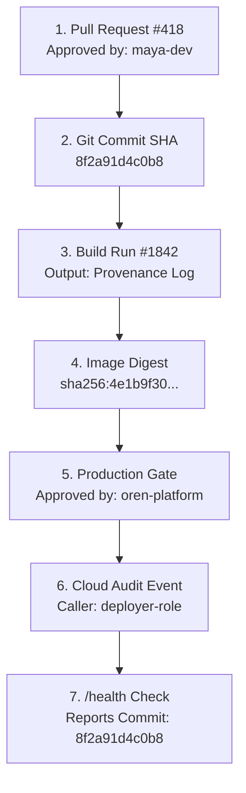

## Table of Contents

1. [The Gap of Unclaimed Systems](#the-gap-of-unclaimed-systems)
2. [What Is Security Ownership?](#what-is-security-ownership)
3. [Owners by Risky Area](#owners-by-risky-area)
4. [CODEOWNERS as an Active Ownership Map](#codeowners-as-an-active-ownership-map)
5. [What Counts as Audit Evidence?](#what-counts-as-audit-evidence)
6. [The Verifiable Evidence Chain](#the-verifiable-evidence-chain)
7. [Designing Cloud Audit Events](#designing-cloud-audit-events)
8. [Solving the Evidence Gaps](#solving-the-evidence-gaps)
9. [Putting It All Together](#putting-it-all-together)

## The Gap of Unclaimed Systems

A software delivery pipeline is a composite system. It is built from application code, deployment files, orchestration rules, and runtime credentials. When the boundaries between these pieces are poorly defined, critical changes can slip through unnoticed. Consider these three scenarios:

* **The Silent Pipeline Edit**: A developer modifies a deployment script to bypass security checks. Because the script resides in a shared repository with no designated owner, the change merges without review, exposing production.
* **The Missing Audit Trail**: An auditor demands proof that every change currently running in production went through a peer review process. The team spends three weeks digging through thousands of unlinked Git commits and deployment logs to reconstruct a timeline.
* **The Orphaned Secret**: A security scanner triggers an alert for a leaked database token. The team cannot rotate the token because nobody knows which services consume it, who created it, or which team is responsible for maintaining it.

To prevent these failures, we must tie our delivery systems to named human accountability and collect verifiable, linked evidence at every step. We call this combination **Ownership and Evidence**.

## What Is Security Ownership?

Security ownership means that every component, configuration, credential, and pipeline script has a named team or person responsible for its safety. 

A common anti-pattern in software companies is the belief that "security owns security." This is a dangerous habit. A central security team cannot understand the daily architectural changes of twenty different applications, nor can they manage the deployment files of every pipeline. Good security ownership divides responsibilities across the roles that actually build and operate the software:

* **Application Engineers** understand service logic and code behavior. They own the application source code, package choices, and runtime secret consumers.
* **Platform Engineers** understand delivery machinery. They own the pipeline runner configurations, deployment templates, and cloud access roles.
* **Security Engineers** understand risk boundaries. They support other teams by reviewing threat models, defining default security baselines, and triaging high-risk exceptions.
* **On-Call Engineers** understand production reality. They own immediate incident response and log monitoring during active operational shifts.

By making ownership explicit, we stop treating security as a distant roadblock and weave it directly into the daily engineering process.

## Owners by Risky Area

To map ownership practically, we identify the sensitive areas of our delivery system and assign a primary team to monitor them. The table below represents a healthy ownership map for a typical web service:

| Risky Area | Primary Owner | Support Partner | Practical Responsibility |
| :--- | :--- | :--- | :--- |
| **Application Source** | Application Team | Security Team | Review code modifications, update lockfiles, and triage library vulnerabilities. |
| **Workflow Files** | Platform Team | Security Team | Ensure pipeline tokens default to read-only; isolate PR test environments. |
| **Registry Access** | Platform Team | Application Team | Maintain container registry access controls and verify image signatures. |
| **Deployment Roles** | Platform Team | Cloud Security | Scope OIDC deployment sessions to specific cloud resources; drop admin wildcards. |
| **Runtime Secrets** | Application Team | Platform Team | Track which workloads consume database keys; coordinate quarterly rotations. |
| **Audit Log Storage** | On-Call Team | Platform Team | Ensure pipeline run logs and cloud events are captured and retained securely. |

The **Primary Owner** column names the team that is expected to notice configuration drift first. The **Support Partner** names the team that provides specialized review when a change affects the system's risk profile.

## CODEOWNERS as an Active Ownership Map

To turn a paper ownership map into active routing, we use a `CODEOWNERS` file located in the root of our source repository. This file instructs our repository host (such as GitHub or GitLab) to automatically request reviews from the designated teams whenever specific files are changed:

```text
# .github/CODEOWNERS
# Path Pattern                      Reviewer Teams

.github/workflows/                 @devpolaris/platform @devpolaris/security
deploy/production/                 @devpolaris/platform @devpolaris/orders
scripts/deploy-prod.sh             @devpolaris/platform @devpolaris/security
src/orders/                        @devpolaris/orders
package-lock.json                  @devpolaris/orders @devpolaris/security
docs/security-exceptions/          @devpolaris/security @devpolaris/orders
```

Read this file from left to right. If a pull request modifies a build script inside `scripts/deploy-prod.sh`, both the platform and security teams are automatically added as reviewers. If a developer updates application dependencies in `package-lock.json`, both the orders application team and the security team are notified.

A common gotcha is that CODEOWNERS only requests reviews; it does not block merges by itself. To make ownership active, the repository must be configured with **Branch Protection Rules** that require approvals from the designated code owners before code can merge into the main branch.

### Verifying Ownership via Terminal

An engineer performing a security audit can verify that sensitive file paths are correctly mapped in the ownership file using a simple terminal search:

```bash
$ git grep -n "@devpolaris/security" -- .github/CODEOWNERS
.github/CODEOWNERS:4:.github/workflows/                 @devpolaris/platform @devpolaris/security
.github/CODEOWNERS:6:scripts/deploy-prod.sh             @devpolaris/platform @devpolaris/security
.github/CODEOWNERS:8:package-lock.json                  @devpolaris/orders @devpolaris/security
.github/CODEOWNERS:9:docs/security-exceptions/          @devpolaris/security @devpolaris/orders
```

This output lists the exact line numbers and rules matching our security reviewers. If a new deployment script or custom GitHub Action is added to the codebase but is missing from this output, we know there is an ownership gap.

## What Counts as Audit Evidence?

Evidence is any verifiable, immutable record that helps a human trace a production change back to its origin. To be useful, evidence must answer a sequence of basic questions:

* *Which commit was deployed?*
* *Who reviewed the code change?*
* *Which build workflow compiled the binary?*
* *What is the cryptographic digest of the built artifact?*
* *Who approved the deployment to production?*
* *What was the outcome of the deployment?*

Audit evidence is not limited to a single log file. A complete evidence packet compiles facts across multiple distinct domains:

* **Human Gate Evidence** (Pull Request reviews, CODEOWNERS approvals)
* **&plus; Build Gate Evidence** (Ephemeral runner run logs, signed build provenance)
* **&plus; Artifact Evidence** (Cryptographic image digests, SBOM components list)
* **&plus; Deploy Gate Evidence** (OIDC cloud session logs, production environment approvals)
* **&plus; Runtime Evidence** (Secure system logs, application health reports)
* **&rArr; Cryptographic Chain of Evidence**

The goal of this chain is correlation. If a production server reports a runtime error, an investigator should be able to trace its version tags back to a specific build workflow run, which links to a signed pull request, which lists the exact human peer who approved the change.

## The Verifiable Evidence Chain

The evidence chain tracks the software release step-by-step, connecting stable identifiers across different systems:



Consider this example of a completed, high-quality release record for a production deployment:

* **Service**: `orders-api`
* **Environment**: `production`
* **Git Commit SHA**: `8f2a91d4c0b8e7...`
* **Pull Request**: `https://github.com/devpolaris/orders-api/pull/418`
* **Peer Approver**: `maya-dev`
* **Build Pipeline**: GitHub Actions Run `#1842`
* **Container Image**: `ghcr.io/devpolaris/orders-api@sha256:4e1b9f30d4a97a7...`
* **Deploy Approver**: `oren-platform` (Deployment Gate `#991`)
* **Deployment Runner**: `deploy-prod.yml` Run `#1847`
* **Cloud IAM Role**: `orders-api-prod-deployer`
* **Production Result**: `/health` returned HTTP `200` (Version `8f2a91d4c0b8e7...`)

If the runtime behavior of the orders service drifts, this record allows the on-call engineer to verify the exact digest that was deployed, the build pipeline that constructed it, and the developer reviews that authorized the release. Without this correlated packet, the team has to guess what is running based on timestamp correlation alone.

## Designing Cloud Audit Events

When a deployment runner updates a production service, the cloud provider records a system log event. To be useful during an audit or incident investigation, the event log must capture the identity of the runner and point back to the source workflow.

Here is a structured example of a healthy cloud audit event log:

```json
{
  "time": "2026-05-19T10:42:31Z",
  "caller": "orders-api-prod-deployer",
  "action": "service.update",
  "resource": "orders-api-prod",
  "source": "github-actions/deploy-prod/1847",
  "image": "ghcr.io/devpolaris/orders-api@sha256:4e1b9f30...",
  "result": "success"
}
```

Notice the critical identifiers recorded in this event:
* **caller**: The specific OIDC role assumed by the runner, not a generic administrator account.
* **action**: The scoped permission executed (`service.update`).
* **resource**: The specific production service targeted.
* **source**: The stable workflow run ID (`deploy-prod/1847`) that initiated the session.
* **image**: The unique cryptographic digest deployed.

If the `source` field is missing, the log only tells us *that* the service was updated, but we lose the link back to the specific build pipeline that drove the change.

## Solving the Evidence Gaps

Evidence gaps occur when a pipeline performs actions without recording the stable identifiers that connect them. The table below outlines common gaps and how to repair them:

| Evidence Gap | Operational Symptom | Engineering Repair |
| :--- | :--- | :--- |
| **No Image Digests** | The team deploys images using mutable labels like `prod` or `latest`. | Update deployment manifests to reference unique, immutable container digests (`@sha256:...`). |
| **Disconnected Cloud Actions** | Cloud audit logs show a deployment role acted, but cannot link it to a Git commit. | Configure OIDC metadata mapping to inject the GitHub Run ID and Commit SHA as cloud session tags. |
| **Vague Log Records** | Release logs say *"Deploy completed"* without listing version or target details. | Codify release templates that output the target service name, commit SHA, and health status. |
| **Silent Merges** | Sensitive configurations are updated without team review. | Configure `CODEOWNERS` rules and enforce branch protection on all workflow directories. |
| **Unknown Runtime Version** | The running server has no endpoint to report its active build version. | Expose a secure `/health` or `/version` API that returns the commit SHA and image digest from application memory. |

To keep audit evidence safe, we must also enforce log retention policies. Logs should be stored in write-once, read-many (WORM) storage that cannot be modified or deleted by developers or compromise runners.

### Concrete Incident Analysis Example

To understand why correlated audit evidence is invaluable, let us look at a blameless post-mortem report snippet generated after a production incident. Notice how every answer relies on tracing the linked identifiers:

### Incident Post-Mortem: database-url secret rotation failure (INC-8812)

#### 1. What Happened?
On 2026-05-19 at 10:45:00 UTC, the `orders-api` application entered a crash loop and became unavailable for 3 minutes during a scheduled secret rotation.

#### 2. Tracing the Evidence Path:
* **Event Trigger**: OIDC role `orders-api-prod-deployer` initiated a service update. *(Source Cloud Log: transaction_id `tx-90128`)*
* **Deploy Pipeline**: Traced back to GitHub workflow `deploy-prod.yml` Run `#1847`.
* **Git Commit**: Deployed from commit SHA `8f2a91d4c0b8`.
* **Container Digest**: `ghcr.io/devpolaris/orders-api@sha256:4e1b9f30...`
* **Secret Version**: Application mounted `/var/run/secrets/orders/database-url` matching vault version `orders/prod/database-url` version `3`.

#### 3. The "5 Whys" Root Cause Analysis:
* **Why did the app crash loop?**
  * It was unable to connect to the database because of an "Access Denied" error.
* **Why was the database access denied?**
  * The application read version 3 of the `database-url` secret, which was invalid.
* **Why was version 3 of the secret invalid?**
  * The automatic rotation runner failed while updating the database credential, meaning the database still expected the version 2 password.
* **Why did the rotation runner fail silently?**
  * The runner's API script encountered a network timeout but did not report an error, continuing the deployment of version 3.
* **Why did the script fail to report the timeout error?**
  * The rotation script lacked a structured validation check. It did not test the connection with the new password before deactivating the old one.

#### 4. Repair Action Items:
* Add a validation connection step to the rotation script before deactivating keys.
* Configure Slack alerts on rotation run script failures (Owner: Platform Team).

Without the correlated evidence packet (linking the cloud role, the Git commit, the workflow run, and the vault version), finding the silent script failure in the middle of a release would have taken hours of active debugging. Because the logs carried the release metadata, the team isolated the failure in minutes.

## Putting It All Together

Security is a shared responsibility supported by clear accountability and verifiable evidence. By mapping explicit human owners to sensitive configurations and capturing linked audit trails across our pipelines, we turn DevSecOps from a series of vague intentions into a robust, observable engineering discipline.

To secure your ownership and evidence, ensure you verify these controls:

* **Ownership Directories**: Map risky areas to specific engineering teams, making primary and support roles transparent.
* **Active Routing**: Use `CODEOWNERS` and branch protection to route sensitive reviews to designated owners automatically.
* **Immutable Digests**: Deploy and track container workloads using unique cryptographic digests rather than mutable tags.
* **Correlated Packets**: Compile release logs that tie pull requests, commit SHAs, build runs, deployment gates, and health outcomes together.
* **WORM Retention**: Store pipeline logs and cloud audit events in secure, tamper-proof storage with defined retention policies.

This concludes the **Security Foundations** phase of our DevSecOps roadmap. You have established the Delivery Trust Model, applied Least Privilege to workflows and secrets, and mapped Ownership and Evidence across the release path. In the next phase, we will move into **Pipeline Security**, putting these foundations into practice to secure CI/CD runners and scan code repositories for vulnerabilities.

---

**References**

- [GitHub Actions - Monitoring and Troubleshooting Workflow Runs](https://docs.github.com/en/actions/monitoring-and-troubleshooting-workflows/using-workflow-run-logs) - Official guidance on inspecting workflow run histories and log archives.
- [GitHub Repository Settings - About Protected Branches](https://docs.github.com/en/repositories/configuring-branches-and-merges-in-your-repository/managing-protected-branches/about-protected-branches) - Explains how to enforce peer reviews and required code owner approvals before merging code.
- [CycloneDX BOM Specification](https://cyclonedx.org/specification/overview/) - The open standard for generating Software Bills of Materials (SBOMs) to log third-party dependencies.
- [SLSA (Supply-chain Levels for Software Artifacts) - Provenance Verification](https://slsa.dev/spec/v1.0/provenance) - Defines standards for validating builder identities and compile-time metadata.
- [NIST SP 800-218 Secure Software Development Framework](https://csrc.nist.gov/pubs/sp/800/218/final) - NIST recommendations for generating secure release logs, tracking software configuration items, and auditing operational actions.
