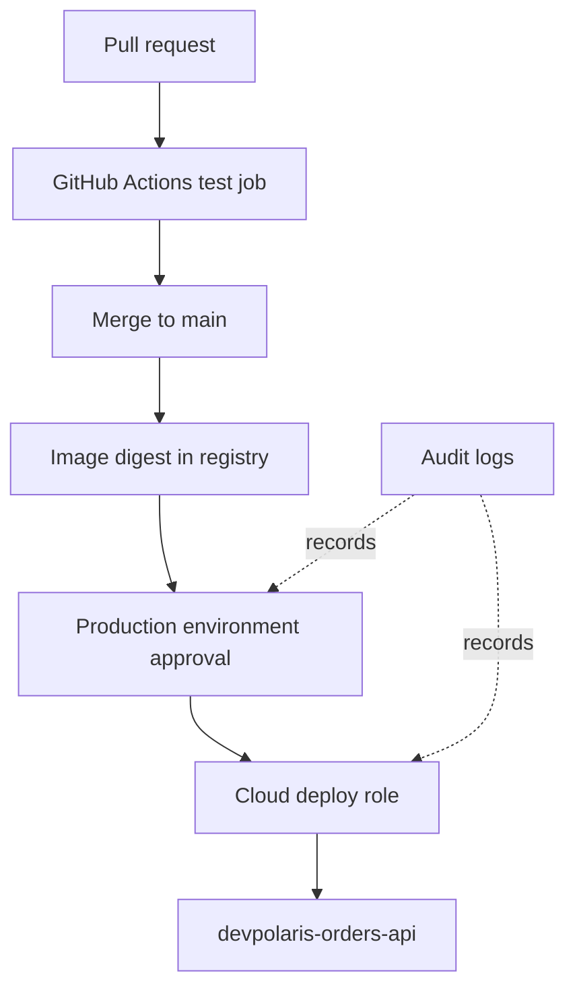

## Table of Contents

1. [What Threat Modeling for DevOps Workflows Means in Delivery Work](#what-threat-modeling-for-devops-workflows-means-in-delivery-work)
2. [The Operating Context](#the-operating-context)
3. [A Useful Baseline Workflow](#a-useful-baseline-workflow)
4. [Artifacts That Make the Risk Concrete](#artifacts-that-make-the-risk-concrete)
5. [Diagnostic Path](#diagnostic-path)
6. [Failure Modes and Fix Directions](#failure-modes-and-fix-directions)
7. [Engineering Tradeoffs](#engineering-tradeoffs)
8. [Production Access Review Practice](#production-access-review-practice)

## What Threat Modeling for DevOps Workflows Means in Delivery Work

Threat modeling means drawing the workflow, naming misuse
stories, and deciding which
risks need controls. It exists because vague worry does
not help a team choose what to
fix.

The running example is devpolaris-orders-api, a Node.js
service stored in GitHub,
tested and deployed with GitHub Actions, and hosted in a
small cloud account. The team
uses a production GitHub environment, a package registry
image, a cloud deploy role,
and a monthly production access review. That example is
small enough to inspect by
hand, but it contains the same trust questions that appear
in larger delivery systems.

A delivery system is not only a build script. It is a set
of identities, artifacts,
approvals, and logs that can change production. When you
look at security through that
lens, the useful question is not "is this secure" in a
vague way. The useful question
is which identity can perform which action, at which
boundary, with which evidence
left behind.

For a junior engineer, this framing is helpful because it
turns security from a
separate language into normal debugging. If a deploy
failed, you inspect the actor,
the permission, and the target. If a deploy succeeded when
it should not have, you
inspect the same things and then tighten the boundary that
allowed it.

## The Operating Context

The service path is intentionally ordinary. A developer
opens a pull request, GitHub
Actions runs tests, the merge to main builds an image, and
the deploy job updates
production after environment approval. The cloud account
contains the production app,
a database, a log workspace, a secret store, and a few IAM
or RBAC roles.



The diagram is the first artifact. It gives the team a
shared object to point at
during review. If someone says the pipeline is safe, ask
which arrow they mean. If
someone says a risk is accepted, ask which box owns that
risk and which log proves the
action later.

## A Useful Baseline Workflow

A baseline workflow should separate untrusted validation
from trusted deployment. Pull
request code can run tests, but it should not receive
production secrets or broad
write permissions. Deployment should happen from the
protected branch and should use
an environment that records approval.

```yaml
name: orders-api-delivery
on:
  pull_request:
    branches: ["main"]
  push:
    branches: ["main"]

permissions:
  contents: read

jobs:
  test:
    runs-on: ubuntu-latest
    steps:
      - uses: actions/checkout@v4
      - uses: actions/setup-node@v4
        with:
          node-version: "20"
          cache: "npm"
      - run: npm ci
      - run: npm test

  deploy-prod:
    needs: test
    if: github.ref == 'refs/heads/main'
    environment: production
    permissions:
      contents: read
      id-token: write
      packages: read
    runs-on: ubuntu-latest
    steps:
      - uses: actions/checkout@v4
      - run: ./scripts/login-cloud-oidc.sh
      - run: ./scripts/deploy-prod.sh
```

This workflow is not perfect, but the shape is healthy.
The top-level token is
read-only. The deploy job asks for the extra permissions
it needs. The deploy job runs
only from main and uses a named production environment. A
reviewer can now inspect one
job and understand why it has more power than the test
job.

If a failure appears, avoid broadening everything at once.
A denied package read needs
a package read permission. A denied cloud action needs the
exact cloud action on the
exact resource. A missing approval needs an environment
rule, not a larger token.

## Artifacts That Make the Risk Concrete

Security reviews improve when they use real artifacts
instead of opinions. A workflow
file, role policy, audit event, access review note, or
deployment record lets the team
discuss the same facts.

```text
Service: devpolaris-orders-api
Commit: 8f2a91d4c0b8
Workflow run: orders-api-delivery #1842
Image: ghcr.io/devpolaris/orders-api@sha256:4e1b9f...c71a
Cloud principal: orders-api-prod-deployer
Environment approver: maya-dev
Target: rg-devpolaris-orders-prod/orders-api
Health check: GET /health returned 200
```

This record gives the team a path backward from production
to source. If the running
image does not match the workflow output, investigate the
deploy script or a manual
production change. If the cloud principal is a human admin
instead of the deploy role,
investigate why the normal path was bypassed.

The tradeoff is that evidence takes storage and design.
The fix is to automate facts
where possible and keep human notes for judgment,
exceptions, and decisions.

## Diagnostic Path

A good security habit should help when something breaks.
The diagnostic path below
works for most delivery security questions because it
follows the change from code to
production.

```text
Diagnostic path
1. Start with the pull request, commit SHA, actor, and changed files.
2. Open the workflow run and record event, ref, job permissions, and approval.
3. Compare the artifact digest with the digest running in production.
4. Check the cloud activity log for principal, action, resource, and result.
5. Match the finding to a fix: narrow a permission, rotate a secret, add review, or improve evidence.
```

The important detail is order. Starting in the cloud
console can show what changed,
but it may not show why the change was allowed. Starting
in the pull request can show
intent, but it may not show the acting identity. Walking
the whole chain keeps the
team from fixing the first symptom and missing the broken
boundary.

For devpolaris-orders-api, the most useful fields are
commit SHA, workflow event, job
permissions, image digest, cloud principal, and target
resource. If one field is
missing, add it to the workflow output or release
evidence.

## Failure Modes and Fix Directions

Most delivery security failures repeat familiar shapes.
Learn to recognize the shape,
then choose the narrow fix.

| Failure mode | What it looks like | Fix direction |
| :--- | :--- | :--- |
| Trust boundary is missing | PR job can deploy or publish | Split jobs and restrict events |
| Permission is too broad | One role can change every service | Scope role to one service and environment |
| Secret is long-lived | Static cloud key sits in GitHub secrets | Replace with OIDC or rotate and restrict |
| Evidence is weak | Production changed with no visible approver | Add environment approvals and audit retention |
| Ownership is unclear | Nobody knows who reviews workflow changes | Add CODEOWNERS and a review checklist |

A fix direction is not the same as a command. The command
depends on the provider and
repository. The engineering decision is stable: reduce
blast radius, make the boundary
explicit, and keep enough evidence to prove the next
change.

## Engineering Tradeoffs

Security controls have costs. Narrow roles take longer to
write than admin roles.
Environment approval slows an urgent release. Secret
rotation can break old processes
if the team does not plan the handoff. Audit retention
costs money and needs a
retrieval path.

The answer is not to remove friction everywhere. Put
friction where the risk changes.
A normal application code change can move with peer review
and tests. A workflow
permission change, deploy role change, or production
secret change should receive a
more careful review because it changes what the delivery
system can do.

For the orders API team, the practical target is
explainable security. If a junior
engineer can trace who approved a change, which identity
deployed it, which artifact
ran, and which permission allowed it, the system is much
easier to operate and
improve.

## Production Access Review Practice

Monthly production access reviews are where the mental
model meets people. The review
should compare current access with current responsibility.
It should remove old users,
confirm service identities, and record any exception with
an owner and date.

```text
Review: devpolaris-orders-api production access
Date: 2026-05-08
Human admins: maya-dev, oren-platform
Log readers: orders-oncall-group
Deploy role: orders-api-prod-deployer
Removed: old-ci-service-user, sam-contractor
Exception: shared log reader remains until workspace split, owner oren-platform
Next review: 2026-06-05
```

This artifact is small, but it answers important
questions. Who still has access?
Which temporary exception remains? Who owns the cleanup?
If the review finds an
account nobody recognizes, disable it or remove access
first, then investigate why it
was still present.

---

**References**

- [GitHub Actions security hardening](https://docs.github.com/actions/security-guides/security-hardening-for-github-actions) - GitHub explains token scope, secret handling, and safer workflow patterns.
- [NIST Secure Software Development Framework](https://csrc.nist.gov/Projects/ssdf) - NIST describes secure software practices that map well to delivery systems.
- [OWASP Threat Modeling Cheat Sheet](https://cheatsheetseries.owasp.org/cheatsheets/Threat_Modeling_Cheat_Sheet.html) - OWASP gives a practical structure for finding and discussing threats.
- [GitHub Actions OpenID Connect](https://docs.github.com/actions/deployment/security-hardening-your-deployments/about-security-hardening-with-openid-connect) - GitHub describes replacing long-lived cloud secrets with short-lived federation.
