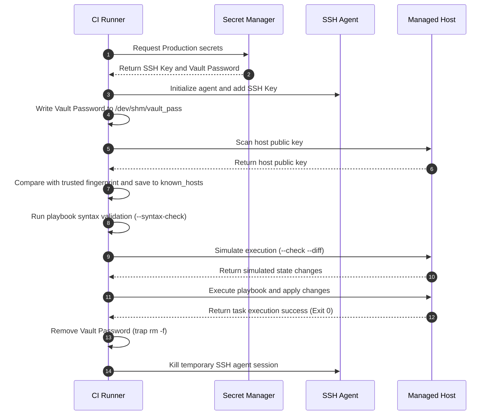

## Table of Contents

1. [The Problem: Uncontrolled and Untracked Deployments](#the-problem-uncontrolled-and-untracked-deployments)
2. [The Runner as an Automated Control Node](#the-runner-as-an-automated-control-node)
3. [Environment-Driven Dependency Resolution Paths](#environment-driven-dependency-resolution-paths)
4. [Secure Credential Management in Runner Environments](#secure-credential-management-in-runner-environments)
5. [Multi-Vault Identity Management and Vault Labels](#multi-vault-identity-management-and-vault-labels)
6. [Memory Leakage and Swap Space Vulnerabilities](#memory-leakage-and-swap-space-vulnerabilities)
7. [SSH Key Architecture: Agent Socket Authentication](#ssh-key-architecture-agent-socket-authentication)
8. [The Cryptographic Challenge-Response Handshake](#the-cryptographic-challenge-response-handshake)
9. [Host Key Verification and Hashed Known Hosts](#host-key-verification-and-hashed-known-hosts)
10. [Host Key Fingerprint Mismatches and Safe Remediation](#host-key-fingerprint-mismatches-and-safe-remediation)
11. [Verification Stages: Syntax Checks and Simulated Runs](#verification-stages-syntax-checks-and-simulated-runs)
12. [Execution Results: POSIX Exit Codes and Pipeline Integration](#execution-results-posix-exit-codes-and-pipeline-integration)
13. [Background Processes and the Wait Protocol](#background-processes-and-the-wait-protocol)
14. [Process Isolation and Containerized Runner Boundaries](#process-isolation-and-containerized-runner-boundaries)
15. [Linux Namespaces and Escape Vectors](#linux-namespaces-and-escape-vectors)
16. [Automated Execution Workflow](#automated-execution-workflow)
17. [Putting It All Together](#putting-it-all-together)
18. [What's Next](#whats-next)
19. [References](#references)

## The Problem: Uncontrolled and Untracked Deployments

Running Ansible in CI means turning a playbook run into a credentialed, logged pipeline job with explicit inventory, limit, preview, and approval boundaries.

Deploying application updates across multiple production servers requires careful control over when, where, and how changes are applied. When engineering teams run Ansible playbooks manually from their own local computers, they introduce several major security and operational risks into the infrastructure. A developer laptop contains personal configuration settings, custom environment variables, and varying versions of Ansible. These discrepancies mean that a playbook running successfully on one machine might fail on another due to minor differences in the local Python library paths or remote connection defaults.

Manual execution also presents a severe security vulnerability. To run a playbook, the local computer must have direct SSH access to the production servers and must possess the decryption keys for Ansible Vault secrets. If these private keys and passwords reside on multiple developer machines, the attack surface of the entire organization expands. An attacker who compromises a single developer laptop can immediately gain administrative access to the production fleet. Furthermore, manual execution lacks centralized audit tracking. When a team member modifies a database configuration or restarts a critical web server from their command terminal, there is no shared record of what command was run, what change was made, or which commit version was active.

To solve these problems, teams must transition all playbook execution to a centralized, automated pipeline. The continuous integration runner becomes the dedicated control plane that executes playbooks inside a controlled and standardized environment. This automation ensures that every execution is identical, fully logged, and triggered only after passing structured syntax and security audits.

## The Runner as an Automated Control Node

A CI runner is the temporary machine or container that executes a pipeline job. When it runs `ansible-playbook`, that runner becomes the control node for the deployment.

Example: a GitLab runner can check out the repository, install pinned Ansible collections, load an SSH agent, and connect to production hosts. Unlike a developer laptop, the automated runner starts from a clean environment, so it must be configured with the exact dependencies, paths, and settings the playbook requires.

Every automated run should begin by auditing the execution environment itself to establish a baseline in the build logs. This audit is crucial because a change in the underlying operating system image or the Python runtime on the runner can silently alter how Ansible evaluates tasks or establishes network connections. Running the version verification tool records the active state of the control node:

```bash
ansible --version
```

The output printed to the pipeline log contains several critical values that engineers can use to debug failed execution runs:

| Field | Meaning | Impact on Execution |
| :--- | :--- | :--- |
| ansible core version | The specific version of the engine | Determines feature availability and module behaviors |
| config file | The active configuration file | Specifies the parsed configuration precedence path |
| configured module search path | Where modules are loaded from | Shows custom module directory override paths |
| ansible python module location | The system path to the library | Identifies the active core library dependencies |
| executable location | The path to the binary | Confirms which command line execution path is used |
| python version | The version of the interpreter | Controls standard string encoding and cryptographic features |

If the output shows that Ansible is using a default configuration file under the host operating system path instead of the repository configuration file, the pipeline might execute tasks with incorrect timeout variables or unsafe log settings. By printing these details at the start of every run, teams can ensure that any environment drift is immediately visible in the central build history.

## Environment-Driven Dependency Resolution Paths

Dependency resolution paths are the directories Ansible searches for roles, collections, and custom modules. In CI, those paths should point to pinned, expected locations instead of whatever happens to be installed on the runner image.

Example: `ANSIBLE_COLLECTIONS_PATH` can point to a repository-managed collection install directory so a pipeline uses the same `community.general` version every run. Beyond tracking binary versions, automated runners must explicitly manage these downstream dependency paths.

Ansible allows pipelines to control these resolution behaviors using dedicated shell environment variables:
- `ANSIBLE_ROLES_PATH` specifies the lookup directory for system roles.
- `ANSIBLE_COLLECTIONS_PATH` configures where Ansible collections are loaded.
- `ANSIBLE_LIBRARY` sets the search paths for custom module source files.

When Ansible resolves roles, modules, and collections, it consults these configured search paths. Configuring them explicitly in the pipeline specification prevents path offset errors and makes dependency loading come from the intended version-controlled or pinned installation locations instead of whatever happens to exist on the runner image.

## Secure Credential Management in Runner Environments

Runner credential management is the process of giving the CI job temporary access to Vault passwords, SSH keys, and cloud credentials without leaving them behind. The runner needs these values only for the deployment window.

Example: a job can write a Vault password to `/dev/shm/vault_pass` with mode `0600`, register a cleanup trap, and remove the file when the job exits. While a human operator can type a password interactively, an automated pipeline must use non-interactive methods carefully.

Passing a vault password as a standard environment variable is highly discouraged. Operating systems expose environment variables to all running processes under the same user space, and any diagnostic tool that dumps the environment block of the system will print the plain-text password to the pipeline logs. Similarly, writing the password to a permanent file on the runner filesystem creates a persistent copy that might remain on the disk after the job completes, especially if the runner is shared across multiple pipeline projects.

To mitigate these risks, pipelines should store the vault password as a masked secret in the pipeline configuration and expose it to Ansible only for the duration of the job. A common Linux pattern is writing the password file under `/dev/shm`, which is usually backed by tmpfs memory rather than an ordinary workspace file. This reduces disk persistence risk, but swap, runner configuration, and crash behavior still matter.

To clean up even when the playbook command fails or the shell receives common termination signals, engineers use POSIX shell traps. A trap registers a cleanup command that runs for normal shell exits and handled signals, though it cannot protect against every failure mode such as a killed runner VM:

```bash
mkdir -p ~/.ssh
chmod 700 ~/.ssh
echo "${ANSIBLE_VAULT_PASSWORD}" > /dev/shm/vault_pass
chmod 600 /dev/shm/vault_pass
trap 'rm -f /dev/shm/vault_pass' EXIT INT TERM
```

The cleanup trap keeps the password file limited to the job window in normal operation. Once the shell finishes executing, the file is unlinked from the tmpfs path, reducing the chance that later pipeline jobs can read it.

## Multi-Vault Identity Management and Vault Labels

Multi-vault identity management means supplying more than one Vault password to a run and labeling which encrypted content each password should unlock. This keeps different secret groups separated inside the same deployment.

Example: database credentials can use a `db` vault ID, while application feature flags use an `app` vault ID. Rather than merging these keys into a single password file, pipelines pass separate `--vault-id` arguments.

Ansible supports parsing multiple vault passwords simultaneously using the `--vault-id` flag, which pairs a human-readable identity label with a password file source path. This architecture allows organizations to isolate credentials across logical boundaries in the continuous integration runner:

```bash
ansible-playbook -i inventories/prod.ini playbooks/deploy.yml \
  --vault-id db@/dev/shm/db_vault_pass \
  --vault-id app@/dev/shm/app_vault_pass
```

When the execution engine encounters an encrypted block of variables, it reads the header label (such as `$ANSIBLE_VAULT;1.2;AES256;db`) and tries the matching vault ID password first. By default, vault labels are hints; if you need Ansible to use only the password with the matching label, enable `DEFAULT_VAULT_ID_MATCH` and scope CI secrets so jobs receive only the vault passwords they truly need.

## Memory Leakage and Swap Space Vulnerabilities

Swap space is disk-backed storage the operating system can use when RAM is under pressure. A file stored in `/dev/shm` is intended to live in memory, but memory pages can still be copied to swap unless the runner environment prevents it.

Example: a Vault password written to `/dev/shm/vault_pass` can reduce normal workspace persistence, but an unencrypted swap partition can still receive memory pages containing secrets under pressure.

If the vault password file in `/dev/shm` or the memory of the Ansible playbook process itself is paged out, the plain-text credentials are written to physical disk sectors. These sectors are not automatically cleared when the process exits, allowing users with root access to retrieve the secrets later by scanning raw disk blocks. To protect secrets from swap space leakage, engineers must ensure the host operating system encrypts its swap partition or configures the runner environment to lock secret-handling memory regions using the `mlock` system call, which explicitly prevents designated RAM pages from being paged to disk.

## SSH Key Architecture: Agent Socket Authentication

An SSH agent is a local helper process that holds private keys in memory and signs authentication challenges for SSH clients. The playbook uses the agent through a socket path instead of reading a raw key file from the workspace.

Example: the CI job can load `PRODUCTION_SSH_KEY` into `ssh-agent`, expose `SSH_AUTH_SOCK`, run Ansible, then kill the agent after the job. This separates key material from playbook files and reduces accidental key leakage.

An SSH agent is a background service process that holds decrypted private keys in its system memory. The agent does not expose the private key bytes to the external environment. Instead, it creates a Unix domain socket, which is a specialized local communication file on the operating system. When a client process needs to authenticate against a remote host, it sends a cryptographic challenge request to this socket file. The agent signs the challenge using the private key in memory and returns the signature to the client. The location of this socket file is exposed to the shell through the `SSH_AUTH_SOCK` environment variable.

In an automated pipeline, the CI runner establishes a temporary SSH agent before starting the Ansible execution. The secure credentials manager of the pipeline provider injects the private key into the agent, and the runner exposes only the socket path to the execution workspace:

```bash
eval $(ssh-agent -s)
echo "${PRODUCTION_SSH_KEY}" | tr -d '\r' | ssh-add -
```

When Ansible executes the connection plugin to contact a remote host, the underlying SSH process reads the `SSH_AUTH_SOCK` variable, connects to the socket, and requests a signature. The private key remains inside the agent process, so it is not copied into the workspace as a plain file. The remaining risk is agent misuse: any process that can access the agent socket during the job can ask the agent to sign authentication requests, so isolate the runner and kill the agent after the playbook finishes.

## The Cryptographic Challenge-Response Handshake

Challenge-response authentication proves the runner controls the private key without sending the private key to the server. The server sends or participates in data that must be signed, and the SSH client returns a valid signature.

Example: the runner's SSH client asks the local agent to sign session data for `app-server-01`; the target server verifies that signature with the matching public key in `authorized_keys`. During authentication, the SSH client initiates a TCP connection to port 22 and offers the public key identity to the target server.

The target server checks its authorized keys list to verify whether the public key is allowed. If the key is recognized, the SSH client must prove it controls the matching private key by producing a valid signature over SSH session data. The runner client cannot produce that signature directly if the key is held by the agent. Instead, it sends the signing request through the local Unix domain socket specified by `SSH_AUTH_SOCK`.

The background SSH agent process receives the signing request, uses the private key to generate a cryptographic signature, and returns the signature through the Unix socket to the SSH client. The client forwards the signature to the target host. The target host verifies the signature using the matching public key and grants shell access. Because the private key does not need to leave the agent process, the pipeline workspace stays cleaner.

## Host Key Verification and Hashed Known Hosts

A host key is the server's public identity for SSH. Host key verification checks that the server answering on port 22 is the server you expected, not another machine intercepting the connection.

Example: before connecting to `192.168.10.15`, the runner should already know that host's Ed25519 fingerprint and reject the connection if the server presents a different key. In interactive environments, SSH may prompt a person to accept a new fingerprint, but an automated pipeline cannot answer that prompt safely.

A common but highly insecure workaround is to disable host key verification entirely by setting the `ANSIBLE_HOST_KEY_CHECKING` configuration variable to false. This configuration instructs the SSH client to accept any host key presented by the remote end without checking its validity. If an attacker intercepts the network traffic between the runner and the production server, they can present a malicious public key, intercept the login session, and capture the administrative credentials of the target system.

To maintain security while allowing automated execution, the pipeline must populate the known hosts file of the runner before launching the playbook. The safest pattern is to store expected host key fingerprints in a trusted source, such as your deployment repository or infrastructure inventory, then compare scans against those expected values. `ssh-keyscan` is useful for collecting keys, but by itself it does not prove the key is authentic:

```bash
ssh-keyscan -H -t ed25519 192.168.10.15 192.168.10.16 >> ~/.ssh/known_hosts
chmod 600 ~/.ssh/known_hosts
```

A standard known hosts file entry consists of host identifiers, the public key type, and the base64-encoded public key payload. Using the `-H` option hashes the hostname and IP address fields, which reduces topology exposure if someone reads the known hosts file. If a host key changes unexpectedly during execution, the SSH client detects the fingerprint mismatch, aborts the connection, and fails the pipeline before continuing the SSH session.

## Host Key Fingerprint Mismatches and Safe Remediation

A host key mismatch means the key returned by the server does not match the key the runner expected for that host. Treat it as a security event until you prove the host was legitimately replaced or rekeyed.

Example: if `checkout-web-01.internal` was rebuilt, its host key may change, but the safe fix is to verify the new fingerprint through a trusted management path before updating `known_hosts`. When the automated pipeline sees a mismatch, SSH aborts the connection to prevent interception attacks.

In automated environments, developers are often tempted to script an automated deletion of the old host key using commands like `ssh-keygen -R`. This practice is highly unsafe because it programmatically disables the protection provided by host key verification. If a network attack is in progress, the script will delete the genuine host key, accept the attacker's malicious host key, and proceed with playbook execution.

Safe remediation requires explicit, out-of-band key management. Host keys should be rotated using administrative control tasks on isolated management planes, not through automated scripts inside the pipeline itself. The new public key should be extracted from the physical or virtual machine hypervisor API, where its authenticity can be confirmed independently of the network path, and then pushed to the deployment repository using cryptographically signed Git commits before the pipeline is allowed to run again.

This operational flow preserves the integrity of the host key verification check and prevents automated pipelines from blindly trusting altered network targets.

## Verification Stages: Syntax Checks and Simulated Runs

Verification stages are pipeline checks that increase in depth before production execution. A syntax check catches playbook structure errors, while check mode and diff mode provide target-aware preview evidence.

Example: run `--syntax-check` on every pull request, then run `--check --diff --limit staging-canary-01` against staging before a production approval step.

The first stage is a syntax audit. This check reads the playbook structure and catches YAML parsing errors and many static playbook problems. It does not execute tasks on remote hosts, and it should not be treated as a complete module-behavior test:

```bash
ansible-playbook -i inventories/ci.ini playbooks/deploy.yml --syntax-check
```

If a developer makes a basic mistake, such as incorrect indentation, this check can fail immediately. Because this audit runs without applying changes, teams can run it on every pull request, while still keeping deeper validation for linting, check mode, and staging runs.

The second stage is a dry-run simulation using check mode and diff mode. This execution contacts the staging targets but instructs the active modules not to apply any actual modifications. Instead, the modules query the remote operating system state, compare it against the desired state defined in the playbook, and report what changes would occur:

```bash
ansible-playbook -i inventories/staging.ini playbooks/deploy.yml \
  --check \
  --diff \
  --limit staging-canary-01 \
  --vault-password-file /dev/shm/vault_pass
```

Diff mode prints a visual text comparison for modules that support useful diffs. If the playbook attempts to update a file that contains sensitive production secrets, diff mode can print those secrets to the logs unless the task explicitly disables diff generation. To protect these secrets, any task handling credentials must disable diff reporting:

```yaml
- name: Write application configuration file
  ansible.builtin.template:
    src: config.j2
    dest: /etc/app/config.conf
    mode: "0600"
  no_log: true
  diff: false
```

Setting `no_log` to true prevents the task from printing its input parameters, variables, and execution results to the pipeline output, while setting `diff` to false prevents the module from printing the text differences of the modified file.

## Execution Results: POSIX Exit Codes and Pipeline Integration

A POSIX exit code is the integer a process returns to its parent shell when it exits. CI runners use that code to decide whether a job step passed or failed.

Example: if `ansible-playbook` exits with `0`, the deployment step can continue. If it exits non-zero because a host failed or was unreachable, the pipeline should stop or run a controlled failure handler.

Ansible returns process exit codes that the pipeline runner can parse to handle failures gracefully. Exact codes can vary by Ansible version and failure path, so pin your Ansible version and test the outcomes your pipeline depends on. The following table describes common patterns:

| Exit Code | Meaning | System Cause | Pipeline Action |
| :--- | :--- | :--- | :--- |
| 0 | Success | All tasks completed successfully on all active targets | Proceed to the next deployment step |
| non-zero | General Error | A command line error, syntax problem, unreachable host, failed task, or runtime exception occurred | Fail the job unless the script intentionally captures and handles the status |

If a task fails on a target host, Ansible exits non-zero, which prompts the CI runner to mark the entire build job as failed. However, in complex deployments, teams may want to capture failures to trigger automated rollbacks or send notifications to a messaging channel. To prevent the CI runner from immediately terminating before cleanup or notifications run, engineers can capture the exit status within the pipeline script:

```bash
ansible-playbook -i inventories/prod.ini playbooks/deploy.yml
STATUS=$?
if [ $STATUS -ne 0 ]; then
  echo "Deployment failed with exit code ${STATUS}"
  ./scripts/notify-failure.sh
  exit $STATUS
fi
```

Capturing the status allows the runner to execute cleanup scripts, record diagnostic measurements, and exit with the original failure code so the system accurately reports the build outcome.

## Background Processes and the Wait Protocol

The wait protocol is the shell pattern for starting a process in the background, keeping its process ID, and later collecting its real exit code with `wait`. It matters because starting a command successfully is not the same as the command finishing successfully.

Example: `ansible-playbook deploy.yml &` can return control to the script immediately, but only `wait $PLAYBOOK_PID` tells the runner whether the playbook ultimately passed or failed.

When a playbook runs in the background, the shell immediately returns control to the script and populates the special parameter `$!` with the process identifier of the background command. However, the exit status parameter `$?` will immediately report zero, indicating that the command was successfully sent to the background, rather than reporting whether the playbook itself completed successfully. To capture the true exit status of the background task, the pipeline script must use the `wait` command, passing the captured process identifier:

```bash
ansible-playbook -i inventories/prod.ini playbooks/deploy.yml &
PLAYBOOK_PID=$!
wait $PLAYBOOK_PID
PLAYBOOK_STATUS=$?
```

Using this protocol suspends the parent shell until the specific background process exits, transferring the true exit code of the playbook into `$?` so the pipeline runner can evaluate the build outcome accurately.

## Process Isolation and Containerized Runner Boundaries

Process isolation is the set of operating system boundaries that keep one pipeline job from reading or controlling another job or the host. CI runners may use isolated virtual machines or containers, and those models have different risk profiles.

Example: a dedicated VM runner gives production credentials their own temporary machine, while a container runner may share the host kernel with other jobs and needs stricter capability and mount controls.

In a containerized runner environment, the pipeline job executes inside a lightweight container (such as a Docker container). This container has a dedicated filesystem and an isolated network namespace, but it shares the host operating system kernel. If the runner container is configured to run in privileged mode or mounts the host Docker socket, a compromised playbook can escape the container boundaries. An attacker could execute container escape commands, gain administrative control over the host runner virtual machine, and read the secrets of other pipeline projects.

To secure containerized environments, runners should always operate with reduced privileges. Mounting the host Docker socket file `/var/run/docker.sock` inside the execution container must be avoided, because any process with access to that socket can issue commands with full Docker daemon authority on the host. The Ansible process should run as a non-root user within the container filesystem, and repository files should be mounted read-only to prevent the playbook from modifying runner configurations. For production deployment pipelines, isolated runner virtual machines should be allocated so that production credentials are never loaded onto shared, multi-tenant container nodes where other projects could reach them.

By enforcing strict process isolation at the runner level, organizations ensure that even if a playbook contains a compromised dependency or a malicious community role, the blast radius of the intrusion is confined to a single, temporary execution space.

## Linux Namespaces and Escape Vectors

Linux namespaces are kernel features that give a container its own view of resources such as filesystems, process IDs, networks, and users. Escape vectors are configuration mistakes that weaken those views and let container processes affect the host.

Example: a runner container with `--privileged` can access host device nodes under `/dev`, which may let a malicious task mount host disks. Modern container runtimes rely on namespaces for isolation, but privileged settings can break the boundary.

When a continuous integration runner container is executed with the `--privileged` flag or is assigned host namespaces, these safety boundaries are broken. A playbook task configured to run shell commands inside a privileged container can interact directly with the host kernel device nodes located under `/dev`. An attacker can use these nodes to mount the underlying host physical disk partition, access host configuration files, and retrieve secrets belonging to other projects on the same runner host. To prevent this, organizations must configure container runtimes to restrict capabilities, block root namespace mapping, and utilize isolated virtual machines for production pipelines.

## Automated Execution Workflow

The following sequence diagram illustrates how the continuous integration runner coordinates credentials, verifies hosts, runs validation checks, and applies changes safely:



This workflow initializes credentials and execution sockets dynamically, checks them before use, limits their lifetime, and cleans them up before the job terminates in normal operation.

## Putting It All Together

The problem of uncontrolled deployments is not primarily a tooling problem. It is a traceability and isolation problem. When engineers run playbooks from laptops, every run is invisible to the rest of the team. There is no record of who ran what, no way to reproduce the exact execution environment, and no gate between an untested change and a production server in the customer portal cluster.

A CI pipeline solves these three problems simultaneously. Every playbook execution is tied to a specific commit in version control, so the exact code that changed the infrastructure is permanently recorded alongside the infrastructure change itself. The runner container provides a hermetic execution environment with pinned dependency versions, so the same playbook produces the same result whether it runs today or six months from now. The pipeline gate, a syntax check, a check-mode dry run against staging, and a peer review approval, prevents any change from reaching production unless it passes the team's shared quality bar.

The customer portal deployments that once drifted under untracked manual runs are now governed by a pipeline that records every execution, constrains every runner to a known-good environment, loads credentials only into memory for the duration of the job, verifies host keys against a trusted fingerprint before opening any SSH connection, and cleans up all credential material when the job completes. Each of those controls addresses a specific failure mode that manual execution routinely exposed.

## What's Next

With the continuous integration pipeline securing the control node and target verification workflows, the next step is establishing continuous compliance monitoring. The following article details how to audit host configurations, detect unauthorized state changes, and use automated testing frameworks to confirm that target servers remain in their desired state long after the deployment pipeline completes.

---

**References**

- [Ansible Playbook Verification Options](https://docs.ansible.com/ansible/latest/cli/ansible-playbook.html)
- [How to Validate Tasks using Check Mode](https://docs.ansible.com/ansible/latest/playbook_guide/playbooks_checkmode.html)
- [SSH Agent Protocol Specifications](https://www.openssh.com/txt/draft-miller-ssh-agent-04.txt)
- [Shared Memory tmpfs Filesystem Administration](https://www.kernel.org/doc/html/latest/filesystems/tmpfs.html)
- [POSIX Exit Code Standards](https://pubs.opengroup.org/onlinepubs/9699919799/utilities/V3_chap02.html)
- [Secure Host Key Verification Best Practices](https://docs.ansible.com/ansible/latest/reference_appendices/config.html#ansible-host-key-checking)
