## Table of Contents

1. [The Problem: Orchestrating the Control Plane and Targets](#the-problem-orchestrating-the-control-plane-and-targets)
2. [Ansible's Default Execution Boundary](#ansibles-default-execution-boundary)
3. [Bypassing the SSH Transport: Local Connection Mode](#bypassing-the-ssh-transport-local-connection-mode)
4. [Under the Hood: Subprocess Spawning on the Control Node](#under-the-hood-subprocess-spawning-on-the-control-node)
5. [Target Delegation: Running Tasks on Sibling Hosts](#target-delegation-running-tasks-on-sibling-hosts)
6. [Delegate Facts and the Fact Assignment Boundary](#delegate-facts-and-the-fact-assignment-boundary)
7. [Local Process Exhaustion and Throttling Boundaries](#local-process-exhaustion-and-throttling-boundaries)
8. [The Shorthand Legacy: local_action versus delegate_to](#the-shorthand-legacy-local_action-versus-delegate_to)
9. [Environmental Inheritance and Path Resolution Differences](#environmental-inheritance-and-path-resolution-differences)
10. [Security Boundaries and the Risks of Local Actions](#security-boundaries-and-the-risks-of-local-actions)
11. [Local and Remote Execution Scenarios](#local-and-remote-execution-scenarios)
12. [Putting It All Together](#putting-it-all-together)
13. [What's Next](#whats-next)

## The Problem: Orchestrating the Control Plane and Targets

Ansible execution boundaries define where a task runs: on the control node, on a remote managed host, or through a delegated target.

When automating the deployment of a secure customer notification system, system engineering teams must coordinate tasks across different physical environments. The notification service package is compiled as a compressed software tarball on a centralized integration server or resides in a local build directory on the control machine. The target production fleet consists of several remote virtual machines situated behind strict network firewalls.

To deploy the update successfully, the playbook cannot start by modifying the remote servers. Before touching any production server, it must verify that the compiled tarball exists on the local build filesystem, calculate its SHA256 checksum against the expected value, read a version manifest file to determine which target version to deploy, and query a central configuration database or key-value store to retrieve active deployment routing rules. None of these operations can run on the remote nodes because they depend on local files or internal APIs that the remote servers cannot reach.

If the playbook attempts to execute these tasks using the standard SSH connection pipeline, the tasks will run on the remote target nodes. The remote nodes do not have access to the local build directory on the control plane, resulting in task failures.

Conversely, if developers write separate, custom Bash scripts to handle the local build audits before launching Ansible, they lose the benefits of a single, unified orchestration codebase. The engineering team needs a mechanism within Ansible to define explicit execution boundaries, directing some tasks to run locally on the control node and others to execute on the remote production targets.

## Ansible's Default Execution Boundary

Ansible's default execution boundary is remote execution. The control node runs `ansible-playbook`, but normal tasks execute on managed hosts through the selected connection plugin, usually SSH for Linux.

Example: a file task that creates `/etc/app/config.yml` runs on `app-server-01`, not on your laptop, because that file belongs on the target server. By default, this separates the control node from the managed hosts listed in the inventory.

When you execute a standard task, such as creating a directory, the control plane performs the following actions:
1. **Module Payload Preparation**: It gathers the code path for the selected module (e.g. `ansible.builtin.file`) and prepares the task parameters for the connection plugin.
2. **SFTP/SCP Transport**: With the common SSH connection, it opens a secure shell connection to the target host and transfers a module payload to a remote temporary directory, typically under `/tmp/ansible-tmp-...`.
3. **Remote Execution**: It executes the module using the target host's supported interpreter or execution path.
4. **Clean Up**: It deletes the temporary remote files and reads the JSON return string over the SSH socket connection to report success or failure.

While this default boundary keeps managed hosts isolated and standardizes target configurations, it is highly inefficient when a task needs to query resources that reside exclusively on the control node itself.

## Bypassing the SSH Transport: Local Connection Mode

Local connection mode runs tasks on the control node instead of a remote host. Use it when the task needs local files, local tools, or local cloud credentials.

Example: a task that checks `/opt/builds/checkout/checkout-api-latest.tar.gz` must run on the build server that holds the artifact, not on a production web host. Ansible provides the `connection: local` directive to use this local execution path.

The following playbook demonstrates how to use `connection: local` to audit local software tarballs on the control node before pushing them to production web hosts:

```yaml
- name: Audit local application assets
  hosts: localhost
  gather_facts: false
  connection: local
  tasks:
    - name: Verify build tarball exists on the control node
      ansible.builtin.stat:
        path: "/opt/builds/checkout/checkout-api-latest.tar.gz"
      register: local_tarball_status

    - name: Calculate local build checksum
      ansible.builtin.stat:
        path: "/opt/builds/checkout/checkout-api-latest.tar.gz"
        checksum_algorithm: sha256
      register: local_tarball_checksum
      when: local_tarball_status.stat.exists
```

Inside this play, the target host is set to the symbolic name `localhost`. Because `connection: local` is active, the tasks run directly on the filesystem of the machine executing the playbook. No SSH keys are required, no network handshakes occur, and no remote processes are spawned. The control plane reads the local file metadata, calculates the SHA256 checksum, and registers the values in the active play context.

For local plays, set the Python interpreter deliberately when needed. Official Ansible guidance often uses `ansible_python_interpreter: "{{ ansible_playbook_python }}"` so local tasks run under the same Python environment that launched `ansible-playbook`, rather than accidentally using a different system Python.

## Under the Hood: Subprocess Spawning on the Control Node

Subprocess spawning means Ansible starts a child process on the same machine that launched the playbook. With `connection: local`, the module payload runs locally through Python instead of being transferred over SSH.

Example: a local `stat` task can run as a child Python process on the CI runner and read `/opt/builds/checkout/checkout-api-latest.tar.gz` directly from the runner filesystem.

Normally, the connection plugin manager loads `ansible.plugins.connection.ssh` to spawn a persistent SSH process. When `connection: local` is active, the manager loads `ansible.plugins.connection.local` instead.

This local connection plugin performs the following systems actions:
1. **Local Temporary Directory Creation**: It creates a secure temporary directory directly on the control node filesystem, typically under `$TMPDIR`, `/var/tmp/`, or `/tmp/`.
2. **Payload Preparation**: It writes the local module payload and JSON arguments to this local temporary directory.
3. **Subprocess Spawning**: Using Python's standard `subprocess.Popen` library, the local connection plugin forks a new child process on the control node:
   ```python
   # Simplified Python representation inside the connection plugin
   proc = subprocess.Popen(
       [sys.executable, local_zip_path],
       stdin=subprocess.PIPE,
       stdout=subprocess.PIPE,
       stderr=subprocess.PIPE
   )
   ```
4. **Execution and Deserialization**: The child process runs using the control plane's active Python interpreter (`sys.executable`). It executes the module, writes its JSON outcomes to the stdout descriptor pipe, and exits. The parent Ansible process reads the pipe, deletes the local temporary files, and deserializes the JSON payload back into memory.

This local connection path avoids the remote SSH daemon (`sshd`), firewall path, and SSH key validation for that task. It can be faster for local filesystem work, but performance still depends on the module, local disk, Python startup, and any external APIs the task calls.

```mermaid
graph TD
    subgraph SSHFlow ["Standard Remote Transport (SSH)"]
        ControlNodeSSH["Control Plane Memory"]
        SshdRemote["Remote SSH Daemon (sshd)"]
        PythonRemote["Remote Python Interpreter"]
        ControlNodeSSH -->|SFTP / TCP Port 22| SshdRemote
        SshdRemote -->|Spawns Process| PythonRemote
    end

    subgraph LocalFlow ["Local Connection Bypass (Native Subprocess)"]
        ControlNodeLocal["Control Plane Memory"]
        ForkProcess["Direct OS Fork: subprocess.Popen()"]
        PythonLocal["Control Plane Resident Python"]
        ControlNodeLocal -->|Local Filesystem Write| ForkProcess
        ForkProcess -->|Native Execution| PythonLocal
    end
```



## Target Delegation: Running Tasks on Sibling Hosts

Delegation means one task runs somewhere other than the current inventory host. It lets a play continue targeting one host while a specific task executes on the control node or another inventory host.

Example: during a database deployment, the active host can be `db-server-01`, but a metadata task can be delegated to `localhost` to write a central deployment log. While setting `hosts: localhost` is useful for dedicated local plays, delegation handles single redirected tasks inside a larger remote play.

To redirect a single task to a different host without changing the scope of the play, you can use the `delegate_to` directive.

The following playbook targets the production database servers but delegates a configuration snapshot backup task to the local control machine:

```yaml
- name: Deploy Database Schema Updates
  hosts: databases
  become: true
  tasks:
    - name: Record deployment metadata locally
      ansible.builtin.lineinfile:
        path: "/var/log/deployments/database_runs.log"
        line: "Deploying schema version {{ schema_version }} to {{ inventory_hostname }}"
        create: true
        mode: "0640"
      delegate_to: localhost
      become: false

    - name: Run database schema migration
      ansible.builtin.command: "/opt/db/bin/migrate.sh"
```

The execution flow of this delegated task behaves as follows:
- **`delegate_to: localhost`**: Directs the control plane to execute the `lineinfile` task on the control machine itself rather than on the active remote database host.
- **`become: false`**: Overrides the play-level `become: true` setting. This prevents the local connection plugin from attempting to run `sudo` on the control node, which would fail if the local running user lacks administrator privileges.
- **`inventory_hostname`**: Even though the task executes locally, the variable `{{ inventory_hostname }}` still evaluates to the name of the active database host currently being processed by the play thread. This allows you to record host-specific metadata directly to a centralized log file.

You can also use `delegate_to` to point to sibling hosts in the inventory, such as delegating a target deregistration task to your active F5 load balancer node before upgrading a web host.

## Delegate Facts and the Fact Assignment Boundary

Delegate facts control where facts gathered by a delegated task are stored. The question is whether the facts belong to the original inventory host being processed or to the host that actually ran the delegated task.

Example: while processing `web-01`, a delegated setup task can gather facts from `db-server-01`. With `delegate_facts: true`, those facts are stored under `hostvars["db-server-01"]` instead of being attached to `web-01`.

By default, facts gathered by a delegated task are assigned to the current inventory host, not to the delegated host. This surprises people who delegate a `setup` task to a different machine and expect those facts to appear under the delegated host's `hostvars`.

To assign gathered facts to the delegated host instead, set `delegate_facts: true`:

```yaml
- name: Gather facts from the database host while processing a web host
  ansible.builtin.setup:
  delegate_to: db-server-01.internal
  delegate_facts: true
```

By adding `delegate_facts: true`, Ansible stores the gathered facts under `hostvars["db-server-01.internal"]` instead of attaching them to the web host currently being processed.

## Local Process Exhaustion and Throttling Boundaries

Local process exhaustion happens when too many delegated local tasks run at once on the control node. Each copy consumes CPU, memory, file descriptors, credentials, and sometimes external API quota.

Example: a play targeting 100 web hosts can accidentally start many parallel `aws elbv2 describe-target-health` commands on `localhost` if the task is delegated without `run_once` or `throttle`.

Because `delegate_to: localhost` runs the work on the control plane, those parallel task copies consume local CPU, memory, file descriptors, API quota, and credentials.

This sudden process spike can exhaust the control plane's operating system process table, saturate its CPU cores, and trigger out-of-memory crashes:

```plain
OSError: [Errno 12] Cannot allocate memory
```

To protect the control plane from local process exhaustion, you must apply throttling boundaries to delegated tasks. Ansible provides two parameters to control this load:
- **`run_once: true`**: Instructs the engine to execute the task on one host in the active play context and share the result with other hosts in that context. With `serial`, remember that `run_once` can run once per batch, so design global API calls carefully.
- **`throttle: 1`**: Restricts the maximum number of parallel processes for that specific task. Setting `throttle: 1` ensures that the local subprocesses are executed sequentially, one after another, protecting the control plane's RAM and CPU allocation.

```yaml
- name: Query cloud target group status
  ansible.builtin.command:
    argv:
      - aws
      - elbv2
      - describe-target-health
      - --target-group-arn
      - "{{ checkout_target_group_arn }}"
  delegate_to: localhost
  run_once: true
  changed_when: false
  register: global_target_status
```

## The Shorthand Legacy: local_action versus delegate_to

`local_action` is older shorthand for running a task on the control machine. `delegate_to: localhost` is the clearer modern form because it keeps normal YAML module syntax.

Example: a local build archive check is easier to review as a normal `ansible.builtin.stat` task with `delegate_to: localhost` than as a dense one-line `local_action` string.

A comparison of the two syntax formats illustrates the architectural differences:

```yaml
# The legacy shorthand format (local_action)
- name: Verify build archive locally
  local_action: ansible.builtin.stat path=/opt/builds/archive.tar.gz

# The modern standard format (delegate_to)
- name: Verify build archive locally
  ansible.builtin.stat:
    path: /opt/builds/archive.tar.gz
  delegate_to: localhost
```

Both formats can run work locally, but the `delegate_to: localhost` format is usually easier to read and review.

The `local_action` syntax often encourages dense one-line key-value notation, which is harder to read in reviews.

Furthermore, `delegate_to: localhost` preserves standard YAML block dictionary syntax and makes Fully Qualified Collection Names (FQCNs) easy to use cleanly.

## Environmental Inheritance and Path Resolution Differences

Execution context is the filesystem, environment variables, user, and Python runtime a task sees while it runs. Local and remote tasks can have completely different contexts.

Example: `output.txt` in a local delegated task may be written under the CI runner workspace, while the same relative path in a remote task may resolve on `app-server-01`. Developers must understand these differences to prevent path and variable failures.

### Path Resolution

When executing remote tasks, relative path behavior depends on the module and remote execution context. Avoid ambiguity by using absolute paths for files you manage.

When executing local tasks via `connection: local` or `delegate_to: localhost`, relative paths can resolve on the control node instead of the managed host. If you run the playbook from `/srv/ansible/`, a task writing to `output.txt` may write under the local working directory. Use absolute paths or `playbook_dir`-anchored paths for predictable local behavior.

### Environmental Variables

Remote tasks usually run in a non-interactive environment shaped by the connection plugin, become settings, remote user, and any `environment` keyword you set.

Local tasks can inherit environment from the user running the `ansible-playbook` command. If your local terminal session has loaded AWS API credentials (`AWS_ACCESS_KEY_ID`), active Git configuration parameters, or system proxies, local tasks may see values that are missing in CI/CD.

When running local connection tasks with facts gathered, you can query the control plane's local environment using the `ansible_env` dictionary:

```yaml
- name: Resolve local builder workspace path
  ansible.builtin.debug:
    msg: "The local workspace path is {{ ansible_env.WORKSPACE | default('/srv/builds') }}"
```

While this inheritance is highly convenient for cloud integrations, it can introduce inconsistencies if a playbook succeeds locally because of environmental variables that are missing when the playbook runs inside an automated CI/CD runner.

## Security Boundaries and the Risks of Local Actions

Local actions run with access to the control node's files, credentials, and environment. That makes them powerful, but also riskier than ordinary remote tasks when their inputs come from untrusted hosts.

Example: a delegated shell task that builds a local command from remote host facts can turn a compromised remote fact into command execution on the CI runner. Bypassing the SSH transport layer therefore requires strict input validation.

First, **Command Injection Risks** are highly severe. If a local task executes a shell module using variables gathered from remote, untrusted hosts (such as host facts), a malicious actor who has compromised a remote host can manipulate their facts to inject malicious commands into the local shell. If the control node runs with high privileges, these commands will execute with administrator authority on your orchestration control plane, compromising the root of your entire infrastructure.

Second, **Accidental Filesystem Destructions** can occur if local tasks use empty or misconfigured path variables:

```yaml
- name: Clean up temporary build files (Dangerous)
  ansible.builtin.file:
    path: "{{ local_build_directory }}/tmp"
    state: absent
  delegate_to: localhost
```

If the `local_build_directory` variable is undefined or resolves to an empty string, the path evaluates to `/tmp`. The task will attempt to delete the control plane's entire system temporary directory, crashing active running processes and corrupting local databases. You should always use assertions to validate that path variables are defined and non-empty before executing local deletions.

## Local and Remote Execution Scenarios

The right execution location is the machine that owns the resource being inspected or changed. Local tasks should handle local build artifacts and control-node API calls; remote tasks should handle files, packages, and services on managed hosts.

Example: checksum a release tarball on the build runner, call a cloud load balancer API from `localhost`, and render `/etc/app.conf` on the remote application server.

The table below outlines common operations scenarios and the recommended connection boundaries:

| Operations Task | Connection Boundary | Recommended Module / Pattern | Rationale |
| :--- | :--- | :--- | :--- |
| **Audit Local Build Files** | Local Control Plane | `ansible.builtin.stat` with `connection: local` | Verifies build tarball integrity and version metadata before starting network deployment. |
| **Cloud Infrastructure API Calls** | Local Control Plane | Provider collection module or CLI delegated to localhost | Calls cloud provider endpoints over HTTPS using the control plane's local IAM role credentials. |
| **Deregister Load Balancer Targets** | Local Control Plane or Sibling Delegation | Provider-specific target registration/drain task | Gracefully drains traffic from a specific web host before applying configurations. |
| **Modify Remote Configurations** | Remote Managed Host | `ansible.builtin.template` over standard SSH | Renders and secures configuration templates directly on the target operating system. |
| **Audit Service Health** | Remote Managed Host | `ansible.builtin.uri` executing locally on the target | Confirms the application process is answering local requests correctly. |

## Putting It All Together

Ansible playbooks are highly effective because they allow developers to coordinate complex tasks across physical execution boundaries. While standard remote tasks commonly prepare module payloads and transfer them over SSH sockets, you can use local connection modes and delegation to run tasks directly on the control plane or sibling nodes.

Enforcing these execution boundaries relies on three main principles:
- **Transport Choices**: Using `connection: local` swaps the remote SSH path for local execution on the control node.
- **Task Delegation**: Using `delegate_to: localhost` redirects single tasks to the control machine, allowing you to audit build files or register cloud assets mid-play.
- **Safety Boundaries**: Enforcing strict input validations and avoiding raw shell command execution prevents local command injection risks and accidental filesystem corruptions.

By matching the execution boundary to the requirements of each task, you build a robust deployment pipeline that coordinates build artifacts, cloud controllers, network balancers, and target hosts within a single automation codebase.

---

**References**

- [Ansible Documentation: Local Connection Mode](https://docs.ansible.com/ansible/latest/playbook_guide/playbooks_delegation.html#local-playbooks-and-connection-local)
- [Python Subprocess Management Library](https://docs.python.org/3/library/subprocess.html)
- [Delegating Task Execution in Playbooks](https://docs.ansible.com/ansible/latest/playbook_guide/playbooks_delegation.html)
- [Ansible Configuration Settings and Paths](https://docs.ansible.com/ansible/latest/reference_appendices/config.html)
