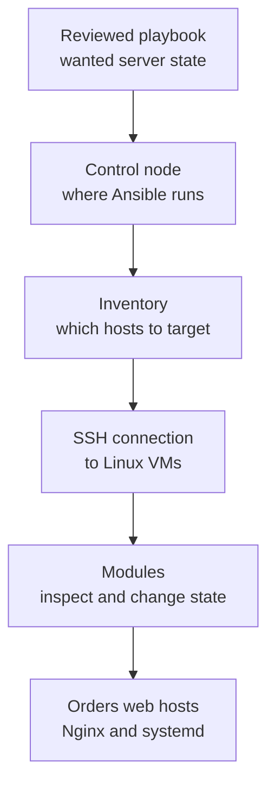

## Table of Contents

1. [What Ansible Changes](#what-ansible-changes)
2. [Control Node, Managed Nodes, and Inventory](#control-node-managed-nodes-and-inventory)
3. [Playbooks Are Ordered Conversations](#playbooks-are-ordered-conversations)
4. [Modules Carry the State Logic](#modules-carry-the-state-logic)
5. [The First Orders Playbook](#the-first-orders-playbook)
6. [Reading Ok, Changed, Failed, and Unreachable](#reading-ok-changed-failed-and-unreachable)
7. [Privilege, Safety, and Blast Radius](#privilege-safety-and-blast-radius)
8. [When Ansible Is the Right Tool](#when-ansible-is-the-right-tool)
9. [The First Workflow to Practice](#the-first-workflow-to-practice)

## What Ansible Changes

A Linux server is easy to change once. You can SSH into it, install Nginx, copy a config file, restart a service, and check whether the site responds. The problem starts when the same server must be rebuilt, when staging and production need to match, or when a teammate asks exactly which command fixed the last release.

Ansible is a configuration automation tool. It connects to machines, usually over SSH for Linux hosts, and runs small units of work called modules. A module is a reusable Ansible action that knows how to inspect and change one kind of thing: a package, a file, a service, a user, a template, a firewall rule, or another target. You write the desired result in a YAML file called a playbook, and Ansible works through that playbook against the hosts you selected.

It exists because server configuration should not depend on one person's terminal history. A production Nginx config, a systemd service, and a package list are too important to live only as remembered commands. Ansible moves those decisions into files your team can review, repeat, and run against more than one machine.

In the larger Infrastructure as Code loop, Ansible usually manages the inside of machines. Terraform might create the virtual machines, security groups, DNS records, and load balancer. Ansible then connects to the Linux VMs and makes sure the operating system has the packages, files, users, directories, and services the application needs.

This article uses `devpolaris-orders` as the running example. The service runs on two Linux web VMs behind Nginx. A small Node or Python API listens on `127.0.0.1:3000`. Nginx receives public HTTP traffic and proxies it to the local app. systemd keeps the app process running after reboots.

The first mental model is this:

```text
Repository files:
  inventory.yml
  playbooks/orders-web.yml
  templates/orders-api.nginx.conf.j2
  files/devpolaris-orders.service

Real servers:
  orders-web-01
  orders-web-02

Ansible's job:
  connect to the servers
  inspect the current state
  change only what needs to match the playbook
  report what happened per host
```

That is different from a shell script that blindly runs commands. A shell script can be useful, but it often says "do this step." A good Ansible playbook says "make this state true." The difference matters on the second run. If Nginx is already installed and the config file already matches, Ansible should report that no change was needed.

The mental model also keeps you from expecting Ansible to be a cloud provisioning tool by default. Ansible can call cloud APIs when you use the right collections, but the beginner path is clearer if you give it running machines first. Start with Linux hosts, SSH, packages, files, templates, and services. That is enough to learn the shape of the tool without mixing every infrastructure layer into one lesson.



You will see these words constantly: control node, managed node, inventory, playbook, play, task, module, and become. They sound like a lot at first, but each one answers a plain question. Where does Ansible run? Which machines are targets? What should happen? Which action knows how to do it? Does the task need root privileges?

## Control Node, Managed Nodes, and Inventory

The control node is the machine where you run Ansible. It might be your laptop during learning, a CI runner in a team workflow, or a dedicated automation host in a company network. The control node reads your files and opens connections to the machines you want to change.

The managed nodes are the machines Ansible changes. For this article, the managed nodes are Linux VMs named `orders-web-01` and `orders-web-02`. They already exist, they accept SSH, and they have a user account that Ansible can use. Ansible does not need an agent running on those VMs for the normal Linux SSH workflow.

Inventory is the file or source that tells Ansible which managed nodes exist. It is the server map. A tiny inventory for `devpolaris-orders` can be written in YAML like this:

```yaml
all:
  children:
    orders_web:
      hosts:
        orders-web-01:
          ansible_host: 10.20.40.11
        orders-web-02:
          ansible_host: 10.20.40.12
      vars:
        ansible_user: deploy
        app_name: devpolaris-orders
```

The names `orders-web-01` and `orders-web-02` are inventory aliases. An alias is the name Ansible uses inside patterns and output. The `ansible_host` value is the real address Ansible connects to. Keeping both lets humans use stable, meaningful names even when the private IP address changes later.

The group `orders_web` is how a playbook targets both web servers at once. Groups are important because configuration is usually tied to a role in the system, not to a single host. These machines are web entry points for the orders service, so they belong together.

You can ask Ansible to show the inventory it loaded before running a playbook:

```bash
$ ansible-inventory -i inventory.yml --graph
@all:
  |--@ungrouped:
  |--@orders_web:
  |  |--orders-web-01
  |  |--orders-web-02
```

That output is a useful early check. If `orders_web` is missing, a playbook with `hosts: orders_web` will not reach anything. If the wrong host appears in the group, the playbook may target a machine you did not mean to change.

The inventory does not say what to do. It says where Ansible can act and which labels describe the hosts. The playbook supplies the work. Keeping that split clear prevents a lot of confusion later. Inventory answers "which machines?" and playbooks answer "what state should those machines have?"

## Playbooks Are Ordered Conversations

A playbook is a YAML file that contains one or more plays. A play connects a group of hosts to a list of tasks. A task calls one module with arguments. If you know JavaScript objects or Python dictionaries, the shape will look familiar: keys, values, nested blocks, and lists.

For a first reading, do not focus on every YAML detail. Read a play like a conversation between you and a group of machines:

```yaml
- name: Configure orders web servers
  hosts: orders_web
  become: true
  tasks:
    - name: Install nginx
      ansible.builtin.apt:
        name: nginx
        state: present

    - name: Keep nginx running
      ansible.builtin.service:
        name: nginx
        state: started
        enabled: true
```

The first line gives the play a human name. `hosts: orders_web` tells Ansible which inventory group to target. `become: true` tells Ansible to use privilege escalation, usually sudo on Linux, because installing packages and managing system services require root-level rights. The `tasks` list is the ordered work.

Each task has a human name too. Good task names read like a checklist item in a deployment review: "Install nginx", "Render orders Nginx site", "Restart orders service". When a run fails, those names are what you will scan first.

The module names use fully qualified collection names such as `ansible.builtin.apt` and `ansible.builtin.service`. Fully qualified means the name includes the collection namespace and the module name. You may see short names like `apt` in old examples, but the longer form is clearer for learning because it points at the exact module documentation.

Ansible runs tasks in order within a play. For this web server, the order matters. Nginx must be installed before Ansible can manage its service. The config file should be written before Nginx is reloaded. The app service file should exist before systemd can enable it.

An ordered playbook is not the same thing as a random list of shell commands. The modules still inspect state before acting. The order gives the server a safe path from its current shape to the desired shape.

```text
Play:
  target group: orders_web
  privilege: become true

Task 1:
  ensure package nginx is present

Task 2:
  ensure service nginx is started and enabled

Result:
  each host reports ok, changed, failed, or unreachable
```

The playbook is also a review artifact. A teammate can read the file and ask practical questions before it runs. Which hosts does it target? Does every task need root? Will it restart a service? Does the task use an idempotent module or a raw command? Those questions are much easier to answer from a playbook than from a terminal history.

## Modules Carry the State Logic

The heart of the Ansible mental model is the module. A module is not just a wrapper around a command. A good module knows how to check the current state, decide whether a change is needed, apply the change when necessary, and report the result.

Look at the package task again:

```yaml
- name: Install nginx
  ansible.builtin.apt:
    name: nginx
    state: present
```

The desired state is "the `nginx` package is present." If Nginx is missing, the `apt` module installs it and reports `changed`. If Nginx is already installed, the module reports `ok`. You do not need to write a shell condition around `dpkg` or `apt-cache` for the normal case.

That is why idempotency matters. Idempotency means you can repeat the task and still end in the same final state. The second run should not reinstall packages, append duplicate lines, or restart healthy services without a reason.

Compare that with this task:

```yaml
- name: Append proxy timeout with shell
  ansible.builtin.shell: echo "proxy_read_timeout 30s;" >> /etc/nginx/conf.d/orders.conf
```

The shell command appends text. It does not know whether the line is already present. Run it three times and you may get three copies. That behavior is common when shell commands are used for state that a module could manage.

A safer version expresses the file state directly:

```yaml
- name: Set proxy timeout
  ansible.builtin.lineinfile:
    path: /etc/nginx/conf.d/orders.conf
    regexp: "^proxy_read_timeout"
    line: "proxy_read_timeout 30s;"
    create: true
    mode: "0644"
```

Now the task has enough information to inspect and repair the file. If the line is missing, Ansible adds it. If the line exists with a different value, Ansible changes it. If the file already matches, Ansible leaves it alone.

For larger config files, templates are usually clearer than many line edits. A template is a file with variables inside it. Ansible renders the template for each host, then copies the final content to the target path.

```nginx
server {
    listen 80;
    server_name {{ orders_server_name }};

    location / {
        proxy_pass http://127.0.0.1:{{ orders_app_port }};
        proxy_set_header Host $host;
        proxy_set_header X-Forwarded-For $proxy_add_x_forwarded_for;
    }
}
```

That template shows the shape of the Nginx site in one place. The variables let staging and production use different names or ports without copying the whole file. The next task renders it:

```yaml
- name: Render orders nginx site
  ansible.builtin.template:
    src: orders-api.nginx.conf.j2
    dest: /etc/nginx/sites-available/orders-api.conf
    owner: root
    group: root
    mode: "0644"
```

The module does the comparison. If the rendered content is identical to the file on the server, the task is `ok`. If the content differs, Ansible replaces the file and reports `changed`. That `changed` result can then notify a handler, which is a task that runs only when another task reports a change.

```yaml
handlers:
  - name: Reload nginx
    ansible.builtin.service:
      name: nginx
      state: reloaded
```

This is one of the first places Ansible feels different from a shell script. You do not reload Nginx on every run. You reload it when the config file changed. The report tells you why the reload happened.

## The First Orders Playbook

Now put the pieces together for `devpolaris-orders`. The goal is modest: install Nginx, render the Nginx site, install a systemd unit for the app, enable both services, and verify that the local app responds through Nginx.

A beginner-safe repository can start like this:

```text
ansible/
  inventory.yml
  playbooks/
    orders-web.yml
  templates/
    orders-api.nginx.conf.j2
  files/
    devpolaris-orders.service
```

This layout keeps each artifact in an obvious place. The inventory names the hosts. The playbook names the desired state. The template owns the Nginx config. The file directory holds a static systemd unit.

Here is a compact playbook that uses those files:

```yaml
- name: Configure orders web servers
  hosts: orders_web
  become: true
  vars:
    orders_app_port: 3000
    orders_server_name: orders.devpolaris.local
  tasks:
    - name: Install nginx
      ansible.builtin.apt:
        name: nginx
        state: present
        update_cache: true
        cache_valid_time: 3600

    - name: Install orders systemd unit
      ansible.builtin.copy:
        src: devpolaris-orders.service
        dest: /etc/systemd/system/devpolaris-orders.service
        owner: root
        group: root
        mode: "0644"
      notify: Reload systemd

    - name: Render orders nginx site
      ansible.builtin.template:
        src: orders-api.nginx.conf.j2
        dest: /etc/nginx/sites-available/orders-api.conf
        owner: root
        group: root
        mode: "0644"
      notify: Reload nginx

    - name: Enable orders nginx site
      ansible.builtin.file:
        src: /etc/nginx/sites-available/orders-api.conf
        dest: /etc/nginx/sites-enabled/orders-api.conf
        state: link
      notify: Reload nginx

    - name: Keep orders app running
      ansible.builtin.service:
        name: devpolaris-orders
        state: started
        enabled: true

    - name: Keep nginx running
      ansible.builtin.service:
        name: nginx
        state: started
        enabled: true

  handlers:
    - name: Reload systemd
      ansible.builtin.systemd_service:
        daemon_reload: true

    - name: Reload nginx
      ansible.builtin.service:
        name: nginx
        state: reloaded
```

There is enough here to discuss real server operations without making the example huge. Installing a package needs `apt`. Copying a static unit needs `copy`. Rendering Nginx needs `template`. Creating the site link needs `file`. Managing long-running processes needs `service` or `systemd_service`.

The playbook also shows the first tradeoff. You can write one big playbook that configures everything on a host, or you can split work into smaller roles and playbooks as it grows. The first approach is easier for learning because every moving part is visible. The second approach is easier for a large team because common patterns can be reused. Start with one readable playbook, then extract roles only when repetition becomes real.

Before changing servers, use check mode and diff mode:

```bash
$ ansible-playbook -i inventory.yml playbooks/orders-web.yml --check --diff
```

Check mode asks Ansible to predict changes without applying them where modules support that behavior. Diff mode shows file differences for modules that can report them. These modes are not a replacement for staging, but they are useful review evidence before a production run.

For a template change, diff output might look like this:

```text
TASK [Render orders nginx site]
--- before: /etc/nginx/sites-available/orders-api.conf
+++ after: /home/deploy/.ansible/tmp/orders-api.nginx.conf.j2
@@
-        proxy_pass http://127.0.0.1:8080;
+        proxy_pass http://127.0.0.1:3000;

changed: [orders-web-01]
changed: [orders-web-02]
```

That evidence is concrete. The playbook will change the upstream port from `8080` to `3000` on both web hosts. A reviewer can compare that with the application release notes before anyone touches production.

## Reading Ok, Changed, Failed, and Unreachable

Ansible output is part of the operating model. The run tells you which hosts were reached, which tasks changed state, which tasks failed, and which hosts were unreachable. Beginners often look only for a red failure. A better habit is to read the recap as a small status table for every host.

A first successful run might end like this:

```text
PLAY RECAP
orders-web-01             : ok=8    changed=4    unreachable=0    failed=0    skipped=0    rescued=0    ignored=0
orders-web-02             : ok=8    changed=4    unreachable=0    failed=0    skipped=0    rescued=0    ignored=0
```

`ok` means the task completed successfully. `changed` means the task completed and altered the host. A task can count as both `ok` and `changed` because it succeeded and made a change. `failed` means Ansible reached the host but a task failed. `unreachable` means Ansible could not complete the connection setup to the host.

The second run should usually be quieter:

```text
PLAY RECAP
orders-web-01             : ok=8    changed=0    unreachable=0    failed=0    skipped=0    rescued=0    ignored=0
orders-web-02             : ok=8    changed=0    unreachable=0    failed=0    skipped=0    rescued=0    ignored=0
```

That second run is not a full health check. It does not prove customers can place orders. It does show that the server state Ansible manages already matches the playbook. For configuration management, `changed=0` on a repeated run is useful evidence.

When a task fails, the first useful question is whether this is a connection problem or a task problem. Connection problems produce `unreachable`. Task problems produce `failed`.

```text
fatal: [orders-web-02]: UNREACHABLE! => {
    "changed": false,
    "msg": "Failed to connect to the host via ssh: ssh: connect to host 10.20.40.12 port 22: Connection timed out",
    "unreachable": true
}
```

Ansible did not get far enough to manage Nginx. The fix direction is network and SSH: confirm the VM exists, check the private IP, check security group rules, check route access from the control node, and confirm the SSH user.

A task failure looks different:

```text
fatal: [orders-web-01]: FAILED! => {
    "changed": false,
    "msg": "Could not find the requested service devpolaris-orders: host"
}
```

Here Ansible reached the machine. The failure is about systemd service state. The next checks are local to the host configuration: did the unit file copy to `/etc/systemd/system/devpolaris-orders.service`, did systemd reload after the copy, and does the unit name match the service task?

The recap gives you the first fork in diagnosis:

| Recap Signal | Meaning | First Place To Look |
|--------------|---------|---------------------|
| `unreachable=1` | Ansible could not connect | Inventory address, SSH, network path, remote user |
| `failed=1` | A task failed after connection | Task output, module arguments, service logs |
| `changed` on every run | A task is not stable | Shell commands, templates with changing content, unsafe module options |
| `changed=0` on second run | Managed state already matches | Continue with application health checks |

This reading habit keeps you from debugging the wrong layer. If SSH cannot connect, editing the playbook task will not help. If the service unit is missing, changing inventory group names will not help.

## Privilege, Safety, and Blast Radius

Ansible usually connects as a normal remote user and escalates privilege for tasks that need it. On Linux, that often means SSH as `deploy`, then sudo to root for package installs, files under `/etc`, and system services. The Ansible word for this is `become`.

```yaml
- name: Configure orders web servers
  hosts: orders_web
  become: true
  tasks:
    - name: Install nginx
      ansible.builtin.apt:
        name: nginx
        state: present
```

`become: true` is convenient at the play level when most tasks need root. It is also a signal worth reviewing. Root-level automation can change system files, restart services, and break production quickly if the target set is wrong.

For mixed work, put `become` closer to the task that needs it:

```yaml
- name: Check app health without root
  ansible.builtin.uri:
    url: http://127.0.0.1:3000/health
    status_code: 200

- name: Restart nginx with root privileges
  become: true
  ansible.builtin.service:
    name: nginx
    state: restarted
```

That shape tells reviewers which operations are privileged. It also reduces the chance that a harmless diagnostic task silently gains more authority than it needs.

Blast radius means the amount of the system a run can affect. In Ansible, blast radius is mostly controlled by inventory, `hosts`, and command-line limiting. If the play says `hosts: all`, the blast radius is every host in the inventory. If the play says `hosts: orders_web`, the blast radius is the web group. If the command adds `--limit orders-web-01`, the first run touches only one host.

```bash
$ ansible-playbook -i inventory.yml playbooks/orders-web.yml --limit orders-web-01
```

That command is a canary run. A canary is one representative target used before a wider rollout. For `devpolaris-orders`, you might run the playbook against `orders-web-01`, check Nginx and app health, then run against the full `orders_web` group.

Use tags when a playbook has several kinds of work and you need a narrow run:

```yaml
- name: Render orders nginx site
  tags: ["nginx"]
  ansible.builtin.template:
    src: orders-api.nginx.conf.j2
    dest: /etc/nginx/sites-available/orders-api.conf
    mode: "0644"
  notify: Reload nginx
```

```bash
$ ansible-playbook -i inventory.yml playbooks/orders-web.yml --tags nginx --limit orders-web-01
```

Tags are useful, but they are not a substitute for a readable playbook. If a playbook only works when you know a secret combination of tags, split the work or rename the tasks. A junior teammate should be able to understand the ordinary path before learning the escape paths.

## When Ansible Is the Right Tool

Ansible fits work where you need to configure operating systems, packages, files, users, directories, services, templates, and coordinated changes across existing machines. It is most useful when the target is a real host with SSH access and the change is about making that host match a known state.

Terraform is usually a better first tool for creating cloud infrastructure resources. If the team needs a new VM, security group, load balancer, DNS record, or object storage bucket, Terraform or another provisioning tool can track those objects through provider APIs and state. Once the VM exists, Ansible can configure it.

The boundary is not perfect, but it is useful:

| Work | First Tool To Consider | Reason |
|------|------------------------|--------|
| Create VMs and networks | Terraform or OpenTofu | Provider APIs and state track cloud objects |
| Install Nginx on Linux VMs | Ansible | The change happens inside the operating system |
| Render `/etc/nginx` files | Ansible | Templates and file modules fit server config |
| Create an S3 bucket | Terraform or OpenTofu | The target is a cloud resource, not a host file |
| Restart a systemd service | Ansible | The action belongs on the host |
| Build a machine image | Image builder plus Ansible or scripts | Some teams bake base config before VM creation |

The tradeoff is timing. Configuring a running server with Ansible is flexible. You can change a file, run a playbook, and inspect the result quickly. Baking everything into an image can make runtime changes smaller and faster, but the image build process must be maintained. Many teams use both: images for base packages and Ansible for environment-specific config.

There is also a scale tradeoff. Ansible connects to hosts and runs tasks. That model is easy to reason about for a few servers and still works for many fleets, but every run has connection, privilege, and ordering concerns. If the service moves to containers or Kubernetes later, some configuration shifts into images, Helm charts, Kubernetes manifests, or deployment controllers. The Ansible mental model remains useful because you learned to ask what owns desired state and where the change actually happens.

For `devpolaris-orders`, a sensible beginner split is:

```text
Terraform:
  create Linux VMs
  create security groups
  create load balancer
  create DNS record

Ansible:
  install Nginx
  place Nginx site config
  place systemd unit
  keep services enabled and running
  verify local health endpoint
```

This split keeps each tool close to the layer it can inspect well. Terraform sees cloud resources. Ansible sees the Linux host.

## The First Workflow to Practice

A good first Ansible workflow is small and repeatable. Do not start by writing a playbook that changes every service on every server. Start with one inventory group, one playbook, and one visible result.

For `devpolaris-orders`, the first workflow can look like this:

```text
1. Confirm inventory loads.
2. Confirm Ansible can connect.
3. Run syntax check.
4. Run check mode with diff.
5. Run against one host with --limit.
6. Verify Nginx and app health.
7. Run against the full group.
8. Run a second time and expect changed=0.
```

The commands are short:

```bash
$ ansible-inventory -i inventory.yml --graph
$ ansible orders_web -i inventory.yml -m ansible.builtin.ping
$ ansible-playbook -i inventory.yml playbooks/orders-web.yml --syntax-check
$ ansible-playbook -i inventory.yml playbooks/orders-web.yml --check --diff
$ ansible-playbook -i inventory.yml playbooks/orders-web.yml --limit orders-web-01
$ ansible-playbook -i inventory.yml playbooks/orders-web.yml
```

The `ping` module is not ICMP ping. It checks whether Ansible can connect to the host and run a small Python-based module. A successful result looks like this:

```text
orders-web-01 | SUCCESS => {
    "changed": false,
    "ping": "pong"
}
orders-web-02 | SUCCESS => {
    "changed": false,
    "ping": "pong"
}
```

After the canary run, verify the service from the host or through the load balancer. Ansible can include a local health check, but you should understand what it proves:

```yaml
- name: Verify orders app through nginx
  ansible.builtin.uri:
    url: http://127.0.0.1/health
    status_code: 200
```

That task proves Nginx on the host can return a local health response. It does not prove DNS, the load balancer, TLS, or external reachability. Those checks belong in the deployment or monitoring path. Ansible can help run them, but the mental model should keep the layers separate.

When the playbook is stable, the second full run should be boring:

```text
PLAY RECAP
orders-web-01             : ok=9    changed=0    unreachable=0    failed=0    skipped=0    rescued=0    ignored=0
orders-web-02             : ok=9    changed=0    unreachable=0    failed=0    skipped=0    rescued=0    ignored=0
```

That is the operating loop to practice. The files say what should be true. Inventory selects the machines. Modules inspect and change state. The recap tells you what happened. A second run shows whether the managed state is stable.

---

**References**

- [Ansible playbooks](https://docs.ansible.com/projects/ansible/latest/playbook_guide/playbooks_intro.html) - Official introduction to playbooks, plays, tasks, modules, execution order, check mode, and idempotency.
- [Understanding privilege escalation: become](https://docs.ansible.com/projects/ansible/latest/playbook_guide/playbooks_privilege_escalation.html) - Official guide to `become`, privilege escalation directives, and the limits of running tasks as another user.
- [How to build your inventory](https://docs.ansible.com/projects/ansible/latest/inventory_guide/intro_inventory.html) - Official inventory guide for hosts, groups, variables, and inventory organization.
- [Connection methods and details](https://docs.ansible.com/projects/ansible/latest/inventory_guide/connection_details.html) - Official details for SSH behavior, remote users, keys, and connection settings.
- [ansible.builtin collection](https://docs.ansible.com/projects/ansible/latest/collections/ansible/builtin/index.html) - Official index for built-in modules such as `apt`, `template`, `copy`, `file`, `service`, `systemd_service`, `uri`, and `ping`.
