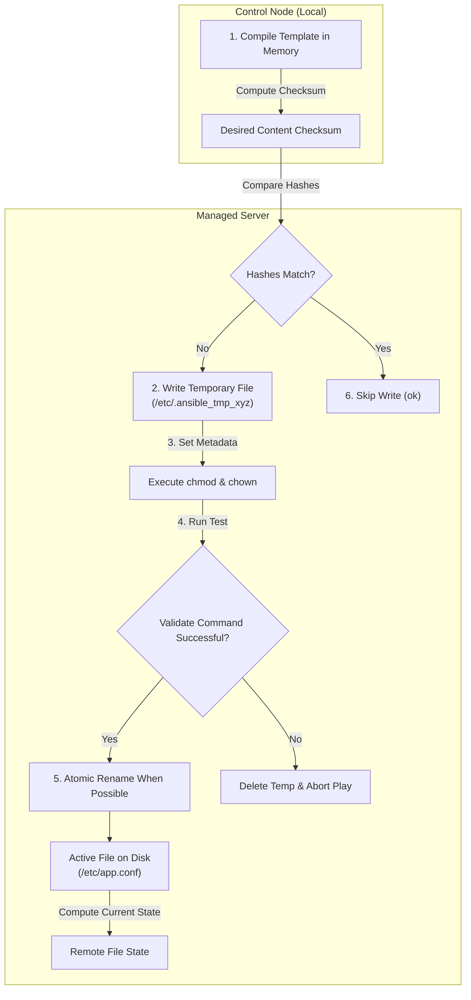

## Table of Contents

1. [Files as Infrastructure States](#files-as-infrastructure-states)
2. [The Files and Templates Preview](#the-files-and-templates-preview)
3. [Directory Management: The File Module](#directory-management-the-file-module)
4. [Static File Deployments: The Copy Module](#static-file-deployments-the-copy-module)
5. [Dynamic Template Compilation: The Template Module](#dynamic-template-compilation-the-template-module)
6. [Pre-Replacement Validation: The validate Parameter](#pre-replacement-validation-the-validate-parameter)
7. [Under the Hood: Atomic Writes, Checksums, and File Transports](#under-the-hood-atomic-writes-checksums-and-file-transports)
8. [Dry Runs, Diffs, and Secret Redaction](#dry-runs-diffs-and-secret-redaction)
9. [Putting It All Together](#putting-it-all-together)
10. [What's Next](#whats-next)

## Files as Infrastructure States

Ansible file management is the process of declaring file contents, ownership, modes, validation steps, and template inputs as repeatable host state.

In system administration and DevOps, file management is the practice of declaratively defining the exact contents, ownership permissions, directory paths, and file modes of your application configurations on your managed nodes. In the Linux operating system, almost all system and application states are represented as files on disk. The web servers, process managers, database parameters, and environment credentials only operate correctly when their supporting files exist in the exact directories, contain the correct text lines, and are secured with the proper permissions.

To understand why a disciplined, declarative approach to file management is essential, consider our scenario. A web application deployment might push a Jinja2-rendered Nginx configuration, a static TLS certificate bundle, a Python requirements file, and several systemd unit files to every node in a fleet. Managing these manually means each file change requires logging into each server, which breaks reproducibility the moment one server drifts. A template rendered by hand instead of by a tool diverges from the declared template source the first time someone edits it directly on the server.

Ansible solves this by using declarative file orchestration modules. You write playbooks that specify the exact desired state of your filesystem objects: their parent paths, ownership users, octal permission modes, and contents. Ansible's state-aware modules inspect the host, compare content and metadata with your target goals, and write only when the system has drifted, keeping your server environments more secure and consistent.

## The Files and Templates Preview

Here is an early, comment-free YAML preview demonstrating how to manage directories, copy static files, and compile dynamic configuration templates safely in a single playbook:

```yaml
- name: Standardize application configurations and directories
  hosts: app_servers
  become: true
  tasks:
    - name: Create restricted application log directory
      ansible.builtin.file:
        path: /var/log/app
        state: directory
        owner: www-data
        group: adm
        mode: "0750"

    - name: Copy static web health checklist
      ansible.builtin.copy:
        src: files/health.html
        dest: /var/www/html/health.html
        owner: root
        group: root
        mode: "0644"

    - name: Render dynamic virtual host configuration
      ansible.builtin.template:
        src: templates/app.conf.j2
        dest: /etc/nginx/sites-available/app.conf
        owner: root
        group: root
        mode: "0644"
        validate: "nginx -t -c %s"
```

## Directory Management: The File Module

A directory is a filesystem container that maps human-friendly names to inode numbers on disk. In Linux, a directory must be managed with the same strict security parameters as an ordinary file.

You manage these directories using the `ansible.builtin.file` module with the argument `state: directory`. When you define a directory task, you must explicitly configure its ownership and permission bits:

```yaml
- name: Settle log directory permissions
  ansible.builtin.file:
    path: /var/log/app
    state: directory
    owner: www-data
    group: www-data
    mode: "0750"
```

The file module runs three checks before making any change. It first calls `stat()` on the target path to determine whether the file or directory exists. If the path exists, it reads the current permission bitmask, owner UID, and group GID and compares them against the declared values in the task. When every attribute already matches, the module exits with `changed: false` without writing anything to disk.

You must quote the numeric permission bits (using `"0750"` instead of `0750`). In YAML, unquoted numbers starting with a zero are parsed as octal integers in some contexts, but can be parsed as decimal in others, leading to incorrect permission bits (like setting `0644` as decimal, which resolves to `1204` octal, creating a broken state). Quoting the string ensures consistent parsing.

Additionally, remember that directory execute permissions (the `7` and `5` in `0750`) have a different meaning than file execute permissions: they represent directory traversal permissions, allowing the user and group to enter the directory and search paths inside it. A log directory with mode `"0640"` would block the application process from writing logs because the process cannot enter the folder.

## Static File Deployments: The Copy Module

The copy module moves fixed file content from the control node to a managed host. Use it when every target should receive the same bytes.

Example: `files/health.html` can be copied to `/var/www/html/health.html` on every app server with owner `root` and mode `"0644"`. When a configuration file or system asset is identical across all your servers, such as a generic HTML index, a static security policy, or a system utility script, `ansible.builtin.copy` is the direct fit.

The copy module reads a local file from the control plane and copies it over a secure network pipe to the managed host:

```yaml
- name: Deploy static health checklist
  ansible.builtin.copy:
    src: files/health.html
    dest: /var/www/html/health.html
    owner: root
    group: root
    mode: "0644"
```

The copy module is safe because it checks the target state before transferring unnecessary data. It compares the source content with the destination content using checksums and remote file metadata. If the content and requested metadata already match, the module skips the write and reports `ok`.

You must avoid using the copy module to deploy large release directories containing thousands of files. Because the copy module compiles and hashes every file individually, copying huge asset trees introduces substantial connection latency. For large application deployments, you should use specialized packaging systems, artifact downloads, or synchronization modules.

## Dynamic Template Compilation: The Template Module

The template module renders a text file from variables before sending it to the host. Use it when the file shape is shared, but some values need to differ by host or environment.

Example: the same `templates/app.conf.j2` file can render `server_name staging.example.com` for staging and `server_name app.example.com` for production. When a configuration file requires host-specific or environment-specific values, such as different database endpoints, listening ports, or domain names, `ansible.builtin.template` is the right module.

The template module uses the Jinja2 template engine under the hood. The template file (conventionally named with a `.j2` file extension) lives on the control node and contains standard configuration text mixed with variable placeholders enclosed in double curly braces:

```jinja2
server_name {{ app_domain_name }};
listen {{ app_listening_port }};
```

When the template task executes, the control plane compiles the template in memory, resolving all Jinja2 placeholders using the active host's variables, and then transfers the final compiled text to the managed host.

You must design templates defensively. Template variables should reference stable, predictable values that are declared in defaults or group vars rather than facts that might differ between runs. If a template outputs a new timestamp or random string on every run, the local and remote file hashes will never match, and Ansible will report `changed` indefinitely, continuously triggering handlers and restarting your application services. Variable names should follow lowercase snake_case so that the template stays readable and Jinja2 resolves them without ambiguity.

## Pre-Replacement Validation: The validate Parameter

The `validate` parameter is a pre-write test for a candidate file. Ansible writes the new content to a temporary path, runs a validation command against that temporary file, and replaces the live file only if the command succeeds.

Example: `validate: "nginx -t -c %s"` asks Nginx to parse the candidate config before it becomes `/etc/nginx/sites-available/app.conf`. Deploying a configuration file with a syntax error can easily crash your application services, so validation catches the mistake before the active file is replaced.

Ansible prevents this operational risk by supporting the `validate` parameter inside the `copy` and `template` modules. The `validate` directive instructs Ansible to test the candidate configuration file before it replaces the active production file on the filesystem:

```yaml
- name: Render virtual host configuration
  ansible.builtin.template:
    src: templates/app.conf.j2
    dest: /etc/nginx/sites-available/app.conf
    validate: "nginx -t -c %s"
```

The execution flow of the `validate` parameter is highly secure:
1. **Write Temporary File**: Ansible compiles the template and writes the final text block to a temporary file on the managed host (typically in `/tmp`).
2. **Execute Validation Command**: It runs the validation command, replacing the `%s` placeholder with the path to the temporary file. In our example, Nginx parses the candidate file, verifying all block syntax and port bindings. The command is passed securely without shell expansion, so shell features such as pipes, redirects, and environment-variable expansion should not be used directly in `validate`.
3. **Inspect Exit Code**: If the validation command returns a non-zero exit code, the check fails. Ansible deletes the temporary file, halts the task execution immediately, and leaves the active production file at `/etc/nginx/sites-available/app.conf` completely untouched.
4. **Replacement**: If the validation returns `0` (success), Ansible replaces the production file. The validation protects against syntax errors, but you still need service health checks after reloads or restarts.

## Under the Hood: Atomic Writes, Checksums, and File Transports

An atomic write is a file replacement pattern where readers see either the old file or the new file, not a half-written file. A checksum is a content fingerprint Ansible uses to decide whether the destination file already matches the desired content.

Example: if `/etc/app.conf` already has the same checksum as the rendered template, Ansible reports `ok` and skips the write. If the checksum differs, Ansible writes a temporary file, validates it when configured, and swaps it into place.

When you modify a file using `copy` or `template`, the remote Python bootstrapper executes a strict, transactional write sequence to protect your files from corruption:

1. **Calculate Checksums**: The control node computes a checksum of the desired content. The remote module computes or retrieves comparable state for the active file on disk.
2. **Transfer to Temp**: If the hashes differ, the control plane transfers the data over the SSH channel to a temporary file, using random naming conventions (such as `/etc/.ansible_tmp...`).
3. **Set Metadata**: The script runs `chown` and `chmod` system calls on the temporary file, aligning its ownership and permissions to your playbook parameters.
4. **Run Validation**: If a `validate` parameter is present, it runs the validation command against the temporary file.
5. **Execute Atomic Rename When Possible**: The script uses an atomic rename-style replacement when the filesystem supports it and unsafe writes are not enabled.



On normal local filesystems, an atomic rename means readers see either the old file or the new file, not a half-written blend of both. This protects the active file from many interrupted-transfer cases, but unusual filesystems, container mounts, and explicit unsafe-write settings can change the behavior.

## Dry Runs, Diffs, and Secret Redaction

Check mode previews whether supported tasks would change a host, and diff mode shows the line-level text differences for modules that can report them. Together, they help you review file changes before applying them.

Example: before changing Nginx from port `8080` to `9000`, a `--check --diff` run can show the exact line that will change without replacing the live file.

```bash
ansible-playbook -i inventory/hosts.yml playbooks/deploy.yml --check --diff
```

For file and template tasks, diff mode outputs a standard unified diff block showing exactly which lines will be added or removed:

```diff
--- /etc/nginx/sites-available/app.conf
+++ /etc/nginx/sites-available/app.conf
@@ -3,3 +3,3 @@
-    listen 8080;
+    listen 9000;
```

This output is a critical verification tool. However, if you are deploying sensitive environment files containing database passwords, API keys, or secret tokens, running `--diff` will print your plaintext secrets directly into terminal stdout logs, CI runner histories, or console outputs.

To prevent this security leak, you must set `diff: false` and `no_log: true` directly on your secret-bearing tasks:

```yaml
- name: Render sensitive database environment file
  ansible.builtin.template:
    src: templates/db.env.j2
    dest: /etc/app/db.env
    owner: root
    group: admin
    mode: "0600"
  diff: false
  no_log: true
```

This configuration instructs Ansible to execute the file update while suppressing text diffs and task details in normal callback output. It reduces accidental secret exposure in logs, but it does not replace careful template design, file permissions, and secret handling.

## Putting It All Together

We started by looking at how manual filesystem edits can lead to configuration drift, permission leaks, and application crashes across your web application server cluster.

Ansible solves these problems by providing a highly robust, transactional file management engine:
- **Declarative Tasks**: Playbooks define filesystem states, using specific modules to manage directories, copy static files, and render templates.
- **Metadata Alignment**: The `file` module uses `stat()` and metadata system calls to verify owner, group, and quoted octal permission modes consistently.
- **Dynamic Compilation**: The `template` module dynamically compiles Jinja2 templates in control-plane memory, resolving variables before remote transfers.
- **Under-the-Hood Security**: The remote engine writes data to temporary paths, sets metadata, and uses atomic replacement behavior where supported.
- **Pre-Write Validation**: The `validate` parameter tests candidate files on-host, aborting deployments immediately if syntax errors are found.
- **Secret Redaction**: We use `diff: false` and `no_log: true` on secret-bearing tasks to redact sensitive plain-text credentials from console logs.

Following these practices helps your system configurations deploy safely and predictably across your network.

## What's Next

Now that you master files, directories, Jinja2 template rendering, and pre-replacement validations, the next article will explore **Managing Line-Level Edits**. We will look at how to modify individual lines inside existing, shared configuration files safely using modules like `lineinfile` and `blockinfile`.

---

**References**

- [Ansible Built-in File Module](https://docs.ansible.com/ansible/latest/collections/ansible/builtin/file_module.html) - Technical reference for managing files, symlinks, and directories.
- [Ansible Built-in Copy Module](https://docs.ansible.com/ansible/latest/collections/ansible/builtin/copy_module.html) - Documentation for static file transfers and checksum comparisons.
- [Ansible Built-in Template Module](https://docs.ansible.com/ansible/latest/collections/ansible/builtin/template_module.html) - Guide to rendering Jinja2 configuration templates.
- [Linux Programmers Manual - rename()](https://man7.org/linux/man-pages/man2/rename.2.html) - The standard Linux kernel system specification defining atomic rename operations.
