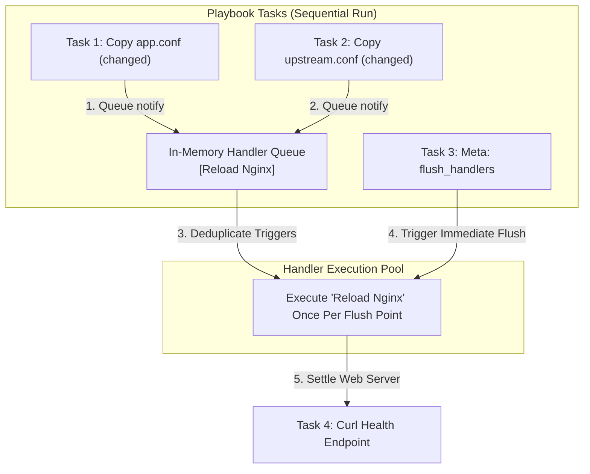

## Table of Contents

1. [Event-Driven Service Management](#event-driven-service-management)
2. [The Handlers and Restarts Preview](#the-handlers-and-restarts-preview)
3. [Task Notifications: The notify Trigger](#task-notifications-the-notify-trigger)
4. [Reload vs. Restart: Choosing the Operational Action](#reload-vs-restart-choosing-the-operational-action)
5. [systemd Daemon Reloads: Introspecting Unit Files](#systemd-daemon-reloads-introspecting-unit-files)
6. [Under the Hood: The Handler Execution Queue and Flush Points](#under-the-hood-the-handler-execution-queue-and-flush-points)
7. [Failure Safeguards: The Host Abort Gotcha](#failure-safeguards-the-host-abort-gotcha)
8. [Putting It All Together](#putting-it-all-together)
9. [What's Next](#whats-next)

## Event-Driven Service Management

A handler is a delayed task that runs only when another task reports a relevant change, most often to reload or restart a service after its input files changed.

In configuration management, handlers are event-driven execution blocks designed strictly to perform deferred, host-specific actions (such as restarting system background processes or reloading web server routing tables) only when triggered by a parent task that has successfully modified a system parameter. In server orchestration, writing configuration files or compiling templates is only half the job. A service (like Nginx or an application API) typically reads its configuration parameters from disk only when it is initially launched or explicitly instructed to reload. If your playbook updates a configuration file but does not notify the service, your host enters a drifted state: the correct file exists on disk, but the active process in memory continues to run old, stale settings.

To see why a disciplined, event-driven handler pipeline is essential, consider our scenario. A web server configuration change is only active after the server process restarts, but restarting on every configuration change is wasteful if the play touches multiple files. Without a notification system, an automation script restarts the service after each task, bouncing it three times for three file changes, causing unnecessary downtime windows and log noise. The alternative of never restarting leaves the running process serving a stale configuration that no longer matches the files on disk.

Ansible solves this by using handlers and notifications. A task notifies a handler only when it returns a status of `changed`. Ansible queues these notifications in memory, deduplicates repeated triggers by handler name, and normally executes the service actions at the end of the play. This event-driven design helps your application services update only when their inputs actually changed.

## The Handlers and Restarts Preview

Here is an early, comment-free YAML playbook preview demonstrating how to configure template notifications, systemd unit reloads, and deferred service restarts using handlers:

```yaml
- name: Settle application files and service actions
  hosts: app_servers
  become: true
  tasks:
    - name: Deploy application environment variables
      ansible.builtin.template:
        src: templates/app.env.j2
        dest: /etc/app/app.env
        owner: root
        group: root
        mode: "0600"
      notify: Restart application service

    - name: Settle systemd service descriptor
      ansible.builtin.template:
        src: templates/app.service.j2
        dest: /etc/systemd/system/app.service
        owner: root
        group: root
        mode: "0644"
      notify:
        - Reload systemd daemon
        - Restart application service

  handlers:
    - name: Reload systemd daemon
      ansible.builtin.systemd_service:
        daemon_reload: true

    - name: Restart application service
      ansible.builtin.service:
        name: app
        state: restarted
```

## Task Notifications: The notify Trigger

`notify` is the task keyword that queues a handler when that task reports `changed`. It connects a state change, such as a rewritten config file, to a delayed action, such as reloading the service that reads that file.

Example: a template task that updates `/etc/app/app.env` can `notify: Restart application service`. If the rendered file already matches the host, the task reports `ok` and the restart is not queued.

When a task with a `notify` directive runs, Ansible checks whether the task's result carries `changed: true`. If the task made no change, the notification is silently discarded. If the task did change something, Ansible records the handler name in a deferred notification queue for that host. The handler itself does not run immediately. Ansible collects all notifications from the entire play and flushes them once, at the end of the play, running each handler exactly once regardless of how many tasks notified it.

You must treat handler names as stable interfaces. A vague name like `Restart` is a safety hazard if your playbook manages Nginx, backend APIs, and database daemons in the same run. Use highly specific names (like `Restart application service` or `Reload Nginx web server`) so tasks clearly notify the intended target.

Alternatively, Ansible supports listening topics: a handler can listen for a generic topic (such as `listen: webserver configuration updated`), and multiple different file tasks can notify that topic, keeping your playbooks modular.

## Reload vs. Restart: Choosing the Operational Action

Reload and restart are different service actions. A reload asks the running process to reread configuration if it supports that behavior, while a restart stops the process and starts it again.

Example: Nginx can usually reload a changed virtual host with less disruption, but a simple application process that only reads `/etc/app/app.env` during startup may need a full restart. Selecting the wrong action can trigger service drops or fail to apply configuration changes:

### 1. The Reload Action (`state: reloaded`)
A reload asks the service manager to reload configuration without a full stop/start cycle. The exact mechanism is service-specific: some services receive a signal, some run a reload command, and some service managers map reloads differently. Web servers like Nginx verify the syntax of the new file in memory, spawn new worker threads to handle subsequent incoming requests using the new configuration, and slowly retire old worker threads as they finish active connections. A well-supported reload can keep the service online and reduce connection disruption, but you still need health checks because reload behavior is controlled by the service itself.

### 2. The Restart Action (`state: restarted`)
A restart stops the active process and starts a fresh process instance. This is a heavier operation that triggers immediate, temporary service downtime. Use a restart when the target application reads its configurations only at process startup. Background Python or Go application binaries that parse environment files like `/etc/app/app.env` on startup usually need a restart unless the service explicitly implements a reload path.

## systemd Daemon Reloads: Introspecting Unit Files

systemd is the Linux process manager that starts, stops, and supervises many background services. A unit file is the service descriptor systemd reads to know which command to start, which user to run as, and which dependencies apply.

Example: `/etc/systemd/system/app.service` can define that the `app` process starts as user `appuser` after the network is online. When you manage system services on modern Linux hosts, systemd caches these descriptors in memory.

If you update a systemd unit file using a template task, and then immediately call the service module to restart the service, systemd will ignore your changes and output a warning log:

```plain
Warning: The unit file, source configuration file or drop-ins of app.service changed on disk. Run 'systemctl daemon-reload' to reload units.
```

Under the hood, systemd caches all unit file structures in its own memory. If you update the file on disk, systemd's cache is stale. If you attempt a restart, it runs the old unit settings.

To prevent this stale state, you must instruct systemd to rebuild its memory cache by executing a daemon reload before the service restart occurs. You do this using the `ansible.builtin.systemd_service` module:

```yaml
- name: Reload systemd daemon
  ansible.builtin.systemd_service:
    daemon_reload: true
```

By linking your template tasks to both a `Reload systemd daemon` handler and a `Restart application service` handler, you make systemd reload its unit metadata before the service restart uses the updated unit specification.

## Under the Hood: The Handler Execution Queue and Flush Points

A handler queue is the per-host list of delayed handler names Ansible has been asked to run. A flush point is the moment Ansible drains that queue and executes the handlers.

Example: three template tasks can all notify `Reload Nginx web server`, but the handler queue records that name once for the host and runs the reload once at the flush point.

When you run a playbook, the Ansible engine manages a custom in-memory handler execution queue for each targeted host:

1. **Queue Notifications**: As tasks report `changed`, the worker processes append the triggered handler names to the host's queue array.
2. **Deduplicate Triggers**: If five separate template tasks modify files and all five notify `Reload Nginx web server`, the engine deduplicates the queue. The handler name is recorded once for that flush point, preventing five redundant service restarts.
3. **Execute at Play End**: By default, Ansible waits until the normal tasks in the play have completed for a host before executing that host's queued handlers, running them in the order they are defined in the `handlers` block.
4. **Force Immediate Updates (meta: flush_handlers)**: If a subsequent task in your playbook depends on the service already running the new configuration (for example, writing an Nginx virtual host, and then immediately running a curl task to check the site's health through Nginx), the default play-end timing will fail because the handler has not executed yet. You override this timing by inserting a flush point task:
   ```yaml
   - name: Force immediate handler execution
     ansible.builtin.meta: flush_handlers
   ```
   This task instructs the engine to immediately pause task execution, execute all queued handlers on all active hosts, and then resume the remaining playbook tasks.



Using flush points allows you to run health check validations safely during the run, ensuring that any service reload errors are caught before the playbook completes.

## Failure Safeguards: The Host Abort Gotcha

The host abort gotcha is that a later task failure can prevent queued handlers from running on that host. This can leave files changed on disk while the running service still uses old in-memory settings.

Example: a play updates `/etc/app/app.env` and queues a restart, but a later migration task fails before handlers flush. Without handler safeguards, the service may keep running with the old environment until the next successful restart.

By default, if a normal task encounters a fatal error and aborts execution on a host, Ansible drops that host from the active run pool immediately. When the play ends, the queue for that aborted host is discarded:
- **The Stale State Risk**: If a playbook successfully updates `/etc/app/app.env` (queuing a restart), and then subsequent task 5 fails, the playbook halts. The environment file has been updated on disk, but the service restart handler never ran. The active process is now running mismatched configurations.
- **Forcing Handlers**: If you want queued handlers to run even if a later task fails, you can instruct Ansible to preserve the queue by passing the `--force-handlers` flag to the command line, or setting `force_handlers: true` inside your play block:
   ```yaml
   - name: Standardize cluster environments
     hosts: app_servers
     force_handlers: true
   ```
   This configuration tells Ansible to run notified handlers even on hosts with failed tasks, as long as the host is still reachable. It reduces mismatched file and process states, but unreachable hosts and handler failures can still prevent completion.

## Putting It All Together

We started by looking at how updating files on disk without restarting or reloading background processes leaves your systems in a drifted state, while blind system-wide reboots create needless downtime and drop active socket connections.

Ansible solves these problems by providing a robust, event-driven service coordination pipeline:
- **Event-Driven Triggers**: Playbook tasks use the `notify` keyword to queue handlers, executing changes only when modules report `changed`.
- **Deduplication**: The engine compiles an in-memory queue, aggregating duplicate notifications into a single execution, minimizing service drops.
- **Action Scoping**: We select `state: reloaded` when the service has a safe reload path, and `state: restarted` when applications require fresh process boots.
- **systemd Cache Auditing**: We use the `systemd_service` module with `daemon_reload: true` to ask systemd to reload unit metadata before restarting unit files.
- **Execution Tuning**: We leverage `meta: flush_handlers` flush points to force immediate updates before health checks, and `force_handlers: true` guards to protect systems from aborted runs.

Following these practices helps your system configurations and remote processes transition together with fewer unnecessary restarts and clearer failure boundaries.

## What's Next

Now that you master files, templates, partial edits, and service handlers, the next article will explore **Structuring Roles**. We will look at how to organize tasks, files, templates, defaults, and handlers into reusable directory structures, allowing you to manage entire application services as modular, self-contained units.

---

**References**

- [Ansible Handlers Guide](https://docs.ansible.com/ansible/latest/playbook_guide/playbooks_handlers.html) - Official reference for notify keywords and event-driven tasks.
- [Ansible Built-in Service Module](https://docs.ansible.com/ansible/latest/collections/ansible/builtin/service_module.html) - Documentation for managing init and systemd service states.
- [systemd systemctl daemon-reload Specification](https://www.freedesktop.org/software/systemd/man/latest/systemctl.html#daemon-reload) - The systemd process manager specification defining unit cache reloads.
- [Ansible Meta Tasks and Flush Handlers](https://docs.ansible.com/ansible/latest/collections/ansible/builtin/meta_module.html) - Technical manual for executing runtime meta commands.
