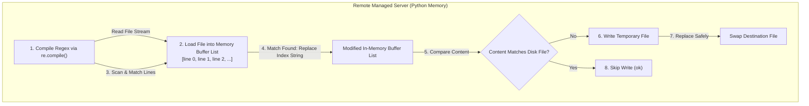

## Table of Contents

1. [The Boundary of Shared Files](#the-boundary-of-shared-files)
2. [The Line-Level and Block-Level Preview](#the-line-level-and-block-level-preview)
3. [Line-Level Management: The lineinfile Module](#line-level-management-the-lineinfile-module)
4. [Block-Level Scopes: The blockinfile Module](#block-level-scopes-the-blockinfile-module)
5. [Pattern Replacements: The replace Module](#pattern-replacements-the-replace-module)
6. [Under the Hood: Regex Compilation and File Stream Processing](#under-the-hood-regex-compilation-and-file-stream-processing)
7. [Validating Candidate States in Shared Contexts](#validating-candidate-states-in-shared-contexts)
8. [When to Pivot to Templates](#when-to-pivot-to-templates)
9. [Putting It All Together](#putting-it-all-together)
10. [What's Next](#whats-next)

## The Boundary of Shared Files

In configuration management, managing partial or line-level edits is the practice of modifying only a specific, bounded section or a single text line inside an existing file on a managed host, while leaving all surrounding content completely untouched. While templates and static copy tasks are the ideal choice when the automation team owns a file completely (such as a private systemd service descriptor or a dedicated virtual host configuration), they fail when multiple roles, system packages, or local operations must share the same file. In these shared environments, overwriting the entire file would erase configurations managed by other teams or operating system updates, causing system failures.

To see why precise line-level and block-level edits are essential, consider our scenario. You are managing a configuration playbook that must adjust a proxy timeout inside a shared Nginx include file, append a database upstream block to a shared upstream catalog, and retire an old socket path across multiple lines in a shared application configuration directory. None of these files are owned exclusively by your playbook.

Overwriting the entire file with a template breaks the shared contract. A package manager upgrade that adds new default rules to a shared OS file has those updates erased on the next playbook run. Two automation roles managing separate sections of the same upstream catalog continuously overwrite each other. Even a single-line change forces you to take ownership of every other line in the file, making code reviews much harder and turning a trivial edit into a coordination problem.

Ansible solves this by providing specialized partial edit modules: `lineinfile` for individual lines, `blockinfile` for contiguous text blocks bounded by markers, and `replace` for global pattern substitutions. By scoping your edits to the narrowest logical boundary, you protect shared states and modify only the exact lines you own.

## The Line-Level and Block-Level Preview

Here is an early, comment-free YAML playbook preview demonstrating how to configure individual lines, manage marked blocks, and execute pattern replacements safely in a single playbook run:

```yaml
- name: Settle specific lines and blocks in shared files
  hosts: app_servers
  become: true
  tasks:
    - name: Set global proxy timeout line
      ansible.builtin.lineinfile:
        path: /etc/nginx/conf.d/global-limits.conf
        regexp: '^\s*proxy_read_timeout\s+'
        line: 'proxy_read_timeout 30s;'

    - name: Manage database upstream block
      ansible.builtin.blockinfile:
        path: /etc/nginx/conf.d/upstreams.conf
        marker: "# {mark} ANSIBLE MANAGED DB UPSTREAM"
        block: |
          upstream db_cluster {
              server 10.80.20.51:5432;
              keepalive 16;
          }

    - name: Replace old application socket path
      ansible.builtin.replace:
        path: /etc/app/runtime.conf
        regexp: '/var/run/app-old\.sock'
        replace: '/var/run/app-new.sock'
```

## Line-Level Management: The lineinfile Module

The `ansible.builtin.lineinfile` module is designed strictly to manage a single, logical line of text inside a target file. Its primary job is to find an existing line matching a regular expression search pattern, replace it with your desired text, or append the line if no match is found.

When you configure a `lineinfile` task, you must be extremely precise:
- **`regexp`**: The regular expression used to scan the file. A good regex must match both the *old* incorrect setting and the *new* correct setting. For example, using `'^(\s*)proxy_read_timeout\s+'` ensures that Ansible finds the timeout line regardless of whether its current value is `10s`, `20s`, or already `30s`.
- **`line`**: The exact string that should exist in the file.
- **`backrefs`**: An optional mode that lets the `line` parameter reference matched groups from the regex, such as using `\1` to preserve leading whitespace. This changes behavior: when `backrefs: true` and the regex does not match, `lineinfile` leaves the file unchanged instead of inserting a new line.

The regular expression is your primary safety boundary. If the expression is too broad, Ansible may match and overwrite an unrelated parameter. If it is too narrow, the module will fail to recognize the correct line on subsequent runs and append a duplicate line at the end of the file, breaking idempotency. You must write the regular expression to target only the specific parameter name and its leading boundaries.

## Block-Level Scopes: The blockinfile Module

When your configuration changes require writing several contiguous lines of text (such as adding a complete upstream block, a multiline network policy, or a block of environment parameters) to a shared file, using `lineinfile` repeatedly is highly fragile. You must instead use the `ansible.builtin.blockinfile` module.

The blockinfile module writes a complete block of text to a file and surrounds it with strict, unique marker lines:

```yaml
- name: Manage database upstream block
  ansible.builtin.blockinfile:
    path: /etc/nginx/conf.d/upstreams.conf
    marker: "# {mark} ANSIBLE MANAGED DB UPSTREAM"
    block: |
      upstream db_cluster {
          server 10.80.20.51:5432;
      }
```

When blockinfile runs, it expands the BEGIN and END marker strings using the `marker` parameter, building two unique delimiter lines such as `# BEGIN ANSIBLE MANAGED DB UPSTREAM` and `# END ANSIBLE MANAGED DB UPSTREAM`. It then scans the target file line by line for those delimiters. If the block already exists between the delimiters, blockinfile replaces it with the current content; if the delimiters are absent, it inserts the block at the position specified by `insertafter` or `insertbefore`. On subsequent runs, if the block content already matches what is in the file, the module reports `ok` without writing. You must always write a unique string inside the `marker` parameter. If you use the default generic marker in a file that has multiple block tasks, the second task will overwrite the first task's block because both share the same default boundary.

## Pattern Replacements: The replace Module

The `ansible.builtin.replace` module is designed to execute global pattern substitutions across an entire file. It scans the target file, locates every string that matches your regular expression, and replaces it with your target text.

```yaml
- name: Replace old socket path
  ansible.builtin.replace:
    path: /etc/app/runtime.conf
    regexp: '/var/run/app-old\.sock'
    replace: '/var/run/app-new.sock'
```

Typical use cases for `replace` include:
- Migrating socket paths, database IPs, or domain names across multiple configuration blocks.
- Commenting out deprecated or insecure parameters globally.
- Standardizing paths or usernames across legacy configuration files.

You must be extremely careful to design your regular expression to be idempotent. If the `regexp` search pattern can also match the `replace` text, the module will match the newly written string on every subsequent run, continuously writing changes and reporting `changed` indefinitely. You must write the regular expression to explicitly match only the old, deprecated pattern, ensuring that once the substitution is complete, the search returns zero matches and reports a clean `ok`.

## Under the Hood: Regex Compilation and File Stream Processing

To appreciate how these partial edit modules execute safely on remote managed hosts without corrupting shared files, it helps to understand the regex compilers and stream buffers operating inside the remote Python namespace.

When a partial edit task (such as `lineinfile`) executes, the remote Python module runs a file stream transaction:

1. **Regex Compilation**: The script uses Python's built-in `re` library to compile your `regexp` argument into an optimized regular expression pattern object (`re.compile(regex)`). If the regex syntax is malformed, it aborts execution immediately with a parsing error.
2. **Buffer Stream Read**: The script opens the target file in read-only mode, loading the text into memory as a list of individual line strings.
3. **Line-by-Line Match**: It iterates through the line buffer list. The compiled regex object executes matches against each line. In a `lineinfile` run, the script records the index of the last matching line.
4. **Buffer Modification**: If a match is found, the script replaces that specific index string in the buffer list with your desired `line` parameter, using backreferences only when that mode is enabled. If no match is found and `backrefs` is not enabled, it appends the line to the end of the list or inserts it around a configured anchor line.
5. **Checksum Check**: The module compares the modified content with the active file on disk. If they match, it skips writing and exits with `ok`.
6. **Atomic Replacement When Possible**: If the content differs, it writes the modified buffer list to a temporary file, copies metadata as needed, and replaces the destination using Ansible's safe file operation path when the filesystem supports it.



This memory-buffer stream processing means Ansible can calculate the candidate result before replacing the active file, which helps protect shared configurations from partial writes.

## Validating Candidate States in Shared Contexts

Just like complete file templates, a single syntax error inside a partial line edit can easily crash your system services. For example, if you append a line with a missing semicolon to a shared Nginx include, Nginx will fail to reload.

To reduce this operational risk, partial edit modules support the `validate` parameter:

```yaml
- name: Set global proxy timeout line
  ansible.builtin.lineinfile:
    path: /etc/nginx/conf.d/global-limits.conf
    regexp: '^\s*proxy_read_timeout\s+'
    line: 'proxy_read_timeout 30s;'
    validate: "nginx -t -c %s"
```

Ansible does not test the edited line in isolation. It compiles the complete modified memory buffer (including the edited line in its exact surrounding context) and writes it to a temporary file. The validation command then runs against that temporary file, with `%s` replaced by the temporary path, executed securely without shell expansion so pipes and redirects should not be used directly inside the `validate` string. If the validation command returns a non-zero exit code, Ansible deletes the temporary file and aborts the task immediately, leaving the active production file unchanged.

## When to Pivot to Templates

While partial edit modules are highly useful, using them to perform multiple separate changes inside the same configuration file is a major operational anti-pattern. If you chain ten `lineinfile` tasks to configure a single file, you make the playbook incredibly fragile and difficult to read.

Here is a quick reference table to help you decide whether to use partial edits or pivot to a complete file template:

| Variable | Use Partial Edits (`lineinfile` / `blockinfile`) | Pivot to Complete Templates (`template`) |
| :--- | :--- | :--- |
| **File Ownership** | The file is shared and managed by other packages, roles, or OS updates. | The automation team owns the entire file exclusively. |
| **Edit Scale** | Managing a single configuration parameter or an isolated, marked block. | Managing multiple settings, conditional blocks, or loops. |
| **Readability** | High for single lines, but extremely low if multiple tasks chain edits. | High: The template file shows the exact final shape in one place. |
| **Drift Risk** | Medium: Markers must be respected, and regexes must stay robust. | Low: The template completely resets and standardizes the file on every run. |
| **Review Value** | High for pinpointing specific system upgrades in git histories. | High for auditing the complete file configuration contract. |

The rule of thumb is simple: if you own the file, write a template; if you share the file, manage the smallest possible line or block boundary.

## Putting It All Together

We started by looking at how blind complete-file overwrites on shared or OS-managed files can erase configuration states, while unguided shell edits can corrupt formatting and duplicate lines.

Ansible solves these challenges by providing highly disciplined, state-aware partial edit modules:
- **Precise Boundaries**: We use `lineinfile` to manage individual lines, mapping search patterns to robust regular expressions.
- **Isolated Blocks**: We leverage `blockinfile` with unique boundary markers (like `DB UPSTREAM`) to declare multiline configurations safely.
- **Global Replacements**: We utilize the `replace` module to perform idempotent text migrations across files.
- **Under-the-Hood Buffering**: The remote engine compiles regexes in Python memory, processes files as in-memory stream lists, compares changes, and replaces files safely when needed.
- **Whole-File Validation**: We configure `validate` parameters to test the candidate file in its complete context before replacement.
- **Text vs. Template Deciding**: We restrict partial edits to shared settings, pivoting to complete templates when the team owns the file structure.

Following these practices ensures that your system configurations are edited cleanly, safely, and securely without disrupting surrounding services.

## What's Next

Now that you master partial filesystem edits, block markers, regular expressions, and defensive validation, the next article will explore **Handlers and Restarts**. We will look at how to bind these file and template modifications to the service reloads or restarts that make the changes take effect.

---

**References**

- [Ansible Built-in lineinfile Module](https://docs.ansible.com/ansible/latest/collections/ansible/builtin/lineinfile_module.html) - Technical reference for managing single lines.
- [Ansible Built-in blockinfile Module](https://docs.ansible.com/ansible/latest/collections/ansible/builtin/blockinfile_module.html) - Documentation for managing marked blocks of lines.
- [Ansible Built-in replace Module](https://docs.ansible.com/ansible/latest/collections/ansible/builtin/replace_module.html) - Technical guide for executing pattern-based text replacements.
- [Python Regular Expression Operations Specification](https://docs.python.org/3/library/re.html) - The standard Python `re` library specification used by Ansible modules.
