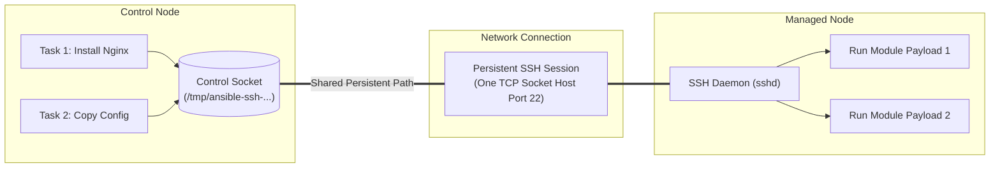

## Table of Contents

1. [The Operations Pipeline Workflow](#the-operations-pipeline-workflow)
2. [Early Inventory and Connection Preview](#early-inventory-and-connection-preview)
3. [Step 1: Inspecting the Host Catalog Graph](#step-1-inspecting-the-host-catalog-graph)
4. [Step 2: Proving Remote Execution](#step-2-proving-remote-execution)
5. [Step 3: Dry Runs and Output Differences](#step-3-dry-runs-and-output-differences)
6. [Under the Hood: SSH Multiplexing and Sockets](#under-the-hood-ssh-multiplexing-and-sockets)
7. [Step 4: Blast Radius Minimization](#step-4-blast-radius-minimization)
8. [Step 5: Verifying System Stability](#step-5-verifying-system-stability)
9. [Putting It All Together](#putting-it-all-together)
10. [What's Next](#whats-next)

## The Operations Pipeline Workflow

An Ansible workflow is a structured sequence of checks and commands that you execute to safely apply configuration changes to your server infrastructure. Instead of running a playbook immediately against your entire fleet of machines, a disciplined workflow validates your host targets, tests remote access channels, dry-runs task updates, and verifies system stability in layers. This gradual process isolates failures early and prevents simple configuration typos from affecting all your active production environments.

To see why a structured workflow is essential, consider our concrete scenario. You are tasked with deploying an application software update across a dual-node web application cluster. You need to update an environment configuration file, install a new security utility package, and restart the backend services.

Without a structured verification workflow, a mismatched SSH configuration silently excludes hosts from the run, a stale inventory entry directs tasks to the wrong machine, and a playbook with no dry-run step can push a broken configuration to the entire cluster before anyone notices.

A professional operations pipeline removes this uncertainty. You do not treat the playbook run as a single giant step. Instead, you break the operation down into controlled validation steps: inspecting parsed target groups, confirming connection handshakes, dry-running state changes to view file differences, applying changes to a single target host first, reading the run recap metrics, and executing a second run to confirm that the hosts have settled.

## Early Inventory and Connection Preview

Here is an early, comment-free YAML preview of the inventory configuration and host group definition used to manage the dual-node application cluster in our scenario:

```yaml
all:
  children:
    app_cluster:
      hosts:
        app-node-01:
          ansible_host: 10.50.20.11
        app-node-02:
          ansible_host: 10.50.20.12
      vars:
        ansible_user: admin
        ansible_ssh_private_key_file: ~/.ssh/deploy_key
```

## Step 1: Inspecting the Host Catalog Graph

The very first layer of any Ansible run is verifying the host catalog, which is commonly called the inventory. Before you instruct Ansible to make any modifications or open any network connections, you must confirm exactly which computers the control node expects to touch.

You query this information using the `ansible-inventory` command. By passing the inventory path and the graph flag, you instruct Ansible to parse the host files and output a tree-like diagram of your infrastructure.

```bash
ansible-inventory -i inventory/hosts.yml --graph
```

For our dual-node web application cluster, the parsed graph outputs a clean structural layout:

```plain
@all:
  |--@ungrouped:
  |--@app_cluster:
  |  |--app-node-01
  |  |--app-node-02
```

This output is a vital validation gate. If you see a machine listed in the wrong group, or if a production server appears inside a testing group group, you know your host mappings are misaligned. This check is incredibly safe because it operates entirely inside the memory of the control node, without sending a single network packet to the remote servers. You fix all structural catalog bugs here before touching your network channels.

To inspect the specific connection variables assigned to an individual server, you query the specific host details:

```bash
ansible-inventory -i inventory/hosts.yml --host app-node-01
```

This command prints the final, merged dictionary of variables that Ansible will use when connecting to `app-node-01`. You use this to verify that target addresses, connection ports, remote SSH users, and private key paths match your expectations.

## Step 2: Proving Remote Execution

Once you have verified the host graph, the next step is to prove that the control node can actively connect to the managed hosts and run commands. You achieve this using Ansible's built-in `ping` module.

You execute this as an ad-hoc command, which is a quick way to run a single module against a group of hosts without writing a full playbook file:

```bash
ansible app_cluster -i inventory/hosts.yml -m ansible.builtin.ping
```

It is important to understand that this is not a standard network ping. It does not send ICMP packets from your kernel to the target host. Instead, Ansible opens a real SSH network connection, verifies your login credentials, searches for a Python interpreter on the remote machine, transfers a small temporary Python script, runs it, and waits for a specific JSON formatted response containing the string `pong`.

A successful connection test produces a clean result block for each host:

```json
app-node-01 | SUCCESS => {
    "changed": false,
    "ping": "pong"
}
app-node-02 | SUCCESS => {
    "changed": false,
    "ping": "pong"
}
```

This output proves three things:
- The control node has a valid network path to the managed servers.
- The SSH keys and user credentials match the remote security rules.
- The target hosts have a working Python environment that can run Ansible's temporary module payloads.

If a host returns a status of `UNREACHABLE`, you know the connection layer is broken. You do not waste time debugging playbook configuration bugs. You focus entirely on network and access issues: verifying SSH key file permissions, adjusting local firewalls, checking VPN gateways, or correcting login usernames.

## Step 3: Dry Runs and Output Differences

With verified connection paths, you can now preview the exact changes your playbook will apply. You do this by running the playbook in check mode (using the `--check` flag) and requesting a line-by-line configuration difference (using the `--diff` flag).

```bash
ansible-playbook -i inventory/hosts.yml playbooks/deploy.yml --check --diff
```

Check mode asks Ansible modules to query the current state of the remote machines, compare it to your playbook goals, and report what they would change without applying supported writes. Diff mode works alongside this by showing before-and-after details for modules that support diff output, commonly file and template modules. Treat both modes as strong review evidence rather than a perfect simulator, because unsupported modules and tasks that depend on earlier real changes can produce incomplete previews.

For our application cluster configuration file update, the dry run output displays the exact text line that will be written:

```diff
--- /etc/app/config.json
+++ /etc/app/config.json
@@ -2,3 +2,3 @@
 {
-  "port": 8080,
+  "port": 9000,
   "debug": false
 }
```

This visual preview allows you to verify that your variables are interpolating correctly and that no unexpected files will be modified.

You must keep in mind that check mode has structural limitations. While standard file and template modules can predict changes accurately, some tasks depend on steps that must create real files or resources earlier in the playbook. For example, if a task creates a user database, and a subsequent task connects to that database to configure tables, the second task will fail during a dry run because the database does not physically exist yet. Understanding this limitation helps you distinguish between true playbook bugs and expected dry run limitations.

## Under the Hood: SSH Multiplexing and Sockets

To appreciate the speed and efficiency of a professional Ansible workflow, it helps to understand the underlying networking protocols used by the control node. By default, running a playbook containing ten tasks against five hosts requires Ansible to execute fifty separate commands on the remote systems.

Opening a new SSH connection for every single task introduces substantial latency. A standard SSH handshake requires multiple network round trips to negotiate cryptographic algorithms, exchange host keys, and verify user credentials. In high-latency cloud networks or multi-region environments, this handshake sequence can take anywhere from 200ms to 800ms. If repeated fifty times across ten tasks and five hosts, network handshakes alone can add several minutes to a simple playbook run.

To solve this problem, Ansible leverages a low-level SSH performance protocol known as **SSH Multiplexing** (often configured via the `ControlMaster` and `ControlPersist` SSH settings).



When SSH Multiplexing is enabled:
1. **Initialize the Control Socket**: On the first task of a play, Ansible opens a standard SSH connection to the remote host. It creates a special local domain socket file (typically inside `/tmp/ansible-ssh-...`).
2. **Hold the Connection Open**: The `ControlPersist` setting tells the SSH client to keep this initial secure TCP channel active in the background, even after the first task exits (for example, keeping it alive for 60 seconds).
3. **Route Subsequent Tasks**: When the second task runs, the Ansible control process routes the SSH commands directly through the existing local control socket file. The command bypasses the entire cryptographic handshake and credential verification sequence, traveling instantly over the pre-established TCP tunnel.
4. **Serialize the Pipeline**: Ansible's task execution engine manages the flow of these commands. It reads the tasks sequentially, sends temporary module payloads through the open connection, and uses a callback plugin manager to capture and process result streams.

This socket reuse reduces the per-task execution latency to a few milliseconds, making agentless automation extremely fast and highly responsive.

## Step 4: Blast Radius Minimization

Even with verified connections and successful dry runs, running a new playbook on your entire production fleet at once is risky. If a subtle runtime error occurs, you can take down all nodes simultaneously.

A professional workflow minimizes this risk by limiting the initial playbook run to a single host (using the `--limit` CLI argument). This host acts as a live canary.

```bash
ansible-playbook -i inventory/hosts.yml playbooks/deploy.yml --limit app-node-01
```

By targeting only `app-node-01`, you verify that the execution succeed on a real, live host. If the systemd service fails to reload, or if a configuration parameter triggers a service crash, the blast radius is confined to a single machine. The other half of your dual-node cluster stays completely healthy, continuing to serve web traffic to your users.

Once the limited run completes, you inspect the final Play Recap block:

```plain
PLAY RECAP
app-node-01 : ok=15 changed=3 unreachable=0 failed=0 skipped=2
```

You analyze these numbers to verify that the execution matches your expectations:

| Field | Meaning |
|---|---|
| `ok` | Task ran and the system was already in the correct state |
| `changed` | Task ran and modified the system |
| `failed` | Task ran but returned a non-zero exit code or module failure |
| `unreachable` | Ansible could not establish a connection to the host |

For our scenario, `changed` should be exactly 3 (writing the config file, installing the package, and restarting the service). Both `failed` and `unreachable` must be 0.

Once you have verified the canary run, you can confidently run the playbook against the entire host group without the limit flag, rolling out the changes to the rest of your fleet.

## Step 5: Verifying System Stability

The final step in a professional workflow is verifying that your tasks are truly idempotent and that your systems have settled into a stable, quiet state. You achieve this by running the exact same playbook command a second time against the hosts you just updated.

```bash
ansible-playbook -i inventory/hosts.yml playbooks/deploy.yml --limit app-node-01
```

During this second run, if your playbook is designed correctly, the output should display no active modifications. Every task should report `ok` and the `changed` count in the recap should be exactly 0:

```plain
PLAY RECAP
app-node-01 : ok=15 changed=0 unreachable=0 failed=0 skipped=2
```

If the second run reports changes, the cause is almost always a task that is not truly state-aware. A common pattern is using the `shell` module to append text to a file on every run rather than using a declarative file module that checks existing content first. Template tasks that embed dynamic timestamp values or random variables fail the content checksum comparison on every execution, causing a file rewrite even when nothing meaningful changed. Handlers can also misfire continuously if their parent task reports changes on every run, triggering service restarts that should only happen once.

Fixing these issues ensures that your playbooks are safe to run continuously (such as in an automated cron loop or CI/CD environment) without causing constant service interruptions or configuration drift.

## Putting It All Together

We started by examining the dangers of running configuration playbooks across a dual-node web application cluster without a disciplined workflow, where simple typos, SSH access issues, or target mistakes can take down your entire application fleet.

Ansible answers these dangers by providing a structured, layered execution pipeline:
- **Visual Validation**: We run graph checks to verify parsed target groups before opening network channels.
- **Connection Proof**: We use the ping module to verify SSH handshakes, keys, and remote Python availability.
- **Dry-Run Previews**: We combine check and diff modes to preview configuration file modifications line-by-line.
- **Under-the-Hood Efficiency**: We use SSH Multiplexing to share network sockets, bypassing handshake overhead and optimizing task pipelines.
- **Canary Rollouts**: We limit initial runs to a single host to minimize the blast radius, checking run recap metrics before full rollouts.
- **Idempotency Auditing**: We execute a second run to confirm that the hosts have settled and that the changed count is exactly zero.

Following this workflow gives you concrete evidence before and after each run, making your automation safer, more predictable, and easier to recover when a host behaves differently than expected.

## What's Next

Now that you have mastered a safe playbook execution workflow and understand the underlying mechanics of SSH socket multiplexing, the next submodule will explore the structure of playbooks and tasks. We will look at how Ansible parses YAML text files, maps keys to module arguments, and defines the structural building blocks of machine states.

---

**References**

- [Ansible Command Line Utilities Guide](https://docs.ansible.com/ansible/latest/user_guide/command_line_tools.html) - Documentation for ansible-inventory and ad-hoc execution tools.
- [Ansible Check Mode and Diff Mode](https://docs.ansible.com/ansible/latest/playbook_guide/playbooks_checkmode.html) - How to safely preview and dry-run playbook modifications.
- [OpenSSH Multiplexing Specification](https://www.openssh.com/txt/release-3.9) - Original release notes and protocol details for SSH ControlMaster and ControlPersist.
- [Ansible Connection Tuning](https://docs.ansible.com/ansible/latest/playbook_guide/playbooks_connection.html) - Best practices for optimizing SSH connection sharing and pipelining.
