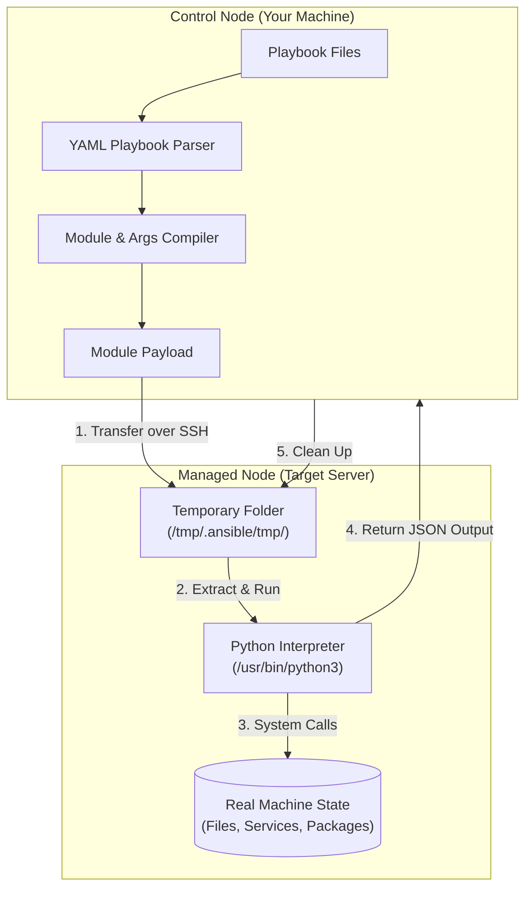
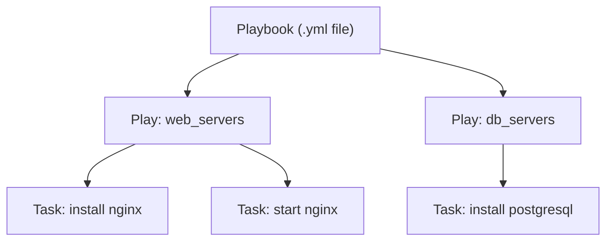

## Table of Contents

1. [What Is Ansible?](#what-is-ansible)
2. [The Web Application Fleet Scenario](#the-web-application-fleet-scenario)
3. [Early Playbook Preview](#early-playbook-preview)
4. [Agentless Architecture vs. Resident Daemons](#agentless-architecture-vs-resident-daemons)
5. [Under the Hood: The Module Payload Loop](#under-the-hood-the-module-payload-loop)
6. [The Control Node and Managed Nodes Split](#the-control-node-and-managed-nodes-split)
7. [Playbooks, Plays, Tasks, and Modules](#playbooks-plays-tasks-and-modules)
8. [Idempotency: The Core Safety Principle](#idempotency-the-core-safety-principle)
9. [Putting It All Together](#putting-it-all-together)
10. [What's Next](#whats-next)

## What Is Ansible?

Ansible is an automation tool for configuring computer systems and running repeatable operations on many machines at once. You write plain-text files that describe exactly what directories, configuration settings, software packages, and system services should exist on your servers. Ansible reads those files, connects to the targeted machines over standard network paths, makes whatever adjustments are necessary, and reports back whether the systems were modified.

If you manage servers by hand, you know that keeping them matching over time is difficult. An administrator logs into one host, installs a package, and updates a config file. A week later, another host needs the same setup. The administrator repeats the steps, but might miss a small permission setting, or type a slightly different package version number. Over months, these tiny differences multiply. The hosts begin to differ from one another in subtle ways that make them unpredictable.

Ansible solves this problem by turning machine setups into written, versioned text files. Instead of remembering what steps to run or keeping private text documents filled with terminal commands, your team writes the desired state of your systems into files that anyone can read. You can then run those files against one machine, five machines, or a thousand machines, ensuring that every host is configured in the exact same way.

## The Web Application Fleet Scenario

To see why this is useful, consider a common system administration task. You are managing a fleet of three server machines that run a custom web application. Each of these machines requires a specific environment to operate:
- The system package catalog must be refreshed before installing software.
- A web server software package (like Nginx) must be installed.
- A custom configuration file must exist at `/etc/nginx/sites-available/app.conf` to direct incoming traffic.
- A system service daemon must be actively running and enabled to start automatically whenever the server reboot cycles occur.
- A dedicated file directory at `/var/www/app/logs` must exist with restricted permissions so that only the web server process can write logs to it.

Doing this by hand on three machines is tedious. If your fleet grows to fifty machines, manual setup is no longer practical. If one server crashes and needs to be replaced, rebuild steps must be executed from memory or outdated setup guides. By writing this environment description into an Ansible file, you can recreate the setup in the same repeatable shape and make every server converge on the same specifications.

## Early Playbook Preview

Here is an early, comment-free preview of an Ansible playbook that standardizes the web application environment described in our scenario. Even if you have never seen Ansible code before, you can read this file and understand what states it enforces:

```yaml
- name: Standardize web application hosts
  hosts: webservers
  become: true
  tasks:
    - name: Ensure nginx web server is installed
      ansible.builtin.apt:
        name: nginx
        state: present
        update_cache: true

    - name: Configure virtual host routing
      ansible.builtin.copy:
        content: |
          server {
              listen 80;
              server_name localhost;
              location / {
                  proxy_pass http://127.0.0.1:8080;
              }
          }
        dest: /etc/nginx/sites-available/app.conf
        owner: root
        group: root
        mode: "0644"

    - name: Create restricted application log directory
      ansible.builtin.file:
        path: /var/www/app/logs
        state: directory
        owner: www-data
        group: www-data
        mode: "0750"

    - name: Keep web server running and enabled
      ansible.builtin.service:
        name: nginx
        state: started
        enabled: true
```

## Agentless Architecture vs. Resident Daemons

In the world of system automation, most traditional tools rely on a client-server model that requires a resident background agent (often called a daemon) to be constantly running on every managed machine. This background process periodically polls a central management server for new instructions, compiles them locally, and applies changes.

This resident agent model introduces several physical and operational issues. A resident agent process consumes memory and CPU on every managed node continuously, not just during automation runs, which reduces the resources available for your actual applications on small virtual machines. The agent software requires its own installation, version pinning, and upgrade cycle across the entire fleet, meaning a crashed or corrupted agent removes that machine from your management plane entirely. Each agent is also an additional network listener, expanding the attack surface by adding an open port and authentication credential to every managed machine.

Ansible takes a fundamentally different path: it is agentless. For Linux hosts, this means the managed servers do not run any special Ansible background processes or daemons. They require no resident software updates, no local database files, and no dedicated ports listening for management traffic. Instead, Ansible leverages the network paths and access routes you already use. It connects over standard SSH, runs whatever tasks are needed, and then disconnects completely. When Ansible is not actively running a playbook, it occupies zero memory and zero CPU cycles on your servers.

## Under the Hood: The Module Payload Loop

Because Ansible is agentless, people often wonder how it actually executes tasks on a remote machine. If there is no agent process waiting to receive orders, how does a managed machine know how to check packages, read file permissions, or start systemd services?

The answer lies in a highly structured, temporary execution loop executed by the control machine over SSH. Behind the scenes, when you launch a normal Python-based module, Ansible assembles a temporary module payload. In Ansible's own developer documentation, the packaging framework for new-style Python modules is called **AnsiballZ**.

Here is the step-by-step low-level sequence of how Ansible executes a single task on a remote Linux host:

1. **Establish the Connection**: The control node opens a standard SSH network socket connection to the target managed machine, using the SSH keys and connection parameters you configured.
2. **Discover the Python Interpreter**: Ansible inspects the remote operating system to find a working Python execution environment. It scans standard system directories (searching for `/usr/bin/python3`, `/usr/bin/python`, or customized paths) and caches the location.
3. **Assemble the Module in Memory**: On your control computer, Ansible takes the Python code representing the requested module (for example, the code that manages file directories) and merges it with the specific arguments you wrote in your playbook.
4. **Package the Module Payload**: Ansible compresses this combined Python module code and argument data into a single payload. The payload is self-contained enough to carry the helper code required for that task.
5. **Transfer the Payload**: Ansible writes a small bootstrapping script to the SSH channel, which creates a temporary directory on the managed host (typically inside `/tmp/.ansible/tmp/`) and transfers the base64-encoded zip package using SFTP or SCP file protocols.
6. **Execute the Code**: The bootstrapping script tells the remote Python interpreter to read and execute the module payload from the temporary directory. The remote Python process performs the real systems calls (like `stat()`, `mkdir()`, or modifying package lists) to align the host state.
7. **Return Results and Clean Up**: The remote Python execution writes a JSON-formatted text block back to the SSH standard output stream containing the status (whether the task succeeded, if anything changed, or if an error occurred). By default, Ansible removes the temporary files after the module finishes, unless configuration such as remote-file retention is enabled for troubleshooting.



This loop is what makes Ansible feel agentless in normal operation. The managed host does not keep a resident Ansible daemon running between plays, and the temporary module files are cleaned up during ordinary execution.

## The Control Node and Managed Nodes Split

To operate Ansible, you divide your computers into two roles: the control node and the managed nodes.

The **control node** is the machine where you actually install the Ansible program itself. This is where your playbook files, inventories, and configuration parameters live. You run commands like `ansible-playbook` from this machine. It can be your personal laptop, a dedicated administration server inside your private network, or a shared CI/CD pipeline runner inside a cloud environment.

The **managed nodes** are the target machines that you want to configure and maintain. These are the systems that receive your web servers, databases, security updates, and directories. These nodes do not have Ansible installed. For typical Linux and other POSIX hosts, they need two simple things:
- An active network path that allows the control node to reach them over SSH (typically port 22).
- A working installation of a Python interpreter (Python 3.x is standard on almost all modern Linux distributions).

Windows hosts and network devices use different connection plugins and module families, so they do not fit this exact SSH-plus-Python path. The important beginner idea is that Ansible lives on the control node, while managed nodes only need the runtime access required by the modules you run against them.

Here is a quick reference table showing the differences between these two roles:

| Feature | Control Node | Managed Node |
| :--- | :--- | :--- |
| **Ansible Installation** | Must be installed | Not required |
| **Operating System** | macOS or Linux (Windows not supported as control) | Linux, Windows, macOS, or network switches |
| **Typical Resource Use** | Temporary CPU spikes during runs | Zero memory/CPU when playbooks are idle |
| **Authentication** | Holds private SSH keys and vault passwords | Holds public SSH keys matching the control keys |
| **Execution Role** | Assembles module payloads and orchestrates runs | Executes temporary module code and reports results |

## Playbooks, Plays, Tasks, and Modules

When you write automation files in Ansible, you use a set of hierarchy terms that describe how the work is organized. Understanding these terms prevents confusion when you read playbooks or debug run errors.

The hierarchy flows from the largest file structure down to the individual units of work.

A playbook is the top-level file that groups all automation for a scenario into one document. Inside a playbook, a play maps a set of target hosts to an ordered list of steps. Each step in that list is a task, a human-readable instruction like "ensure the Nginx package is installed." A module is the compiled code behind each task, which performs the actual system operation and reports back whether anything changed.



## Idempotency: The Core Safety Principle

The single most important safety concept in Ansible is **idempotency**. Idempotency means that running a task multiple times will leave the target machine in the exact same final state as running it once, without causing unintended side effects.

When you write custom shell scripts to configure servers, you are writing imperative lists of instructions:
- Run `mkdir /var/log/app`
- Run `apt-get install nginx`
- Run `echo "setting = value" >> /etc/app.conf`

If you run this shell script a second time, it will fail or cause issues. The `mkdir` command will return an error because the directory already exists. The `echo` command will append the same setting line a second time, corrupting the configuration file. To make a shell script safe to rerun, you must write complicated conditional logic to check if directories exist and if lines are already in files before running commands.

Ansible modules are designed under the hood to be declarative. You do not tell Ansible what actions to execute; you describe the final state you want. The module compares that desired state with the actual system state, and only acts if they do not match.

Consider this Ansible task:

```yaml
- name: Ensure nginx web server is installed
  ansible.builtin.apt:
    name: nginx
    state: present
```

When Ansible executes this task:
1. The remote module runs `dpkg-query` or inspects system package catalogs to see if `nginx` is present.
2. If the package is missing, the module installs it and returns a status of `changed`.
3. If the package is already present, the module does nothing and returns a status of `ok`.

Running this task once, ten times, or a hundred times is completely safe. The server settles into the desired state, and Ansible only spends time and effort making changes when the host has drifted from your playbook definition.

## Putting It All Together

We started by examining the problems of managing a web application fleet by hand, where manual steps, unwritten config changes, and diverging package versions lead to server drift and unpredictable failures.

Ansible answers these challenges through an elegant, zero-overhead architecture:
- **Agentless Execution**: It runs without any resident background daemons on your servers, connecting over standard SSH and using resources only during active execution.
- **The Module Payload Loop**: During a run, it assembles temporary task payloads, transfers them to the managed host, executes them, receives structured results, and normally cleans up the temporary files afterward.
- **Declarative and Idempotent Tasks**: It focuses on describing the final target state rather than listing execution steps, ensuring that playbooks can be safely run repeatedly against any number of hosts.

By splitting your computers into control nodes that orchestrate runs and managed nodes that receive temporary tasks, you move your server environments out of human memory and into clear, version-controlled playbooks.

## What's Next

Now that you understand the high-level architecture of Ansible and the mechanics of the agentless execution loop, the next article will explore the actual workflow of running a playbook. We will step through the commands to set up a control environment, initiate connection checks, execute dry runs to preview system shifts, and read the recap lines to diagnose host changes.

---

**References**

- [Ansible Architecture Overview](https://docs.ansible.com/ansible/latest/network/getting_started/basic_concepts.html) - Official guide to control nodes, managed nodes, and communication patterns.
- [Ansible Modules Introduction](https://docs.ansible.com/ansible/latest/user_guide/modules.html) - Documentation on how state-aware modules execute on remote targets.
- [Understanding Idempotency in Configuration Systems](https://docs.ansible.com/ansible/latest/reference_appendices/faq.html#what-is-idempotency) - Detailed explanation of declarative system reconciliation.
- [Secure Shell (SSH) Protocol Specifications](https://datatracker.ietf.org/doc/html/rfc4251) - The Internet Engineering Task Force (IETF) RFC outlining the SSH transport layer used by Ansible.
