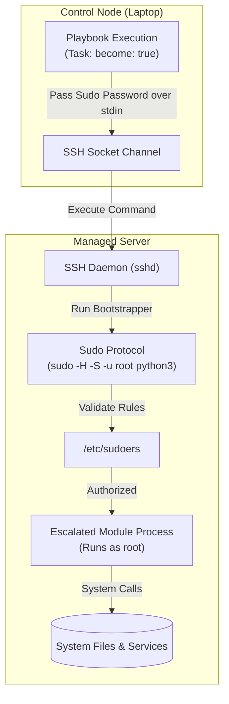

## Table of Contents

1. [The Security Boundary of Host Connections](#the-security-boundary-of-host-connections)
2. [The Connection and Privilege Code Preview](#the-connection-and-privilege-code-preview)
3. [Connection Address vs. Inventory Name](#connection-address-vs-inventory-name)
4. [The Login User Layer](#the-login-user-layer)
5. [Privilege Escalation: The Sudo Protocol](#privilege-escalation-the-sudo-protocol)
6. [Fine-Grained Privilege: become_user and Task Scopes](#fine-grained-privilege-become_user-and-task-scopes)
7. [Under the Hood: Sudoers Configuration and NOPASSWD](#under-the-hood-sudoers-configuration-and-nopasswd)
8. [Diagnosing Access and Privilege Failures](#diagnosing-access-and-privilege-failures)
9. [Putting It All Together](#putting-it-all-together)
10. [What's Next](#whats-next)

## The Security Boundary of Host Connections

In server automation, managing connections and privilege escalation is the practice of separating the initial network authentication layer from the administrative system access layer on your managed nodes. Instead of logging directly into your servers as the root superuser (which introduces a major security risk and violates standard access control rules), the automation system uses a multi-tiered security model. It logs in as a restricted, non-privileged user account first, and then escalates privileges only for the specific tasks that require administrative permissions to modify the host state.

To see why this separation of concerns is a vital operational safeguard, consider our scenario. You are setting up an administrative account that must configure Nginx virtual hosts and start background application services on a remote managed server.

If your connection and privilege layers are mixed or poorly configured, allowing direct root SSH logins exposes the entire infrastructure to brute-force attacks, while a restricted login user without a correctly scoped sudoers entry will either fail silently on administrative tasks or hang indefinitely waiting for a password prompt that automated playbooks can never answer.

Ansible solves this by dividing the execution path into three distinct questions: Which network address should the control node connect to? Which restricted user account should it log in as? Should this specific task escalate privileges to become another user, such as root, to perform writes? Understanding how these layers operate prevents connection hangs, keeps your network secure, and makes run failures easy to diagnose.

## The Connection and Privilege Code Preview

Here is an early, comment-free YAML preview demonstrating how to configure connection variables in your inventory and manage privilege escalation targets inside a playbook task block:

### File: `inventory/hosts.yml`
```yaml
all:
  children:
    app_servers:
      hosts:
        app-server-01:
          ansible_host: 10.80.20.15
```

### File: `inventory/group_vars/app_servers.yml`
```yaml
ansible_port: 22
ansible_user: deployer
ansible_ssh_private_key_file: ~/.ssh/deploy_key
```

### File: `playbooks/configure_web.yml`
```yaml
- name: Standardize application server environments
  hosts: app_servers
  tasks:
    - name: Inspect server network health
      ansible.builtin.command: ping -c 3 1.1.1.1
      changed_when: false

    - name: Deploy virtual host configuration
      become: true
      ansible.builtin.copy:
        content: "server { listen 80; }"
        dest: /etc/nginx/sites-enabled/app.conf
        owner: root
        group: root
        mode: "0644"
```

## Connection Address vs. Inventory Name

The name Ansible uses inside inventory files does not need to match the actual IP address or DNS hostname it connects to. The `ansible_host` variable sets the real connection target independently, so `app-server-01` can be a stable alias in playbook logs, variable directories, and task filters while the underlying address changes freely. When a cloud server is destroyed and replaced with a new instance, the inventory maintainer updates `ansible_host` once in the group variables file, and every playbook and log line continues to reference the friendly name without modification. If the connection address is stale or incorrect, the initial SSH handshake will fail, so verifying parsed inventory variables with graph and host-variable checks before running full playbooks is a reliable habit.

## The Login User Layer

The remote user (configured via the `ansible_user` variable or the `remote_user` playbook keyword) represents the restricted identity used by Ansible to establish the initial secure network shell connection to the managed host.

When the control node opens an SSH socket, it uses the credentials matching the configured remote user -- typically a deployment SSH key path or standard agent forwarder socket -- verifies the host key against local known-hosts lists, and completes the handshake by establishing a secure shell session inside the non-privileged user namespace.

Using a dedicated, restricted login user (such as `deployer` or `ansible-run`) rather than a shared personal user account is a critical security convention. It gives your automation a clearer audit trail in the host's authentication logs, and it lets you keep the initial SSH key separate from the decision to run a specific task with administrative privileges.

You can verify that this login layer is functioning correctly at any time by running the built-in ping module as an ad-hoc connection test:

```bash
ansible app_servers -i inventory/hosts.yml -m ansible.builtin.ping
```

A successful response proves that Ansible can connect with the selected address, user, and authentication material.

## Privilege Escalation: The Sudo Protocol

Once the login user has established the SSH connection, many tasks (such as writing configurations under `/etc`, modifying package directories, and enabling systemd background processes) will require administrative authority. To execute these tasks, Ansible uses **Privilege Escalation** (commonly triggered by the `become: true` directive).

Under the hood, when you set `become: true` on a task or play:
1. **Transfer Module Payload**: Ansible packages the task module payload and transfers it to a temporary directory on the remote host as usual.
2. **Execute via Sudo**: Instead of running the temporary Python script directly via `/usr/bin/python3`, the bootstrap script wraps the execution call in the host's privilege escalation protocol, typically pre-pending `sudo -H -S -n -u root /usr/bin/python3 ...`.
3. **Pass Password Challenges**: The `-S` flag tells sudo to write all password prompts to standard error and read the password directly from standard input. If you configured a sudo password, the control node securely passes the string through the open SSH pipe stdin channel, preventing the password from appearing in remote terminal logs or process lists.
4. **Execute as Target User**: Sudo validates the permissions boundary, runs the module process as the target user (defaulting to `root`), returns the result, and lets Ansible clean up the temporary files when the connection flow supports cleanup.



This wrapping keeps administrative access explicit at the play, block, or task level, which makes privilege boundaries visible during review.

## Fine-Grained Privilege: become_user and Task Scopes

While privilege escalation defaults to becoming the `root` superuser, you will frequently encounter database and application systems that require tasks to run as specific, non-root system accounts. For example, database operations must be executed as the `postgres` user, while web server audits must run as the `nginx` account.

You configure these exceptions using the `become_user` parameter:

```yaml
- name: Initialize postgres database configuration
  become: true
  become_user: postgres
  ansible.builtin.command: pg_ctl reload -D /var/lib/postgresql/data
  changed_when: false
```

`become_user` chooses the target account only after privilege escalation is enabled. Setting `become_user: postgres` by itself does not turn on escalation; keep `become: true` beside it unless the play or block already enables become.

When this task executes, Ansible logs in as the standard `ansible_user` and then invokes sudo with the target user flag, translating to `sudo -u postgres ...`. Sudo validates that the deployer account is permitted to assume the postgres role, then runs the module process inside the restricted `postgres` system namespace, keeping all other system directories out of reach of accidental modifications.

You must keep privilege boundaries highly visible. While setting `become: true` globally at the play level is common in simple playbooks, it is safer to apply `become: true` only to the specific tasks that require it. This allows health checks, network ping tests, and read-only audits to run inside the restricted login shell, protecting your hosts from accidental privilege abuse.

## Under the Hood: Sudoers Configuration and NOPASSWD

Because Ansible playbooks are designed to run non-interactively (such as inside automated pipelines or scheduled cron loops), the remote privilege escalation must be completely seamless. If the remote sudo configuration requires entering a password, and no password is supplied, the run will crash with a `Missing sudo password` error.

To ensure non-interactive execution, systems administrators configure the remote managed hosts' `/etc/sudoers` database to allow the Ansible login user to run commands as root without a password challenge.

This is configured by adding a specific entry using the `visudo` editor:

```plain
deployer ALL=(ALL) NOPASSWD: ALL
```

- **`deployer`**: The specific SSH login user account.
- **`ALL=(ALL)`**: Allows the user to run commands on all hosts as any target user.
- **`NOPASSWD: ALL`**: Instructs the sudo PAM system to bypass the password verification challenge completely for this user.

You must recognize that this configuration shifts the security boundary entirely to the SSH private keys. Because anyone who gains access to the `deployer` SSH private key can instantly become root on the remote servers, you must protect your private key files using strict local permissions (`chmod 600`) and store them in secure, encrypted environments like Ansible Vault or hardware-backed key chains.

## Diagnosing Access and Privilege Failures

When connection or privilege escalation fails, Ansible's console output logs a specific diagnostic trace. Decoding these messages allows you to quickly isolate where the execution failed:

### 1. Connection Failures (UNREACHABLE)
If the console prints:

```plain
fatal: [app-server-01]: UNREACHABLE! => {
    "msg": "Failed to connect to the host via ssh: Permission denied (publickey)."
}
```
- **Diagnostic**: The network layer is functioning (the host accepted packets on port 22), but the SSH login user authentication failed.
- **Remediation**: Check that your `ansible_user` name is correct, verify that the SSH private key file path is valid, and confirm that the host's `authorized_keys` file contains the matching public key.

### 2. Privilege Escalation Failures (Missing Sudo Password)
If the console prints:

```plain
fatal: [app-server-01]: FAILED! => {
    "msg": "Missing sudo password"
}
```
- **Diagnostic**: SSH authentication succeeded and the login user executed the task, but the remote sudo PAM system challenged the process for a password that Ansible did not have.
- **Remediation**: Verify that `/etc/sudoers` on the remote host contains the correct `NOPASSWD` entry for your login user, or pass the `--ask-become-pass` flag to the CLI to supply the password manually during the run.

### 3. Module Permissions Failures (Permission Denied)
If the console prints:

```plain
fatal: [app-server-01]: FAILED! => {
    "msg": "Failed to set permissions on /etc/nginx/app.conf: Permission denied"
}
```
- **Diagnostic**: The connection succeeded and the task executed, but you forgot to set `become: true`. The restricted login user attempted to write to a root-owned path and was blocked by standard POSIX permissions.
- **Remediation**: Add `become: true` to the task or play block to escalate privileges safely.

## Putting It All Together

We started by looking at how configuration runs can fail before task logic runs, due to stale connection addresses, incorrect login accounts, missing passwords, or missing privilege directives.

Ansible answers these operational challenges by separating connection and privilege parameters into clear layers:
- **Address Mapping**: We use stable inventory aliases for host names, keeping connection targets scoped strictly to the `ansible_host` address.
- **Access Authentication**: We use restricted, non-privileged user accounts (`ansible_user`) to establish secure initial SSH connection sockets.
- **Become Protocol**: We use `become: true` and `become_user` to run specific tasks under the sudo privilege escalation protocol, isolating root access.
- **Non-Interactive Sudoers**: We configure remote `/etc/sudoers` files with carefully scoped `NOPASSWD` rules when automation must run unattended.
- **Diagnostic Decoding**: We read terminal errors to separate transport socket errors (`UNREACHABLE`) from authorization errors (`Missing sudo password`), isolating bugs instantly.

Mastering these boundaries ensures that your automation executes securely, cleanly, and reliably. The Nginx fleet can now be reached securely because each target address resolves correctly, the deployment user gains the privileges it needs only for the duration of each task, and sudo is locked to the specific commands the role requires.

## What's Next

Now that you master connection targets and privilege escalation rules, the next article will explore **Targeting Host Patterns**. We will look at how to use regular expressions and group filters to target subsets of hosts, apply run limits, and deploy hotfixes safely to canary nodes.

---

**References**

- [Behavioral Inventory Parameters](https://docs.ansible.com/ansible/latest/inventory_guide/intro_inventory.html#connecting-to-hosts-behavioral-inventory-parameters) - Official guide to connection address and port variables.
- [Understanding Privilege Escalation: Become](https://docs.ansible.com/ansible/latest/playbook_guide/playbooks_privilege_escalation.html) - Documentation for become, become_user, and sudo variables.
- [Sudoers Manual and Specifications](https://www.sudo.ws/docs/man/1.8.17/sudoers.man/) - The official specification for visudo rules and NOPASSWD directives.
- [Secure Shell (SSH) Authentication Protocols](https://datatracker.ietf.org/doc/html/rfc4252) - The IETF RFC detailing SSH connection authentication channels.
