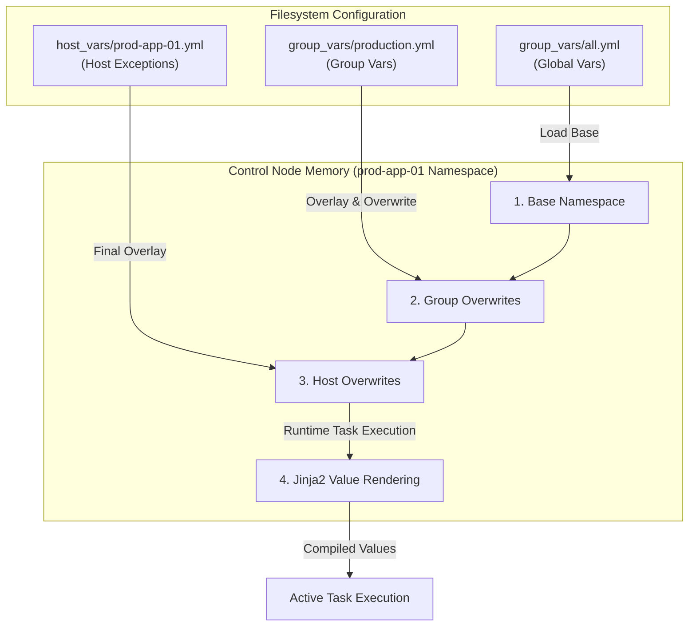

## Table of Contents

1. [Variable Scoping in Configuration Management](#variable-scoping-in-configuration-management)
2. [The Variable Structure Preview](#the-variable-structure-preview)
3. [Group Variables: Designing Practical Scopes](#group-variables-designing-practical-scopes)
4. [Host Variables: Handling Infrastructure Exceptions](#host-variables-handling-infrastructure-exceptions)
5. [Directory-Based Variables beside Inventory](#directory-based-variables-beside-inventory)
6. [Under the Hood: Variable Compilation and Memory Resolution](#under-the-hood-variable-compilation-and-memory-resolution)
7. [Auditing Merged Variables](#auditing-merged-variables)
8. [Putting It All Together](#putting-it-all-together)
9. [What's Next](#whats-next)

## Variable Scoping in Configuration Management

In system automation, variable scoping is the method of restricting the visibility and lifetime of a variable value to a specific logical boundary, such as a whole infrastructure fleet, a specific service tier, or a single physical server node. Instead of hardcoding concrete parameters—like IP addresses, service ports, domain names, and directory paths—directly inside your playbook files, you use variables to act as placeholders. You then declare the actual data values inside your host catalog, allowing the playbook to remain a highly reusable blueprint that behaves differently based on the target hosts.

To understand why a disciplined variable scoping strategy is essential, consider our scenario. You are managing a configuration playbook for a web application database cluster.

If you hardcode these parameters inside your playbooks:
- A single playbook file cannot deploy both staging and production environments, because the ports, usernames, and database names are different.
- A temporary change (such as draining traffic from a single server for maintenance) requires you to modify and commit the main application playbook, risking configuration errors across other healthy servers.
- Secrets (like database passwords and API tokens) will be committed in plaintext to your code repository, creating a major security vulnerability.
- Your playbooks will become cluttered with repetitive blocks of conditional checks, making them extremely difficult to read and troubleshoot.

Ansible solves this by splitting playbooks from variables. The playbook defines *how* the work is done, templates define *how* values are placed, and the inventory defines *what* values apply to which hosts. By scoping variables at the narrowest useful level, you keep your playbooks completely general, modular, and easy to maintain.

## The Variable Structure Preview

Here is an early, comment-free directory structure and variable configuration preview. It demonstrates how to separate shared group variables from unique host variables using structured YAML files placed beside your main inventory:

### File: `inventory/hosts.yml`
```yaml
all:
  children:
    staging:
      hosts:
        stage-app-01:
          ansible_host: 10.70.40.11
    production:
      hosts:
        prod-app-01:
          ansible_host: 10.70.50.11
        prod-app-02:
          ansible_host: 10.70.50.12
```

### File: `inventory/group_vars/production.yml`
```yaml
app_port: 9000
app_domain: app.example.com
ansible_user: admin
```

### File: `inventory/host_vars/prod-app-02.yml`
```yaml
drain_before_reload: true
```

## Group Variables: Designing Practical Scopes

Group variables are values that apply automatically to every host machine that belongs to a specific inventory group. They are the ideal choice for settings that are shared across an entire service tier, environment, or physical datacenter location.

For example, all servers inside your production database group will likely share:
- The database listening port number (such as `5432` for PostgreSQL).
- The path to the system log directory (such as `/var/log/postgres`).
- The remote administrator SSH username used by the control node to log in (such as `admin`).

By defining these values at the group level, you enforce consistency across your systems. You write the parameter once in your group variables block, and every host inside that group receives the same setting unless a narrower variable scope deliberately overrides it.

The main operational trap is choosing group names that are too broad. If you define a group variable named `port: 80` inside a broad parent group named `web`, you might accidentally overwrite custom ports on specialized web servers that belong to child groups. You must design group structures around clear, bounded service definitions (like `customer_db` or `internal_api`) to ensure variables only apply to the intended targets.

## Host Variables: Handling Infrastructure Exceptions

Host variables are values that apply to exactly one managed server node in your inventory. They are best reserved for unique infrastructure exceptions and physical parameters, not shared configuration values.

Typical examples of valid host variables include:
- **`ansible_host`**: The specific physical IP address or DNS domain used by the network socket to connect over SSH to that node.
- **`storage_disk_path`**: A custom mount path for a server node that has older hardware or different disk drives than the rest of the fleet.
- **`drain_before_reload`**: A temporary maintenance flag set to `true` on a single active canary node during a rolling upgrade.

You must avoid copying the same variable across multiple individual host files. If you find yourself writing `db_port: 5432` inside five separate host variable files, you are creating a drift hazard. If the database port shifts to `5433` in the future, you must update five separate files by hand. If you miss one, that server will drift. In this scenario, `db_port` is a shared group variable, not a host exception, and must be moved to the group scope immediately.

## Directory-Based Variables beside Inventory

While you can write variables inline inside your main inventory file, this practice quickly leads to massive, unreadable documents as your infrastructure scales. To keep your host maps clean and maintainable, Ansible automatically scans and imports variable files from two dedicated sibling directories placed beside your inventory: `group_vars/` and `host_vars/`.

The directory structure follows a strict naming convention:

```text
inventory/
├── hosts.yml              # The clean host catalog map (contains no vars)
├── group_vars/
│   ├── all.yml            # Variables applied to every host in the inventory
│   ├── staging.yml        # Variables applied only to hosts in group "staging"
│   └── production.yml     # Variables applied only to hosts in group "production"
└── host_vars/
    ├── prod-app-01.yml    # Variables applied only to host "prod-app-01"
    └── prod-app-02.yml    # Variables applied only to host "prod-app-02"
```

When you run a playbook, the Ansible execution engine automatically searches for these folders. If it targets a host named `prod-app-01` that belongs to the group `production`, it reads `group_vars/production.yml` and `host_vars/prod-app-01.yml`, merging their content in memory. This physical separation keeps your inventory files extremely clean, makes pull requests simple to review, and prevents a variable change on a single host from modifying unrelated group settings.

## Under the Hood: Variable Compilation and Memory Resolution

To appreciate the safety and flexibility of scoped variables, it helps to understand how the control plane parses, merges, and isolates namespaces in memory during execution.

Under the hood, when you trigger a playbook, Ansible compiles a custom, isolated memory namespace for each individual target host:

1. **Initialize Global Scope**: The engine reads the `all` group variables (from `group_vars/all.yml`), placing them at the bottom of the host's memory namespace.
2. **Merge Group Hierarchy**: It walks up the inventory group tree. It merges variables from parent groups first, and then overwrites them with values from more specific child groups (e.g., child group variables overwrite parent group variables). If a host belongs to multiple sibling groups at the same hierarchy level, Ansible also has deterministic merge rules, and `ansible_group_priority` can be used when you need to make that ordering explicit.
3. **Apply Host Variables**: It reads host-specific variables (from `host_vars/prod-app-01.yml` or inline values), overwriting any conflicting group-level variables.
4. **Jinja2 Value Rendering**: Ansible variables are often evaluated when a task or template needs them. If a variable contains a Jinja2 expression (`{{ app_port }}`), Ansible resolves it in the context of the current host and task.
5. **Per-Host Context**: Each host receives its own effective variable context. If a task running on `prod-app-01` registers a temporary runtime value, that registered result belongs to that host's task context rather than becoming a shared value for every other host.



This dynamic compilation ensures that every task receives a highly custom, validated, and safe variable state tailored precisely to that host's position in the infrastructure.

## Auditing Merged Variables

Because variables can be defined across multiple files and directories, tracking down exactly which value a server will receive can be confusing. To remove this uncertainty, you must audit the final, merged variables using the `ansible-inventory` command.

To view the complete, compiled variable dictionary for a specific host, run the query command with the host flag:

```bash
ansible-inventory -i inventory/hosts.yml --host prod-app-02
```

The tool parses the inventory and variable directories, resolves parent-child overrides, and outputs a merged JSON dictionary that shows the effective variables Ansible has discovered for that host:

```json
{
    "ansible_host": "10.70.50.12",
    "ansible_port": 22,
    "ansible_user": "admin",
    "app_domain": "app.example.com",
    "app_port": 9000,
    "drain_before_reload": true
}
```

This output is your single source of truth. If a configuration file is rendered with the wrong port, or a login task uses the wrong username, you inspect this merged JSON block before modifying any playbooks. It tells you instantly whether the issue is a file path typo, a scope leakage, or an incorrect variable overwrite.

## Putting It All Together

We started by looking at how hardcoding environments and parameters inside playbook files limits reusability, forces risky playbook modifications, and creates security issues.

Ansible solves these problems by providing a clear, structured variable scoping model:
- **Playbook Independence**: Playbooks define general tasks, templates organize variables, and inventories define host-specific data.
- **Group Scopes**: We use group variables to enforce consistency across entire service tiers, defining shared ports and users at the group level.
- **Host Scopes**: We restrict host variables to unique physical exceptions (like connection addresses or disk paths), avoiding duplicate values across files.
- **Directory Layouts**: We organize variable files into dedicated `group_vars/` and `host_vars/` sibling directories, keeping our host maps clean and easy to audit.
- **Memory Resolution**: Under the hood, the engine compiles isolated memory namespaces for each host, dynamically resolving variables at runtime via lazy Jinja2 evaluation.
- **Catalog Auditing**: We leverage `ansible-inventory --host` queries to inspect merged JSON states, verifying boundaries before execution.

Structuring your variables this way keeps your playbooks general, clean, and easier to audit.

## What's Next

Now that you have mastered inventory variable scopes and directory-based layouts, the next article will explore **Connection Targets and Privilege Escalation**. We will look at how Ansible establishes remote SSH connections, handles authentication parameters, and uses the sudo privilege escalation protocol (`become: true`) to execute administrative tasks safely.

---

**References**

- [Ansible Variables Documentation](https://docs.ansible.com/ansible/latest/playbook_guide/playbooks_variables.html) - Official reference for variables, scoping, and directory layout rules.
- [Organizing Host and Group Variables](https://docs.ansible.com/ansible/latest/inventory_guide/intro_inventory.html#organizing-host-and-group-variables) - Best practices for variable folder locations.
- [Jinja2 Template Designer Guide](https://jinja.palletsprojects.com/en/3.1.x/templates/) - Comprehensive documentation for the Jinja2 rendering engine used by Ansible.
- [Ansible Variable Precedence Hierarchy](https://docs.ansible.com/ansible/latest/playbook_guide/playbooks_variables.html#variable-precedence-where-should-i-put-a-variable) - Detailed guide to the ordering of variable overwrites.
