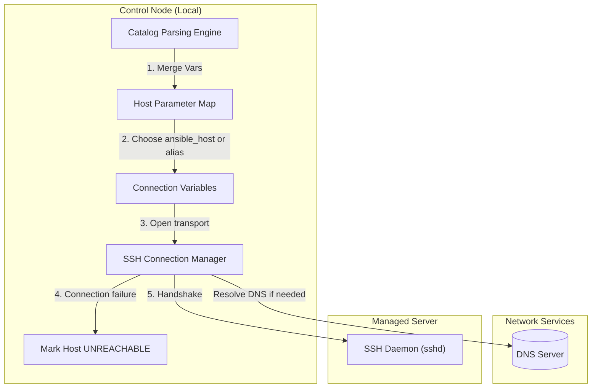

## Table of Contents

1. [The Infrastructure Host Catalog](#the-infrastructure-host-catalog)
2. [The Static Inventory Code Preview](#the-static-inventory-code-preview)
3. [INI vs. YAML Syntaxes: Structural Formats](#ini-vs-yaml-syntaxes-structural-formats)
4. [Hierarchical Groups: Mapping Tiers and Environments](#hierarchical-groups-mapping-tiers-and-environments)
5. [Dynamic Inventories: Live Service Discovery](#dynamic-inventories-live-service-discovery)
6. [Under the Hood: Catalog Parsing and DNS Resolution](#under-the-hood-catalog-parsing-and-dns-resolution)
7. [Auditing the Parsed Graph](#auditing-the-parsed-graph)
8. [Putting It All Together](#putting-it-all-together)
9. [What's Next](#whats-next)

## The Infrastructure Host Catalog

An Ansible inventory is a structured database file or dynamic script that acts as the official catalog of all host machines and network targets in your infrastructure. Before a playbook can perform system writes, package installations, or directory creations, Ansible must consult this host catalog to determine exactly which computers exist, how to reach them over the network, and how they are organized into logical service groups. The inventory acts as your automation boundary, ensuring that playbooks target only the intended environments and preventing configuration changes from spilling into the wrong servers.

To see why maintaining an accurate inventory is critical, consider our scenario. You are managing a multi-tier production cluster containing two web application servers and a backend database server.

If your host catalog is poorly designed or unmaintained, a playbook meant to run database optimizations might target your web servers instead, bringing down your user-facing sites, or a staging playbook might run against active production servers because the two environments share a single messy host file. Without clean host aliases, recap logs display raw IP addresses that leave you unable to verify which physical nodes were actually updated.

Ansible solves this by separating human-friendly host aliases from physical connection parameters. The catalog acts as your first safety boundary, allowing you to define distinct environments (like staging and production) in isolated files, group servers by their operational roles, and query the entire network layout safely before executing changes.

## The Static Inventory Code Preview

Here is an early, comment-free YAML static inventory preview that maps our multi-tier production cluster. This catalog separates our friendly server aliases from their network paths and organizes them into logical sub-groups:

```yaml
all:
  children:
    production:
      children:
        webservers:
          hosts:
            web-node-01:
              ansible_host: 10.60.30.21
            web-node-02:
              ansible_host: 10.60.30.22
        databases:
          hosts:
            db-node-01:
              ansible_host: 10.60.30.51
      vars:
        ansible_port: 22
        ansible_user: admin
```

## INI vs. YAML Syntaxes: Structural Formats

When you write static inventory files, Ansible supports two primary text-based syntaxes: **INI** and **YAML**. Both formats define the same underlying host map, but they organize parameters and groups differently.

### 1. The INI Format
The INI format is a legacy, line-oriented text format. It uses square brackets to declare host groups, and lists hosts and variables as compact, single-line string definitions:

```ini
[webservers]
web-node-01 ansible_host=10.60.30.21
web-node-02 ansible_host=10.60.30.22

[databases]
db-node-01 ansible_host=10.60.30.51
```

The major benefit of the INI syntax is that it is highly compact and quick to read. However, as your infrastructure variables grow (such as adding key files, SSH arguments, and custom ports), INI lines can become extremely long and difficult to read, leading to parsing errors.

### 2. The YAML Format
The YAML format is the modern standard for Ansible configurations. It represents your host catalog as a deeply nested, key-value data structure:

```yaml
all:
  children:
    webservers:
      hosts:
        web-node-01:
          ansible_host: 10.60.30.21
```

YAML's structured indentation makes nested parent-child group hierarchies highly visible. It forces you to write parameters on separate lines, which is significantly easier to review in pull requests and git histories. The primary caveat is that a single incorrect space or indentation level can place a host under the wrong group or variable block, requiring strict syntax validation.

## Hierarchical Groups: Mapping Tiers and Environments

One of the most powerful features of an Ansible inventory is **hierarchical grouping**. A group is simply a named collection of hosts. Instead of targeting individual machines by name, you target groups that represent specific operational roles, tiers, or environments.

You design groups using a parent-child structure. In our cluster scenario, we have a parent group named `production` that contains two child groups: `webservers` and `databases`.

Group variables cascade automatically from parent groups to every child host they contain. Declaring a variable once on the `production` group pushes it to every web server, database node, and cache instance in that environment without repeating it in each host entry. Nested group hierarchies also let you run a playbook against a specific sub-tier, such as only the `webservers` group, without touching any other part of the production fleet. Service boundary groups enforce a clean operational contract: broad, generic group names like `web` should be avoided entirely. If multiple teams share a network, a generic `web` group might target unrelated services, so you use highly descriptive names like `customer_portal_web` or `billing_api` to ensure that service blast radiuses are clear.

## Dynamic Inventories: Live Service Discovery

While static files are excellent for small or stable networks, they fail in modern cloud environments where virtual machines are continuously created, destroyed, or autoscaled. If your fleet changes daily, manually updating static files is impossible and leads to stale records.

Ansible solves this using **Dynamic Inventories**. A dynamic inventory is usually an inventory plugin, and older script-based inventories are also supported. Instead of reading a fixed host list from disk, the inventory source asks another system, such as AWS EC2, GCP Compute, Kubernetes, or NetBox, for the current host catalog and turns that response into Ansible groups and variables.

When Ansible calls a dynamic inventory plugin, it initiates a secure API call to the target platform (EC2, GCE, Azure, or a CMDB) and retrieves a snapshot of active resources with their addresses, tags, and metadata. The plugin filters those resources based on rules you configured, such as selecting only instances tagged `Env=production`, then maps them into Ansible host names, groups, and variable blocks held in memory. If inventory caching is enabled, Ansible stores that result for the duration of the run, reducing repeated API calls. If the platform tags a resource with `env=staging`, the plugin surfaces that as a group membership, letting you target `staging` in your playbook without editing any static file.

This dynamic mapping means autoscaled hosts can appear and disappear through the source system instead of requiring constant manual edits to a static host file.

## Under the Hood: Catalog Parsing and Connection Setup

To fully appreciate the safety of host mappings, it helps to separate inventory parsing from the later network connection. Inventory tells Ansible what each host is called and what connection variables it should use. The connection plugin then tries to open the actual transport to that address.

When you launch `ansible-playbook`, the engine parses the inventory target through several sequential execution gates:

1. **Catalog Parsing**: The engine loads inventory files or inventory plugins, building a unified host database in memory.
2. **Variable Merging**: It resolves all group and host variable trees, applying precedence rules to create a final parameter dictionary for each host.
3. **Connection Variable Selection**: For each targeted host, Ansible decides which value should be used as the network destination. If `ansible_host` is set, the SSH connection normally uses that value; otherwise it uses the inventory host name.
4. **Transport Attempt**: The selected connection plugin, usually SSH for Linux hosts, asks the operating system to resolve DNS names and open a socket. DNS, routing, authentication, or host-key problems appear as connection failures, often reported as `UNREACHABLE`.
5. **Host Key Check**: For SSH connections, the local SSH client compares the server's host key with the user's known-hosts policy. This verifies that the server key is trusted; it does not prove that the inventory data itself was correct.



This split gives you two useful checkpoints: audit the parsed inventory before a run, then let the connection layer fail loudly if DNS, routing, authentication, or host-key trust does not match reality.

## Auditing the Parsed Graph

Because inventory parsing involves merging multiple files, variables, and potential dynamic scripts, the loaded catalog can occasionally surprise you. You must audit your parsed inventory structure using the `ansible-inventory` utility before running playbooks.

You query the structural tree using the `--graph` flag:

```bash
ansible-inventory -i inventory/production.yml --graph
```

For our hierarchical cluster scenario, the command prints the clean, parsed relationships:

```plain
@all:
  |--@ungrouped:
  |--@production:
  |  |--@webservers:
  |  |  |--web-node-01
  |  |  |--web-node-02
  |  |--@databases:
  |  |  |--db-node-01
```

If you see a staging host listed inside the `@production` branch, you know your syntax or file boundaries are broken.

To inspect the exact, merged connection details for an individual server, you query the specific host key:

```bash
ansible-inventory -i inventory/production.yml --host web-node-01
```

This outputs the complete, structured JSON dictionary:

```json
{
    "ansible_host": "10.60.30.21",
    "ansible_port": 22,
    "ansible_user": "admin"
}
```

This view allows you to audit the active network target and user parameters in isolation, ensuring that no stale variables are leaking into your execution.

## Putting It All Together

We started by looking at how an inaccurate or poorly maintained host catalog can lead to disastrous target errors across your production databases and web servers.

Ansible answers this by separating host records into a disciplined, multi-layered inventory structure:
- **Syntax Formats**: We use static INI or YAML files, preferring YAML's nested key-value definitions to maintain clear, readable structures.
- **Hierarchical Groups**: We design parent-child trees (like `production` containing `webservers`) to ensure scope inheritance and granular playbook targeting.
- **Dynamic Inventories**: We utilize secure cloud plugins that query live metadata and output JSON schemas, automating scaling environments.
- **Under-the-Hood Resolution**: The control engine processes host catalog records in memory, making socket `getaddrinfo()` calls to verify target IPs and executing strict host key audits before connecting.
- **Graph Diagnostics**: We leverage `ansible-inventory` tools to graph and audit merged host catalogs, validating boundaries before active playbooks run.

Following these practices ensures that your host catalog is a stable, secure map of your entire infrastructure.

## What's Next

Now that you understand the structure of inventories, static and dynamic catalogs, and the mechanics of host-to-address mapping, the next article will explore **Groups and Host Variables**. We will look at how to organize variables into dedicated files, separate configuration values by operational groups, and avoid hardcoding environment settings in playbooks.

---

**References**

- [Ansible Inventory Guide](https://docs.ansible.com/ansible/latest/inventory_guide/intro_inventory.html) - Official reference for static host catalogs and variable parameters.
- [Working with Dynamic Inventories](https://docs.ansible.com/ansible/latest/inventory_guide/intro_dynamic_inventory.html) - Documentation on cloud inventory plugins and structured JSON schemas.
- [POSIX System Interfaces - getaddrinfo()](https://pubs.opengroup.org/onlinepubs/9699919799/functions/getaddrinfo.html) - The IEEE POSIX standard defining socket-level DNS address resolution.
- [Ansible Inventory Command Line Utility](https://docs.ansible.com/ansible/latest/cli/ansible-inventory.html) - Reference manual for graphing and auditing loaded inventories.
