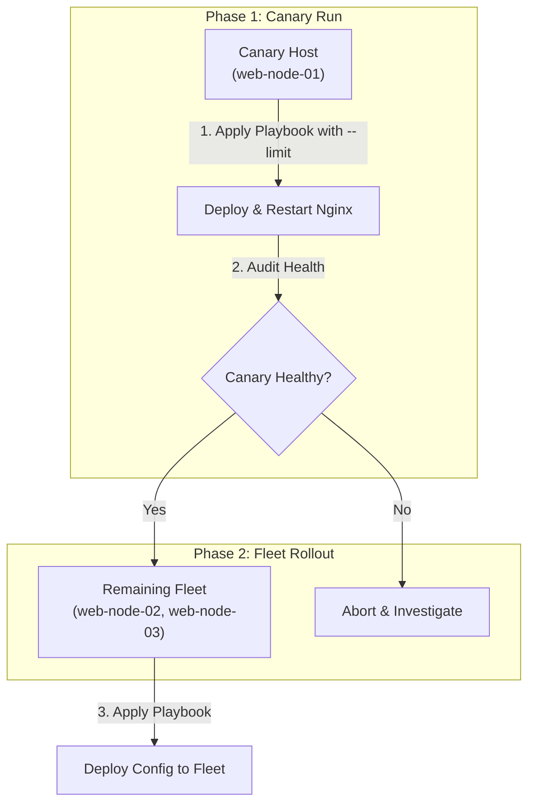

## Table of Contents

1. [The Security Boundary of Target Selection](#the-security-boundary-of-target-selection)
2. [The Targeting Pattern Preview](#the-targeting-pattern-preview)
3. [Host Patterns: Matching Rules and Logic](#host-patterns-matching-rules-and-logic)
4. [The Limit Flag: Restricting Execution Scopes](#the-limit-flag-restricting-execution-scopes)
5. [Pre-Flight Validation: Listing Matched Targets](#pre-flight-validation-listing-matched-targets)
6. [Canary Rollouts: Confining the Blast Radius](#canary-rollouts-confining-the-blast-radius)
7. [Under the Hood: Host Slice Queue Slicing](#under-the-hood-host-slice-queue-slicing)
8. [Putting It All Together](#putting-it-all-together)
9. [What's Next](#whats-next)

## The Security Boundary of Target Selection

A host pattern is Ansible's target-selection expression for choosing a subset of inventory hosts before tasks run.

Target selection in Ansible is the operational practice of using precise logical rules, filters, and command-line execution limits to restrict the scope of a playbook run to a highly specific subset of servers. Even if your playbook contains perfectly designed, state-aware tasks, executing them against the wrong machines can trigger widespread system disruptions. By defining strict targeting boundaries at both the playbook level and the execution command level, you minimize the blast radius of new deployments and prevent a minor upgrade from affecting your entire infrastructure fleet at once.

To see why a disciplined targeting strategy is essential, consider our scenario. You are deploying a critical security hotfix that must only apply to Nginx web hosts in your production environment, specifically targeting those located in a particular network zone, while staging and database servers must remain completely untouched.

Without precise targeting controls, a loose `hosts: all` pattern or a command-line typo can send production database servers the same tasks intended only for Nginx web hosts, crashing unrelated services and turning a focused security hotfix into a fleet-wide outage. A rolling upgrade with no batch controls reboots every application server at once, dropping all user traffic in a single sweep instead of taking nodes offline one at a time.

Ansible solves this by using robust target matching rules. The playbook’s `hosts` parameter defines the primary group scope, the `--limit` CLI flag restricts active runs on demand, and pre-flight validation tools let you graph the resolved host list safely before sending a single network handshake.

## The Targeting Pattern Preview

Here is an early, comment-free preview demonstrating how to configure precise host targeting patterns inside a playbook and restrict active runs using CLI flags at execution time:

### File: `playbooks/deploy_hotfix.yml`
```yaml
- name: Apply Nginx security hotfix to production webservers
  hosts: production:&webservers
  become: true
  tasks:
    - name: Ensure latest security package is present
      ansible.builtin.apt:
        name: nginx-common
        state: latest
```

### Execution Command
```bash
ansible-playbook -i inventory/hosts.yml playbooks/deploy_hotfix.yml \
  --limit "web-node-01" \
  --list-hosts
```

## Host Patterns: Matching Rules and Logic

Host pattern logic is the small expression language Ansible uses to combine, intersect, or subtract inventory groups. It lets you choose the target set before any task runs.

Example: `production:&webservers` means "only hosts that are both production and web servers," while `webservers:!staging` means "web servers except staging." When you write the `hosts` line inside a playbook or execute ad-hoc commands, Ansible parses this string against the inventory host names and groups.

The four primary pattern matching rules are:

The colon operator combines two groups into a single target union. The pattern `webservers:databases` selects all hosts that belong to either the `webservers` group or the `databases` group, merging their scopes into one list. The ampersand symbol restricts the run to hosts that appear in both groups simultaneously. The pattern `production:&webservers` selects only hosts that belong to both the `production` group and the `webservers` group, excluding any web server that sits outside production entirely. The exclamation operator removes specific hosts or groups from the selection. The pattern `webservers:!staging` starts with every host in `webservers` and then subtracts those that are also members of the `staging` group. Wildcards match any host whose name fits the shell-style glob pattern. The pattern `web-node-*` selects any inventory entry whose name begins with that prefix, regardless of which group that host belongs to.

While these logical patterns are extremely powerful, you must avoid writing overly complex or clever strings. If an intersection pattern requires multiple operators and is difficult to read out loud, it is a safety hazard. You must instead create a structured, named child group in your inventory file. A clean, descriptive group name like `production_web` is significantly safer to review in code pull requests.

One important beginner trap is the difference between an inventory host name and its connection address. If your inventory defines `web-node-01 ansible_host=10.60.30.21`, patterns match `web-node-01` and its groups. They do not match the raw IP address unless that IP address is also the inventory host name.

## The Limit Flag: Restricting Execution Scopes

The `--limit` (or `-l`) command-line argument is a high-level safety guard that instructs Ansible to restrict the playbook run to a specific subset of hosts for the current execution.

It is critical to understand the relationship between a playbook's `hosts` pattern and the `--limit` flag.

The flag performs a reductive operation only. It can narrow the host list that the playbook already compiled, but it cannot introduce hosts that fall outside the playbook's scope. If a playbook declares `hosts: webservers` and you run it with `--limit db-node-01`, the run executes zero tasks because `db-node-01` is not a member of the `webservers` group. A playbook designed with `hosts: all` under the assumption that operators will always remember to pass a limit flag is fragile by default. If a developer runs the playbook without the flag, the tasks execute across the entire infrastructure fleet and the blast radius, which is the total number of machines affected by a failure, becomes the entire estate.

The playbook should always start as narrow as possible, targeting the specific service tier group, and the `--limit` flag should only be used as a secondary, active guard to restrict runs further for testing, debugging, or canary deployments.

## Pre-Flight Validation: Listing Matched Targets

Pre-flight validation means checking the resolved host list before Ansible opens network connections or runs modules. It is the safest way to catch a bad pattern while the run is still just local parsing.

Example: before applying a hotfix, `--list-hosts` should show only `web-node-01` and `web-node-02`, not `db-node-01`. Because merging parent-child groups, logical pattern intersections, and CLI limit flags can produce unexpected host lists, you must audit the target list before executing any tasks.

You do this using the `--list-hosts` flag. This command instructs the control node to parse the inventory, resolve all patterns and limits, and output the final, matched host list:

```bash
ansible-playbook -i inventory/hosts.yml playbooks/deploy_hotfix.yml \
  --limit "production:&webservers" \
  --list-hosts
```

The terminal prints a clean, parsed list of target nodes:

```plain
  play #1 (production:&webservers): Apply Nginx security hotfix to production webservers
    hosts (2):
      web-node-01
      web-node-02
```

This pre-flight check is safe because it operates on the inventory and play definition from the control node. It does not open SSH connections, transfer module payloads, or modify any server settings. Running `--list-hosts` first is your primary verification gate, ensuring that the target count matches your expectations before you execute changes.

## Canary Rollouts: Confining the Blast Radius

A canary rollout is the practice of deploying configuration changes to a single, isolated host node (the canary) to verify that the updates are completely healthy before rolling them out to the remaining hosts in the fleet.



When you perform a canary rollout:
1. **Canary Execution**: You run the playbook targeting only the first node using a strict limit:
   ```bash
   ansible-playbook -i inventory/hosts.yml playbooks/deploy.yml --limit web-node-01
   ```
2. **Health Audit**: You perform active system checks on the canary host: verifying that Nginx binds to the correct port, auditing log directories for runtime exceptions, and testing health check endpoints.
3. **Blast Radius Control**: If the configuration is invalid (for example, if a port typo triggers an Nginx service crash), only the canary host is affected. The remaining servers continue to run healthy configurations, keeping your application online.
4. **Fleet Execution**: Once you have verified the canary is stable, you safely run the playbook against the entire group without the limit flag, deploying the change fleet-wide.

## Under the Hood: Host Slice Queue Slicing

Queue slicing means breaking the selected host list into smaller batches and finishing the play on one batch before moving to the next. Ansible uses the `serial` parameter for this rollout control.

Example: if `webservers` contains 20 hosts and `serial: 2` is set, Ansible updates two hosts at a time instead of sending the same change to all 20 hosts at once. For large infrastructure groups where a single canary is not enough, this controls the rollout pace.

Under the hood, when you set `serial` (which accepts counts, percentage strings, or a list of batch sizes), the control plane changes its task execution queue loop:

1. **Slice the Target List**: Instead of running task 1 across all 100 hosts in the play before moving to task 2, Ansible slices the in-memory target array into sequential batches (for example, `serial: 2` creates batches of two hosts).
2. **Execute the Entire Play**: The control node runs the *entire* playbook task list (tasks 1, 2, and 3, including handlers and reloads when they are notified and flushed) on the first batch of hosts, sending module payloads through their open connection channels.
3. **Evaluate Batch Success**: Once the play finishes for the first batch, the engine evaluates the results in memory.
4. **Dynamic Run Abort**: If a task fails on a host, the engine checks the `max_fail_percentage` parameter. If the failure rate exceeds this limit, Ansible stops the play before moving deeper into the remaining rollout.

```yaml
- name: Apply rolling upgrades to application hosts
  hosts: webservers
  serial: 2
  max_fail_percentage: 10
  tasks:
    - name: Update configuration
      ansible.builtin.template:
        src: config.j2
        dest: /etc/app.conf
```

This queue slicing means a broken upgrade can be stopped after a small batch, preventing a bad configuration from propagating across your entire network when your failure thresholds are set carefully.

## Putting It All Together

We started by looking at how loose or poorly defined targeting patterns can lead to accidental fleet-wide outages during critical service upgrades.

Ansible solves these problems by providing a strict, multi-layered target selection engine:
- **Logical Patterns**: We use boolean logic (unions, intersections, and exclusions) to build highly specific targeting rules like `production:&webservers`.
- **Reductive Limits**: We utilize `--limit` command-line flags as an active execution guard to restrict runs to specific canary hosts, minimizing the blast radius.
- **Pre-Flight Checks**: We run `--list-hosts` to audit resolved target nodes in memory before initiating network handshakes.
- **Canary Rollouts**: We deploy configurations to a single canary node first, auditing health parameters before rolling updates out fleet-wide.
- **Under-the-Hood Slicing**: We configure `serial` batch slicing and `max_fail_percentage` abort boundaries to manage rollout pace and protect remaining healthy hosts.

Following these practices ensures that your configuration changes propagate safely, predictably, and securely across your network.

## What's Next

Now that you master target selection, host patterns, and rolling execution queues, the next submodule will move into **Values and Facts**. We will start by exploring **Variables**, looking at how Ansible compiles and interpolates values dynamically using the Jinja2 template engine.

---

**References**

- [Targeting Hosts and Groups: Patterns](https://docs.ansible.com/ansible/latest/inventory_guide/intro_patterns.html) - Official guide to union, intersection, and exclusion matching rules.
- [Controlling Playbook Execution: Strategies and Batches](https://docs.ansible.com/ansible/latest/playbook_guide/playbooks_strategies.html) - Documentation for serial and max_fail_percentage configurations.
- [Ansible Playbook Command Line Reference](https://docs.ansible.com/ansible/latest/cli/ansible-playbook.html) - Reference manual for limit, list-hosts, and ad-hoc flags.
- [Rolling Updates with Ansible](https://docs.ansible.com/ansible/latest/scenario_guides/guide_rolling_upgrade.html) - Best practices for deploying rolling application upgrades.
