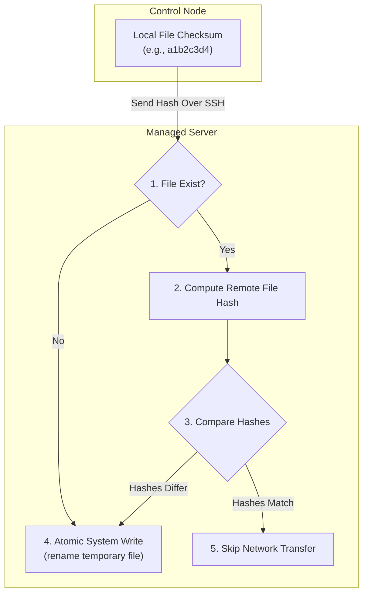

## Table of Contents

1. [The Principle of Idempotency](#the-principle-of-idempotency)
2. [The Target State Code Preview](#the-target-state-code-preview)
3. [How Modules Reconcile State Under the Hood](#how-modules-reconcile-state-under-the-hood)
4. [Evaluating the Second Run Settle](#evaluating-the-second-run-settle)
5. [Handlers: Binding Restarts to True Changes](#handlers-binding-restarts-to-true-changes)
6. [Idempotency with Shell and Command Modules](#idempotency-with-shell-and-command-modules)
7. [Putting It All Together](#putting-it-all-together)
8. [What's Next](#whats-next)

## The Principle of Idempotency

Idempotency is the property that rerunning the same task leaves an already-correct host unchanged.

Idempotency is the core safety property of a modern configuration management system. An operation is defined as idempotent when executing it multiple times produces the exact same final system state as running it once, without creating duplicate side effects or accumulating unnecessary changes. In Ansible, this means that when a playbook runs against a target server, the tasks should modify the host only if it has drifted from your written goals, and then report a quiet status of no changes on all subsequent runs.

To understand why idempotency is a vital operational safeguard, consider our scenario. You are managing the log storage directories, user security settings, and runtime configuration parameters on a fleet of three server machines.

If your automation scripts are not idempotent, running the same setup script a second time might append a duplicate user definition line to `/etc/passwd`, corrupting the login database, or fail outright because the log directory already exists, which blocks the rest of the script from executing. Worse, the web server service gets restarted on every single run regardless of whether any configuration changed, dropping active socket connections and causing unnecessary downtime for your users.

An idempotent playbook changes this behavior completely. Instead of treating tasks as a sequence of aggressive command actions, you describe the target state you want the machines to settle into. The playbook can then be executed continuously (every day, or even every hour) to audit your servers. If a server is perfectly configured, the run executes instantly with zero modifications, keeping your environments completely stable.

## The Target State Code Preview

Here is an early, comment-free YAML preview of an idempotent playbook. This script describes the log directories, user accounts, and configuration states we require, designed to run safely repeatedly without causing drift:

```yaml
- name: Audit log environment and configuration
  hosts: loghosts
  become: true
  tasks:
    - name: Ensure system log utility is installed
      ansible.builtin.apt:
        name: rsyslog
        state: present

    - name: Settle application log directory properties
      ansible.builtin.file:
        path: /var/log/app_storage
        state: directory
        owner: syslog
        group: adm
        mode: "0755"

    - name: Maintain application configuration file
      ansible.builtin.copy:
        content: "log_format = json"
        dest: /etc/app_log.conf
        owner: root
        group: root
        mode: "0644"
```

## How Modules Reconcile State Under the Hood

State reconciliation means comparing the host's current state with the state written in your task, then changing only the parts that differ. This is the practical mechanism behind idempotency.

Example: if your task says `/var/log/app_storage` should exist with mode `0755`, the file module checks the current path first. It creates or fixes the directory only when the existing host state does not match that target. Because Ansible is agentless and executes tasks using temporary module payloads over SSH, each module must carry this read-before-write logic with it.

Here is the low-level systems depth of how different Ansible modules reconcile state under the hood:

### 1. The File Module and Inode Metadata
Inode metadata is the filesystem record that describes a file or directory, including its type, owner, group, and permission bits. The file module reads this metadata so it can decide whether a path already matches your task.

When you call the `ansible.builtin.file` module to manage a directory path, the temporary Python script executes the low-level `stat()` system call on the target path. The kernel returns a status structure containing the inode metadata: file type, owner user ID (UID), group ID (GID), and permission bitmask. The module compares each of these numeric values against the arguments in your playbook task. If the path is missing entirely, the module issues a `mkdir()` system call to create it and reports `changed`. If the path exists but the permission bits differ, for example, the directory is `0777` while the playbook requires `0755`, the module corrects the attributes through `chmod()` and `chown()` system calls and reports `changed`. If every field already matches, the module returns `ok` and exits without touching the disk.

### 2. The Copy Module and Content Checksums
A checksum is a short fingerprint calculated from file content. If two files produce the same checksum, Ansible can treat their contents as matching without comparing every line by hand.

When you use `ansible.builtin.copy` to write configuration content to a host, the control node first compiles the final text block and calculates a checksum before transferring anything. The remote Python script then executes a `stat()` call on the destination path to confirm the file exists. If it does, the script reads the existing file and calculates its own checksum. The module compares both strings in memory: when they match, the content is already correct and the module skips the transfer entirely, reporting `ok`. When they differ, the module writes the new content to a temporary file on the managed host, recalculates the checksum of that temporary file to verify integrity, and then issues an atomic `rename()` system call to swap it into place. The atomic rename prevents partial writes from leaving a corrupted configuration file on disk if the network drops mid-transfer.

### 3. The Package Module and System Catalogs
A package catalog is the operating system's local record of installed software and available package versions. Package modules read that catalog before installing anything, so they do not repeatedly reinstall software that is already present.

When you manage packages using `ansible.builtin.apt`, the remote module queries local package directories and system catalogs by running internal searches equivalent to `dpkg-query -W` on Debian-based hosts. It parses the output to read the installation status and installed version string for the requested package. If the status shows the package is absent, the module invokes the package manager API to download and install it, then reports `changed`. If the status is already correct and the version satisfies the playbook constraint, the module reports `ok` and exits without invoking the package manager at all.



This structural verification ensures that your playbooks act as a strict state validator, modifying only the exact operating system parameters that have drifted.

## Evaluating the Second Run Settle

One of the clearest ways to verify that your playbooks are designed correctly is to execute a second run against the same server immediately after a successful initial run.

When you run a playbook against a freshly provisioned host, the first execution may apply many modifications:

```plain
PLAY RECAP
server-01 : ok=12 changed=6 unreachable=0 failed=0 skipped=0
```

This output is completely healthy. A fresh server requires configuration files to be written, packages to be installed, and directories to be created.

However, when you run the exact same playbook command immediately afterward, the second execution should be completely quiet:

```plain
PLAY RECAP
server-01 : ok=18 changed=0 unreachable=0 failed=0 skipped=0
```

This quiet recap is the definition of a settled host. It proves that the playbook inspected all eighteen states, confirmed they were already correct, and took zero active modifications.

If your second run continues to report changes, you have a configuration bug. A non-zero changed count on a settled host indicates that one or more tasks are executing blindly on every run. You must isolate and fix these tasks, because false changes generate constant operational noise and make it impossible to recognize real configuration errors.

## Handlers: Binding Restarts to True Changes

Configuration file changes are almost always paired with service restarts. For example, if you update the configuration parameters in an application file, the application background service must be reloaded to read the new settings.

If you restart the service on every single run, you introduce constant service drops. Ansible solves this using **Handlers**.

A handler is a special type of task that is defined in a separate block at the end of your play. It behaves exactly like a normal task, but it only executes when it is explicitly notified by another task that reports a status of `changed`.

```yaml
tasks:
  - name: Maintain application configuration file
    ansible.builtin.copy:
      content: "log_format = json"
      dest: /etc/app_log.conf
    notify: Restart app service

handlers:
  - name: Restart app service
    ansible.builtin.service:
      name: app_service
      state: restarted
```

The execution flow of a handler is highly structured. If the configuration file already matches the desired content, the copy task reports `ok`, the handler receives no notification, and the application service continues running without interruption. If the file differs, the copy task writes the new content, reports `changed`, and queues a notification for the handler named `Restart app service`. Ansible does not invoke the handler immediately at that point. It completes all remaining tasks in the play first, then executes each notified handler once at the next flush point. If three separate configuration files are updated and all three notify the same restart handler, Ansible restarts the service a single time at that flush, avoiding multiple sequential service reboots.

If a later task fails before handlers run, Ansible may skip the queued handler on that failed host unless you explicitly use handler failure controls such as `force_handlers`. That nuance matters when a changed configuration file must be followed by a reload to keep the running service aligned with the file on disk.

This deferral mechanic makes change reporting highly critical. If a task falsely reports `changed` on every run, it will trigger your handlers and restart your services continuously. Truthful change reporting is the foundation of rolling deployments.

## Idempotency with Shell and Command Modules

While Ansible's built-in modules are designed to be idempotent out of the box, you will occasionally encounter scenarios where you must run raw commands using the `ansible.builtin.command` or `ansible.builtin.shell` modules.

These modules execute the command you provide, but they do it differently. `ansible.builtin.command` runs a program directly without shell features such as pipes, redirects, or variable expansion. `ansible.builtin.shell` runs through a remote shell when you truly need those shell features. In both cases, Ansible cannot automatically know what system state the command modifies under the hood, so these tasks commonly report `changed` unless you add explicit guards.

To make command and shell tasks safe and idempotent, you must use Ansible's built-in execution guards:

### 1. The `creates` Guard
If your command's primary purpose is to generate a specific file, you pass the `creates` argument containing the target file path. Ansible will skip the task entirely if the file already exists:

```yaml
- name: Initialize application search database
  ansible.builtin.command:
    cmd: /opt/app/bin/init-db
    creates: /var/lib/app/database.db
```

### 2. The `removes` Guard
Conversely, if your command is designed to clean up or delete a file, you pass the `removes` argument. The task will only execute if the file is still present on the system:

```yaml
- name: Clean up temporary installer package
  ansible.builtin.command:
    cmd: rm /tmp/installer.sh
    removes: /tmp/installer.sh
```

### 3. The `changed_when` Override
If your command performs a read-only check (such as verifying a port status or pulling a health check endpoint), it never modifies the system. You instruct Ansible to ignore the change status by setting `changed_when: false`:

```yaml
- name: Check database cluster connection status
  ansible.builtin.command: pg_isready -h localhost -p 5432
  register: db_status
  changed_when: false
```

This override prevents a successful read-only command from reporting `changed`, allowing you to run health checks inside playbooks without triggering downstream handlers. It does not change failure semantics: if the command exits with a non-zero return code, the task can still fail unless you also define the intended failure behavior with `failed_when`.

## Putting It All Together

We started by looking at how a non-idempotent automation script can corrupt system files, fail on existing directories, and cause service drops across your log host fleet.

Ansible solves these issues by placing the concept of idempotency at the center of its execution model:
- **Declarative Modules**: Tasks describe desired final states, and built-in modules use low-level calls like `stat()` and checksum comparisons to verify if changes are actually required.
- **The Second Run Settle**: A healthy playbook should report exactly zero changes on a second run, proving that your host environments are stable.
- **Handler Orchestration**: Restarts are bound to actual task changes, queueing notifications so each notified handler runs once at the next handler flush point.
- **Command Guards**: Raw shell executions are made safe and repeatable using `creates`, `removes`, and `changed_when: false` overrides.

By building your playbooks around these idempotent behaviors, you transform your automation from a fragile list of instructions into a resilient, continuous auditing utility.

## What's Next

Now that you understand the mechanics of idempotency and how modules reconcile host states, the next article will explore how to read and analyze run results. We will break down the specific return codes, stderr captures, and recap blocks that Ansible outputs, showing you how to diagnose connection failures and task errors.

---

**References**

- [Ansible Playbooks: Desired State and Idempotency](https://docs.ansible.com/ansible/latest/playbook_guide/playbooks_intro.html#desired-state-and-idempotency) - Core guide to declarative system management.
- [Ansible Handlers Documentation](https://docs.ansible.com/ansible/latest/playbook_guide/playbooks_handlers.html) - Official reference for change-triggered notifications and deferred execution.
- [Open Group POSIX system interfaces - stat()](https://pubs.opengroup.org/onlinepubs/9699919799/functions/stat.html) - The POSIX standard interface used by file modules to inspect inode metadata.
- [Ansible Command Module Parameters](https://docs.ansible.com/ansible/latest/collections/ansible/builtin/command_module.html) - Reference guide for using creates, removes, and execution overrides.
