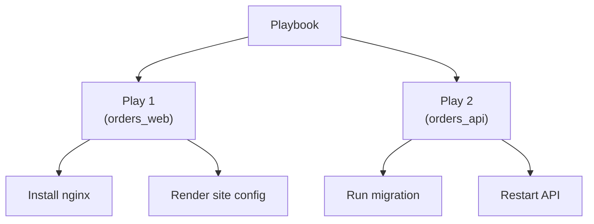

## Table of Contents

1. [What a Playbook Does](#what-a-playbook-does)
2. [Plays](#plays)
3. [Tasks](#tasks)
4. [Order Across Hosts](#order-across-hosts)
5. [Connection and Privilege Choices](#connection-and-privilege-choices)
6. [A Small Orders Playbook](#a-small-orders-playbook)
7. [Common Surprises](#common-surprises)
8. [Putting It All Together](#putting-it-all-together)
9. [What's Next](#whats-next)

## What a Playbook Does

Ansible starts with an inventory. The inventory names the machines Ansible can manage and usually groups them by job: web hosts, API hosts, database hosts, or staging hosts. A playbook is the file that says what should happen to those machines.

For an `orders` service, the inventory might contain two web hosts named `orders-web-01` and `orders-web-02`. A playbook can say that every host in the `orders_web` group should have Nginx installed, should receive the orders site configuration, and should keep the Nginx service running.

A playbook is written in YAML. It is usually committed to source control because it becomes shared operational knowledge. Someone can read it before a change, review it in a pull request, run it against staging, and then run the same intent against production.

The important idea is mapping. A playbook maps a group of hosts to ordered work. It does not describe one single machine only, and it does not behave like a loose shell history. It gives Ansible a structured list of plays, and each play gives Ansible a structured list of tasks.

## Plays

A play is one top-level item inside a playbook. It chooses the hosts for a phase of work and sets play-level behavior for those hosts.

For the orders service, one play might target web hosts:

```yaml
- name: Configure orders web hosts
  hosts: orders_web
  become: true
```

The `hosts` line selects a host pattern or inventory group. Here it selects every host in `orders_web`. The `become` line says tasks in the play may use privilege escalation, such as `sudo`, because package installs and service changes usually need elevated permissions.

A playbook can contain more than one play. This matters when the work naturally moves across different host groups. A deployment could configure web hosts first, run a database migration on one API host, and then reload the web hosts. Each of those phases can be a separate play with its own host target.



Keep plays focused. If one play targets too many unrelated host types, every task needs conditions to avoid running in the wrong place. Separate plays make the target clear before the reader reaches the task list.

## Tasks

A task is one ordered step inside a play. Each task normally calls one Ansible module. The module is the code Ansible uses to inspect or change something on the managed host.

This task asks the `apt` module to make sure Nginx is installed:

```yaml
tasks:
  - name: Install nginx
    ansible.builtin.apt:
      name: nginx
      state: present
```

The task has two audiences. The `name` is for people reading output during a run. The module and arguments are for Ansible. A good task name says what final state the task manages: `Install nginx`, `Render orders site config`, or `Keep nginx running`.

Task names become important when a run fails. Output usually shows the task name before the result. A task named `Run command` forces the operator to open the playbook to learn what happened. A task named `Validate orders nginx config` gives useful context immediately.

## Order Across Hosts

Tasks run in order within a play. If the play installs a package, renders a config file, and starts a service, Ansible does that in the order written.

The default host behavior is the part that surprises many new users. Ansible usually runs the first task across all targeted hosts before moving to the second task. It does not normally finish the whole play on `orders-web-01` and then start from the top on `orders-web-02`.

For two orders web hosts, the default shape looks like this:

| Step | Host | Task |
|------|------|------|
| 1 | `orders-web-01` | Install nginx |
| 2 | `orders-web-02` | Install nginx |
| 3 | `orders-web-01` | Render orders site config |
| 4 | `orders-web-02` | Render orders site config |
| 5 | `orders-web-01` | Keep nginx running |
| 6 | `orders-web-02` | Keep nginx running |

This matters for rolling changes. If you need to limit how many hosts change at once, you do that with play-level behavior such as batches, strategy, or separate inventory groups. The task list itself still reads as the desired order of work.

If a task fails on one host, Ansible normally removes that host from the active set for the rest of the play. Other hosts can continue. This is useful because one broken machine does not always stop the whole deployment, but it also means the recap must be read per host.

## Connection and Privilege Choices

A play can define how Ansible connects and whether tasks should run with elevated privileges. These choices are part of playbook structure because they affect every task below them unless a task overrides the setting.

For the orders web hosts, package and service tasks usually need privilege escalation:

```yaml
- name: Configure orders web hosts
  hosts: orders_web
  remote_user: deploy
  become: true
  tasks:
    - name: Install nginx
      ansible.builtin.apt:
        name: nginx
        state: present
```

`remote_user: deploy` says Ansible should connect as the `deploy` user. `become: true` says tasks can become another user, often root, for privileged operations.

These settings can also appear in inventory, configuration, command-line options, or individual tasks. That flexibility is useful, but it can make a run hard to explain if the same behavior is set in several places. A good first habit is to keep connection and privilege choices close to the play when they are part of that play's intent.

## A Small Orders Playbook

Now the full shape is easier to read. The playbook below configures web hosts for the orders service. It chooses the host group, enables privilege escalation, then runs three ordered tasks.

```yaml
---
- name: Configure orders web hosts
  hosts: orders_web
  become: true

  tasks:
    - name: Install nginx
      ansible.builtin.apt:
        name: nginx
        state: present
        update_cache: true

    - name: Render orders site config
      ansible.builtin.template:
        src: orders.conf.j2
        dest: /etc/nginx/conf.d/orders.conf
        owner: root
        group: root
        mode: "0644"

    - name: Keep nginx running
      ansible.builtin.service:
        name: nginx
        state: started
        enabled: true
```

Read this from the outside in. The top-level list contains one play. The play targets `orders_web`. Inside the play, the task list says what each selected host should receive.

The playbook still does not contain every production concern. It does not show handlers, variables, roles, health checks, or deployment batches. That is fine for the first structure. The core shape is already present: playbook, play, hosts, tasks, modules, arguments.

## Common Surprises

The first surprise is that YAML structure is behavior. Moving a task under a different play changes the hosts it can reach. Moving `become: true` from the play to one task changes which tasks run with privilege. A playbook can look like ordinary indentation, but the indentation decides scope.

The second surprise is that the same task can have different results on different hosts. `Install nginx` may report `ok` on `orders-web-01` because Nginx is already installed and `changed` on `orders-web-02` because it was missing. The task is the same. The host state is different.

The third surprise is that playbooks are better when they are boring to read. A long clever task can hide too much. A short named task calling a specific module is easier to review, rerun, and troubleshoot.

## Putting It All Together

The orders playbook solves the basic configuration problem by putting each concern in the right layer:

- The inventory says which machines are `orders_web`.
- The play chooses that group and sets shared behavior such as privilege escalation.
- The tasks describe ordered host work.
- The modules perform the actual package, file, and service operations.
- The run output reports the result for each task on each host.

Once that structure is clear, Ansible playbooks become easier to read. You can open a file and ask simple questions: which hosts does this play target, what tasks will run, in what order, and which task name will appear if something fails.

## What's Next

The next article looks more closely at tasks and modules. A playbook gets its shape from plays and task lists, but the quality of an Ansible run depends heavily on choosing modules that understand the state you want to manage.

---

**References**

- [Ansible playbooks](https://docs.ansible.com/projects/ansible/latest/playbook_guide/playbooks_intro.html)
- [Using Ansible playbooks](https://docs.ansible.com/projects/ansible/latest/playbook_guide/index.html)
- [Playbook keywords](https://docs.ansible.com/projects/ansible/latest/reference_appendices/playbooks_keywords.html)
