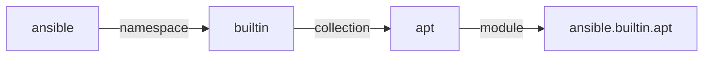
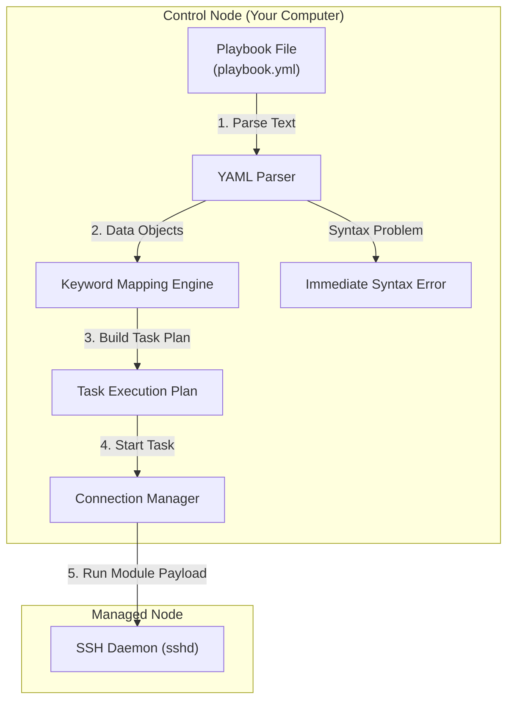

## Table of Contents

1. [The Anatomy of a Playbook](#the-anatomy-of-a-playbook)
2. [The Playbook Blueprint and Code Preview](#the-playbook-blueprint-and-code-preview)
3. [Plays: Targeting Host Groups](#plays-targeting-host-groups)
4. [Tasks: Describing Ordered Machine States](#tasks-describing-ordered-machine-states)
5. [Modules: The Domain-Aware Workhorses](#modules-the-domain-aware-workhorses)
6. [Fully Qualified Collection Names](#fully-qualified-collection-names)
7. [Under the Hood: YAML Tokenization and Module Argument Validation](#under-the-hood-yaml-tokenization-and-module-argument-validation)
8. [Putting It All Together](#putting-it-all-together)
9. [What's Next](#whats-next)

## The Anatomy of a Playbook

An Ansible playbook is an ordered YAML automation document that maps target hosts to tasks and modules.

An Ansible playbook is a structured text file written in YAML format that maps specific groups of server machines to an ordered list of configuration steps. Instead of writing loose shell scripts that execute arbitrary sequences of command lines, you write a playbook to declare exactly what files, packages, user permissions, and system services should exist on your servers. The playbook is a reviewable infrastructure document, allowing your team to version-control and share operational steps before touching a single server.

To understand how a playbook is organized, consider our scenario. You are setting up a local utility server inside your private network to act as a shared developer workspace. This host requires several configurations:
- A shared utility package (like git) must be present.
- A dedicated system user account must exist for the team.
- A local security configuration file must be deployed.
- A utility background service must be kept active and enabled.

If you configure this workspace by hand, you must remember the commands, package names, directory paths, and permission octals. A playbook records these details in a highly structured hierarchy. A playbook contains one or more plays; each play targets a set of hosts and holds an ordered list of tasks.

## The Playbook Blueprint and Code Preview

Here is an early, comment-free playbook preview that standardizes the developer workspace server described in our scenario. This blueprint maps our target host group to the exact list of configurations we require:

```yaml
- name: Standardize developer utility workspace
  hosts: workspaces
  become: true
  tasks:
    - name: Ensure git package is installed
      ansible.builtin.apt:
        name: git
        state: present

    - name: Create local developer system user
      ansible.builtin.user:
        name: devuser
        comment: "Shared Developer Account"
        shell: /bin/bash
        state: present

    - name: Configure developer utilities banner
      ansible.builtin.copy:
        content: "Welcome to the shared developer workspace."
        dest: /etc/motd
        owner: root
        group: root
        mode: "0644"

    - name: Keep system cron service active
      ansible.builtin.service:
        name: cron
        state: started
        enabled: true
```

## Plays: Targeting Host Groups

A play is the top-level block inside an Ansible playbook file. Its primary purpose is to define a scope of work by linking a specific group of servers (from your host catalog) to a list of tasks. A playbook can contain multiple plays, allowing you to orchestrate complex deployment phases across different clusters of servers in a single run.

For example, a multi-play playbook might target database servers in the first play to run storage setup tasks, and then target web application servers in the second play to reload configuration files.

When you declare a play, you define several key parameters:
- **`hosts`**: The name of the host group or pattern to target (such as `workspaces`).
- **`become`**: A boolean flag (set to `true` or `false`) that indicates whether tasks in this play require privilege escalation (usually administrative access via sudo) to execute.
- **`remote_user`**: The specific SSH user name Ansible should use when logging into the servers for this play.

Keeping your plays focused makes your automation cleaner. Instead of targeting all your servers in a single play and using complex conditions to skip tasks on specific hosts, you write separate plays. This ensures that anyone reading the playbook immediately understands which host group receives what configuration.

## Tasks: Describing Ordered Machine States

A task is an individual, named step inside a play's task block. Every task focuses on a single logical goal (like "Ensure git package is installed") and calls a specific module with arguments to achieve that goal.

When Ansible executes a play with the default linear strategy, it processes tasks in the exact order you wrote them in the playbook. The default execution order across multiple hosts is a common source of surprise for beginners: Ansible runs a single task across *all* targeted hosts in the play before proceeding to the next task in the list. Strategies, forks, and `serial` settings can change the batching behavior, but this horizontal task-by-task model is the baseline to learn first.

Consider a play targeting two utility servers (`workspace-01` and `workspace-02`). The task list contains three steps:
1. Install git.
2. Create the user.
3. Configure the banner.

Instead of completing all three tasks on `workspace-01` before starting on `workspace-02`, the task pipeline executes like this:

| Step | Target Host | Active Task |
| :--- | :--- | :--- |
| **1** | `workspace-01` | Install git |
| **2** | `workspace-02` | Install git |
| **3** | `workspace-01` | Create the user |
| **4** | `workspace-02` | Create the user |
| **5** | `workspace-01` | Configure the banner |
| **6** | `workspace-02` | Configure the banner |

This horizontal step execution is highly beneficial because it keeps your hosts synchronized during complex deployments. If a task fails on a specific host (for example, if `workspace-02` runs out of disk space during the package installation task), Ansible automatically removes that broken host from the active run pool. The remaining healthy hosts continue to receive subsequent tasks, keeping your operational status clear.

## Modules: The Domain-Aware Workhorses

An Ansible module is the small program that knows how to manage one kind of system object. A task names the desired result, and the module performs the read, compare, and write logic needed for that object.

Example: `ansible.builtin.apt` knows how to inspect Debian package status and install `git` only when it is missing. `ansible.builtin.user` knows how to inspect local accounts and create `devuser` only when that account does not already exist. While a task represents the human-readable step in a playbook, the module is the underlying code that does the actual work on your servers.

Ansible ships with thousands of built-in modules, covering everything from files and packages to services, users, and cloud providers. The major benefit of using these modules over raw shell commands is that modules are state-aware:

When a module runs, it first performs a read operation to determine the current state of the resource: querying a package manager, reading file metadata, or inspecting a service status. It then compares the observed state against the declared desired state in the task arguments. Only when the two differ does the module issue a write operation. This read-before-write discipline is what makes every module invocation idempotent by default.

If you write shell commands to modify configuration files, you must write complicated search-and-replace logic to prevent duplicating text lines on subsequent runs. An Ansible file module (like `lineinfile`) handles this check automatically, searching for target expressions and only modifying the file if the line is missing or incorrect.

## Fully Qualified Collection Names

In modern Ansible, a collection is a package of related modules, plugins, and helper code. A Fully Qualified Collection Name (FQCN) is the full dotted path to one module inside one collection, so Ansible can find the exact code you meant.

Example: `ansible.builtin.copy` means "use the `copy` module from Ansible's built-in collection," not a third-party module that happens to share the short name `copy`. In modern Ansible, using FQCNs keeps module resolution predictable across laptops, CI runners, and shared control nodes.

An FQCN is a structured, dot-separated string containing three distinct parts:



The FQCN follows a three-part dotted path. The first segment is the namespace, which identifies the organization or individual that maintains the collection. The second segment is the collection name, grouping modules that serve a common purpose. The third segment is the module name itself.

Using the full FQCN (like `ansible.builtin.copy` instead of the short name `copy`) keeps your playbooks more stable. If a third-party collection introduces a custom module also named `copy`, the FQCN tells Ansible to run the built-in core module you intended, preventing module-name ambiguity.

## Under the Hood: YAML Parsing and Module Execution

Playbook execution has two phases: Ansible first parses the YAML file on the control node, then it runs module work against the selected hosts. This split matters because some mistakes are caught before any connection opens, while other mistakes appear only when a real module receives real host data.

Example: a broken indentation level in `playbooks/site.yml` fails immediately during parsing, but an invalid package name like `gti` instead of `git` may only fail when the package module checks the target host's repositories.

When you run `ansible-playbook`, the control node executes several local steps before the first task runs:

1. **YAML Parsing**: The Ansible engine reads your playbook file and converts the text structure into native data structures. If your playbook has indentation errors or invalid characters, the YAML parser fails immediately with a syntax error.
2. **Keyword Mapping**: Ansible maps the top-level keys in the parsed dictionary (such as `hosts`, `become`, and `tasks`) to specific execution classes in the control engine.
3. **Task Planning**: Ansible identifies which modules, connection settings, variables, and host groups are needed for each task.
4. **Module Execution and Validation**: Module-specific argument validation happens when the module or its action plugin executes. Many bad parameters fail early in the task, but the module still usually runs through Ansible's normal execution path rather than being fully proven before any connection is opened.



This local parsing still catches many simple mistakes before a run reaches your hosts, especially broken YAML structure. It does not prove every module argument or runtime condition in advance, so production workflows still need syntax checks, check mode where supported, canary runs, and careful recap reading.

## Putting It All Together

We started by looking at how an Ansible playbook standardizes a developer utility workspace, organizing machine configurations into clear, readable, and versionable files.

By dividing these files into a logical hierarchy, you ensure complete operational clarity:
- **Playbooks** organize your entire deployment blueprint into lists of plays.
- **Plays** target specific host groups and configure privilege boundaries like `become: true`.
- **Tasks** define the ordered sequence of configuration steps, executing horizontally across all target hosts in the play.
- **Modules** provide the state-aware system intelligence, accessed safely using Fully Qualified Collection Names (FQCNs) like `ansible.builtin.copy` to inspect and reconcile remote files, packages, and users.
- **Under-the-Hood Parsing**: The control plane parses YAML and builds a task plan locally, while module-specific validation happens as each task is executed.

This structural separation ensures that your automation is easy to read, simple to maintain, and highly predictable.

## What's Next

Now that you understand the structure of playbooks, plays, tasks, and modules, the next article will explore the core behavioral mechanic of Ansible: **Idempotency**. We will look at how state-aware modules achieve this safety property under the hood, how they compare local and remote states, and how you write playbooks that run safely repeatedly without causing configuration drift.

---

**References**

- [Ansible Playbook Syntax Guide](https://docs.ansible.com/ansible/latest/playbook_guide/playbooks_intro.html) - Official reference for YAML syntax and play structure rules.
- [Ansible Built-in Module Index](https://docs.ansible.com/ansible/latest/collections/ansible/builtin/index.html) - Documentation for the core built-in modules and FQCN mappings.
- [YAML 1.2 Specification](https://yaml.org/spec/1.2.2/) - The official YAML language standard used by playbook parsers.
- [Ansible Error Handling and Validation](https://docs.ansible.com/ansible/latest/playbook_guide/playbooks_error_handling.html) - Best practices for debugging playbook schema and syntax failures.
