## Table of Contents

1. [The Feedback Loop of Playbook Execution](#the-feedback-loop-of-playbook-execution)
2. [The Playbook Output Stream and Code Preview](#the-playbook-output-stream-and-code-preview)
3. [Decoding the Status Stream](#decoding-the-status-stream)
4. [Isolating Failures: Unreachable vs. Failed](#isolating-failures-unreachable-vs-failed)
5. [Execution Branching: Skipped, Rescued, and Ignored](#execution-branching-skipped-rescued-and-ignored)
6. [Under the Hood: Standard Out Capture and JSON Parsing](#under-the-hood-standard-out-capture-and-json-parsing)
7. [The Play Recap: Auditing Fleet Health](#the-play-recap-auditing-fleet-health)
8. [Putting It All Together](#putting-it-all-together)
9. [What's Next](#whats-next)

## The Feedback Loop of Playbook Execution

Ansible's command-line output is a structured audit trail that provides real-time feedback during a playbook execution. Because Ansible manages fleets of servers rather than a single local machine, the terminal output does not present a single success or failure status. Instead, it breaks down the execution timeline by play, task, and host, providing detailed proof of exactly how each remote system responded. Reading this output allows you to diagnose connection drops, identify configuration errors, and confirm that your infrastructure has settled into a safe, predictable state.

To understand why analyzing this feedback loop is critical, consider our scenario. You are executing a configuration update across a three-node database and application cluster containing `db-node-01`, `app-node-01`, and `app-node-02`. The playbook installs a security library, modifies a cluster config file, and reloads the service.

If you treat the output as a simple binary pass-or-fail:
- You might miss that the security library task succeeded on two nodes but silently failed on the third due to a broken system repository, leaving that host vulnerable.
- A connection timeout on a database node might be hidden behind a wall of green task names, causing you to assume the whole cluster was updated.
- You might not realize that a specific task is continuously applying modifications on every run, slowly wearing down your storage drives with unnecessary writes.

A professional operations workflow relies on this status stream. By looking at the colors, codes, and recap summaries that Ansible outputs, you can instantly see which hosts already matched your desired state, which ones required active modifications, which ones connection failures blocked, and which tasks triggered error-handling paths.

## The Playbook Output Stream and Code Preview

Here is an early, comment-free console output preview of a playbook run against our three-node cluster. This output demonstrates a mixed run where different hosts produce different results:

```text
PLAY [Standardize application and database cluster] ****************************

TASK [Gathering Facts] *********************************************************
ok: [db-node-01]
ok: [app-node-01]
ok: [app-node-02]

TASK [Install cluster security library] ****************************************
ok: [db-node-01]
changed: [app-node-01]
fatal: [app-node-02]: FAILED! => {"changed": false, "msg": "No package matching 'sec-lib' found"}

TASK [Configure cluster settings] **********************************************
changed: [db-node-01]
changed: [app-node-01]

RUNNING HANDLER [Reload application service] ***********************************
changed: [app-node-01]

PLAY RECAP *********************************************************************
db-node-01                 : ok=3    changed=1    unreachable=0    failed=0    skipped=0
app-node-01                : ok=3    changed=3    unreachable=0    failed=0    skipped=0
app-node-02                : ok=1    changed=0    unreachable=0    failed=1    skipped=2
```

## Decoding the Status Stream

As Ansible executes each task, it prints a status line for each active host in the play. The status is the direct output of the state-aware module comparing your playbook parameters with the actual remote system.

The two most common successful statuses are `ok` and `changed`:

### 1. The `ok` Status
An `ok` status indicates that Ansible connected to the host, ran the module's state check, and determined that the target system parameter already matched your desired state. The module may still inspect the system, read files, or query service state, but it did not apply a modification. In a healthy, settled environment, most state-management tasks should output `ok`, which tells you that no system drift was corrected during that run.

### 2. The `changed` Status
A `changed` status indicates that the host did not match your playbook parameters. The module executed system writes (such as creating directories, writing configuration text, or installing packages) to align the host. A `changed` status is completely healthy during an initial run, but if the same task continues to report `changed` on every run, the task is likely poorly designed and lacks proper state-aware guards.

Understanding these two indicators helps you analyze what is happening under the hood. If a configuration template task outputs `changed`, it will automatically trigger any downstream notifications, queueing service restarts. If it outputs `ok`, the notifications are skipped, keeping your application services stable.

## Isolating Failures: Unreachable vs. Failed

When a task encounters an error during a playbook execution, Ansible marks the host status as `fatal` and outputs one of two distinct failure states: `UNREACHABLE` or `FAILED`. Distinguishing between these two conditions is the fastest way to isolate operational problems:

```text
  fatal: [host-01]: UNREACHABLE!
  |____________________________|
                 |
        Transport-Layer Error
  (SSH, Keys, DNS, VPN)

  fatal: [host-01]: FAILED!
  |_________________________|
                |
       Execution-Layer Error
  (Permissions, Missing Files, Typos)
```

### 1. Transport-Layer Failures (UNREACHABLE)
An `UNREACHABLE` status indicates that the control plane could not connect to the host through the selected connection path. The task did not get a chance to run on the host. The issue usually resides in the network or transport layer:
- The control node could not resolve the host's DNS name or route packets to its IP address.
- The SSH cryptographic handshake failed because the remote host key was unknown or mismatched.
- The private key file was rejected, or the configured login username does not exist on the remote host.

### 2. Execution-Layer Failures (FAILED)
A `FAILED` status indicates that the connection was successful, but the module encountered an error while attempting to inspect or modify the host. The issue resides in the task parameters, module runtime, interpreter setup, or operating system boundaries:
- The task attempted to copy a configuration file to a directory that does not exist on the host.
- The package manager returned an error because the requested package name was misspelled or missing from system repositories.
- The module attempted to write a file to a protected directory but privilege escalation (`become: true`) was omitted, triggering a permission error.
- The remote Python interpreter required by a Python module is missing or not discovered correctly, causing the module bootstrap to fail after the connection succeeds.

When a host encounters either failure state, Ansible drops it from the active run pool for the remainder of the play by default. Error-handling features such as `ignore_errors`, `ignore_unreachable`, `rescue`, and `clear_host_errors` can alter that flow, so always read the task message before assuming what happened next.

## Execution Branching: Skipped, Rescued, and Ignored

Ansible's runtime output also captures execution branching, which occurs when playbooks use conditionals, error handling, or error overrides to control task flow:

- **`skipped`**: A skipped status indicates that a task was evaluated, but a conditional statement (like a `when` block checking the host's operating system) resolved to `false`. Skipped tasks do not run on the host, consume zero execution time, and are completely healthy when configuring heterogeneous environments.
- **`rescued`**: A rescued status appears when you group tasks inside a `block` and configure a `rescue` section. If a task inside the block fails, the execution does not stop; instead, the control plane catches the failure, runs the rescue tasks to clean up or recover, and allows the play to continue successfully.
- **`ignored`**: An ignored status occurs when a task fails but you have set `ignore_errors: true` on that step. Ansible logs the failure in standard out but allows the playbook to proceed. You must use this override sparingly, as ignoring failures can hide critical configuration bugs.

## Under the Hood: Standard Out Capture and JSON Parsing

To understand how these colors and formatting lines land in your terminal, it helps to look at the process isolation and data streams operating inside the control plane.

When you run a playbook, the Ansible execution engine on your control node forks a separate worker process for each targeted managed host (up to the limit set by your concurrency settings, commonly defaulting to 5 forks).

Here is the step-by-step systems depth of how output is processed:

1. **Module Result Creation**: The remote module payload performs the work and returns a structured result object. Command-like modules include fields such as `stdout`, `stderr`, and `rc`; other modules return fields specific to their domain.
2. **Pipe Communication**: The remote bootstrap script writes this JSON string directly to the open SSH network pipe.
3. **Control Node Capture**: The control node worker process reads the bytes from the local control socket file, parsing the JSON string into an in-memory Python dictionary.
4. **Callback Plugin Dispatch**: The execution engine takes this dictionary and passes it to the **Callback Plugin Manager**. Callback plugins are modular Python scripts that control the user interface.
5. **Formatted Rendering**: The default callback plugin reads the JSON fields (such as `rc`, `stdout`, `stderr`, and `msg`), translates them into human-readable terminal lines, applies ANSI color escape codes (green for ok, yellow for changed, red for failed, and cyan for skipped), and outputs the lines to your local stdout stream.

```mermaid
flowchart LR
    subgraph Managed["Managed Server"]
        ZIP["Module Payload"] -->|1. Return Result Object| JSONPipe["JSON Output Stream"]
    end

    subgraph Control["Control Node (Your Machine)"]
        SSHConn["SSH Network Socket"] -->|2. Receive Bytes| Worker["Forked Worker Process"]
        Worker -->|3. JSON Parse to Dict| Engine["Execution Engine"]
        Engine -->|4. Dispatch Result| CallbackManager["Callback Plugin Manager"]
        CallbackManager -->|5. ANSI Colors| Terminal["Your Terminal Stdout"]
    end

    JSONPipe -->|SFTP/SSH Pipe| SSHConn
```



This process is why Ansible can keep output readable even when tasks run across multiple worker forks. Callback plugins group the result data by task and host so you can read the run as a structured status stream instead of raw interleaved SSH output.

## The Play Recap: Auditing Fleet Health

At the very end of every playbook run, Ansible prints a final, aggregated summary table called the **Play Recap**. The recap compiles the execution metrics for each targeted host, acting as a high-level compliance dashboard.

Here is a quick reference table showing the meaning and diagnostic focus of each Play Recap column:

| Recap Column | System Meaning | Operational Audit Focus |
| :--- | :--- | :--- |
| **`ok`** | Successful tasks that made no modifications. | Measures target environment compliance and stability. |
| **`changed`** | Successful tasks that modified host states. | Indicates active environment updates; should be 0 on a rerun. |
| **`unreachable`** | Connection failures. | Highlights network, DNS, SSH, or credential bugs. |
| **`failed`** | Task errors that aborted execution on the host. | Identifies parameter mismatches, directory typos, or permission bugs. |
| **`skipped`** | Tasks bypassed by conditional statements. | Validates OS-specific or environment-specific branching logic. |
| **`rescued`** | Failed tasks successfully resolved by rescue blocks. | Confirms automated recovery pipelines are active. |
| **`ignored`** | Failed tasks bypassed by ignore overrides. | Highlights accepted risks; audit regularly to prevent stale errors. |

When you analyze a recap block after a deployment, any host with a non-zero value in `failed` or `unreachable` requires immediate attention. Even if a server shows sixteen successful `ok` tasks, a single failure indicates that the machine aborted its execution, leaving it in an incomplete, drifting state.

## Putting It All Together

We started by looking at how a mixed cluster playbook run produces per-host execution details, and why flattening this feedback loop into a simple pass-or-fail can hide critical failures on individual servers.

Ansible answers this by providing a highly structured, color-coded status stream and recap dashboard:
- **State-Aware Statuses**: Terminal lines use `ok` to indicate compliance and `changed` to highlight system writes, driving downstream handlers.
- **Clear Failure Isolation**: The output separates transport-layer socket errors (`UNREACHABLE`) from task parameter errors (`FAILED`), allowing you to isolate network bugs from config bugs instantly.
- **Branching Capture**: The stream logs skipped conditionals, block rescues, and ignored errors, giving you complete visibility into task flow.
- **Process Redirection**: Under the hood, the control plane forks worker processes, captures remote JSON return blocks over SSH pipes, and uses callback plugins to render clean terminal output.
- **The Play Recap**: A final per-host dashboard summarizes the health of your entire fleet, pointing you directly to the hosts that require remediation.

Mastering this feedback loop allows you to read your playbook runs as precise evidence of system status, keeping your deployments safe and compliant.

## What's Next

Now that you have completed Theme 1 and master the foundations of playbooks, tasks, modules, idempotency, and run outputs, the next theme will move into **Inventory, Connections, & Variables**. We will start by exploring Inventories, showing you how Ansible organizes host catalogs, handles static and dynamic host mappings, and resolves DNS names to active network addresses.

---

**References**

- [Ansible Playbook Execution and Output](https://docs.ansible.com/ansible/latest/playbook_guide/playbooks_intro.html#playbook-execution) - Official reference for execution flow and terminal stdout logs.
- [Developing Ansible Callback Plugins](https://docs.ansible.com/ansible/latest/plugins/callback.html) - Documentation on how callback scripts process JSON structures and control stdout formatting.
- [ANSI Escape Codes Specification](https://www.ecma-international.org/publications-and-standards/standards/ecma-48/) - The ECMA standard for colorizing and formatting terminal character streams.
- [Ansible Error Handling: Defining Failures and Overrides](https://docs.ansible.com/ansible/latest/playbook_guide/playbooks_error_handling.html) - Official reference for failed_when, changed_when, and block-rescue structures.
