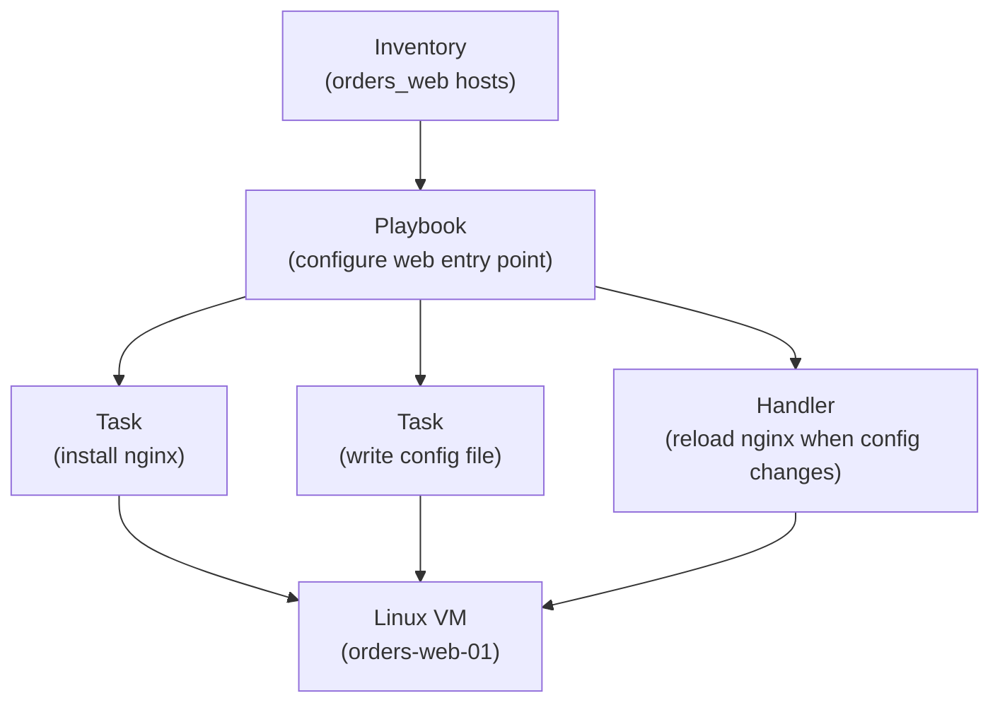

## Table of Contents

1. [The Shape of a Playbook](#the-shape-of-a-playbook)
2. [Plays, Hosts, and Tasks](#plays-hosts-and-tasks)
3. [Desired State in Real Tasks](#desired-state-in-real-tasks)
4. [Running the Same Playbook Twice](#running-the-same-playbook-twice)
5. [Handlers and Service Restarts](#handlers-and-service-restarts)
6. [Reading Task Results](#reading-task-results)
7. [Check Mode, Diff Mode, and Their Limits](#check-mode-diff-mode-and-their-limits)
8. [When a Task Is Not Idempotent](#when-a-task-is-not-idempotent)
9. [A Beginner Review Checklist](#a-beginner-review-checklist)

## The Shape of a Playbook

A server configuration change is easy to make once and hard to repeat unless the steps are written down in a form a tool can run. Installing Nginx, copying a systemd unit, writing an upstream config, and restarting a service are ordinary Linux tasks. The operational problem is that each task has to happen on the right hosts, in the right order, with enough checking that a second run does not disturb a healthy server.

An Ansible playbook is a YAML file that tells Ansible what should happen on one or more managed nodes. A managed node is a target machine Ansible connects to, usually over SSH for Linux servers. The playbook lives in a repository, so the team can review the desired server change before Ansible applies it.

Ansible exists here because a shell history is not a safe operating model. A human can remember that `apt install nginx` worked on `orders-web-01`, but production has more than one VM, and the next release needs the same outcome again. A playbook gives the team a repeatable file that says which hosts are targeted and which tasks should bring those hosts into the desired state.

In the larger DevPolaris system, Terraform might create the Linux VMs, DNS records, and security groups. Ansible then configures the inside of those VMs: packages, files, directories, users, services, and application runtime settings. This article follows `devpolaris-orders`, a small orders API that runs behind Nginx on Linux VMs and is managed by systemd.

Here is the smallest useful picture:



Read the diagram from top to bottom. The inventory names the machines. The playbook names the work. The tasks call Ansible modules, which are small units of Ansible code that know how to inspect and change a target system. The handler is a special task that runs only when another task reports a change.

That last word, change, is one of the most important words in Ansible. A task should not simply run a command every time. A good task checks whether the target host already matches the requested state, changes the host only when needed, and reports honestly whether it changed anything.

## Plays, Hosts, and Tasks

A playbook is a list of plays. A play connects a set of hosts to a list of tasks. That sentence sounds formal, so place it on a real server: the play might target the `orders_web` inventory group, become root with `sudo`, and then install Nginx, deploy a config file, and start the `devpolaris-orders` service.

The play answers "where does this run?" The tasks answer "what should be true on each host?" The module inside each task answers "how does Ansible check and change that piece of the system?" Keeping those questions separate makes a playbook easier to review.

Here is a first playbook for the web VMs:

```yaml
---
- name: Configure devpolaris orders web hosts
  hosts: orders_web
  become: true

  tasks:
    - name: Install nginx
      ansible.builtin.apt:
        name: nginx
        state: present
        update_cache: true

    - name: Create application directory
      ansible.builtin.file:
        path: /opt/devpolaris-orders
        state: directory
        owner: root
        group: root
        mode: "0755"

    - name: Install systemd unit for orders API
      ansible.builtin.copy:
        src: files/devpolaris-orders.service
        dest: /etc/systemd/system/devpolaris-orders.service
        owner: root
        group: root
        mode: "0644"

    - name: Keep orders API running
      ansible.builtin.systemd_service:
        name: devpolaris-orders
        state: started
        enabled: true
        daemon_reload: true
```

The first line after `---` starts a play. `hosts: orders_web` points at an inventory group. `become: true` tells Ansible to use privilege escalation because package installation and systemd changes need root permissions on most Linux distributions.

Each task has a human-readable `name`. Ansible prints the task name during a run, and the name becomes your first diagnostic breadcrumb when something fails. A task named `Copy file` is much less useful than `Install systemd unit for orders API` because the second name tells you what the file means to the system.

The module names use fully qualified collection names such as `ansible.builtin.apt` and `ansible.builtin.copy`. The long name looks noisy at first, but it removes ambiguity. Many Ansible collections can contain modules with the same short name, so the fully qualified name tells the reader and Ansible exactly which module is meant.

The playbook also has a clear order. Ansible runs tasks from top to bottom within a play. That means the package exists before the service is managed, and the systemd unit exists before the service starts. Order is useful, but it should not become hidden state. Each task should still describe a desired result that makes sense on its own.

## Desired State in Real Tasks

The safer Ansible habit is to describe the final state instead of writing the shell command you would type manually. For the `apt` module, `state: present` means "the package should be installed." For the `file` module, `state: directory` means "this path should exist as a directory." For the service task, `state: started` and `enabled: true` mean "the service should be running now and should start after reboot."

This is the same desired-state idea from the IaC fundamentals article, but closer to the operating system. The playbook does not say "run these commands because I hope the server needs them." It says "make these facts true on the host." The module checks the current host state and decides whether work is needed.

Compare the desired-state task with a manual shell-shaped task:

```yaml
- name: Install nginx with apt module
  ansible.builtin.apt:
    name: nginx
    state: present
    update_cache: true
```

That task can check whether Nginx is already installed. If the package is present, it can report `ok`. If the package is missing, it installs it and reports `changed`.

Here is the shell-shaped version:

```yaml
- name: Install nginx with shell
  ansible.builtin.shell: apt-get update && apt-get install -y nginx
```

The shell command may work, but it gives Ansible less structure. Ansible can run the command, but it does not naturally understand the desired package state in the same way the `apt` module does. It also makes the task harder to preview, harder to report accurately, and easier to copy into places where it does too much work on every run.

The difference becomes clearer with files. The `copy` module can compare the source file content, owner, group, and mode with the destination. If the destination already matches, there is nothing to do.

```yaml
- name: Install nginx site config
  ansible.builtin.copy:
    src: files/devpolaris-orders.nginx.conf
    dest: /etc/nginx/sites-available/devpolaris-orders.conf
    owner: root
    group: root
    mode: "0644"
```

A repeated shell append is much riskier:

```yaml
- name: Add upstream line with shell
  ansible.builtin.shell: echo "proxy_read_timeout 30s;" >> /etc/nginx/nginx.conf
```

The shell task does not express "the file should contain this setting once." It expresses "append this text now." If the playbook runs five times, the file can receive five copies. That is not an Ansible problem as much as a modeling problem: the task describes an action, not a desired final state.

Use this table as a first review lens:

| Desired Result | Prefer | Be Careful With |
|----------------|--------|-----------------|
| Package installed | `ansible.builtin.apt` | `shell: apt-get install ...` |
| Directory exists | `ansible.builtin.file` | `shell: mkdir ...` |
| Managed config file | `copy` or `template` | `shell: echo ... >> file` |
| Service running | `service` or `systemd_service` | `shell: systemctl start ...` |
| One line managed | `lineinfile` | repeated append commands |

This does not mean `shell` is forbidden. Sometimes a vendor tool or migration command has no better module. The habit is to ask whether Ansible already has a module that understands the state you want. If it does, start there.

## Running the Same Playbook Twice

Idempotency means a task can run more than once and still leave the host in the same final state. In Ansible, the practical proof is the second run. The first run may install packages and write files. The second run should mostly report `ok` because the host already matches the playbook.

For `devpolaris-orders`, imagine `orders-web-01` is new. Nginx is missing, the app directory is missing, and no systemd unit exists. The first run should change the host.

```bash
$ ansible-playbook -i inventory/prod.ini playbooks/orders-web.yml --limit orders-web-01

PLAY [Configure devpolaris orders web hosts] *****************************

TASK [Gathering Facts] ***************************************************
ok: [orders-web-01]

TASK [Install nginx] *****************************************************
changed: [orders-web-01]

TASK [Create application directory] **************************************
changed: [orders-web-01]

TASK [Install systemd unit for orders API] *******************************
changed: [orders-web-01]

TASK [Keep orders API running] *******************************************
changed: [orders-web-01]

PLAY RECAP ***************************************************************
orders-web-01              : ok=5    changed=4    unreachable=0    failed=0
```

The recap is a compact story. Ansible reached the host, ran five tasks including fact gathering, and changed four things. That is expected on a new VM.

Now run the same playbook again:

```bash
$ ansible-playbook -i inventory/prod.ini playbooks/orders-web.yml --limit orders-web-01

PLAY [Configure devpolaris orders web hosts] *****************************

TASK [Gathering Facts] ***************************************************
ok: [orders-web-01]

TASK [Install nginx] *****************************************************
ok: [orders-web-01]

TASK [Create application directory] **************************************
ok: [orders-web-01]

TASK [Install systemd unit for orders API] *******************************
ok: [orders-web-01]

TASK [Keep orders API running] *******************************************
ok: [orders-web-01]

PLAY RECAP ***************************************************************
orders-web-01              : ok=5    changed=0    unreachable=0    failed=0
```

The second recap matters more than it first appears. `changed=0` tells you that the host already matched the playbook. This is what makes Ansible useful for routine enforcement, retries after network issues, and scheduled configuration runs.

If the second run reports changes, inspect which task changed and why. Some tasks legitimately change on every run, such as a command that rotates a token or fetches a new build. Most configuration tasks should not behave that way. A task that changes every time can restart services every time, make CI noisy, and hide real drift because the recap is always busy.

The right reaction is not to chase a perfect zero for every possible playbook. It is to know which tasks are expected to change and which tasks should be quiet after the first run. For a base web-host playbook, package, directory, config, and service tasks should usually settle into `ok`.

## Handlers and Service Restarts

Configuration files and services have a special relationship. If you change the Nginx site config, Nginx usually needs a reload before it uses the new file. If the file does not change, a reload is unnecessary. A handler gives you that behavior: it waits for a task notification and runs only when a notifying task changed something.

This is important because service restarts are not harmless. A reload may be cheap, but it still touches a live process. A restart can briefly drop connections if the service does not support graceful restart. The playbook should restart or reload only when a configuration change makes that action necessary.

Here is the Nginx part of the `devpolaris-orders` playbook with handlers:

```yaml
---
- name: Configure devpolaris orders web hosts
  hosts: orders_web
  become: true

  tasks:
    - name: Install nginx
      ansible.builtin.apt:
        name: nginx
        state: present
        update_cache: true

    - name: Install nginx site config
      ansible.builtin.template:
        src: templates/devpolaris-orders.nginx.conf.j2
        dest: /etc/nginx/sites-available/devpolaris-orders.conf
        owner: root
        group: root
        mode: "0644"
      notify: Reload nginx

    - name: Enable nginx site
      ansible.builtin.file:
        src: /etc/nginx/sites-available/devpolaris-orders.conf
        dest: /etc/nginx/sites-enabled/devpolaris-orders.conf
        state: link
      notify: Reload nginx

    - name: Keep nginx running
      ansible.builtin.service:
        name: nginx
        state: started
        enabled: true

  handlers:
    - name: Reload nginx
      ansible.builtin.service:
        name: nginx
        state: reloaded
```

The `template` task writes a file only when the rendered content differs from the destination. The symlink task creates or corrects the enabled-site link. Both tasks notify `Reload nginx`, but Ansible runs the handler once at the end of the play even if both tasks changed.

That batching is useful. If three Nginx-related tasks change, you do not want three reloads during the same play. You want Ansible to finish the related file work and then reload the service once.

The handler name is part of the contract. If the task says `notify: Reload nginx`, the handlers list needs a handler with that exact name. A typo is easy to miss in review because YAML still parses. When a config change does not seem to trigger a reload, compare the `notify` text with the handler name first.

Handlers depend on truthful change reporting. If a shell task reports `changed` every run, it can trigger a handler every run. If a task hides a real change with `changed_when: false`, it may prevent a needed restart. That is why idempotency is not just a nice recap number. It controls whether follow-up operations happen.

## Reading Task Results

Ansible output is meant to be read as operational evidence. Each task result tells you whether the task was `ok`, `changed`, `skipped`, `failed`, or `unreachable` for each host. Those words are compact, but they map to very different next actions.

Here is a realistic failure when the Nginx template contains a syntax mistake:

```bash
$ ansible-playbook -i inventory/prod.ini playbooks/orders-web.yml --limit orders-web-01

TASK [Install nginx site config] *****************************************
changed: [orders-web-01]

RUNNING HANDLER [Reload nginx] *******************************************
fatal: [orders-web-01]: FAILED! => {
    "changed": false,
    "msg": "Unable to reload service nginx: Job for nginx.service failed."
}

PLAY RECAP ***************************************************************
orders-web-01              : ok=4    changed=1    unreachable=0    failed=1
```

The failure happened in the handler, not in the template task. That distinction matters. The file copied successfully, but Nginx could not reload with the new configuration. The next check should inspect Nginx's own error output on the host.

```bash
$ ssh ubuntu@orders-web-01
$ sudo nginx -t
nginx: [emerg] host not found in upstream "orders-api.service.local" in /etc/nginx/sites-enabled/devpolaris-orders.conf:12
nginx: configuration file /etc/nginx/nginx.conf test failed
```

Now the failure has a concrete location. The bad value is the upstream hostname in the generated Nginx file. The fix may be a corrected variable, a DNS record, or a template change. The Ansible output told you which task failed, and the service command told you why the daemon rejected the config.

Registered variables give you a way to keep a task result for later tasks. A registered result is a host-level variable that exists for the rest of the current playbook run. You can use it to inspect return codes, stdout, stderr, or whether a previous task changed.

```yaml
- name: Test nginx configuration
  ansible.builtin.command: nginx -t
  register: nginx_config_test
  changed_when: false

- name: Show nginx test output
  ansible.builtin.debug:
    var: nginx_config_test.stderr_lines
  when: nginx_config_test is failed
```

The `command` task runs `nginx -t`, which checks Nginx configuration. `changed_when: false` tells Ansible that this check should not count as changing the host. That matters because a validation command should not trigger handlers or make the recap look like configuration drift.

Common result fields are worth learning:

| Field | Meaning | Typical Use |
|-------|---------|-------------|
| `changed` | Whether the task changed the target | Decide whether a handler should run |
| `failed` | Whether the task failed | Branch diagnostics or stop the play |
| `rc` | Return code from command-style modules | Check command success or specific failure |
| `stdout` | Normal command output as text | Read command output |
| `stdout_lines` | Normal output split into lines | Print or loop over output safely |
| `stderr` | Error output as text | Diagnose command failure |
| `results` | Per-item results from a loop | Inspect looped task outcomes |

Do not turn every playbook into a maze of registered variables. Most desired-state modules should stand alone. Register results when you are validating, making a later decision, or preserving evidence that helps the reader understand why the next task runs.

## Check Mode, Diff Mode, and Their Limits

Ansible has two preview tools that are especially useful while learning. Check mode asks Ansible to predict what would change without applying the change. Diff mode asks supported modules to show content differences. Together, they give you a safer way to inspect a playbook before touching a production host.

For the orders web playbook, a cautious run might look like this:

```bash
$ ansible-playbook -i inventory/prod.ini playbooks/orders-web.yml --limit orders-web-01 --check --diff

TASK [Install nginx site config] *****************************************
--- before: /etc/nginx/sites-available/devpolaris-orders.conf
+++ after: /Users/senlin/devpolaris/ansible/templates/devpolaris-orders.nginx.conf.j2
@@
-proxy_read_timeout 15s;
+proxy_read_timeout 30s;

changed: [orders-web-01]

PLAY RECAP ***************************************************************
orders-web-01              : ok=5    changed=1    unreachable=0    failed=0
```

This preview tells you that Ansible would change the Nginx config and exactly which line differs. That is good review evidence. A teammate can see that the timeout is moving from `15s` to `30s` before the live file changes.

Check mode is not a perfect simulator. Some modules can predict changes well. Some modules cannot know the result without doing the work. Command-style tasks are especially limited because Ansible cannot safely infer what an arbitrary command would do.

Use this split:

| Preview Question | Good Fit |
|------------------|----------|
| Would this file content change? | `--check --diff` with `copy` or `template` |
| Would this package be installed? | `--check` with package modules |
| Would this command mutate a database? | Usually not safe to guess |
| Would a service reload succeed? | Test with service-specific validation |
| Would users receive traffic successfully? | Needs health checks outside check mode |

For Nginx, a strong pattern is to validate the config before reload. Ansible has a `validate` option for some file modules, and you can also run a separate command task. The key idea is that previewing a file diff and validating the daemon config answer different questions.

```yaml
- name: Install nginx site config
  ansible.builtin.template:
    src: templates/devpolaris-orders.nginx.conf.j2
    dest: /etc/nginx/sites-available/devpolaris-orders.conf
    owner: root
    group: root
    mode: "0644"
    validate: "nginx -t -c %s"
  notify: Reload nginx
```

The `validate` command runs against a temporary rendered file before Ansible puts it in place. That helps catch invalid syntax before the live config is replaced. It does not prove that the upstream application is healthy, but it catches a class of Nginx mistakes early.

After the playbook applies, you still need a runtime check:

```bash
$ curl -fsS http://orders-web-01.internal/health
ok
```

That command checks the service behavior, not just the configuration file. Ansible can make Nginx configured and running. A health check confirms that the user-facing path responds.

## When a Task Is Not Idempotent

Non-idempotent tasks are not always obvious. They often start as quick fixes: append a line, run a setup command, restart a service, download the latest artifact, or create a user with a random password. The task works once, so it gets committed. Later, it runs again and changes a server that did not need to change.

Here is a common unsafe pattern:

```yaml
- name: Add orders log directory to logrotate
  ansible.builtin.shell: echo "/var/log/devpolaris-orders/*.log { daily rotate 14 }" >> /etc/logrotate.d/devpolaris-orders
```

The task appends text every time. A second run makes the file longer. A third run makes it longer again. The playbook recap reports `changed` every time, and the file slowly becomes wrong.

A better version manages the whole file:

```yaml
- name: Install logrotate config for orders API
  ansible.builtin.copy:
    dest: /etc/logrotate.d/devpolaris-orders
    owner: root
    group: root
    mode: "0644"
    content: |
      /var/log/devpolaris-orders/*.log {
          daily
          rotate 14
          missingok
          notifempty
          copytruncate
      }
```

Now the desired state is the file content. If the file already matches, Ansible reports `ok`. If someone edits it by hand, Ansible can restore the reviewed content on the next run.

Sometimes you really do need a command. For example, maybe the orders app ships a vendor CLI that warms an application cache. The task should still tell Ansible when it changed something.

```yaml
- name: Warm orders API cache
  ansible.builtin.command: /opt/devpolaris-orders/bin/orders-cache warm
  register: cache_warm
  changed_when: "'cache updated' in cache_warm.stdout"
```

This task is still an imperative command, but its change reporting is more honest. If the command prints `cache already current`, the recap should not report a change. If it prints `cache updated`, the recap can show that the host changed.

Be careful with `changed_when: false`. It is useful for read-only checks such as `nginx -t`, but it can also hide real changes. If a task writes a file, restarts a process, or changes data, do not silence it just to make the recap tidy. The recap is there to teach you what happened.

Here are practical signs that a task deserves another look:

| Sign | Likely Problem | Better Direction |
|------|----------------|------------------|
| It appends with `>>` | Duplicate lines on repeat runs | Manage a file, block, or line |
| It always restarts a service | Unnecessary disruption | Use handlers |
| It downloads `latest` every run | Moving target | Pin a version or checksum |
| It uses `shell` for a package | Weak state reporting | Use a package module |
| It hides changes | Recap cannot be trusted | Set accurate `changed_when` |

The goal is not to make every playbook perfectly declarative. The goal is to make repeated runs safe and understandable.

## A Beginner Review Checklist

When you review your first Ansible playbook, avoid trying to memorize every keyword. Start with the operating questions a teammate would ask before letting the playbook touch a server.

The first question is target scope: which hosts does this play touch? Check `hosts`, the inventory, and any planned `--limit` value. A perfect task pointed at the wrong group is still dangerous. For production, the target should be visible in the command, pull request, or run log.

The second question is privilege: which tasks need `become: true`? Installing packages and writing `/etc` files usually need root. Reading a health endpoint does not. A play-level `become: true` is common for server configuration, but sensitive tasks deserve extra attention because they can write system files.

The third question is idempotency: what should happen on the second run? Package, file, directory, template, and service tasks should usually become quiet. Command and shell tasks need a reason and often need `changed_when`, `creates`, `removes`, or a better module.

The fourth question is service impact: what restarts or reloads? A config file task should notify a handler. A handler should run only when needed. A playbook that restarts Nginx on every run will make the team stop trusting routine automation.

The fifth question is evidence: how will you know it worked? Ansible recap tells you which tasks changed. Service validation tells you whether the daemon accepts its config. A health check tells you whether the application path responds.

Here is a small review record for the orders web playbook:

```text
Playbook: playbooks/orders-web.yml
Inventory: inventory/prod.ini
Target: orders_web, limited to orders-web-01 for first run
Privileged tasks: package install, /etc files, systemd service
Expected first run: nginx installed, config written, service started
Expected second run: changed=0
Service impact: nginx reload only after config or symlink changes
Verification: nginx -t and curl /health
```

That record is useful because it names expectations before the run. If the second run reports `changed=3`, you already know which assumption failed. If `curl /health` fails after Ansible reports success, you know the host configuration applied but the application path still needs investigation.

For a beginner, this is the core Ansible habit: read a playbook as a promise about server state, not as a list of commands. Then use the run output to check whether Ansible kept that promise host by host.

---

**References**

- [Ansible playbooks](https://docs.ansible.com/ansible/latest/playbook_guide/playbooks_intro.html) - Official guide to playbook structure, task execution, check mode, and desired state.
- [Handlers: running operations on change](https://docs.ansible.com/ansible/latest/playbook_guide/playbooks_handlers.html) - Explains how handlers run when tasks notify them after a change.
- [Return Values](https://docs.ansible.com/ansible/latest/reference_appendices/common_return_values.html) - Defines common result fields such as `changed`, `failed`, `rc`, `stdout`, and `stderr`.
- [Error handling in playbooks](https://docs.ansible.com/ansible/latest/playbook_guide/playbooks_error_handling.html) - Covers `changed_when`, `failed_when`, and failure behavior for task results.
- [Conditionals](https://docs.ansible.com/ansible/latest/playbook_guide/playbooks_conditionals.html) - Shows how Ansible evaluates `when` expressions and registered task results.
