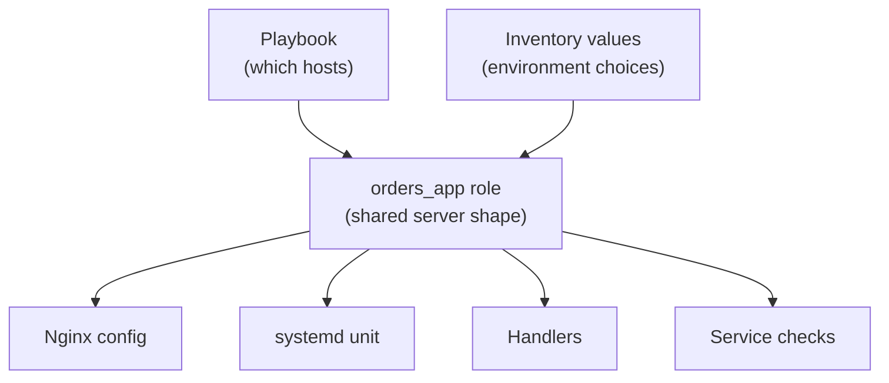

## Table of Contents

1. [The Copy-Paste Problem Roles Solve](#the-copy-paste-problem-roles-solve)
2. [What a Role Is](#what-a-role-is)
3. [The Smallest Useful Role Shape](#the-smallest-useful-role-shape)
4. [Moving devpolaris-orders Into a Role](#moving-devpolaris-orders-into-a-role)
5. [Defaults Are the Role Contract](#defaults-are-the-role-contract)
6. [Templates and Handlers Belong Together](#templates-and-handlers-belong-together)
7. [Calling the Role From a Play](#calling-the-role-from-a-play)
8. [Dynamic and Static Reuse](#dynamic-and-static-reuse)
9. [Running the Same Role for More Than One Environment](#running-the-same-role-for-more-than-one-environment)
10. [Failure Modes When Reuse Hides Too Much](#failure-modes-when-reuse-hides-too-much)
11. [A Review Checklist for Roles](#a-review-checklist-for-roles)

## The Copy-Paste Problem Roles Solve

Ansible playbooks often begin as one clear file. You install Nginx, render one config file, copy a systemd unit, start the service, and check that the health endpoint answers. For the first `devpolaris-orders` VM, that is fine. The file is short enough to read from top to bottom.

The trouble starts when the same work appears in several places. Staging needs almost the same Nginx config as production. A second VM needs the same systemd unit with a different port. Another playbook needs the same handler that reloads Nginx only after the config changes. Copying the tasks works for one afternoon, then the copies begin to drift.

A role is Ansible's answer to that drift. It gives repeated automation a named home with a known file layout. The role can own the tasks, templates, files, handlers, defaults, and metadata for one responsibility. The playbook stays focused on target selection: which hosts should receive this behavior, and which environment-specific values should they use?

Think about a small application codebase. At first, one file can hold a route handler, database query, validation, and formatting. Later, you pull repeated logic into functions or modules because the repetition itself becomes a source of mistakes. Roles are the same move for Ansible, except the repeated work affects real servers.

In this article, the `devpolaris-orders` team will take a flat playbook that configures Linux VMs and move the reusable parts into a role called `orders_app`. The servers run Nginx in front of a systemd service. The role will keep the service shape consistent while still letting staging and production choose their own domain name, port, and release path.



The diagram separates the two jobs. The role describes the reusable server shape. The playbook and inventory decide where that shape is applied and which values make it specific to one environment.

## What a Role Is

A role is a directory with a structure Ansible understands. If a role contains `tasks/main.yml`, Ansible treats that file as the role's main task list. If it contains `handlers/main.yml`, Ansible loads the handlers. If it contains `defaults/main.yml`, Ansible loads default variable values. The names matter because Ansible uses the directory shape as a convention.

That convention is useful for beginners because it reduces guessing. You do not need to invent a new layout every time a playbook grows. When someone opens `roles/orders_app/tasks/main.yml`, they expect to find the work the role performs. When they open `roles/orders_app/templates/`, they expect Jinja2 templates (text files with variables inside them) that the role renders onto managed hosts.

The important word is related. A role should collect content that belongs to one responsibility. The `orders_app` role can install and configure the orders API service. A separate `base_linux` role might manage common packages, users, SSH settings, and time sync. A separate `nginx_tls` role might manage certificates and hardened TLS defaults for several services.

Roles are not only folders for neatness. They create a review boundary. A reviewer can ask, "Does this role own app runtime configuration, or is it also changing global SSH behavior?" If a role quietly starts doing unrelated work, reuse becomes dangerous because every play that calls the role inherits the surprise.

For `devpolaris-orders`, the role boundary will be:

| Role Area | Belongs in `orders_app`? | Reason |
|-----------|--------------------------|--------|
| Nginx site config for orders API | Yes | It is specific to serving this app. |
| systemd unit for orders API | Yes | It controls this app process. |
| App release directory | Yes | The service needs a known working path. |
| Global SSH hardening | No | It affects every user and should live in a base role. |
| OS package mirror settings | No | It is a host baseline concern, not app behavior. |
| Database creation | Usually no | It is normally provisioned before server config runs. |

The table keeps the role honest. If a future task does not fit the right column, it probably belongs somewhere else.

## The Smallest Useful Role Shape

Ansible roles can contain many directories, but a beginner does not need all of them on day one. Start with the directories that match the work you actually have. Empty directories add noise and make the role look more complicated than it is.

For the orders service, this is enough:

```text
ansible/
  site.yml
  inventory/
    staging.ini
    prod.ini
  group_vars/
    orders_web_staging.yml
    orders_web_prod.yml
  roles/
    orders_app/
      defaults/
        main.yml
      handlers/
        main.yml
      tasks/
        main.yml
      templates/
        orders-api.conf.j2
        devpolaris-orders.service.j2
```

The `site.yml` file is still the playbook entry point. The inventory files still list hosts. The `group_vars` files hold values for groups of hosts. The role owns the repeated app configuration.

The role directories have specific jobs:

| Directory | What It Holds | Orders Example |
|-----------|---------------|----------------|
| `defaults/` | Safe default variables callers may override | `orders_app_port: 8080` |
| `tasks/` | The main work Ansible runs | Install packages, render files, start services |
| `handlers/` | Tasks that run only when notified by changes | Reload Nginx, restart the app service |
| `templates/` | Jinja2 templates rendered with variables | Nginx site, systemd unit |

You may later add `files/` for static files, `vars/` for higher-precedence role variables, or `meta/` for role metadata and argument validation. Do that when the role needs them. A smaller role is easier to teach, review, and debug.

The role path also matters. By default, Ansible looks for a `roles/` directory next to the playbook, plus configured role search paths. Keeping `roles/orders_app` beside `site.yml` is the least surprising beginner layout. It works locally, in CI, and from a small control VM without extra configuration.

## Moving devpolaris-orders Into a Role

Start with the work the flat playbook already performs. The orders API needs Nginx installed, the app user present, a release directory created, a systemd unit rendered, an Nginx site rendered, and both services started. Those are related tasks, so they make sense inside `roles/orders_app/tasks/main.yml`.

Here is a compact version of the role task file:

```yaml
- name: Install web server package
  ansible.builtin.apt:
    name: nginx
    state: present
    update_cache: true

- name: Create application user
  ansible.builtin.user:
    name: "{{ orders_app_user }}"
    system: true
    shell: /usr/sbin/nologin
    home: "{{ orders_app_home }}"

- name: Create application release directory
  ansible.builtin.file:
    path: "{{ orders_app_release_dir }}"
    state: directory
    owner: "{{ orders_app_user }}"
    group: "{{ orders_app_user }}"
    mode: "0755"

- name: Render systemd unit
  ansible.builtin.template:
    src: devpolaris-orders.service.j2
    dest: /etc/systemd/system/devpolaris-orders.service
    owner: root
    group: root
    mode: "0644"
  notify:
    - Reload systemd
    - Restart orders app

- name: Render nginx site
  ansible.builtin.template:
    src: orders-api.conf.j2
    dest: /etc/nginx/sites-available/devpolaris-orders.conf
    owner: root
    group: root
    mode: "0644"
  notify:
    - Reload nginx

- name: Enable nginx site
  ansible.builtin.file:
    src: /etc/nginx/sites-available/devpolaris-orders.conf
    dest: /etc/nginx/sites-enabled/devpolaris-orders.conf
    state: link
  notify:
    - Reload nginx

- name: Enable and start orders app
  ansible.builtin.service:
    name: devpolaris-orders
    state: started
    enabled: true

- name: Enable and start nginx
  ansible.builtin.service:
    name: nginx
    state: started
    enabled: true
```

The task names read like a checklist because each task changes one small piece of host state. That makes failure output easier to understand. If the Nginx template fails, the run points at the Nginx template task. If systemd cannot start the app, the run points at the service task.

The role uses fully qualified collection names such as `ansible.builtin.apt` and `ansible.builtin.template`. A collection is a package of Ansible content. The `ansible.builtin` prefix makes it clear these modules come from Ansible itself, not from a third-party collection with a similar short name.

The task file also shows why roles help with relative paths. Inside the role, the template task can use `src: orders-api.conf.j2`. Ansible knows to look inside `roles/orders_app/templates/`. Without a role, teams often end up with long relative paths that break when a playbook moves.

## Defaults Are the Role Contract

Defaults are the lowest-precedence variables a role provides. Low precedence means callers can override them from inventory, play vars, or extra vars. That makes `defaults/main.yml` a good place to document the values the role expects.

For `orders_app`, the defaults might look like this:

```yaml
orders_app_name: devpolaris-orders
orders_app_user: devpolaris-orders
orders_app_home: /opt/devpolaris-orders
orders_app_release_dir: /opt/devpolaris-orders/current
orders_app_port: 8080
orders_app_domain: orders.local
orders_app_health_path: /health
orders_app_environment: staging
```

These variables are not random configuration knobs. They are the role contract. A caller can read this file and learn which decisions are expected to vary. The domain changes by environment. The port might change if another service already listens on `8080`. The release directory changes only if your deployment layout changes.

Use defaults for values that are safe to show and safe to override. Do not put production secrets in defaults. Do not put values there just because YAML needs a variable. If a value must be supplied by each environment, you can leave it out of defaults and let the role fail when the variable is missing, or add role argument validation later.

Inventory group variables can override the defaults for a specific target group:

```yaml
orders_app_environment: prod
orders_app_domain: orders.devpolaris.example
orders_app_port: 8080
orders_app_release_dir: /srv/devpolaris-orders/releases/current
```

This is the same idea as a function with default arguments. The role says, "Here is a reasonable shape." The environment says, "For production, use these exact values." The role should not need `if environment == prod` checks everywhere. When a role contains many environment branches, it is usually trying to own decisions that belong in inventory.

There is one common beginner mistake with role variables: putting everything under `vars/main.yml` because the word "vars" sounds general. Role vars have higher precedence than defaults, so they are harder for inventory to override. Prefer `defaults/main.yml` for the role contract. Use `vars/main.yml` only for internal values the role author intentionally does not want callers to change.

## Templates and Handlers Belong Together

The orders API has two generated files: an Nginx site and a systemd service unit. Generated files are good role material because the path and structure stay the same while values change per environment.

The Nginx template can stay small:

```nginx
server {
    listen 80;
    server_name {{ orders_app_domain }};

    location {{ orders_app_health_path }} {
        proxy_pass http://127.0.0.1:{{ orders_app_port }}{{ orders_app_health_path }};
        proxy_set_header Host $host;
        proxy_set_header X-Forwarded-Proto $scheme;
    }

    location / {
        proxy_pass http://127.0.0.1:{{ orders_app_port }};
        proxy_set_header Host $host;
        proxy_set_header X-Forwarded-Proto $scheme;
        proxy_set_header X-Forwarded-For $proxy_add_x_forwarded_for;
    }
}
```

The template tells Nginx to accept HTTP traffic and proxy it to the local app process. The role does not hardcode the domain or port because those are environment choices. It does hardcode the reverse proxy shape because that is part of how this service is operated.

The systemd template controls the app process:

```ini
[Unit]
Description=DevPolaris Orders API
After=network-online.target
Wants=network-online.target

[Service]
User={{ orders_app_user }}
Group={{ orders_app_user }}
WorkingDirectory={{ orders_app_release_dir }}
Environment=NODE_ENV={{ orders_app_environment }}
ExecStart=/usr/bin/node {{ orders_app_release_dir }}/server.js
Restart=on-failure
RestartSec=5

[Install]
WantedBy=multi-user.target
```

When either template changes, the host needs a follow-up action. A changed systemd unit should trigger `systemctl daemon-reload` and restart the app. A changed Nginx site should test and reload Nginx. Handlers exist for exactly that pattern: run this operation only when a task reports a change.

```yaml
- name: Reload systemd
  ansible.builtin.systemd:
    daemon_reload: true

- name: Restart orders app
  ansible.builtin.service:
    name: devpolaris-orders
    state: restarted

- name: Reload nginx
  ansible.builtin.service:
    name: nginx
    state: reloaded
```

Handlers make repeated runs quieter. If the templates already match the host, Ansible does not reload services. If the Nginx config changes, Ansible reloads Nginx once even if several tasks notify the same handler. That keeps the run idempotent and reduces unnecessary service churn.

A stronger production role might validate Nginx configuration before reloading. You can do that by notifying a handler that runs `nginx -t` before the reload, or by adding a task with `validate` support where the module allows it. The beginner lesson is the same: template changes and service actions should be connected deliberately.

## Calling the Role From a Play

Once the role owns the repeated work, `site.yml` becomes shorter. The playbook no longer needs every Nginx and systemd task inline. It needs to say which host group gets the role and which privilege level the tasks require.

```yaml
- name: Configure devpolaris-orders web hosts
  hosts: orders_web
  become: true
  roles:
    - orders_app
```

The `roles:` section is the classic way to run roles for a play. Ansible processes roles listed there before normal `tasks:` in the play. That is a good fit when the role is the main work of the play.

Inventory still controls the targets:

```ini
[orders_web]
orders-web-01 ansible_host=10.20.1.21
orders-web-02 ansible_host=10.20.1.22

[orders_web:vars]
ansible_user=ubuntu
```

Now the command stays familiar:

```bash
$ ansible-playbook -i inventory/prod.ini site.yml --limit orders-web-01 --check --diff

PLAY [Configure devpolaris-orders web hosts] *******************************

TASK [orders_app : Install web server package] *****************************
ok: [orders-web-01]

TASK [orders_app : Render nginx site] **************************************
changed: [orders-web-01]

TASK [orders_app : Enable and start orders app] ****************************
ok: [orders-web-01]

PLAY RECAP *****************************************************************
orders-web-01              : ok=8    changed=1    unreachable=0    failed=0
```

The output now includes the role name in task labels: `orders_app : Render nginx site`. That helps during debugging because you can see which role produced the task. In a larger playbook with `base_linux`, `nginx_tls`, and `orders_app`, those prefixes save time.

Run `--check --diff` before applying a template change when the module supports it. Check mode asks Ansible to predict the change. Diff mode shows file differences for supported modules. They are not a full staging environment, but they are useful review evidence before touching a production host.

## Dynamic and Static Reuse

Ansible has more than one way to reuse a role. The three common choices are `roles:`, `ansible.builtin.import_role`, and `ansible.builtin.include_role`. They look similar, but they are processed at different times.

The `roles:` section and `import_role` are static reuse. Ansible processes the role as the playbook is parsed. Static reuse is easier to list with commands such as `--list-tasks` and `--list-tags`, and tags applied to an import apply to the imported tasks.

```yaml
- name: Configure app after base packages
  hosts: orders_web
  become: true
  tasks:
    - name: Import the orders app role
      ansible.builtin.import_role:
        name: orders_app
      tags:
        - orders_app
```

`include_role` is dynamic reuse. Ansible reaches the include during task execution, then loads the role. This is useful when earlier task results decide whether a role should run, or when you need to loop over role calls.

```yaml
- name: Configure app only on Linux web hosts
  hosts: orders_web
  become: true
  tasks:
    - name: Include orders app role for Debian family hosts
      ansible.builtin.include_role:
        name: orders_app
      when: ansible_facts["os_family"] == "Debian"
```

For most beginner app roles, choose one simple style for a playbook. Use `roles:` when the role is the main configuration of the play. Use `import_role` when you need the role to appear at a specific point among other tasks and you want static behavior. Use `include_role` when runtime conditions or loops are the point.

Here is the practical difference:

| Reuse Form | Processed | Good For | Watch Out For |
|------------|-----------|----------|---------------|
| `roles:` | During play parsing | Main role list for a play | Runs before normal `tasks:` |
| `import_role` | During play parsing | Static task order and visible task lists | Variables must be available early |
| `include_role` | At runtime | Conditional role calls and loops | Tags and task listing behave differently |

Mixing static and dynamic reuse in the same area can make a playbook harder to reason about. The task order may still be valid, but a junior engineer reading the file has to remember which content exists at parse time and which content appears later.

## Running the Same Role for More Than One Environment

Reuse is only useful if different callers can supply different values safely. The `orders_app` role should work for staging and production without copying the role. The difference belongs in inventory and group variables.

Staging inventory can target one VM:

```ini
[orders_web]
orders-staging-01 ansible_host=10.30.1.11

[orders_web:vars]
ansible_user=ubuntu
```

Production inventory can target two VMs:

```ini
[orders_web]
orders-prod-01 ansible_host=10.20.1.21
orders-prod-02 ansible_host=10.20.1.22

[orders_web:vars]
ansible_user=ubuntu
```

Then the environment values live in separate group vars files:

```yaml
orders_app_environment: staging
orders_app_domain: staging-orders.devpolaris.example
orders_app_port: 8080
orders_app_release_dir: /srv/devpolaris-orders/staging/current
```

```yaml
orders_app_environment: prod
orders_app_domain: orders.devpolaris.example
orders_app_port: 8080
orders_app_release_dir: /srv/devpolaris-orders/prod/current
```

The role stays the same. The host list and values change. That is the reuse you want: one tested server shape with environment-specific choices supplied at the edge.

A safe rollout can then limit the run to one production host:

```bash
$ ansible-playbook -i inventory/prod.ini site.yml --limit orders-prod-01 --diff
```

After `orders-prod-01` passes health checks, the team can remove the limit and run the same role against the rest of the group. The role does not replace rollout judgment. It gives the rollout a consistent set of tasks.

## Failure Modes When Reuse Hides Too Much

The main risk with roles is not the directory structure. The risk is hiding important decisions behind a friendly name. A role called `orders_app` can sound harmless while changing a global package repository, opening firewall ports, replacing a shared Nginx file, or restarting a service used by another app.

One failure shape is an overly broad template. Imagine the role writes `/etc/nginx/nginx.conf` instead of a site file under `/etc/nginx/sites-available/`. The next run might replace global Nginx settings that another app depends on.

```text
TASK [orders_app : Render global nginx config] *****************************
changed: [orders-prod-01]

RUNNING HANDLER [orders_app : Reload nginx] ********************************
fatal: [orders-prod-01]: FAILED! => {
  "changed": false,
  "msg": "nginx: [emerg] unknown directive \"proxy_cache_pathh\" in /etc/nginx/nginx.conf:42"
}
```

The typo is easy to fix, but the boundary problem matters more. A role for one app should prefer an app-specific site file. Global web server settings should live in a shared Nginx role with stronger review.

Another failure shape is a variable with an unsafe default:

```yaml
orders_app_domain: orders.devpolaris.example
```

If that value sits in `defaults/main.yml`, staging might accidentally serve production's domain unless staging overrides it. A safer default for a domain might be `orders.local`, or no default at all if every environment must supply a real domain.

The third failure shape is using shell commands where modules already understand state:

```yaml
- name: Enable nginx site with shell
  ansible.builtin.shell: ln -s /etc/nginx/sites-available/devpolaris-orders.conf /etc/nginx/sites-enabled/devpolaris-orders.conf
```

That command fails on the second run because the symlink already exists. The `file` module can express the desired state instead: the symlink should exist at this path and point to that source. Reuse should make idempotency easier, not weaker.

When a role fails, inspect the task prefix, the changed task, and the variables used by that task. A role is still just Ansible content. You debug it by reading the rendered values, checking the host state, and narrowing the target with `--limit`.

## A Review Checklist for Roles

A role should earn reuse before many playbooks depend on it. Review the first version as if you are creating a small internal API for server configuration.

Use this checklist for the `orders_app` role:

| Question | What Good Looks Like |
|----------|----------------------|
| Does the role have one clear responsibility? | It configures the orders app service, not every host baseline. |
| Are environment choices in inventory or group vars? | Domain, port, release path, and environment are easy to override. |
| Are safe defaults documented in `defaults/main.yml`? | A reader can understand the role contract without scanning every task. |
| Do templates notify handlers instead of restarting services every run? | Services reload only when files change. |
| Do tasks use Ansible modules instead of raw shell where possible? | Repeated runs report `ok` when the host already matches. |
| Can the role run against one canary host? | `--limit orders-prod-01` is enough to test a production change first. |
| Does `--check --diff` show useful evidence? | Template changes are visible before apply when supported. |

Also run the commands that make role behavior visible:

```bash
$ ansible-playbook -i inventory/prod.ini site.yml --syntax-check
$ ansible-playbook -i inventory/prod.ini site.yml --list-tasks
$ ansible-playbook -i inventory/prod.ini site.yml --list-tags
$ ansible-playbook -i inventory/prod.ini site.yml --limit orders-prod-01 --check --diff
```

`--syntax-check` catches YAML and playbook parsing problems. `--list-tasks` shows what Ansible thinks it will run. `--list-tags` shows the tag surface. The canary `--check --diff` run gives you a smaller target before a full production apply.

The final review question is simple: if a junior teammate opens the role during an incident, can they find the Nginx template, systemd unit, service handlers, and environment values without guessing? If yes, the role is doing its job. If no, make the boundary and names clearer before more playbooks depend on it.

---

**References**

- [Ansible Roles](https://docs.ansible.com/projects/ansible/latest/playbook_guide/playbooks_reuse_roles.html) - Official role documentation covering role structure, role search paths, play-level roles, `include_role`, `import_role`, and argument validation.
- [Reusing Ansible Artifacts](https://docs.ansible.com/projects/ansible-core/devel/playbook_guide/playbooks_reuse.html) - Official guide to reusable variables, task files, playbooks, roles, and the practical differences between dynamic and static reuse.
- [Handlers: Running Operations on Change](https://docs.ansible.com/projects/ansible/latest/playbook_guide/playbooks_handlers.html) - Official handler guide explaining how Ansible runs service actions only after notifying tasks report changes.
- [ansible-playbook Command](https://docs.ansible.com/projects/ansible/latest/cli/ansible-playbook.html) - Command reference for flags used in role review, including `--syntax-check`, `--list-tasks`, `--list-tags`, `--limit`, `--check`, and `--diff`.
