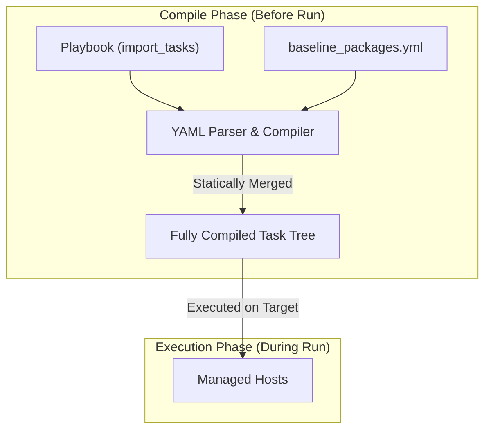
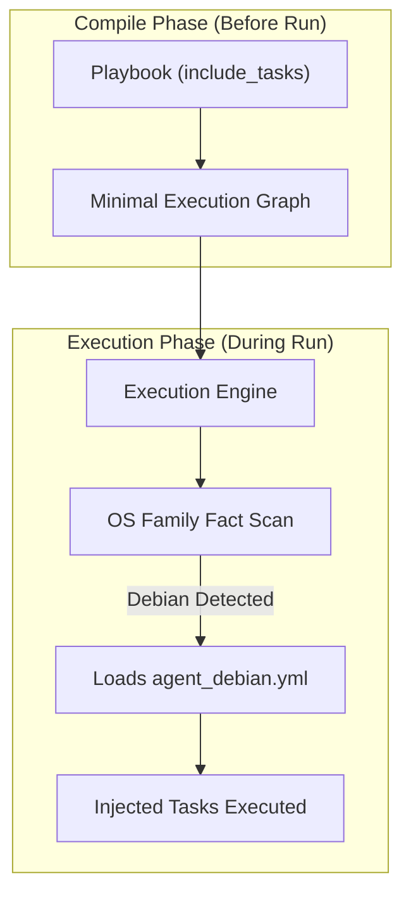

## Table of Contents

1. [The Challenge of Multi-Platform Infrastructure](#the-challenge-of-multi-platform-infrastructure)
2. [Imports versus Includes at a Glance](#imports-versus-includes-at-a-glance)
3. [Parse-Time Loading: Static Imports](#parse-time-loading-static-imports)
4. [Runtime Loading: Dynamic Includes](#runtime-loading-dynamic-includes)
5. [Roles as Reuse: Importing versus Including Roles](#roles-as-reuse-importing-versus-including-roles)
6. [The Impact on Playbook Features](#the-impact-on-playbook-features)
7. [Static Analysis and Linting Safeguards](#static-analysis-and-linting-safeguards)
8. [Collections and Fully Qualified Names](#collections-and-fully-qualified-names)
9. [Under the Hood: Module Name Resolution](#under-the-hood-module-name-resolution)
10. [Choosing the Right Timing](#choosing-the-right-timing)
11. [Putting It All Together](#putting-it-all-together)
12. [What's Next](#whats-next)

## The Challenge of Multi-Platform Infrastructure

In any corporate enterprise, the production server fleet is rarely homogeneous. A single infrastructure pipeline might deploy to some machines running Debian-based operating systems, other machines running Red Hat Enterprise Linux, and perhaps serverless cloud containers.

When configuring a system service, such as a monitoring agent, administrators encounter platform-specific differences. Debian systems use the `apt` package manager and store service configuration files in `/etc/default/`; Red Hat systems use the `dnf` package manager and store the same configuration variables in `/etc/sysconfig/`.

If developers try to write a single, monolithic playbook that handles all platforms inline using continuous conditional tasks, the playbook becomes unreadable. A task list with dozens of `when: ansible_facts['os_family'] == 'Debian'` statements scattered throughout introduces cognitive load.

To solve this, Ansible provides reuse mechanisms that split large task files into smaller, platform-specific subfiles. However, when organizing this reused content, developers must choose between static imports and dynamic includes. This choice determines whether Ansible loads the task structure early, while parsing the playbook, or waits until execution reaches the include task.

## Imports versus Includes at a Glance

The following playbook shows how both static imports and dynamic includes are invoked within the same task list to manage system configuration tasks:

```yaml
- name: Configure enterprise system agents
  hosts: all
  become: true
  tasks:
    - name: Statically compile baseline system packages
      ansible.builtin.import_tasks: baseline_packages.yml

    - name: Dynamically include operating system tasks
      ansible.builtin.include_tasks: "agent_{{ ansible_facts['os_family'] | lower }}.yml"
```

The baseline tasks file (`baseline_packages.yml`) contains generic system utilities:

```yaml
- name: Install common system diagnostics
  ansible.builtin.apt:
    name: ["curl", "htop", "sysstat"]
    state: present
```

The platform-specific tasks file (`agent_debian.yml`) contains Debian package setup:

```yaml
- name: Install Debian monitoring packages
  ansible.builtin.apt:
    name: ["monitoring-agent-deb"]
    state: present
```

## Parse-Time Loading: Static Imports

When you use the `import_tasks` module, Ansible treats the referenced file as static reuse. Before normal task execution reaches the managed hosts, Ansible reads the imported YAML file, parses its contents, and expands the import statement into the actual tasks defined inside the file.

This is why static imports are visible to playbook inspection commands. The imported tasks are known early enough for Ansible to list them and apply task-level keywords to the expanded tasks.

Because this compilation happens early, static imports carry several technical constraints. You cannot use variables that are registered during runtime task execution to define the name of the imported file. The filename must be static or derived from variables known at compile time, such as playbook vars or inventory variables. If you apply a conditional `when` statement or a tag to an `import_tasks` block, the control plane duplicates that condition and applies it to every task compiled from the imported file, so every child task inherits the parent constraint. Because Ansible parses the tasks early, missing files and YAML syntax problems are usually caught before those tasks execute, though module-specific failures can still depend on runtime data and target state.

Static imports are highly predictable. They provide a stable, unchanging execution blueprint that is fully transparent to static analysis tools.



## Runtime Loading: Dynamic Includes

In contrast, when you use the `include_tasks` module, Ansible treats the inclusion as an active task. It places the include task into the execution queue, then loads the referenced file when that task is reached.

When execution reaches the include task for a host, Ansible evaluates the task parameters in that host's context. If the include task passes its conditional `when` guards, the control plane reads the file, parses its YAML structure, and adds the included tasks to that host's execution path.

This allows different target hosts to load different files or skip inclusion entirely based on facts, registered variables, or other runtime conditions.

This deferral enables advanced runtime flexibility. You can use variables gathered from the target host (such as `ansible_facts`) or registered from previous tasks to dynamically generate the filename of the included file, so a single include statement can load different task files on different hosts in the same run. If a conditional check on the `include_tasks` statement evaluates to false, the target file is never read from the control node filesystem at all, which is highly efficient when some files contain modules installed only on specific target platforms. Because the included tasks are parsed in-memory when the include is reached, the system can adapt its execution structure based on the success or failure of preceding tasks.

The trade-off for this flexibility is a loss of early visibility. Because the control plane does not know which tasks exist inside the included file until it reaches the include statement during execution, static validation tools and playbook inspection flags cannot view the included tasks before the run begins.



## Roles as Reuse: Importing versus Including Roles

Just as individual task files can be loaded statically or dynamically, entire Ansible roles can also be imported or included within a playbook's task list.

### Static Role Imports

Using `ansible.builtin.import_role` loads the target role statically. Ansible exposes the role's tasks, defaults, vars, and handlers early enough that the imported role behaves much like a role listed under the play's `roles:` section.

Static role imports are predictable and easier to inspect with list commands. However, you cannot use runtime host facts to determine which role to import.

### Dynamic Role Includes

Using `ansible.builtin.include_role` defers the loading of the role until the execution engine reaches that task during the live run. This allows you to conditionally execute different roles on different hosts depending on runtime criteria.

For example, you might include a database configuration role only if a port scan task reveals that a database service is active on the target machine:

```yaml
- name: Include database configuration role if service is present
  ansible.builtin.include_role:
    name: database_config
  when: database_port_detected | default(false)
```

When a role is dynamically included, its tasks are loaded when the include task runs. By default, `include_role` does not expose the role's `defaults` and `vars` to the rest of the play; set `public: true` only when later tasks intentionally need those values.

## The Impact on Playbook Features

The choice between static imports and dynamic includes has profound implications for how core Ansible features behave. Understanding these differences is essential to preventing unexpected results in production pipelines.

### Playbook Inspection Flags

When auditing an automated deployment, administrators often run the playbook using the `--list-tasks` or `--list-tags` command-line flags. These flags execute a dry-run analysis on the control plane, listing all planned actions without modifying any managed systems.

If the playbook uses `import_tasks` or `import_role`, the compilation engine expands the import files, and the command-line output lists every task contained within those files.

If the playbook uses `include_tasks` or `include_role`, the output lists the include task itself. The tasks located inside the included file are not visible in that early listing because Ansible has not reached the include and loaded the file.

### Tag Resolution

Tags allow administrators to execute a small subset of tasks in a large playbook by passing the `--tags` parameter on the command line.

When a tag is applied to a static `import_tasks` statement, the compilation engine applies that tag to every task extracted from the imported file. The tasks are fully indexed, and passing the tag on the command line will execute only those specific tasks.

When a tag is applied to a dynamic `include_tasks` statement, the tag is only bound to the include task itself. If you pass that tag on the command line, Ansible executes the include task, opens the file, and then runs only the tasks inside the included file that also match the active tag selection.

Furthermore, if you apply a tag to a task *inside* an included file, but do not tag the parent `include_tasks` statement, running the playbook with that tag can skip the include task itself. If you want tag inheritance for dynamic includes, use the `apply` keyword or wrap the include in a tagged block.

### Loop Boundaries

Ansible tasks can execute repeatedly using the `loop` parameter.

You cannot apply a loop to an `import_tasks` statement. Static imports are expanded before task execution, so loops belong on dynamic includes instead.

You can apply a loop to an `include_tasks` statement. When the loop runs, the engine executes the include task once for each item in the list, dynamically parsing and executing the target file repeatedly with the corresponding item bound to the loop context.

### Handler Resolution and Notification

The timing differences also affect how notification handlers are processed. Handlers are special tasks executed at the end of a play when notified by standard tasks.

When you use `import_tasks` inside the playbook's `handlers` section, Ansible loads the handler tasks early. Each task inside the imported file is registered as an active handler in the handler namespace. Any task in the main playbook can notify these individual tasks directly by their name.

When you use `include_tasks` inside the `handlers` section, the individual tasks inside the included file are not registered in the handler namespace at startup. Because the file has not yet been opened or parsed, the execution engine does not know the names of the inner tasks. Consequently, standard tasks cannot notify the inner tasks by name; they can only notify the parent `include_tasks` task itself, which will dynamically load and execute the subfile when the handler runs.

## Static Analysis and Linting Safeguards

In enterprise engineering organizations, infrastructure code is put through automated quality gates before it is merged into production branches. A key tool in this validation pipeline is `ansible-lint`, which evaluates security rules, deprecation warnings, and style constraints.

Using static imports (`import_tasks`) gives static analysis tools better visibility. Because the files are loaded early, `ansible-lint` can usually trace module calls, privilege escalation parameters, and file permission declarations more easily.

Dynamic includes (`include_tasks`) present a challenge for static code analyzers. When the filename of an included file is generated dynamically using runtime host facts, such as `"agent_{{ ansible_facts['os_family'] | lower }}.yml"`, the linting tool cannot predict which files will be opened at runtime. As a result, it cannot validate the tasks inside those files during the pull request validation check. To maintain robust quality gates, developers using dynamic includes must supply explicit linter hints or configure the CI pipeline to run syntax checks against all task files in isolation.

## Collections and Fully Qualified Names

As you split playbooks into modular files, the tasks inside those files will reference various Ansible modules. To ensure that these modules are resolved reliably, you should use their Fully Qualified Collection Names, or FQCNs.

Ansible distributes its modules inside structured packages called collections. For example, the core modules ship in the `ansible.builtin` collection, while community-supported utilities ship in namespaces like `community.general`.

Using the FQCN, such as `ansible.builtin.template` instead of simply `template`, eliminates a category of ambiguity that grows larger as a project installs more collections. If a third-party collection defines a module named `copy` that behaves differently from the standard file copier, the FQCN tells Ansible exactly which module to load, preventing silent behavior changes. It also makes it straightforward to navigate directly to the correct official module documentation, and developers reviewing the code immediately understand the module's origin without needing to trace the active collection search path.

A modular project should also list its external collection requirements inside a `collections/requirements.yml` file, specifying precise versions to prevent breaking changes in production when a new control node is provisioned.

```yaml
# collections/requirements.yml
collections:
  - name: community.general
    version: ">=8.0.0,<9.0.0"
  - name: ansible.posix
    version: "1.5.4"
```

## Under the Hood: Module Name Resolution

To understand why Fully Qualified Collection Names are a critical standard, we must look at how the execution engine searches for modules.

If a playbook uses short, unqualified module names, such as `template` or `copy`, the loader is forced to run a multi-step search path resolution loop. At the play level, developers can define a `collections` keyword that establishes a search priority list, similar to the `$PATH` environment variable in Unix operating systems.

```yaml
- name: Apply systems changes
  hosts: all
  collections:
    - community.general
    - ansible.builtin
  tasks:
    - name: Run a generic package task
      apt:
        name: htop
```

When resolving the `apt` name, the execution engine must decide which collection provides that short name:
1. It checks if `community.general.apt` exists.
2. If not found, it checks if `ansible.builtin.apt` exists.
3. If still not found, it queries other installed collection namespaces in order of priority.

The main risk is not a benchmark-level delay; it is ambiguity. By referencing the FQCN directly, you make the module source explicit and avoid surprises when a project installs more collections later.

## Choosing the Right Timing

Deciding whether to use static imports or dynamic includes should not be based on personal preference. Instead, it should be guided by a clear technical decision tree:

Use `import_tasks` or `import_role` when:
- The task list represents a stable, unchanging series of steps that always executes on every host.
- You want to see all tasks listed when running audit commands like `--list-tasks`.
- You want to apply tags to specific tasks inside the subfile and run them independently.
- You want earlier syntax and structure feedback before the imported tasks execute.

Use `include_tasks` or `include_role` when:
- The task file to load depends on runtime facts, such as the operating system or processor architecture of the managed host.
- The name of the file to load is computed dynamically from variables registered during earlier tasks.
- You need to execute the task list repeatedly using a `loop` statement.
- You are configuring complex, conditional error-recovery handlers that should only be parsed if an active failure occurs.

By matching the reuse mechanism to the timing requirements of the playbook, you keep your infrastructure codebase both flexible and highly predictable.

## Putting It All Together

Organizing multi-platform server configurations requires separating generic system orchestration from platform-specific tasks. Ansible facilitates this modular architecture by allowing playbooks to import or include external task files.

The key to successful reuse is understanding the timing:

| Feature | Static Imports (`import_tasks`) | Dynamic Includes (`include_tasks`) |
| :--- | :--- | :--- |
| **Parsing Time** | Parse time, before normal task execution | Runtime, when the include task is reached |
| **Filename Variable** | Static or known early | Runtime variables or facts can be used |
| **Tag Inheritance** | Inherited by child tasks | Not inherited by default; use `apply` or a block when needed |
| **Loop Support** | Unsupported | Supported |
| **Inspection (`--list`)** | Visible in task listings | The include is visible; inner tasks are loaded later |
| **Validation** | Parsed earlier on the control plane | Parsed when the include is reached |
| **Handler Notification** | Individual imported tasks can be notified | Only the parent include task can be notified |

By choosing static imports for stable system structures and dynamic includes for platform-specific variations, you build an automation framework that is easier to audit, validate, and adapt across different host environments.

---

**References**

- [Reusing Ansible Artifacts](https://docs.ansible.com/ansible/latest/playbook_guide/playbooks_reuse.html) - Official guide covering the full reuse model, including when to use imports, includes, and roles.
- [Statically Importing Tasks](https://docs.ansible.com/ansible/latest/collections/ansible/builtin/import_tasks_module.html) - Module reference for `import_tasks`, including parameter options and parse-time behavior.
- [Dynamically Including Tasks](https://docs.ansible.com/ansible/latest/collections/ansible/builtin/include_tasks_module.html) - Module reference for `include_tasks`, covering runtime loading, loops, and conditional inclusion.
- [Statically Importing Roles](https://docs.ansible.com/ansible/latest/collections/ansible/builtin/import_role_module.html) - Module reference for `import_role` and how static role loading differs from the `roles:` key.
- [Dynamically Including Roles](https://docs.ansible.com/ansible/latest/collections/ansible/builtin/include_role_module.html) - Module reference for `include_role`, including the `public` parameter for exposing role variables.
- [Ansible Collections Guide](https://docs.ansible.com/ansible/latest/collections_guide/index.html) - Covers installing, requiring, and using collections, including the `requirements.yml` format.
- [Tags in Playbooks](https://docs.ansible.com/projects/ansible/latest/playbook_guide/playbooks_tags.html) - Explains tag inheritance differences between static imports and dynamic includes.
