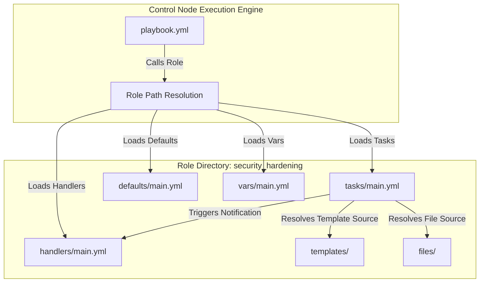

## Table of Contents

1. [The Problem: Monolithic Playbooks](#the-problem-monolithic-playbooks)
2. [Structuring a Role](#structuring-a-role)
3. [Conventional Directory Layout](#conventional-directory-layout)
4. [Under the Hood: Role Path Resolution](#under-the-hood-role-path-resolution)
5. [Defaults versus Vars: The Precedence Boundary](#defaults-versus-vars-the-precedence-boundary)
6. [Variable Namespacing and Namespace Pollution](#variable-namespacing-and-namespace-pollution)
7. [Asserting Required Inputs](#asserting-required-inputs)
8. [Role Dependencies and the Metadata Layer](#role-dependencies-and-the-metadata-layer)
9. [Putting It All Together](#putting-it-all-together)
10. [What's Next](#whats-next)

## The Problem: Monolithic Playbooks

When a system administration team first adopts Ansible, playbooks usually start as single files. A playbook designed to harden server security might begin by installing a firewall, editing the secure shell daemon configuration, setting up file integrity monitoring, and restarting the corresponding system services. This single-file approach works well when managing a small, uniform fleet of servers.

As the organization grows, other departments start using the same security playbook. The core engineering team, the database administration group, and the marketing operations team all have different requirements. For example, database hosts might need specific network ports left open, while public-facing web servers require strict firewall exclusions.

If the organization continues using the single-file playbook, developers are forced to copy and paste hundreds of lines of task blocks, variable definitions, and handlers into new playbook files. This copy-paste workflow introduces configuration drift. When a new security vulnerability requires an immediate change to the secure shell configuration, administrators must search through dozens of independent playbooks to apply the patch manually.

Ansible roles solve this problem by organizing automation into reusable directory structures. A role is a self-contained package of tasks, variables, templates, files, and handlers. By separating the generic system logic from environment-specific values, teams can share a single, hardened role across the entire organization without duplicating code.

## Structuring a Role

To understand how a role isolates automation details, we must look at how a playbook calls a role and how the role organizes its internal components.

The following playbook applies a security hardening role to target web hosts. It passes only the high-level configuration parameters, leaving the low-level operating system actions to the role itself.

```yaml
- name: Apply security hardening to web servers
  hosts: webservers
  become: true
  roles:
    - role: security_hardening
      vars:
        security_hardening_ssh_port: 2222
        security_hardening_allowed_groups: ["admin", "webops"]
```

Inside the `security_hardening` role, the tasks are separated from default values and file templates. The main task list in `roles/security_hardening/tasks/main.yml` contains only the high-level module invocations.

```yaml
- name: Install system security packages
  ansible.builtin.apt:
    name: "{{ security_hardening_packages }}"
    state: present
    update_cache: true

- name: Configure secure shell daemon
  ansible.builtin.template:
    src: sshd_config.j2
    dest: /etc/ssh/sshd_config
    owner: root
    group: root
    mode: "0600"
  notify: Restart secure shell daemon

- name: Initialize host firewall
  ansible.builtin.template:
    src: ufw_rules.j2
    dest: /etc/ufw/user.rules
    owner: root
    group: root
    mode: "0640"
  notify: Reload host firewall
```

The default variables that configure these tasks are stored in `roles/security_hardening/defaults/main.yml`.

```yaml
security_hardening_ssh_port: 22
security_hardening_allowed_groups: ["admin"]
security_hardening_packages: ["ufw", "fail2ban", "auditd"]
```

The internal constants that should not be changed by callers are stored in `roles/security_hardening/vars/main.yml`.

```yaml
security_hardening_sshd_service: sshd
security_hardening_firewall_service: ufw
```

## Conventional Directory Layout

Ansible expects roles to follow a strict, conventional directory layout. When a role is called, the execution engine automatically searches for specific subdirectories and files within the role directory. You do not need to write explicit import or include statements to load these files.

A fully structured role contains the following standard directories:

```text
roles/
  security_hardening/
    defaults/
      main.yml
    vars/
      main.yml
    tasks/
      main.yml
    handlers/
      main.yml
    templates/
      sshd_config.j2
      ufw_rules.j2
    files/
      audit_rules.conf
    meta/
      main.yml
```

Each directory in this structure has a dedicated purpose:
- **defaults**: Contains low-precedence default variables. These variables serve as the public input contract for the role, allowing callers to easily customize behavior.
- **vars**: Contains high-precedence variables. These are internal constants that are tightly coupled to the role implementation and should not be modified by external playbooks.
- **tasks**: Contains the sequential list of tasks executed when the role is called. The `main.yml` file is the entry point.
- **handlers**: Contains service reload or restart triggers. Tasks inside the role can notify these handlers when changes are made.
- **templates**: Contains Jinja2 configuration templates. The `template` module resolves source files inside this folder automatically.
- **files**: Contains static files that are copied to the managed hosts without modification. The `copy` module resolves files inside this directory.
- **meta**: Contains role metadata, including author information, license terms, supported operating systems, and dependencies on other roles.

This layout makes the automation codebase predictable. If a security auditor requests a change to the secure shell configuration template, a developer knows immediately to open `templates/sshd_config.j2`. If a service fails to restart, the developer inspects `handlers/main.yml`.



## Under the Hood: Role Path Resolution

When Ansible parses a playbook containing a `roles` declaration, it must resolve the symbolic name of each role to a filesystem path. The control plane searches the places where Ansible roles are allowed to live on the control node.

For ordinary project roles, the most important location is the `roles/` directory beside the active playbook. If the playbook is located at `/srv/ansible/site.yml`, a project role named `security_hardening` normally lives at `/srv/ansible/roles/security_hardening/`.

Ansible also consults the configured `roles_path`, which can come from `ansible.cfg`, the `ANSIBLE_ROLES_PATH` environment variable, or Ansible's defaults. This setting often points to shared role repositories, such as `~/.ansible/roles/`, `/usr/share/ansible/roles/`, or `/etc/ansible/roles/`.

If the role is packaged inside an Ansible collection and you call it by its fully qualified collection name, such as `acme.platform.security_hardening`, Ansible resolves it from the installed collection paths instead of treating it as a local project role.

Once a matching directory is found, the absolute path is bound to an internal variable named `role_path`. All subsequent module calls within the role resolve relative paths using this `role_path` boundary.

For example, when a task in `tasks/main.yml` invokes the `template` module with `src: sshd_config.j2`, Ansible does not search the playbook directory or the current working directory. Instead, the engine prefixes the source parameter with the role path, resolving it directly to `role_path/templates/sshd_config.j2`.

This path resolution mechanism makes roles mostly self-contained. A role can be copied to a different control node, checked out into a temporary continuous integration directory, or installed via Ansible Galaxy, and it can still resolve its templates and files without relying on relative path helpers like `../../` inside the task definitions.

## Defaults versus Vars: The Precedence Boundary

One of the most common points of confusion when structuring roles is the difference between `defaults/main.yml` and `vars/main.yml`. Both directories store key-value variable definitions using identical YAML syntax. However, their positions within Ansible's variable precedence hierarchy are completely opposite.

Ansible uses a documented precedence hierarchy to resolve variable values during execution. The location of a variable determines its strength when competing against other variables with the same name.

Variables defined in `defaults/main.yml` occupy the weakest role variable tier. This means role defaults are intentionally easy to override. Inventory variables, group variables, host variables, playbook variables, and command-line extra variables can replace a role default.

This weakness is a deliberate design feature. Role defaults act as the public input contract for the role. By placing default values in `defaults/main.yml`, the role author provides a safe, working fallback that allows the role to run out of the box in a development or staging sandbox. Callers can customize the role's behavior by overriding these defaults in their environment inventories or playbooks.

Variables defined in `vars/main.yml` have much stronger precedence than role defaults. They can override inventory values and many ordinary playbook values, which makes them a poor home for public configuration knobs.

Because role variables are strong, they should be used sparingly for internal constants. These are values that are mandatory for the role's internal operations and are not intended as normal caller inputs. For example, if a role is designed specifically to manage Nginx on a Debian platform, the path to the system configuration file may always be `/etc/nginx/nginx.conf`. Storing this path in `vars/main.yml` makes accidental inventory overrides much less likely.

The table below illustrates this precedence boundary:

| Parameter Type | Location | Precedence Strength | Caller Overridable | Architectural Purpose |
| :--- | :--- | :--- | :--- | :--- |
| **Role Defaults** | `defaults/main.yml` | Weakest | Yes, easily | Public configuration knobs, safe fallbacks, documentation of inputs. |
| **Role Vars** | `vars/main.yml` | Strong | Difficult for normal callers | Internal constants, platform-specific paths, private architectural settings. |

If you place a public configuration parameter, such as the secure shell port, inside `vars/main.yml`, a user trying to apply the role will find that their inventory overrides are ignored. This leads to frustration and forces users to modify the role's source code directly, breaking the principal benefit of reuse.

## Variable Namespacing and Namespace Pollution

Unlike programming languages with small function-local scopes, Ansible variables are often visible through a broad host variable context. When a playbook calls roles, generic variable names from different roles can compete with each other.

This shared context introduces the risk of namespace pollution and variable collisions. If two different roles define a generic variable name like `port` or `service_name`, a stronger or later-loaded value can override the value another role expected. This can cause silent failures, where one service is configured using the network port intended for a completely different service.

To prevent namespace pollution, role authors must enforce namespacing by prefixing every variable, default, and handler name with the exact name of the role.

Consider the following bad example, where a role uses generic variable names:

```yaml
# Inside roles/security_hardening/defaults/main.yml (Bad)
ssh_port: 22
allowed_groups: ["admin"]
packages: ["ufw", "fail2ban"]
```

If another role in the same playbook, such as `database_setup`, also defines `packages` or `allowed_groups`, the values will collide.

The corrected example applies the role name as a prefix:

```yaml
# Inside roles/security_hardening/defaults/main.yml (Good)
security_hardening_ssh_port: 22
security_hardening_allowed_groups: ["admin"]
security_hardening_packages: ["ufw", "fail2ban"]
```

Enforcing this prefix pattern provides several structural benefits:
- **Collision Reduction**: Variables are much less likely to collide, even when a playbook executes dozens of different roles.
- **Searchability**: Developers can search the entire repository for the prefix `security_hardening_` to locate every file, template, and inventory entry that configures the role.
- **Self-Documentation**: When a developer reads an environment inventory file, the prefix makes it immediately clear which role will consume each variable.

Namespacing should also be applied to handler names. When a task calls the `notify` directive, Ansible searches for a matching handler name or listen topic. If two roles define a handler named `Restart service`, the notification can become ambiguous during review and may trigger the wrong operational action. Prefixing handler names, such as `Restart security_hardening sshd`, keeps notifications easier to trace.

## Asserting Required Inputs

While role defaults provide safe fallbacks, some configuration parameters are too sensitive or environment-specific to have a default value. For example, a security hardening role might require a custom list of trusted administrative IP addresses, or an application deployment role might require a unique database password.

Leaving these variables undefined in `defaults/main.yml` is a good practice, but if a caller runs the playbook without supplying a value, the execution will fail midway through the run. A task deep inside the role will attempt to reference the undefined variable, resulting in an abrupt failure that can leave the target host in a partially configured state.

To prevent these partial failures, you should use the `ansible.builtin.assert` module at the very beginning of the role's task list to validate that all required inputs are present and meet the expected format.

The following example shows how to write a safety assertion block in `roles/security_hardening/tasks/main.yml`:

```yaml
- name: Validate that required security inputs are provided
  ansible.builtin.assert:
    that:
      - security_hardening_allowed_groups is defined
      - security_hardening_allowed_groups | length > 0
      - security_hardening_ssh_port is integer
      - security_hardening_ssh_port >= 1 and security_hardening_ssh_port <= 65535
    fail_msg: "The security_hardening role requires valid allowed groups and a port between 1 and 65535."
    quiet: true
```

By placing this assertion as the first task in `tasks/main.yml`, the role evaluates the caller's inputs before making any modifications to the target host. If a required variable is missing or contains an invalid port number, the play terminates immediately on the control plane, keeping the remote host safe from incomplete configuration.

Using assertions also documents the role's expectations. Instead of reading through hundreds of lines of templates to find what variables are required, a user can inspect the assertion block to see the validation rules.

## Role Dependencies and the Metadata Layer

In some system configurations, a role cannot function properly without another role executing first. For example, a security hardening role might require a base operating system package repository configuration role to have completed its work.

Ansible supports role dependencies using the `meta/main.yml` file located within the role directory structure. The metadata layer allows the role author to declare that another role must be loaded and executed automatically before the parent role starts.

```yaml
# Inside roles/security_hardening/meta/main.yml
dependencies:
  - role: os_base_repos
    vars:
      os_base_repos_enable_updates: true
```

When the execution engine encounters a role containing dependency declarations, it resolves them recursively and runs the dependency roles before the role that declared them. Ansible also tracks role dependencies so the same dependency is not run repeatedly in the same context unless the role configuration requires a separate run.

While dependencies are highly powerful, they must be used with caution to avoid architectural problems:
- **Circular Dependencies**: If role A depends on role B, and role B depends on role A, the execution engine will detect the circular reference and halt with a compiler error to prevent an infinite loop.
- **Hidden Execution**: When a playbook calls a single role, but that role silently imports five other roles through dependencies, the playbook reader loses visibility into what changes are actually being applied to their servers.
- **Variable Overwrites**: Dependent roles share the host variable context, which increases the likelihood of variable collisions if namespacing prefixes are not maintained.

For simple environments, declaring dependencies explicitly within the playbook's `roles` list is often cleaner than nesting them inside the metadata layer. Listing roles sequentially in the playbook, such as applying `os_base_repos` followed by `security_hardening`, makes the execution order immediately visible to anyone reviewing the repository.

## Putting It All Together

Structuring playbooks into reusable roles changes how systems automation is managed across an organization. Instead of maintaining large, fragile files, teams compile self-contained modules that follow a predictable directory layout.

This modular structure relies on four main principles:
- **Path Isolation**: The control plane resolves all internal templates, files, and handlers relative to the resolved `role_path`, eliminating the need for complex relative path statements.
- **Precedence Discipline**: Safe public defaults live in `defaults/main.yml`, while internal paths and operating system constants can live in `vars/main.yml`.
- **Namespace Cleanliness**: Prefixing variables, defaults, and handlers with the role name reduces collisions in Ansible's shared host variable context.
- **Dependency Awareness**: Using `meta/main.yml` to specify structural prerequisites while maintaining explicit sequential plays when visibility is preferred.

By enforcing these boundaries, you transform raw configuration files into a reliable infrastructure platform. Different teams can invoke the same security hardening role, passing custom variable overrides through their environments while trusting that the underlying system logic remains standardized, audited, and safe.

---

**References**

- [Ansible Roles Documentation](https://docs.ansible.com/ansible/latest/playbook_guide/playbooks_reuse_roles.html)
- [Understanding Variable Precedence](https://docs.ansible.com/ansible/latest/reference_appendices/general_precedence.html)
- [Using Assertions for Playbook Validation](https://docs.ansible.com/ansible/latest/collections/ansible/builtin/assert_module.html)
- [Role Dependencies and Metadata](https://docs.ansible.com/ansible/latest/playbook_guide/playbooks_reuse_roles.html#role-dependencies)
