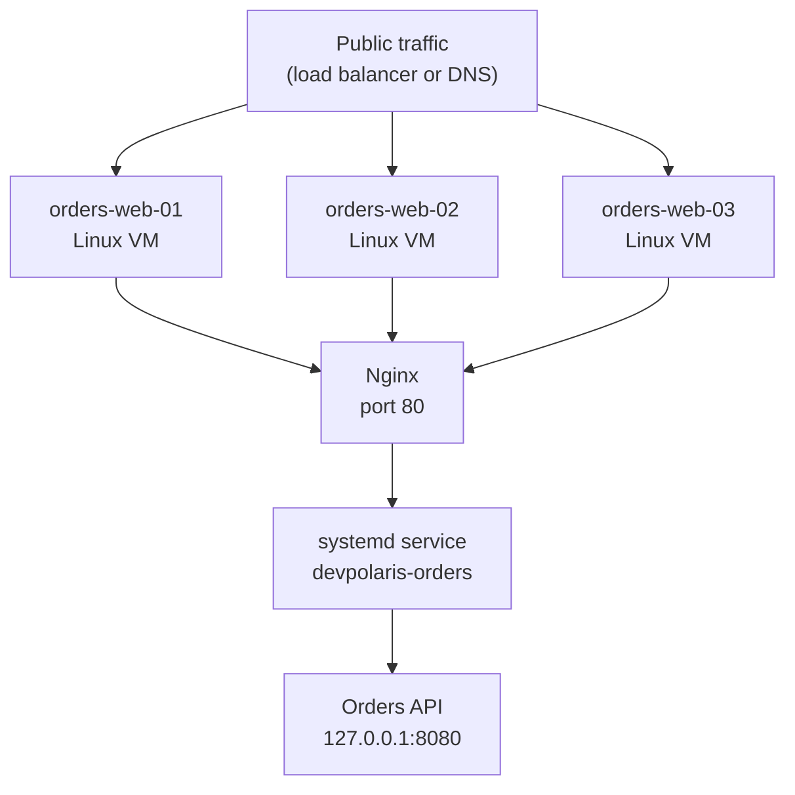

## Table of Contents

1. [What Safe Rollout Controls Are](#what-safe-rollout-controls-are)
2. [The Running Example](#the-running-example)
3. [The Risk Before You Type Enter](#the-risk-before-you-type-enter)
4. [Check Mode: Asking What Would Change](#check-mode-asking-what-would-change)
5. [Diff Mode: Reading File Changes Before They Land](#diff-mode-reading-file-changes-before-they-land)
6. [Limits: Choosing the First Host on Purpose](#limits-choosing-the-first-host-on-purpose)
7. [Serial: Rolling Through the Fleet in Batches](#serial-rolling-through-the-fleet-in-batches)
8. [Health Checks Between Batches](#health-checks-between-batches)
9. [Where Check Mode Can Mislead You](#where-check-mode-can-mislead-you)
10. [A Beginner-Safe Rollout Path](#a-beginner-safe-rollout-path)
11. [Failure Signals and Fix Directions](#failure-signals-and-fix-directions)
12. [Practical Habits for Reviewable Releases](#practical-habits-for-reviewable-releases)

## What Safe Rollout Controls Are

Changing one Linux VM by hand is usually easy. Changing six VMs in the same way, while Nginx
keeps accepting traffic and systemd keeps the application process alive, is where small mistakes
become service problems. Ansible gives you controls that let you slow that work down without
returning to manual SSH sessions.

A rollout is the act of applying a new configuration or application version to a set of machines.
In Ansible, a safe rollout is not a different product or a special deployment server. It is a
careful way to run ordinary playbooks with preview, scope, batch size, and verification controls.
Those controls help you answer four questions before the change reaches every host:

| Question | Ansible control | What it protects |
|----------|-----------------|------------------|
| What would this playbook change? | `--check` | Accidental file, package, or service changes |
| What exactly would file tasks edit? | `--diff` | Hidden template and config mistakes |
| Which hosts are in the blast radius? | `--limit` and `--list-hosts` | Running against the wrong group |
| How many hosts change at once? | `serial` | Fleet-wide failure from one bad release |

Check mode is Ansible's dry run mode. It asks modules to predict whether they would change the
remote host, then stops before making those changes. Diff mode asks supported modules, most often
file and template modules, to show before-and-after text. A limit narrows the hosts selected by the
playbook. A serial batch tells Ansible to finish the play on a small number of hosts before moving
to the next group.

These controls fit between writing the playbook and trusting the playbook with production. They do
not replace tests, monitoring, reviews, or rollback plans. They give you a safer path for the
moment when code leaves the repository and starts changing Linux machines.

In this article, the running example is `devpolaris-orders`, a small order API running on Linux VMs.
Nginx receives HTTP traffic and proxies it to a local app process managed by systemd. The Ansible
playbook updates the app release directory, renders Nginx and systemd config, restarts the service,
and checks `/healthz` before the next server changes.

## The Running Example

Before looking at commands, place the service in your head. The setup is intentionally plain:
three Linux VMs, one Nginx site, one systemd service, and a release artifact that has already been
built by CI. There is no Kubernetes cluster in this example because the lesson is about Ansible
rollout controls, not container scheduling.



The inventory group is named `orders_web`. Each host has a stable name because stable names make
release evidence easier to read. If a rollout report says `orders-web-02` failed, a junior engineer
can find the same host in inventory, logs, monitoring, and SSH records.

```ini
[orders_web]
orders-web-01 ansible_host=10.20.10.21
orders-web-02 ansible_host=10.20.10.22
orders-web-03 ansible_host=10.20.10.23

[orders_web:vars]
ansible_user=deploy
ansible_become=true
app_name=devpolaris-orders
app_port=8080
```

The playbook is also small on purpose. It copies a release artifact into `/opt/devpolaris-orders`,
renders a systemd unit, renders an Nginx site, reloads Nginx when the site changes, restarts the
orders service when the app or unit changes, and then checks the local health endpoint. The exact
artifact source does not matter here. The safe rollout pattern would be the same if CI produced a
tar file, a Debian package, or a checked-out release directory.

Here is the shape of the playbook. The later sections will focus on how to run it, not every task
inside it.

```yaml
---
- name: Roll out devpolaris-orders on Linux VMs
  hosts: orders_web
  become: true
  serial: 1
  vars:
    app_name: devpolaris-orders
    app_user: devpolaris
    release_version: "2026.05.05.1"
    release_root: "/opt/devpolaris-orders"
    current_path: "/opt/devpolaris-orders/current"
    health_url: "http://127.0.0.1:8080/healthz"

  handlers:
    - name: Reload nginx
      ansible.builtin.service:
        name: nginx
        state: reloaded

    - name: Restart orders service
      ansible.builtin.systemd_service:
        name: devpolaris-orders
        state: restarted
        daemon_reload: true

  tasks:
    - name: Create release directory
      ansible.builtin.file:
        path: "{{ release_root }}/releases/{{ release_version }}"
        state: directory
        owner: "{{ app_user }}"
        group: "{{ app_user }}"
        mode: "0755"

    - name: Unpack release artifact
      ansible.builtin.unarchive:
        src: "artifacts/devpolaris-orders-{{ release_version }}.tar.gz"
        dest: "{{ release_root }}/releases/{{ release_version }}"
        owner: "{{ app_user }}"
        group: "{{ app_user }}"

    - name: Point current symlink at the new release
      ansible.builtin.file:
        src: "{{ release_root }}/releases/{{ release_version }}"
        dest: "{{ current_path }}"
        state: link
      notify: Restart orders service

    - name: Render systemd unit
      ansible.builtin.template:
        src: templates/devpolaris-orders.service.j2
        dest: /etc/systemd/system/devpolaris-orders.service
        owner: root
        group: root
        mode: "0644"
      notify: Restart orders service

    - name: Render nginx site
      ansible.builtin.template:
        src: templates/devpolaris-orders.nginx.j2
        dest: /etc/nginx/sites-available/devpolaris-orders.conf
        owner: root
        group: root
        mode: "0644"
      notify: Reload nginx

    - name: Enable nginx site
      ansible.builtin.file:
        src: /etc/nginx/sites-available/devpolaris-orders.conf
        dest: /etc/nginx/sites-enabled/devpolaris-orders.conf
        state: link
      notify: Reload nginx

    - name: Flush handlers before health check
      ansible.builtin.meta: flush_handlers

    - name: Check local health endpoint
      ansible.builtin.uri:
        url: "{{ health_url }}"
        method: GET
        status_code: 200
        return_content: true
      register: health_response
      changed_when: false
```

This is a normal playbook. The safety comes from how you run it and from a few choices inside it:
`serial: 1`, explicit handlers, a health check after the service restarts, and small files that can
be reviewed with `--diff`.

## The Risk Before You Type Enter

The dangerous part of a playbook run is not that Ansible is careless. The dangerous part is that
Ansible is consistent. If the inventory selects the wrong hosts, Ansible will consistently target
the wrong hosts. If the Nginx template points to port `8081` instead of `8080`, Ansible will
consistently render that mistake everywhere it is allowed to run.

That consistency is why Ansible is useful, and it is also why release controls matter. A manual SSH
mistake usually damages one server. A playbook mistake can damage every matching server in the
same minute.

Here are the specific risks in the `devpolaris-orders` rollout:

| Risk | What it looks like | Safer control |
|------|--------------------|---------------|
| Wrong target group | Staging or admin hosts appear in the run | `--list-hosts`, inventory review, `--limit` |
| Bad Nginx template | Nginx reloads, then returns `502 Bad Gateway` | `--check --diff`, `nginx -t`, health check |
| Bad systemd unit | Service fails to restart after daemon reload | `systemctl status`, journal review, health check |
| App release fails | One VM serves errors after the symlink moves | `serial: 1`, stop on failed health check |
| Secret appears in output | Diff prints an environment file value | `diff: false`, vault handling, log review |

The table is not a replacement for understanding the playbook. It gives you a release reading
order. First confirm the target hosts. Then preview changes. Then inspect file diffs. Then change
one host. Then let Ansible move through the rest only after each batch proves it is healthy.

## Check Mode: Asking What Would Change

Check mode starts with a modest promise: Ansible will try to predict changes without applying them.
You run the same playbook with `--check`, and modules that support check mode report whether they
would create a directory, update a template, change a symlink, reload a service, or perform another
action. Modules that do not support check mode may do nothing and may not report useful prediction
data.

That limitation matters, but the command is still one of the best first checks before a rollout.
It lets you compare your expectation with Ansible's plan. If you expected only Nginx and the
systemd unit to change, but the recap says every release directory and symlink would change, the
playbook is telling you to slow down and inspect the variables.

Start with syntax first. A syntax check does not connect to the hosts or execute the play. It only
checks whether Ansible can parse the playbook.

```bash
$ ansible-playbook -i inventories/prod.ini playbooks/deploy-devpolaris-orders.yml --syntax-check

playbook: playbooks/deploy-devpolaris-orders.yml
```

That output is intentionally short. It means Ansible understood the YAML, task structure, and
included files well enough to continue. It does not mean the rollout is safe. A syntactically valid
template can still point Nginx at the wrong port.

Now ask Ansible what would change on one host:

```bash
$ ansible-playbook -i inventories/prod.ini playbooks/deploy-devpolaris-orders.yml \
    --check \
    --limit orders-web-01

PLAY [Roll out devpolaris-orders on Linux VMs] *******************************

TASK [Create release directory] **********************************************
changed: [orders-web-01]

TASK [Unpack release artifact] ************************************************
changed: [orders-web-01]

TASK [Point current symlink at the new release] *******************************
changed: [orders-web-01]

TASK [Render systemd unit] ****************************************************
ok: [orders-web-01]

TASK [Render nginx site] ******************************************************
changed: [orders-web-01]

TASK [Enable nginx site] ******************************************************
ok: [orders-web-01]

TASK [Check local health endpoint] ********************************************
skipping: [orders-web-01]

PLAY RECAP ********************************************************************
orders-web-01 : ok=5 changed=4 unreachable=0 failed=0 skipped=1 rescued=0 ignored=0
```

Read this like a release note written by Ansible. The release directory, artifact, symlink, and
Nginx site would change. The systemd unit and enabled site link already match the desired state.
The health check is skipped because, in check mode, there may be no restarted service to query.

The important detail is not the number `changed=4` by itself. The important detail is whether those
four changes match the release you meant to perform. If you only intended to update the app version
but the Nginx site would also change, `--check` has found something worth reviewing before the
actual rollout.

Check mode also helps with idempotence. Idempotence means running the same automation twice should
leave the system in the same desired state, not keep changing it forever. After a successful
rollout, a check run should usually report little or nothing to change. If it reports the same task
as changed every time, that task may be missing a `creates`, `removes`, stable template value, or
module-specific option that lets Ansible detect current state.

## Diff Mode: Reading File Changes Before They Land

Check mode tells you which tasks would change. Diff mode helps you inspect supported file changes.
The most useful pairing is `--check --diff`, especially with `--limit` so the output stays small.
For `devpolaris-orders`, the Nginx site template is exactly the kind of file you want to inspect.
A one-character port mistake can turn a healthy app into `502` responses.

```bash
$ ansible-playbook -i inventories/prod.ini playbooks/deploy-devpolaris-orders.yml \
    --check --diff \
    --limit orders-web-01

TASK [Render nginx site] ******************************************************
--- before: /etc/nginx/sites-available/devpolaris-orders.conf
+++ after: /Users/senlin/devpolaris/templates/devpolaris-orders.nginx.j2
@@
 server {
     listen 80;
     server_name orders.devpolaris.internal;

     location / {
-        proxy_pass http://127.0.0.1:8081;
+        proxy_pass http://127.0.0.1:8080;
         proxy_set_header Host $host;
         proxy_set_header X-Forwarded-For $proxy_add_x_forwarded_for;
     }
 }
```

This diff tells a useful story. The existing file points Nginx to `8081`, but the playbook would
change it to `8080`. If the systemd unit starts `devpolaris-orders` on `8080`, that is probably the
fix you wanted. If production traffic currently uses `8081`, the diff has found a dangerous
assumption before Ansible reloads Nginx.

Diff output is evidence, but it can also leak sensitive values. Do not use diff mode blindly on
files that contain tokens, database passwords, private keys, or environment variables with secrets.
When a task renders a sensitive file, turn off diff output for that task:

```yaml
- name: Render private environment file
  ansible.builtin.template:
    src: templates/devpolaris-orders.env.j2
    dest: /etc/devpolaris-orders/env
    owner: root
    group: devpolaris
    mode: "0640"
  diff: false
  notify: Restart orders service
```

That `diff: false` line does not stop the task from changing the file. It only stops Ansible from
printing before-and-after content for that task. You still get the task result and the recap, but
you do not risk putting secrets into terminal scrollback, CI logs, or a pasted release report.

Use diff mode for small, reviewable files: Nginx site config, systemd unit files, app config without
secrets, sudoers snippets, cron entries, and other text that a human can inspect. For large files,
binary artifacts, or secret-bearing templates, use checksums, service health, and application logs
instead.

## Limits: Choosing the First Host on Purpose

The `hosts:` line in a playbook selects a group or host pattern from inventory. The `--limit` option
narrows that selection further at run time. That means `hosts: orders_web` can stay broad in the
playbook while the first real run touches only `orders-web-01`.

Before any rollout, ask Ansible which hosts it would run against:

```bash
$ ansible-playbook -i inventories/prod.ini playbooks/deploy-devpolaris-orders.yml \
    --list-hosts

playbook: playbooks/deploy-devpolaris-orders.yml

  play #1 (orders_web): Roll out devpolaris-orders on Linux VMs
    pattern: ['orders_web']
    hosts (3):
      orders-web-01
      orders-web-02
      orders-web-03
```

This command does not execute tasks. It gives you a target list. If a host appears here that should
not receive the release, stop and fix the inventory or playbook pattern. Do not depend on memory
when the terminal can show the exact host list.

Now combine the target preview with a limit:

```bash
$ ansible-playbook -i inventories/prod.ini playbooks/deploy-devpolaris-orders.yml \
    --list-hosts \
    --limit orders-web-01

playbook: playbooks/deploy-devpolaris-orders.yml

  play #1 (orders_web): Roll out devpolaris-orders on Linux VMs
    pattern: ['orders_web']
    hosts (1):
      orders-web-01
```

This is your canary host. A canary is the first small slice of a rollout that proves the release can
survive contact with a real environment. In this VM setup, the canary is one ordinary production
host, not a special platform feature. The value comes from intentionally reducing scope before you
increase it.

You can also limit by inventory group if your inventory has a dedicated group:

```ini
[orders_canary]
orders-web-01

[orders_web]
orders-web-01
orders-web-02
orders-web-03
```

Then the first run can use `--limit orders_canary`. The exact naming is less important than the
practice: make the first host obvious, stable, and easy to identify in logs.

## Serial: Rolling Through the Fleet in Batches

`--limit` controls which hosts are eligible for a run. `serial` controls how many of those hosts
Ansible completes at a time. Without `serial`, Ansible normally runs tasks in parallel across the
selected hosts, using its configured number of forks. The current Ansible command-line reference
shows the default fork count as 5 when it is not overridden, which is enough to change every host in
this three-VM example at once.

For a rollout, that is often too much. If the Nginx template is wrong, all three VMs can start
returning `502`. If the systemd unit has a bad `ExecStart`, all three app processes can fail
together. `serial: 1` makes Ansible finish the whole play on one host before starting the next.

```yaml
- name: Roll out devpolaris-orders on Linux VMs
  hosts: orders_web
  become: true
  serial: 1
```

With three hosts, `serial: 1` produces three batches:

```text
Batch 1: orders-web-01
Batch 2: orders-web-02
Batch 3: orders-web-03
```

Each batch runs through the tasks, handlers, and health check before the next batch starts. That
means the playbook can stop after `orders-web-01` if the service fails there. The other two hosts
keep serving the previous release.

For larger groups, you can use a number, a percentage, or a list. A list gives a nice release shape:
start with one host, then move faster after the first host succeeds.

```yaml
- name: Roll out devpolaris-orders on Linux VMs
  hosts: orders_web
  become: true
  serial:
    - 1
    - 2
    - 25%
```

Read that list as a schedule. The first pass changes one host. The second pass changes two hosts.
Later passes change a quarter of the remaining eligible hosts at a time. For a tiny three-host
service, `serial: 1` is easier to reason about. For a larger fleet, the list form lets you combine
caution at the start with reasonable speed later.

There is a tradeoff here. Smaller batches reduce blast radius, but they make rollouts slower and
can keep the fleet on mixed versions for longer. Larger batches finish faster, but a bad release
can affect more users before the health check catches it. Start small while you are learning the
service, then adjust batch size after the team has reliable health checks and rollback practice.

## Health Checks Between Batches

A serial rollout only helps if a bad batch stops the playbook. For `devpolaris-orders`, the
minimum useful check is the local HTTP health endpoint after systemd and Nginx handlers have run.
The app process listens on `127.0.0.1:8080`, so the playbook checks the app directly on the VM.

```yaml
- name: Flush handlers before health check
  ansible.builtin.meta: flush_handlers

- name: Check local health endpoint
  ansible.builtin.uri:
    url: "http://127.0.0.1:8080/healthz"
    method: GET
    status_code: 200
    return_content: true
  register: health_response
  changed_when: false
```

`meta: flush_handlers` matters because handlers normally run at the end of a play. If the template
task notifies `Restart orders service`, the health check should happen after that restart, not
before it. Flushing handlers here says, "apply any pending restarts now, then test the result."

The health check should be boring and specific. A good `/healthz` endpoint for this service returns
`200` only when the process has started, loaded its config, and can answer basic local requests. It
should not depend on every external system if that would make rollouts fail because of unrelated
network noise. It should still catch the mistakes this playbook can create: wrong port, failed
process, missing config, or a broken app start.

Here is a useful failure shape:

```bash
TASK [Check local health endpoint] ********************************************
fatal: [orders-web-01]: FAILED! => {
    "changed": false,
    "elapsed": 0,
    "msg": "Status code was -1 and not [200]: Request failed: <urlopen error [Errno 111] Connection refused>",
    "url": "http://127.0.0.1:8080/healthz"
}

PLAY RECAP ********************************************************************
orders-web-01 : ok=8 changed=4 unreachable=0 failed=1 skipped=0 rescued=0 ignored=0
```

Connection refused means nothing is listening on that port. The next check is not the Nginx access
log. The next check is systemd, because Nginx is not involved when the playbook talks directly to
`127.0.0.1:8080`.

```bash
$ ssh deploy@orders-web-01 'sudo systemctl status devpolaris-orders --no-pager'
* devpolaris-orders.service - DevPolaris Orders API
     Loaded: loaded (/etc/systemd/system/devpolaris-orders.service; enabled)
     Active: failed (Result: exit-code) since Tue 2026-05-05 14:18:27 UTC; 11s ago
    Process: 18342 ExecStart=/opt/devpolaris-orders/current/bin/orders-api (code=exited, status=203/EXEC)
```

The line `status=203/EXEC` points toward an executable path or permission problem. In this example,
the release artifact might not contain `bin/orders-api`, or the file may not have execute
permission. Because the play uses `serial: 1`, the other hosts have not changed yet.

You can add an Nginx config validation task before reloads too:

```yaml
- name: Validate nginx config
  ansible.builtin.command: nginx -t
  changed_when: false
```

That task catches syntax errors before the handler reloads Nginx. It does not prove the app is
healthy, but it prevents one common failure from reaching traffic.

## Where Check Mode Can Mislead You

Check mode is a simulation, and simulations have boundaries. The most common surprise is a task
that depends on the result of an earlier task. If the earlier task does not run normally in check
mode, the later task may not have the registered data it expects.

For example, imagine this pair of tasks:

```yaml
- name: Ask systemd whether the service exists
  ansible.builtin.command: systemctl cat devpolaris-orders
  register: unit_file
  changed_when: false

- name: Fail if the unit file does not use the current release path
  ansible.builtin.assert:
    that:
      - current_path in unit_file.stdout
```

The command task may be skipped or may not provide the same useful data in check mode, depending on
how it is written and how the module behaves. The assert task then has less information than it
would have during a real run. That does not make check mode useless. It means you should treat check
mode as one signal, not as proof that the real run cannot fail.

There are three beginner-safe ways to handle this:

| Situation | Safer choice | Why it helps |
|-----------|--------------|--------------|
| A task only gathers evidence | Add `check_mode: false` and `changed_when: false` | The task runs in check mode but does not report a change |
| A task would mutate outside Ansible's model | Skip it with `when: not ansible_check_mode` | The preview avoids a misleading or unsafe action |
| A file task might reveal secrets | Add `diff: false` | The run reports change status without printing content |

Here is the evidence-gathering form:

```yaml
- name: Read current systemd unit for validation
  ansible.builtin.command: systemctl cat devpolaris-orders
  register: current_unit
  changed_when: false
  check_mode: false
```

This task runs even during `--check`, but it only reads current system state. It does not restart a
service, edit a file, or install a package. That makes it useful evidence for later checks.

Here is the skip form:

```yaml
- name: Run local health check after restart
  ansible.builtin.uri:
    url: "http://127.0.0.1:8080/healthz"
    status_code: 200
  changed_when: false
  when: not ansible_check_mode
```

The health check only makes sense after a real restart. During `--check`, the new release may not be
present and the service may still be running the old version. Skipping the task avoids a false
failure that teaches the wrong lesson.

When check mode output surprises you, ask which part of the system Ansible could know without
actually changing the host. It can compare a rendered template with an existing file. It can often
predict a directory creation. It cannot fully prove that a future process will start, bind a port,
connect to its dependencies, and pass traffic after a restart.

## A Beginner-Safe Rollout Path

The safest rollout path is a sequence of small questions. Each step should answer one question and
produce evidence you can read. If a step gives an unexpected answer, stop there and fix that layer
before continuing.

Use this path for the `devpolaris-orders` playbook:

| Step | Command | Question answered |
|------|---------|-------------------|
| 1 | `--syntax-check` | Can Ansible parse the playbook? |
| 2 | `--list-hosts` | Which hosts are eligible? |
| 3 | `--check --diff --limit orders-web-01` | What would change on the first host? |
| 4 | `--limit orders-web-01` | Can one production host pass the real rollout? |
| 5 | no extra limit, with `serial: 1` | Can the fleet roll forward one host at a time? |
| 6 | post-run check | Does the fleet still agree on version and health? |

Here are those commands as a terminal session. The line continuations keep each command readable,
but each command is still a normal `ansible-playbook` run.

```bash
$ ansible-playbook -i inventories/prod.ini playbooks/deploy-devpolaris-orders.yml \
    --syntax-check

$ ansible-playbook -i inventories/prod.ini playbooks/deploy-devpolaris-orders.yml \
    --list-hosts

$ ansible-playbook -i inventories/prod.ini playbooks/deploy-devpolaris-orders.yml \
    --check --diff \
    --limit orders-web-01

$ ansible-playbook -i inventories/prod.ini playbooks/deploy-devpolaris-orders.yml \
    --limit orders-web-01

$ ansible-playbook -i inventories/prod.ini playbooks/deploy-devpolaris-orders.yml
```

The fourth command is the first real change. It is also the point where you should have a rollback
path ready. For this example, rollback could mean running the same playbook with the previous
`release_version`, because the symlink model keeps older release directories available.

After the full serial run, check the app version on every host. This can be an Ansible ad hoc
command, a playbook task, or a monitoring query. The important part is that the answer names every
host.

```bash
$ ansible orders_web -i inventories/prod.ini -b -m command \
    -a '/opt/devpolaris-orders/current/bin/orders-api --version'

orders-web-01 | CHANGED | rc=0 >>
devpolaris-orders 2026.05.05.1
orders-web-02 | CHANGED | rc=0 >>
devpolaris-orders 2026.05.05.1
orders-web-03 | CHANGED | rc=0 >>
devpolaris-orders 2026.05.05.1
```

The ad hoc `command` module reports `CHANGED` because it cannot know that reading a version is
harmless unless you tell it in a playbook with `changed_when: false`. Do not overread that word in
ad hoc output. The useful evidence is that each host returns the intended version.

If your team uses a load balancer API, this path can grow one more safety layer. You can remove the
current host from the pool before changing it, then add it back after health passes. Ansible's
delegation model lets a task target the app host while executing the load balancer command from the
control node or another host.

```yaml
- name: Remove host from traffic before local change
  ansible.builtin.command: "/usr/local/bin/lbctl drain {{ inventory_hostname }}"
  delegate_to: localhost
  changed_when: true

- name: Add host back to traffic after health passes
  ansible.builtin.command: "/usr/local/bin/lbctl enable {{ inventory_hostname }}"
  delegate_to: localhost
  changed_when: true
```

Do not add this shape just because it looks mature. Add it when your environment has a real load
balancer operation to perform and when the command is tested. A fake drain step gives you extra
YAML without reducing risk.

## Failure Signals and Fix Directions

A safe rollout article should not pretend that every run succeeds. The value of the preview and
batch controls is that they make failures smaller and easier to diagnose. Here are common failure
signals for the `devpolaris-orders` playbook and the first useful direction for each one.

| Signal | Likely layer | First direction |
|--------|--------------|-----------------|
| `--list-hosts` shows the wrong host | Inventory or host pattern | Fix inventory groups before running tasks |
| `--check --diff` changes an unexpected file | Variables or template | Inspect vars and template inputs |
| Nginx validation fails | Nginx config syntax | Run `nginx -t`, inspect the named file and line |
| Health endpoint returns connection refused | systemd or app process | Check `systemctl status` and journal logs |
| Health endpoint returns `502` through Nginx | Nginx upstream or app port | Compare Nginx `proxy_pass` with systemd app port |
| Later batches never start | Failed first batch | Keep the fleet on old version while fixing canary |

Here is a realistic Nginx failure after a bad template edit:

```bash
TASK [Validate nginx config] **************************************************
fatal: [orders-web-01]: FAILED! => {
    "changed": false,
    "cmd": ["nginx", "-t"],
    "rc": 1,
    "stderr": "nginx: [emerg] invalid number of arguments in \"proxy_set_header\" directive in /etc/nginx/sites-enabled/devpolaris-orders.conf:9\nnginx: configuration file /etc/nginx/nginx.conf test failed"
}
```

The useful part is the file and line:
`/etc/nginx/sites-enabled/devpolaris-orders.conf:9`. That tells you to inspect the rendered file,
not the whole server. If this appeared during the canary run, `serial: 1` and `--limit` have kept
the failure on one host.

Here is a different failure:

```bash
TASK [Check local health endpoint] ********************************************
fatal: [orders-web-01]: FAILED! => {
    "changed": false,
    "status": 503,
    "url": "http://127.0.0.1:8080/healthz",
    "content": "{\"status\":\"degraded\",\"database\":\"unreachable\"}"
}
```

This time the app is listening and returning a structured response. Nginx is not the first suspect.
The app started, but it cannot reach its database. A reasonable fix direction is to inspect the
environment file, database DNS name, firewall rules, and application logs for the new release.

The important release decision is also different. If the canary is already unhealthy, do not
continue to the next host. Either fix forward on the canary, roll the canary back to the previous
release version, or remove it from traffic while the rest of the fleet continues on the old version.

## Practical Habits for Reviewable Releases

A careful Ansible rollout should produce evidence another engineer can follow. That evidence does
not need to be a long report. It can be a short release note in a pull request, chat thread, or
ticket with the target hosts, preview summary, first-host result, and final health check.

For `devpolaris-orders`, a useful release note might look like this:

```text
Service: devpolaris-orders
Release: 2026.05.05.1
Inventory: inventories/prod.ini
Playbook: playbooks/deploy-devpolaris-orders.yml

Target preview:
orders-web-01
orders-web-02
orders-web-03

Preview:
ansible-playbook ... --check --diff --limit orders-web-01
Expected changes: release dir, artifact, current symlink, Nginx site
Unexpected changes: none

Real rollout:
Canary: orders-web-01 passed /healthz
Serial batches: 1 host at a time
Final version check: all 3 hosts returned devpolaris-orders 2026.05.05.1
```

That note helps future you during an incident. If a problem appears after the release, you can see
which version changed, which playbook ran, which host went first, and whether the final check saw
the intended version everywhere.

Keep these practices close when you write and run Ansible rollouts:

| Practice | Reason |
|----------|--------|
| Run `--list-hosts` before real changes | It catches inventory surprises while tasks are still untouched |
| Pair `--check` with `--limit` early | It keeps preview output readable and focused |
| Add `--diff` for small config files | It turns hidden template changes into reviewable evidence |
| Set `diff: false` on secret-bearing files | It prevents sensitive values from entering logs |
| Use `serial` inside the playbook | It makes the batch size part of the release design |
| Put health checks after handlers | It tests the service after the actual restart or reload |
| Keep rollback variables obvious | It lets a tired engineer run the previous version deliberately |

Those details matter when someone else has to review the run. A playbook that names hosts clearly,
renders small files, restarts through handlers, checks health after restarts, and rolls through
hosts in batches gives the operator several places to stop and inspect evidence. If production
starts returning errors after the release, the team can see which host changed first, which batch
failed, and which version each server reported.

---

**References**

- [Validating tasks: check mode and diff mode](https://docs.ansible.com/projects/ansible/latest/playbook_guide/playbooks_checkmode.html) - Official Ansible guide for `--check`, `--diff`, task-level `check_mode`, `ansible_check_mode`, and `diff: false`.
- [ansible-playbook command reference](https://docs.ansible.com/projects/ansible/latest/cli/ansible-playbook.html) - Official command reference for `--check`, `--diff`, `--limit`, `--list-hosts`, `--syntax-check`, and fork behavior.
- [Controlling playbook execution: strategies and more](https://docs.ansible.com/projects/ansible/latest/playbook_guide/playbooks_strategies.html) - Official guide for `serial`, batch sizes, forks, and related play execution controls.
- [Controlling where tasks run: delegation and local actions](https://docs.ansible.com/projects/ansible/latest/playbook_guide/playbooks_delegation.html) - Official guide for delegating load balancer or control-node tasks during a rollout.
- [Playbook example: Continuous Delivery and Rolling Upgrades](https://docs.ansible.com/projects/ansible/latest/playbook_guide/guide_rolling_upgrade.html) - Official Ansible walkthrough showing rolling upgrade ideas in a multi-tier application.
