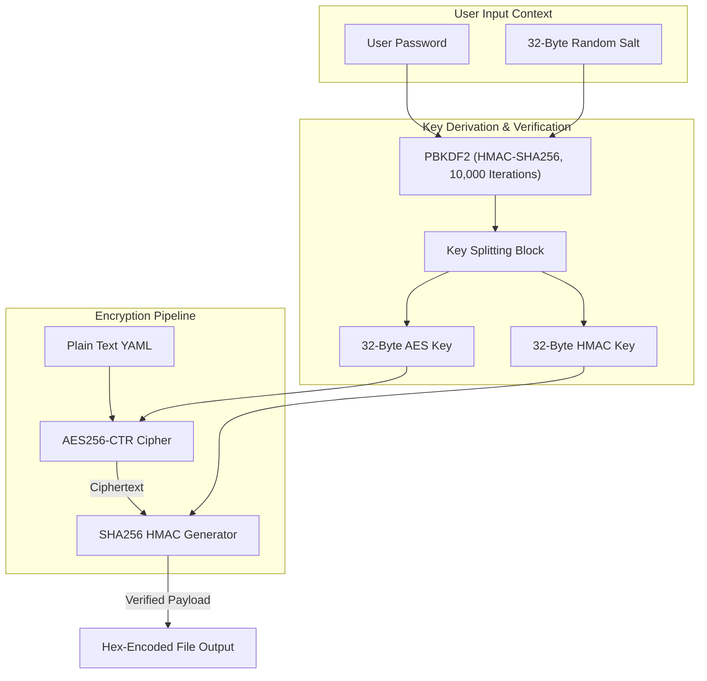

## Table of Contents

1. [The Problem: Public Repositories and Private Secrets](#the-problem-public-repositories-and-private-secrets)
2. [Ansible Vault and the Security Boundary](#ansible-vault-and-the-security-boundary)
3. [Dividing Variables: Public versus Secret Layouts](#diving-variables-public-versus-secret-layouts)
4. [Under the Hood: The AES256 Symmetric Vault File Schema](#under-the-hood-the-aes256-symmetric-vault-file-schema)
5. [The Password-Based Key Derivation Pipeline](#the-password-based-key-derivation-pipeline)
6. [HMAC Verification and Data Integrity Protection](#hmac-verification-and-data-integrity-protection)
7. [Padding and Block Alignment Mechanics](#padding-and-block-alignment-mechanics)
8. [Managing Vault Passwords in Production and Pipelines](#managing-vault-passwords-in-production-and-pipelines)
9. [Multi-Vault Keychains and Label Mapping](#multi-vault-keychains-and-label-mapping)
10. [In-Memory Decryption and the Remote Execution Path](#in-memory-decryption-and-the-remote-execution-path)
11. [The Vulnerabilities of Decrypted States](#the-vulnerabilities-of-decrypted-states)
12. [Symmetric Key Rekeying and Password Rotation](#symmetric-key-rekeying-and-password-rotation)
13. [Comparing Ansible Vault to Enterprise Secret Managers](#comparing-ansible-vault-to-enterprise-secret-managers)
14. [Putting It All Together](#putting-it-all-together)
15. [What's Next](#whats-next)

## The Problem: Public Repositories and Private Secrets

When building a high-availability customer payments portal, a system engineering team needs to configure a wide range of parameters. Most of these settings are non-sensitive. The network port on which the web server listens, the database cluster hostname, and the system log directory paths are all safe to publish. Storing these public settings in a version control system like Git is a best practice. It allows the team to review configuration changes, trace historical edits, and rollback bad updates.

However, the payments portal also requires highly sensitive credentials to function. The application process must connect to the database using an administrative password, authenticate with a third-party payment gateway via a private API signing key, and decrypt user sessions with a cryptographically secure token.

If developers write these sensitive credentials directly into their playbooks or inventory files as plain text, they commit a severe security violation. Once a secret is pushed to a Git repository, it is copied across every developer laptop, indexed by search engines, cached in backups, and exposed to anyone with read access to the project.

Even if the repository is private, hardcoding secrets in plain text leaves the organization vulnerable to insider threats and credentials leaks during source code reviews. The engineering team needs a mechanism to encrypt sensitive variables at rest while keeping them stored right beside the playbooks that consume them.

## Ansible Vault and the Security Boundary

Ansible Vault is the built-in encryption system designed to solve this problem. It allows developers to encrypt individual variables or entire files containing sensitive data. The encrypted content can be safely committed to the Git repository, as the raw payload bytes are completely unreadable without the correct decryption password.

It is critical to understand the precise boundary of Ansible Vault:

**Ansible Vault protects data exclusively at rest.**

Data at rest refers to the files as they reside on a physical disk, inside a Git repository, or on a developer workstation. Vault does not protect the data during execution or after deployment. When you run a playbook, the control plane must decrypt the vaulted variables to construct configuration files, pass arguments to remote modules, or register API tokens.

Once the data is decrypted in memory, other security boundaries must take over. Restricting file permissions on the managed host, configuring secure logging parameters, disabling standard outputs, and isolating process environments are all required to keep the credentials secure. Vault is only the first step in a complete multi-layered security pipeline.

## Dividing Variables: Public versus Secret Layouts

To maintain a clean, auditable repository, you should separate your public variables from your secret variables. Instead of encrypting an entire massive inventory file, which hides normal configuration changes from code reviews, you should split your variables into parallel public and encrypted files.

A group variables directory layout for the payments portal web group illustrates this split:

```plain
inventory/
  group_vars/
    payments_web/
      vars.yml
      vault.yml
```

The public variables file (`vars.yml`) contains normal settings that are helpful during reviews:

```yaml
payments_web_port: 8443
payments_web_db_host: db-replica-01.internal
payments_web_log_path: /var/log/payments
payments_web_service_user: payments-app
```

The secret variables file (`vault.yml`) contains only the credentials, kept under identical variable namespacing rules:

```yaml
payments_web_db_password: "super-secret-database-password-value"
payments_web_gateway_key: "private-payment-gateway-api-token"
payments_web_session_secret: "cryptographically-secure-signing-seed"
```

Once the secrets are isolated in `vault.yml`, you run the encryption command to convert the plain YAML text into an encrypted binary wrapper.

## Under the Hood: The AES256 Symmetric Vault File Schema

To understand the strength of the encryption, we must examine the format of a vaulted file. When you run `ansible-vault encrypt vault.yml`, the command-line tool rewrites the file content.

Opening the encrypted file reveals the specific schema header:

```plain
$ANSIBLE_VAULT;1.2;AES256;production
6130333833343933363138356135303338316235376137363363633432303434
3761323137656464353362323363386232613830646130326539306639353030
```

The header contains four semicolon-separated metadata fields:
1. **Identifier**: `$ANSIBLE_VAULT` designates the file as a valid Ansible Vault payload, prompting the playbook parser to intercept it.
2. **Version**: `1.2` specifies the format version. This version introduced multi-vault password support and improved metadata structures.
3. **Cipher**: `AES256` indicates that the payload is encrypted using the Advanced Encryption Standard with a 256-bit key.
4. **Vault ID Label**: `production` is the label assigned to this specific secret file. By default, Ansible uses this label as a hint and tries the matching vault password first; you must enable `DEFAULT_VAULT_ID_MATCH` if you want Ansible to require the label and password source to match.

The hex-encoded block of text below this header represents the combined payload. To ensure that version control systems handle the file correctly without corrupting binary characters or breaking line feeds, the hexadecimal ciphertext is formatted into lines of exactly 80 characters.

## The Password-Based Key Derivation Pipeline

Ansible Vault does not use the raw user-supplied password to encrypt the file directly. Instead, it processes the password through a secure key derivation pipeline to generate strong cryptographic keys.

When you run the encryption tool, the system performs the following cryptographic steps:
1. **Salt Generation**: The engine generates a cryptographically secure, random 32-byte salt on the control node.
2. **Key Derivation**: Using the PBKDF2 (Password-Based Key Derivation Function 2) algorithm, the system mixes the user-supplied password, the random salt, and a SHA256 hashing digest over 10,000 iterations to derive a secure 80-byte key block.
3. **Key Splitting**: The derived 80-byte block is split into three functional segments:
   - A 32-byte encryption key used for the AES256 cipher.
   - A 32-byte HMAC (Hash-based Message Authentication Code) key used to verify data integrity.
   - A 16-byte buffer discarded or reserved for future extensions.
4. **Payload Encryption**: The raw YAML text is encrypted using the derived 32-byte AES key in AES256-CTR mode.
5. **HMAC Calculation**: The system computes a SHA256 HMAC over the ciphertext so Ansible can verify that the encrypted file has not been altered or corrupted since it was written.
6. **Hexadecimal Formatting**: The salt, HMAC digest, and ciphertext are concatenated and formatted as a single hex-encoded block of text, ensuring compatibility with standard version control systems.



## HMAC Verification and Data Integrity Protection

When Ansible decrypts a vaulted file, it first parses the hex-encoded block back into binary components. This binary payload contains the salt, the HMAC signature, and the encrypted ciphertext. Before initiating the AES decryption cipher, the engine must verify the integrity of the file.

The decryptor uses the parsed salt and the supplied password to reconstruct the 80-byte key block, deriving the 32-byte HMAC key. It then computes a new HMAC signature over the parsed ciphertext using the SHA256 algorithm. The system compares the newly computed HMAC against the HMAC signature parsed from the file header.

If the two signatures do not match exactly, the decryptor halts immediately and exits with a `Decryption failed` error. This integrity check prevents chosen-ciphertext attacks and catches file corruption early. If an administrator accidentally resolves a Git merge conflict inside a vaulted file by editing the hex lines, the HMAC check will fail, protecting the execution engine from loading corrupted binary garbage.

## Padding and Block Alignment Mechanics

AES is a block cipher, which means it operates on fixed-size blocks of data. The block size for AES is always 16 bytes (128 bits). Because the plain-text YAML configuration file is rarely an exact multiple of 16 bytes, the encryptor must apply padding to align the final data block before running the cipher.

Ansible Vault uses PKCS#7 padding under the hood. In this padding scheme, the system calculates how many bytes are needed to complete the final 16-byte block. It then appends padding bytes, where the value of each padding byte is equal to the total number of bytes added.

For example, if the YAML payload is 13 bytes long, the encryptor needs 3 bytes of padding. It will append `0x03 0x03 0x03` to the end of the data. If the payload is already an exact multiple of 16 bytes, an entire block of 16 padding bytes (each containing `0x10`) is appended. This prevents ambiguous truncation. During decryption, the system validates the HMAC, runs the AES cipher, reads the value of the final byte, and strips exactly that number of padding bytes from the end of the output buffer to restore the clean YAML text.

## Managing Vault Passwords in Production and Pipelines

Because the vault password is the single root of trust for your repository secrets, managing it securely during playbook execution is a critical operations task.

### Manual Execution Prompting

When executing playbooks manually on a control node, developers should prompt for the vault password interactively. This ensures that the password is never saved to the local command history or stored on disk:

```bash
ansible-playbook -i inventory/prod.ini playbooks/deploy_portal.yml \
  --vault-id production@prompt
```

The `--vault-id` flag maps the password input to the `production` vault label. When Ansible parses `group_vars/payments_web/vault.yml`, it tries the password with the matching label first. If you need strict label matching, enable `DEFAULT_VAULT_ID_MATCH` in configuration.

### Automation and CI/CD Pipelines

In automated environments like GitHub Actions or GitLab CI runners, interactive prompts are impossible. Instead, the vault password is saved inside the CI system's secure variables and injected into the runner process at runtime.

One common CI pattern is to write the password to a temporary file on the runner disk, enforce strict file permissions, run the playbook, and erase the file after the run:

```bash
# Write the password securely to a temporary file
install -m 0600 /dev/null .vault-pass-production
printf "%s" "$CI_VAULT_PASSWORD_PRODUCTION" > .vault-pass-production

# Execute the playbook using the password file reference
ansible-playbook -i inventory/prod.ini playbooks/deploy_portal.yml \
  --vault-id production@.vault-pass-production

# Securely remove the temporary password file
rm -f .vault-pass-production
```

Using `install -m 0600` ensures that the file is created with read and write permissions restricted exclusively to the active runner user process, preventing other local system processes from viewing the credentials.

## Multi-Vault Keychains and Label Mapping

In large engineering teams, playbooks often configure resources across multiple security zones, such as development, staging, and production. To enforce the principle of least privilege, developers should use different vault passwords for each environment.

Ansible Vault supports multi-vault keychains by allowing playbooks to declare multiple `--vault-id` arguments at runtime:

```bash
ansible-playbook -i inventory/prod.ini playbooks/deploy_portal.yml \
  --vault-id dev@.vault-pass-dev \
  --vault-id stage@.vault-pass-stage \
  --vault-id production@.vault-pass-production
```

When the execution engine parses a vaulted file, it reads the vault ID label from the file's header metadata. By default, Ansible tries the password with the matching label first, then may try other supplied vault passwords in order. This label mapping is useful for clarity, but strict separation requires `DEFAULT_VAULT_ID_MATCH` and careful CI credential scoping.

## In-Memory Decryption and the Remote Execution Path

When Ansible executes a play on the control plane, it loads all variables into memory. When it encounters a vaulted file, it uses the provided password to run the decryption steps, storing the plain-text credentials in the Python process's volatile memory (RAM).

During normal playbook execution, vaulted variables are decrypted so Ansible can use them. They may live in the control process memory, be rendered into temporary candidate files, or be sent as module arguments depending on the task. Vault should therefore be treated as at-rest protection, not as a guarantee that decrypted values never touch temporary paths during every workflow. Commands such as `ansible-vault edit` can also involve editor temporary files.

When a task, such as rendering the payments portal environment config, is executed, the control plane performs the following systems actions:
1. **In-Memory Template Compilation**: The Jinja2 templating engine pulls the plain-text credentials from Python memory and compiles the final text block in RAM.
2. **Module Payload Preparation**: The compiled text or module argument payload is prepared for the selected connection and module execution path.
3. **Transport**: With the common SSH connection path, payloads travel through an encrypted SSH channel to the managed host.
4. **Remote Execution**: On the managed host, Ansible runs the module in a temporary working area and cleans up when the connection and module path support cleanup. The final secret-bearing file still needs strict owner, group, and mode settings.

## The Vulnerabilities of Decrypted States

Although Ansible Vault encrypts secrets while stored in a repository, the decrypted variables are vulnerable during the playbook execution phase.

### Accidental Log Exposure

The most common operational vulnerability is task output logging. If a task fails or if you run a playbook with debug tasks, Ansible will output the parameters passed to the modules. If a database setup task fails while using a vaulted password, the plain-text password can easily appear in standard output streams, console screens, and CI pipeline log archives.

To prevent this exposure, any task that handles a vaulted variable must carry the `no_log: true` parameter:

```yaml
- name: Render payments environment file
  ansible.builtin.template:
    src: payments.env.j2
    dest: /etc/payments/payments.env
    owner: root
    group: "{{ payments_web_service_user }}"
    mode: "0600"
  no_log: true
```

The `no_log: true` directive instructs the execution engine to mask the task's normal output and module arguments, replacing them with a generic censored message in the logs. It does not make deliberate debug output safe, so do not print secret variables with `debug` during production runs.

### Disk Permissions on Managed Hosts

Ansible Vault decrypts the variable so it can be written to the target host's files, such as `/etc/payments/payments.env`. Once written, the secret is no longer protected by Vault.

If the destination file is written with a weak permission bitmask like `mode: "0644"`, any local unprivileged user on the target host can read the database password. You must enforce strict Unix file permissions (`mode: "0600"`) and restrict user ownership to ensure that only the payments service process can read the configuration file.

## Symmetric Key Rekeying and Password Rotation

To maintain strong security hygiene, organizations should rotate their vault passwords periodically. If a password leaks or an engineer leaves the team, the vaulted files must be re-encrypted using a new key.

Manually decrypting a file and encrypting it again is a dangerous practice, as the decrypted secrets can easily be committed to version control during the transition window. To prevent this, Ansible provides the `rekey` command:

```bash
ansible-vault rekey --vault-id production@.vault-pass-old \
  --new-vault-id production@.vault-pass-new \
  group_vars/payments_web/vault.yml
```

The `rekey` command opens the vaulted file using the old password, decrypts the payload so it can be re-encrypted, generates fresh cryptographic material, and writes a new encrypted representation back to disk. Treat the host running rekey as sensitive while the command runs, and avoid interrupted editor or shell workflows that could leave temporary plaintext behind.

## Comparing Ansible Vault to Enterprise Secret Managers

While Ansible Vault is highly effective for managing variables at rest in a repository, larger organizations often integrate it with external, dedicated secret management engines. Choosing the right tool depends on your infrastructure scale and runtime requirements.

The table below outlines the architectural trade-offs:

| Security Metric | Ansible Vault | External Secret Broker (e.g., HashiCorp Vault) |
| :--- | :--- | :--- |
| **Storage Model** | Committed directly inside the Git repository | Centralized dynamic credential engine database |
| **Runtime Requirements** | Decrypted in-memory on the control plane | Fetched over TCP/HTTPS API queries at execution |
| **Audit Trails** | Limited to Git history tracking | Full API query logs mapping user identity |
| **Rotation Lifecycles** | Manual vault re-keying operations | Automated credential rotation schedules |
| **Best Fit** | Bootstrap credentials, simple playbooks, standalone repositories | Distributed cloud workloads, highly dynamic rotated secrets |

## Putting It All Together

Ansible Vault provides a secure storage boundary that allows system engineers to commit sensitive credentials directly to version control beside their playbooks. By isolating secrets in dedicated `vault.yml` files, you maintain the readability of public configurations during repository reviews.

Managing this security boundary relies on a series of nested safeguards:
- **At Rest (Repository)**: AES256-CTR Vault encryption using PBKDF2 key derivation from a unique Vault ID password.
- **In Transit (Network)**: Common SSH connections encrypt module payloads and rendered arguments while they move to managed hosts.
- **In Output (Execution)**: `no_log: true` and `diff: false` reduce accidental exposure in stdout, callbacks, and diffs.
- **At Rest (Managed Host)**: Enforces quoted permissions (`"0600"`) and strict service ownership on target configurations.

By coordinating Ansible Vault with strict execution and filesystem controls, you keep your payments portal infrastructure standardized, automated, and much safer across deployment phases.

---

**References**

- [Ansible Vault Guide](https://docs.ansible.com/projects/ansible/latest/vault_guide/vault.html) - Full reference for creating, editing, encrypting, decrypting, and rekeying vault-protected files and variables.
- [PBKDF2 Cryptographic Standards (RFC 2898)](https://datatracker.ietf.org/doc/html/rfc2898) - The IETF specification defining the password-based key derivation function used by Ansible Vault to generate AES keys from passwords.
- [Managing Secrets in Ansible Playbooks](https://docs.ansible.com/ansible/latest/playbook_guide/playbooks_variables.html#information-security-with-ansible-vault) - Explains how to structure variable files to separate public configuration from vault-encrypted secrets.
- [AES256-CTR Cryptographic Block Cipher Mode](https://csrc.nist.gov/publications/detail/sp/800-38a/final) - NIST special publication covering the counter mode (CTR) block cipher operation used to encrypt vault payloads.
