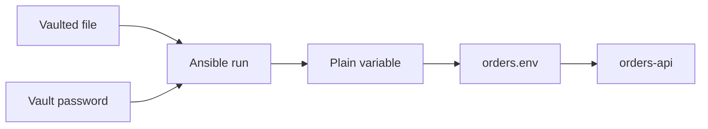

## Table of Contents

1. [What Vault Protects](#what-vault-protects)
2. [Secret Variables](#secret-variables)
3. [Encrypted Files](#encrypted-files)
4. [Vault Passwords](#vault-passwords)
5. [During a Playbook Run](#during-a-playbook-run)
6. [Practical Surprises](#practical-surprises)
7. [Putting It All Together](#putting-it-all-together)
8. [What's Next](#whats-next)

## What Vault Protects

Ansible playbooks usually need a mix of ordinary settings and secret settings. The ordinary settings are easy to review. A port number, a Linux user name, a package name, and a service path can all live in Git as plain text. The secret settings are different. A database password or signing key is still configuration, but it should not be readable by everyone who can clone the repository.

The `orders` service has a simple deployment shape. Two web hosts run Nginx and an `orders-api` process. The process needs a database password, a session signing key, and a token for a private package repository. The playbook must use those values to build the host, but the repository should not expose them.

Ansible Vault is the built-in encryption feature for this situation. It encrypts Ansible variables or whole files so they can be stored with the playbooks that use them. Someone reading the stored file sees Vault text, not the original password.

This is the most important boundary to understand:

```text
Vault protects data at rest.
It does not keep the value secret everywhere after Ansible decrypts it.
```

Data at rest means the file as it sits in Git, on a laptop, in a backup, or in an artifact store. When Ansible runs, it needs the real value. It decrypts the content in order to pass the value into a module, render a template, or load a variable. After that point, other controls matter: task output, file permissions, CI logs, and service configuration.

## Secret Variables

Start with the shape of the data before reaching for the command. An Ansible project normally keeps variables near the hosts or groups that use them. For the `orders` service, the group might be named `orders_web` because both web hosts need the same service configuration.

A clear layout separates public variables from secret variables:

```text
group_vars/
  orders_web.yml
  orders_web.vault.yml
```

The public file contains values that are useful during review:

```yaml
orders_api_user: orders-api
orders_api_port: 8080
orders_database_host: orders-db.internal
orders_package_repo: https://packages.example.internal/orders
```

The vaulted file contains values that should not be readable in the repository:

```yaml
orders_database_password: "replace-with-generated-password"
orders_session_secret: "replace-with-generated-session-key"
orders_package_token: "replace-with-private-repo-token"
```

Keeping the split visible helps reviewers. They can still understand how the service is wired without seeing the credentials. It also keeps the secret file small. A small secret file is easier to rotate, easier to audit, and less likely to hide unrelated changes behind encryption.

Ansible can also encrypt a single variable inside a readable YAML file. That can be useful for a small value, but it has a tradeoff. The surrounding file stays readable while the encrypted value is harder to compare in review. For a service with several related secrets, a separate vaulted file is usually simpler.

## Encrypted Files

Once the `orders_web.vault.yml` file exists, encrypt it with `ansible-vault`. The command asks for a Vault password, then rewrites the file as encrypted text.

```bash
ansible-vault encrypt --vault-id prod@prompt group_vars/orders_web.vault.yml
```

The `prod@prompt` part has two pieces. `prod` is a Vault ID label. It is a human-readable label that becomes part of the encrypted file header. `prompt` tells Ansible to ask for the password interactively.

After encryption, the file no longer looks like YAML:

```text
$ANSIBLE_VAULT;1.2;AES256;prod
6130333833343933363138356135303338316235376137363363633432303434
3761323137656464353362323363386232613830646130326539306639353030
```

The first line is useful. It tells you this is Ansible Vault content, which format version is used, which cipher is used, and which Vault ID label was written into the file. The encrypted body below it is not useful for human review. That is the point.

If you are creating a new secret file from scratch, use `create` instead. It opens your editor after asking for the Vault password.

```bash
ansible-vault create --vault-id prod@prompt group_vars/orders_web.vault.yml
```

If you need to change a vaulted file, use `edit` so the file is decrypted only for the editing workflow and saved encrypted again.

```bash
ansible-vault edit --vault-id prod@prompt group_vars/orders_web.vault.yml
```

Do not decrypt a file permanently just to make a quick edit. A decrypted secret file is easy to commit by mistake. If a secret was already committed in plain text before Vault was added, encrypting the file now does not erase the old copy from Git history, pull request emails, local clones, logs, or backups. Treat that value as exposed and rotate it.

## Vault Passwords

The Vault password is the key that unlocks the encrypted file. It must be stored outside the encrypted file and outside the repository. If a repository contains both `orders_web.vault.yml` and the password file that decrypts it, the encryption boundary is gone.

For a manual production run, prompting is clear:

```bash
ansible-playbook -i inventories/prod.ini playbooks/orders.yml \
  --vault-id prod@prompt \
  --limit orders-web-01
```

This command says: load the production inventory, run the `orders` playbook, ask for the password for the `prod` Vault ID, and limit the run to one host. The limit is not part of Vault, but it shows the normal context: secret handling and rollout safety usually meet in the same command.

In CI, an interactive prompt does not work. The password often comes from the CI system's secret store and is written to a temporary file with restrictive permissions:

```bash
install -m 0600 /dev/null .vault-pass-prod
printf "%s" "$ANSIBLE_VAULT_PASSWORD_PROD" > .vault-pass-prod

ansible-playbook -i inventories/prod.ini playbooks/orders.yml \
  --vault-id prod@.vault-pass-prod \
  --limit orders-web-01

rm -f .vault-pass-prod
```

That temporary file is a credential. It should be ignored by Git, readable only by the job user, and removed when the job is done. In a real pipeline, cleanup should run even when the playbook fails.

Vault IDs are labels, not a full policy system. By default, Ansible uses the label as a hint for which password to try first. A project can make matching stricter with Ansible configuration, but the safest habit is still operational: use clear labels, keep password sources separate, and know which password unlocks which content.

## During a Playbook Run

Vaulted content becomes useful only after Ansible decrypts it. The `orders-api` role might render an environment file from a template:

```ini
ORDERS_API_PORT={{ orders_api_port }}
DATABASE_HOST={{ orders_database_host }}
DATABASE_PASSWORD={{ orders_database_password }}
SESSION_SECRET={{ orders_session_secret }}
```

The source variable was encrypted at rest. The rendered destination is not encrypted by Vault. It is a plain file on the managed host because the service needs to read it.

```yaml
- name: Render orders-api environment
  ansible.builtin.template:
    src: orders.env.j2
    dest: /etc/orders-api/orders.env
    owner: root
    group: orders-api
    mode: "0640"
  no_log: true
```

The mode is quoted because YAML and file permissions have a long history of surprising people. Ansible documentation recommends quoting octal modes such as `"0640"` so the intended permission bits are preserved. For a secret-bearing file, that small habit matters.

The path from repository to running service looks like this:



Each step has a different protection. Vault protects the stored file. SSH protects the connection to the host. Linux ownership and mode protect the rendered file. `no_log` protects task output. None of these replaces the others.

## Practical Surprises

The first surprise is that Vault does not make bad output safe. If a task prints `orders_database_password` with `debug`, the log can still contain the password. If a template task runs with diff output and the rendered file contains secrets, the diff can show the secrets. Vault protected the source file, but the value moved.

The second surprise is that a vaulted file is hard to review. Reviewers can see that encrypted bytes changed, but they cannot see whether the database password changed, the session key changed, or someone added a new secret. That is another reason to keep secret files small and grouped by purpose.

The third surprise is that a Vault password can be broader than expected. If the same password decrypts development, staging, and production files, anyone with that password can read all of them. Separate Vault IDs and separate password sources make the boundary clearer, especially when CI jobs and human operators have different access.

The fourth surprise is that the managed host becomes part of the secret boundary. Once `/etc/orders-api/orders.env` exists, a user who can read that file can read the database password. Vault cannot help there. Use a dedicated service group, a restrictive mode such as `"0640"`, and a deployment pattern that does not copy secret files into world-readable paths.

## Putting It All Together

The `orders` team needed to keep service credentials near the playbooks without exposing them in Git. Vault gave them a storage boundary. Public settings stayed in `orders_web.yml`. Sensitive settings moved into `orders_web.vault.yml`. The production run supplied a Vault password from a prompt or a protected CI secret source.

That solved one problem: someone browsing the repository cannot read the database password. It did not solve every secret problem. During the run, Ansible decrypts the values, renders a service file, and sends task results to the operator or CI system. Those later places need their own boundaries.

## What's Next

The next article follows the decrypted value after Vault has done its job. It covers `no_log`, diff output, debug output, and the difference between useful review evidence and accidental secret exposure.

---

**References**

- [Ansible documentation: Ansible Vault](https://docs.ansible.com/projects/ansible/latest/vault_guide/vault.html)
- [Ansible documentation: Encrypting content with Ansible Vault](https://docs.ansible.com/projects/ansible/latest/vault_guide/vault_encrypting_content.html)
- [Ansible documentation: ansible-vault command line reference](https://docs.ansible.com/projects/ansible/latest/cli/ansible-vault.html)
- [Ansible documentation: ansible-playbook command line reference](https://docs.ansible.com/projects/ansible/latest/cli/ansible-playbook.html)
