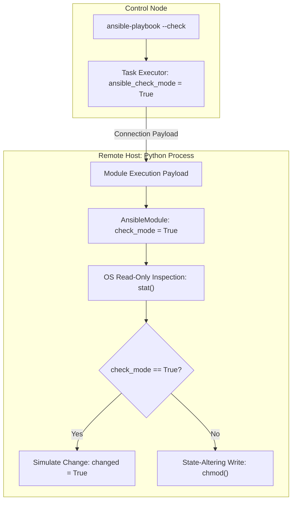

## Table of Contents

1. [The Problem: Blind Execution Risks](#the-problem-blind-execution-risks)
2. [Check Mode: The Dry-Run Boundary](#check-mode-the-dry-run-boundary)
3. [Under the Hood: How Modules Predict Desired States](#under-the-hood-how-modules-predict-desired-states)
4. [Third-Party Module Support and the Safety Gate](#third-party-module-support-and-the-safety-gate)
5. [Diff Mode: Line-by-Line System Comparisons](#diff-mode-line-by-line-system-comparisons)
6. [Under the Hood: Module-Supported Diff Generation](#under-the-hood-module-supported-diff-generation)
7. [The Fragility of Check Mode: Sequential Cascades](#the-fragility-of-check-mode-sequential-cascades)
8. [Managing Dependency Breakdowns with check_mode Overrides](#managing-dependency-breakdowns-with-check_mode-overrides)
9. [Under the Hood: Handlers and Change Notifications in Dry Runs](#under-the-hood-handlers-and-change-notifications-in-dry-runs)
10. [Auditing Diffs Safely: The Secret Boundary Collision](#auditing-diffs-safely-the-secret-boundary-collision)
11. [Putting It All Together](#putting-it-all-together)
12. [What's Next](#whats-next)

## The Problem: Blind Execution Risks

In a fast-moving operations team, automated infrastructure tools are highly efficient but carry a severe risk. When a developer runs a playbook designed to update network interfaces, modify secure socket layer configurations, or migrate system services, the changes are applied immediately to target nodes. If a port variable is mistyped, a security group config is misconfigured, or a template maps to the wrong target directory, a single execution run can bring down the entire web cluster.

Before executing modifications in production, system administrators need to know which target hosts the run will actually connect to and modify, which specific tasks will predict a change on the operating systems, what exact text modifications will occur inside configuration files, and whether any sensitive credentials or secrets are at risk of appearing in the output. Without a reliable dry-run and auditing mechanism, applying infrastructure changes is blind and dangerous. Teams are forced to hope that their variables are correctly mapped, which often leads to outages during maintenance windows.

To solve this, Ansible provides two distinct auditing modes: Check Mode and Diff Mode. These modes allow you to preview likely task changes and inspect configuration diffs before modifying your systems.

## Check Mode: The Dry-Run Boundary

Check Mode is Ansible's dry-run mode. When you execute a playbook with the `--check` command-line flag, Ansible still evaluates variables and may connect to target hosts, but modules that support check mode predict their result without making the normal state-changing updates.

The following command executes a system configuration playbook in Check Mode, limiting the canary run to a single web host to preview changes:

```bash
ansible-playbook -i inventory/prod.ini playbooks/web_config.yml \
  --check \
  --limit web-server-01.internal
```

Running this command produces standard execution output, displaying which tasks would report a `changed` state or a `skipped` state. Treat that output as a prediction, especially if the playbook contains modules without check-mode support or tasks forced to run with `check_mode: false`.

The recap block at the end summarizes these predictions:

```plain
web-server-01.internal : ok=12 changed=3 unreachable=0 failed=0 skipped=2
```

While Check Mode is highly useful, it is important to treat this preview as evidence rather than certainty. Check Mode operates by querying the current host state and predicting the outcome of each task in isolation.

The real execution run can still fail if a system service crashes during restart, a command-line tool has unexpected side effects, or a network interface lock is blocked.

## Under the Hood: How Modules Predict Desired States

To understand why Check Mode is useful but imperfect, we must look at how supported modules branch inside their execution logic.

When you pass `--check` on the command line, the control plane exposes `ansible_check_mode` as `True` in the task context. Supported modules also receive check-mode state through Ansible's module utility layer.

Inside the remote Python process, the module initialization phase loads the standard `AnsibleModule` utility library. This library reads the incoming JSON context and configures an internal flag: `module.check_mode = True`.

When a module runs, its internal execution path branches based on this flag:
1. **State Inspection**: The module queries the target host operating system using read-only system calls. For example, the `file` module runs `stat()` on `/etc/nginx/nginx.conf` to check ownership, permissions, and timestamps.
2. **Comparison**: The module compares the retrieved system facts against the desired task parameters.
3. **Branching**:
   - **Normal Apply Mode**: If a discrepancy exists, the module runs state-altering system calls, such as `os.chmod()` or `os.chown()`, to align the system, returning `changed=True`.
   - **Check Mode**: If a discrepancy exists, the module skips the state-altering system calls entirely. It writes a warning log in Python memory and returns `changed=True` to indicate that a change would have occurred.
4. **JSON Return**: The module writes the final outcome dictionary back to the SSH pipe as a JSON stream, allowing the control plane to display the results.



## Third-Party Module Support and the Safety Gate

What happens when a playbook executes a custom or third-party community module in Check Mode? This is a critical security boundary.

When a developer creates a custom Python module, they must explicitly declare to the standard execution library that the module is capable of running safely in dry-run mode. This is done by setting `supports_check_mode=True` inside the `AnsibleModule` constructor:

```python
# Inside library/custom_dns_record.py
module = AnsibleModule(
    argument_spec=dict(
        name=dict(type='str', required=True),
        value=dict(type='str', required=True)
    ),
    supports_check_mode=True
)
```

If a community module does *not* declare this support, Ansible's execution engine enforces a safety gate. When the control plane runs a playbook with `--check`, and encounters a task using a module that lacks the `supports_check_mode` flag, it skips the task automatically.

The console output logs a warning:

```plain
skipping: [web-server-01.internal] => {"skipped": true, "msg": "remote module (custom_dns_record) does not support check mode"}
```

This safety gate prevents arbitrary community modules from making unexpected, state-altering API calls or filesystem changes during what the operator believed was a safe, read-only dry run.

## Diff Mode: Line-by-Line System Comparisons

While Check Mode tells you *whether* a supported task predicts a change, it cannot show you *what* will change inside the file. To inspect text changes, combine Check Mode with Diff Mode using the `--diff` command-line flag.

Diff Mode instructs text-processing modules (like `template`, `copy`, and `lineinfile`) to generate line-by-line unified diff comparisons before making changes.

The following command runs a configuration playbook in both Check and Diff modes:

```bash
ansible-playbook -i inventory/prod.ini playbooks/web_config.yml \
  --check \
  --diff \
  --limit web-server-01.internal
```

When Nginx configuration templates are updated, the resulting diff output can show the routing modifications:

```diff
--- /etc/nginx/nginx.conf (existing)
+++ /etc/nginx/nginx.conf (new)
@@ -12,4 +12,4 @@
-    listen 8080;
+    listen 8443 ssl;
```

This output provides excellent review evidence for systems engineers and auditors. They can verify that the variable mappings are correct and that Nginx is configured to listen on the correct secure port before applying the change in production.

## Under the Hood: Module-Supported Diff Generation

Diff mode is implemented by modules that support it. For text-oriented file modules, Ansible compares the current content with the candidate content and returns a diff structure for the display callback to render.

When a text-altering module detects a discrepancy between the existing file and the desired content, the broad flow looks like this:
1. **Read Existing State**: The module inspects the current file or metadata.
2. **Build Candidate State**: The module renders or receives the desired content.
3. **Generate Diff Data**: If diff mode is supported and enabled, the module returns a structured diff showing before and after content or metadata.
4. **Display Callback Rendering**: The control node's stdout callback reads the returned diff data and renders it in the terminal.

If a file is binary or a module does not provide useful diff support, Ansible may omit the text diff or return a limited diff response. This is another reason to treat diff mode as review evidence rather than a perfect simulator.

On the control plane, the display callback plugin formats diff additions and deletions for readability when the terminal supports it.

## The Fragility of Check Mode: Sequential Cascades

While Check and Diff modes are highly powerful, they suffer from an inherent system weakness: they cannot simulate sequential cascades where a later task depends on a change made by an earlier task.

Consider the following three tasks written in a playbook:

```yaml
- name: Create system log storage directory
  ansible.builtin.file:
    path: /var/log/refunds
    state: directory
    owner: refunds-app
    mode: "0750"

- name: Create secure log audit script
  ansible.builtin.template:
    src: audit.sh.j2
    dest: /var/log/refunds/audit.sh
    mode: "0700"

- name: Run log audit pre-check
  ansible.builtin.command: "/var/log/refunds/audit.sh --precheck"
```

In a normal execution run, this sequence succeeds because each step builds the environment required by the next step.

However, when you run this playbook with `--check`, the cascade breaks:
- **Task 1** queries the host, sees `/var/log/refunds` is missing, and reports `changed=True` without creating the directory.
- **Task 2** attempts to verify the script state. Because the directory `/var/log/refunds` was never created in Task 1, the template module fails with a directory-not-found error, or halts execution.
- **Task 3** attempts to execute `/var/log/refunds/audit.sh`. Because the script was never written in Task 2, the execution immediately crashes.

This cascade breakdown leads to false playbook failures in Check Mode, even when the underlying playbook code is entirely correct. This can frustrate operators, who may stop using Check Mode because dry runs frequently fail.

## Managing Dependency Breakdowns with check_mode Overrides

To prevent these false failures and maintain a working dry-run pipeline, you can use check-mode task overrides to force specific tasks to run or skip during Check Mode.

Ansible provides two main task-level parameters for this:
- `check_mode: false`: Forces the task to execute normally and apply its changes, even when the playbook is run with the global `--check` flag.
- `check_mode: true`: Forces the task to run in dry-run mode, even when the playbook is run in normal apply mode.

For example, if your playbook runs a read-only script that gathers diagnostic data required by downstream tasks, you should force the task to execute during dry runs by setting `check_mode: false`:

```yaml
- name: Query current cluster routing metadata
  ansible.builtin.command: "/opt/routing/bin/query_routes.sh"
  register: routing_metadata
  changed_when: false
  check_mode: false
```

By setting `check_mode: false`, the `query_routes.sh` script executes normally during a `--check` run. The registered `routing_metadata` variable is populated with real system data, ensuring that downstream tasks that depend on this variable can evaluate their conditions without crashing.

Conversely, you can use the `ansible_check_mode` boolean variable inside task conditions to skip unstable tasks during dry runs:

```yaml
- name: Run complex database migration script
  ansible.builtin.command: "/opt/db/bin/migrate.sh"
  when: not ansible_check_mode
```

This condition ensures that the migration script is skipped during Check Mode, keeping the database safe from partial simulations while allowing other playbook tasks to be audited.

## Under the Hood: Handlers and Change Notifications in Dry Runs

Timing boundaries also introduce unique behaviors when executing notification handlers in Check Mode. Handlers are deferred tasks registered to run at the play's end only when notified of a state change by a preceding task.

If a task is evaluated in Check Mode, reports `changed: [host]`, and triggers a `notify` block, Ansible queues the handler to run at the play's end. The dry run registers that the service *would* have restarted, which is useful validation.

However, the handler task itself is subject to Check Mode rules when it executes. If Nginx config changes and notifies `Restart Nginx`, the handler executes in dry-run mode. The engine queries the systemd socket state, verifies Nginx configuration file paths, and logs that Nginx *would* reload.

If a preceding task was forced to apply using `check_mode: false`, but the handler is skipped or simulated, the real running process does not reflect the new configuration until the actual apply phase is executed.

Furthermore, if the playbook run is executed with the CLI flag `--force-handlers` or the configuration `force_handlers = True` is active, it instructs the execution engine to run queued handlers even if a task fails midway through the play. In Check Mode, if a task fails, these queued handlers are still executed in dry-run mode (simulating reloads/restarts) so you can audit if the service configuration reloads would have been triggered.

Because handlers execute at handler flush points, if a task fails before queued handlers are reached and `--force-handlers` is not active, those handlers may not execute for that host, even in dry run. This is why `meta: flush_handlers` can be important when subsequent tasks require the service to be reloaded before the final play recap.

## Auditing Diffs Safely: The Secret Boundary Collision

A major operational risk is the collision between Diff Mode and secret boundaries. If a playbook renders an environment environment file containing database passwords or session signing keys, enabling Diff Mode will display the plain-text secrets on the terminal.

To prevent this collision, any task that manages sensitive templates must carry the `diff: false` and `no_log: true` parameters:

```yaml
- name: Render refund database environment configuration
  ansible.builtin.template:
    src: refund_db.env.j2
    dest: /etc/refunds/refund_db.env
    owner: root
    group: refunds-admin
    mode: "0600"
  no_log: true
  diff: false
```

By explicitly setting `diff: false`, you instruct the task to suppress diff output. The module can still calculate changed status, but the secret-bearing before/after text is not returned as a normal diff.

## Operating System Process Introspection Leaks

As a crucial security configuration tip on Linux-based systems, administrators can prevent other unprivileged users from auditing active processes and inspecting arguments by mounting the `/proc` filesystem with the `hidepid=2` option:

```plain
UUID=proc /proc proc defaults,hidepid=2 0 0
```

Setting `hidepid=2` can help prevent local users from viewing process CLI arguments or environment variables belonging to other users, mitigating process introspection leaks on Linux hosts. Test this carefully because procfs mount options can affect monitoring and troubleshooting tools.

## Putting It All Together

Check Mode and Diff Mode provide an auditing boundary, allowing teams to preview likely task actions and inspect text changes before modifying production servers. By listing hosts first and running canary dry runs, you catch many syntax errors, variable mapping issues, and accidental secret exposures early.

Managing these dry-run pipelines requires balancing flexibility and safety:

| System Mode | Execution Timing | Operating System Action | System Limitations |
| :--- | :--- | :--- | :--- |
| **Check Mode (`--check`)** | Dry-run simulation | Runs read-only checks, skips state-altering system calls | Fails to simulate cascading tasks where later steps depend on earlier changes. |
| **Diff Mode (`--diff`)** | Text change comparison | Returns module-supported before/after diff data | Can expose sensitive credentials if `diff: false` is not configured on secret tasks. |
| **Check Override (`check_mode: false`)** | Forced apply | Runs task normally, even during global `--check` runs | Must be reserved exclusively for read-only actions or diagnostic queries. |
| **Check Override (`check_mode: true`)** | Forced dry run | Runs task in check mode, even during normal apply runs | Useful for auditing system status within normal configuration pipelines. |

By coordinating these validation modes with selective task overrides, you make automated deployments safer, more predictable, and easier to review against enterprise security standards.

---

**References**

- [Ansible Documentation: Check Mode and Diff Mode](https://docs.ansible.com/ansible/latest/playbook_guide/playbooks_checkmode.html) - Complete reference for enabling check mode and diff mode, including module support requirements and known limitations.
- [Controlling Playbook Execution with check_mode](https://docs.ansible.com/ansible/latest/playbook_guide/playbooks_checkmode.html#information-about-check-mode-in-playbooks) - Explains the `check_mode` task override parameter and the `ansible_check_mode` variable for conditional skipping.
- [Ansible Task Diffs and Secure Logging](https://docs.ansible.com/ansible/latest/reference_appendices/logging.html) - Covers logging configuration and how to prevent sensitive task output from reaching log targets.
