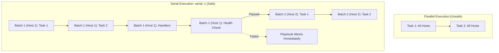

## Table of Contents

1. [The Problem: High-Availability Rollouts and Outage Risks](#the-problem-high-availability-rollouts-and-outage-risks)
2. [Canary Targets: The Command-Line Limit Boundary](#canary-targets-the-command-line-limit-boundary)
3. [Linear Slicing: The Serial Execution Scheduler](#linear-slicing-the-serial-execution-scheduler)
4. [Under the Hood: How Serial Slices the Playbook Queue](#under-the-hood-how-serial-slices-the-playbook-queue)
5. [The Interaction Between Serial and Strategy Plugins](#the-interaction-between-serial-and-strategy-plugins)
6. [The Timing of Change: Handlers and Flushing Boundaries](#the-timing-of-change-handlers-and-flushing-boundaries)
7. [Designing Robust Application Health Checks](#designing-robust-application-health-checks)
8. [Load Balancer Integration and Target Status Checking](#load-balancer-integration-and-target-status-checking)
9. [Failure Boundaries and the max_fail_percentage Algorithm](#failure-boundaries-and-the-max_fail_percentage-algorithm)
10. [Stateless versus Stateful Rollout Strategies](#stateless-versus-stateful-rollout-strategies)
11. [Putting It All Together](#putting-it-all-together)
12. [What's Next](#whats-next)

## The Problem: High-Availability Rollouts and Outage Risks

When managing a high-availability checkout microservice for a global e-commerce portal, system engineering teams face strict uptime constraints. The checkout service runs across a cluster of four independent application servers, situated behind an elastic load balancer. If the checkout database password changes, the web server proxy configurations are updated, or the application package is upgraded, the configuration changes must be deployed across the entire cluster.

In a default Ansible playbook configuration, the execution engine targets all matched inventory hosts in parallel. If you have four web servers, Ansible executes the first task on all four hosts simultaneously, then the second task, and so on.

While this parallel model is highly efficient, it is extremely dangerous during a production rollout. If a new application package contains a critical runtime bug, or if Nginx is rendered with an invalid syntax configuration, the parallel execution will apply the broken state to all four web servers at the same time.

The entire cluster will fail, Nginx will crash, the checkout service will go offline, and the load balancer will begin reporting HTTP 502 Bad Gateway errors to customers worldwide.

To prevent these catastrophic cluster-wide outages, system engineers must design controlled deployment pipelines. By isolating a single node as a canary, dividing the remaining hosts into sequential execution batches, and validating the health of each batch before proceeding, you can isolate errors and keep the blast radius of any deployment failure restricted to a single host.

## Canary Targets: The Command-Line Limit Boundary

The first layer of protection in a production deployment is the command-line host filter: the `--limit` flag. This flag instructs the control plane to override the playbook's default `hosts` pattern and restrict execution to a narrow subset of the inventory catalog.

Before running a play, developers should verify which hosts are targeted by appending the `--list-hosts` flag to their command:

```bash
ansible-playbook -i inventory/prod.ini playbooks/deploy_checkout.yml \
  --list-hosts \
  --limit checkout-web-01.internal
```

The terminal output should explicitly list only the single canary node:

```text
playbook: playbooks/deploy_checkout.yml

  play #1 (checkout_web): Deploy Checkout Service
    pattern: ['checkout_web']
    hosts (1):
      checkout-web-01.internal
```

Once the target list is verified, the developer applies the changes to the canary server:

```bash
ansible-playbook -i inventory/prod.ini playbooks/deploy_checkout.yml \
  --limit checkout-web-01.internal
```

By deploying exclusively to `checkout-web-01.internal`, you isolate the production change. If the application process fails to start on this first server, the load balancer detects the failure, removes the single canary node from the active target group, and redirects all customer checkout traffic to the three remaining healthy servers. The system continues to operate, and the engineering team has time to debug the failure without causing downtime.

## Linear Slicing: The Serial Execution Scheduler

Once the canary node has been successfully updated and verified, the next step is to deploy to the remaining hosts in the cluster. Rather than updating all three remaining servers in parallel, you should configure a rolling update using the `serial` parameter at the playbook level.

The following playbook declares a rolling deployment strategy using a progressive list of serial batch sizes:

```yaml
- name: Deploy Checkout Service
  hosts: checkout_web
  become: true
  serial:
    - 1
    - "50%"
  tasks:
    - name: Render checkout virtual host configuration
      ansible.builtin.template:
        src: checkout.conf.j2
        dest: /etc/nginx/sites-available/checkout.conf
      notify: Reload nginx
```

Under this configuration, the execution engine divides the checkout web hosts into sequential execution batches:
- **Batch 1**: Executes the play on exactly 1 host. This acts as the canary run.
- **Batch 2**: Executes the play on 50% of the original matched host set. In a four-host play, that means 2 hosts.
- **Batch 3**: Executes the play on all remaining hosts.

This progressive batch rollout updates the fleet in measured steps. The exact capacity left online depends on how many hosts are in the pool, whether the canary run is separate from the full rollout, and how your load balancer drains or removes targets.

## Under the Hood: How Serial Slices the Playbook Queue

To understand why `serial` is structurally superior to simple task-level loops, we must look at how the control plane's execution scheduler slices the task queue.

In a normal playbook execution without the `serial` parameter, the engine loops vertically through tasks:

```text
Task 1 (All Hosts) -> Task 2 (All Hosts) -> Task 3 (All Hosts) -> Handlers (All Hosts)
```

If a playbook uses `serial: 1`, the execution engine slices the matched inventory host array into independent execution subsets (batches) and runs the entire play horizontally from start to finish on the active batch before starting the play for the next batch:

```text
Batch 1 (Host 1): Task 1 -> Task 2 -> Task 3 -> Handlers (Host 1) -> Health Check
Batch 2 (Host 2): Task 1 -> Task 2 -> Task 3 -> Handlers (Host 2) -> Health Check
```

This horizontal slicing is critical to system safety. The engine completes the play for the active batch before starting the next batch. If the health check fails on Host 1, the playbook stops before later batches are modified.



## The Interaction Between Serial and Strategy Plugins

To fully understand the scheduling limits of rolling updates, we must examine how `serial` interacts with different execution strategy plugins. Ansible supports two primary built-in execution strategies: `linear` and `free`.

By default, Ansible uses the `linear` strategy. Under this plugin, the execution engine coordinates tasks across all hosts inside the active batch simultaneously. The engine runs Task A, waits for all batch hosts to report success, then runs Task B.

If you configure the playbook to use the `free` strategy, the engine behaves differently:

```yaml
- name: Deploy Checkout Fleet in Free Strategy
  hosts: checkout_web
  strategy: free
  serial: 2
```

In the `free` strategy, Ansible allows each host to run through the entire task list as fast as it can, without waiting for other hosts.

However, when `serial` is combined with `free`, Ansible still respects batch boundaries. Even though Host 1 and Host 2 in Batch 1 execute their tasks at different speeds, Batch 2 does not begin until the active batch has completed. This boundary helps preserve your rollout blast radius.

## The Timing of Change: Handlers and Flushing Boundaries

By default, Ansible queues all notified handlers and executes them at the very end of the play. This optimization prevents service restart tasks from executing repeatedly when multiple configuration templates trigger reload notifications.

However, in a serial rollout, this default behavior introduces a severe operational vulnerability. If the playbook renders the checkout configuration file, registers the `Reload nginx` notification, and immediately executes a health check task, the health check will run against the old Nginx process state because the reload handler is still queued in memory. The health check will pass, and the play will proceed to the next batch. Only at the end of the play will the handlers reload Nginx, exposing a configuration error after the playbook has already approved the rollout.

To eliminate this timing vulnerability, you must force queued handlers to run immediately using the `meta: flush_handlers` directive before executing your health checks:

```yaml
- name: Render Nginx virtual host site configuration
  ansible.builtin.template:
    src: checkout.conf.j2
    dest: /etc/nginx/sites-available/checkout.conf
  notify: Reload nginx

- name: Flush handlers to reload Nginx immediately
  ansible.builtin.meta: flush_handlers

- name: Execute web port health validation check
  ansible.builtin.uri:
    url: http://127.0.0.1:8443/healthz
    status_code: 200
```

By placing the `ansible.builtin.meta: flush_handlers` task between the template render and the health check, the control plane immediately executes the queued reload task. The subsequent health check task evaluates the active service state after the reload attempt, so the rollout proceeds only if the new configuration is actually serving traffic.

## Designing Robust Application Health Checks

A critical step in rolling deployments is the design of the health check. A weak health check that only verifies if a process is active under systemd is insufficient. A process can be running but fail to serve traffic because it cannot connect to the database, lacks directory permissions, or holds a corrupted API secret.

A robust health check must query the application endpoint locally over HTTP and assert that the application can execute standard system functions successfully.

The following task validates the local checkout health endpoint, implementing a retry loop to allow the application process time to complete its startup sequence:

```yaml
- name: Verify that checkout API is responding on localhost
  ansible.builtin.uri:
    url: http://127.0.0.1:8080/healthz
    status_code: 200
    return_content: false
  register: checkout_health_check
  until: checkout_health_check.status == 200
  retries: 10
  delay: 3
  changed_when: false
```

The parameters in this check establish a safe operational boundary:
- **`status_code: 200`**: Verifies that the endpoint returned a successful HTTP 200 response rather than an HTTP 500 or 502 error.
- **`retries: 10` and `delay: 3`**: Instructs the task to loop up to 10 times, waiting 3 seconds between attempts. This gives the application process up to 30 seconds to initialize database connection pools before reporting a failure.
- **`until: checkout_health_check.status == 200`**: Directs the loop to succeed and exit immediately as soon as the API becomes healthy.
- **`changed_when: false`**: Prevents the read-only HTTP request from reporting a false `changed` state in the playbook run recaps.

## Load Balancer Integration and Target Status Checking

For large-scale enterprise deployments, confirming that a service is healthy on localhost is only the first step. You must also verify that the network routing path between the client and the node is intact. If a local process starts successfully, but a local host firewall is misconfigured and blocks incoming traffic from the load balancer, the server remains offline.

A truly robust canary check should query the load balancer's API to confirm that the server is reporting a `healthy` target status before the playbook starts modifying the next batch:

```yaml
- name: Wait for checkout server to report healthy in target group
  ansible.builtin.command:
    argv:
      - aws
      - elbv2
      - describe-target-health
      - --target-group-arn
      - "{{ checkout_target_group_arn }}"
      - --targets
      - "Id={{ ansible_facts['instance_id'] }},Port=8443"
  delegate_to: localhost
  register: target_health_raw
  until: >
    (target_health_raw.stdout | from_json)
    .TargetHealthDescriptions[0].TargetHealth.State == "healthy"
  retries: 15
  delay: 10
  changed_when: false
```

By querying the cloud load balancer target group with the provider API or an appropriate collection module, you verify that:
- The local application process is active.
- Nginx is listening and correctly routing traffic.
- The host-level firewall and cloud security groups permit traffic.
- The load balancer has completed its health checks and successfully marked the node active to receive customer requests.

## Failure Boundaries and the max_fail_percentage Algorithm

In larger deployment clusters containing dozens of web hosts, running a play with `serial: 1` can make deployments excessively slow. To speed up deployments, teams use larger batch sizes, such as `serial: 5` or `serial: "10%"`.

When deploying in larger batches, a single host failure should not necessarily halt the entire play if the remaining hosts in the active batch deploy successfully. To control this tolerance, Ansible provides the `max_fail_percentage` parameter.

```yaml
- name: Deploy Web Fleet Configuration
  hosts: web_fleet
  become: true
  serial: 10
  max_fail_percentage: 20
  tasks:
    - name: Apply standard package updates
      ansible.builtin.apt:
        name: ["curl", "sysstat"]
        state: latest
```

Under this configuration, the execution engine monitors failures within each active batch of 10 hosts:
1. **Calculation**: If 2 out of 10 hosts fail during a task in the active batch, the failure ratio is exactly 20%.
2. **Evaluation**: Because the failure percentage does not exceed the `max_fail_percentage` threshold of 20%, the control plane permits the play to continue on the 8 remaining healthy hosts.
3. **Execution**: If a third host fails, pushing the failure ratio to 30%, the engine triggers an immediate abort. The entire play terminates, preventing the subsequent batch of 10 hosts from being modified.

This math-based failure boundary allows teams to deploy across large fleets quickly while stopping the rollout when failures exceed the tolerance you configured.

## Stateless versus Stateful Rollout Strategies

When designing rolling updates, the deployment strategy must adapt to the stateful nature of the target services.

### Stateless Application Servers

Stateless services, such as checkout web nodes or frontend APIs, are highly tolerant to rolling updates. Because the hosts do not store persistent data, you can reload, replace, or reboot individual hosts sequentially using `serial: 1` or `serial: "25%"` without risking data corruption.

The only constraint is maintaining load balancer capacity to prevent overloading the remaining online servers.

### Stateful Database Clusters

Stateful services, such as relational database clusters or distributed cache stores (like Redis or Elasticsearch), require strict rollout boundaries. If you apply a database package upgrade using `serial: 1` without coordinating the cluster state, restarting the first database node can trigger automatic master failovers, split-brain scenarios, or replication lag, degrading the entire system.

For stateful services, the playbook must coordinate with the cluster manager, pausing replication, upgrading the secondary nodes first, executing failover commands, and verifying data synchronization before starting the next host, making explicit playbook orchestration far safer than simple serial batch loops.

## Putting It All Together

Controlled execution boundaries are essential to protecting production environments from cluster-wide downtime. While dry runs provide valuable review evidence, rolling deployments with batch limits, flushed handlers, and local health checks are required to deploy changes safely.

By coordinating these execution boundaries, you establish a multi-layered deployment strategy:

| Deployment Phase | Control Tool | Operational Mechanism | Architectural Purpose |
| :--- | :--- | :--- | :--- |
| **Canary Auditing** | Command Line `--limit` | Restricts eligible hosts to a single target server | Verifies configuration variables on a single host, keeping the remaining cluster safe. |
| **Rolling Rollouts** | Playbook `serial` | Slices the inventory host array into sequential batches | Upgrades the fleet in measured steps while preserving capacity targets you have calculated. |
| **Timing Coordination** | `meta: flush_handlers` | Forces queued handlers to run immediately | Restarts processes and reloads services before downstream health assertions run. |
| **State Verification** | Local HTTP checks | Queries `/healthz` local endpoints with retry loops | Confirms the new process can connect to dependencies before approving the batch. |
| **Routing Validation** | Load Balancer Check | Queries cloud target group APIs using instance metadata | Confirms the node is successfully registered and actively receiving public client traffic. |
| **Failure Protection** | `max_fail_percentage` | Monitored failure ratio thresholds inside active batches | Stops the play if failures exceed high-availability tolerances. |

By enforcing these deployment boundaries, you transform automated configurations into a more reliable infrastructure platform, helping your e-commerce applications remain active, performant, and secure across deployment lifecycles.

---

**References**

- [Ansible Playbook Serial Guide](https://docs.ansible.com/ansible/latest/playbook_guide/playbooks_strategies.html#controlling-playbook-execution-strategies-and-more)
- [Managing Handlers and Meta Tasks](https://docs.ansible.com/ansible/latest/playbook_guide/playbooks_handlers.html)
- [Ansible Error Handling: max_fail_percentage](https://docs.ansible.com/ansible/latest/playbook_guide/playbooks_error_handling.html#setting-a-maximum-failure-percentage)
- [Targeting Hosts with Limit Patterns](https://docs.ansible.com/ansible/latest/inventory_guide/intro_patterns.html)
