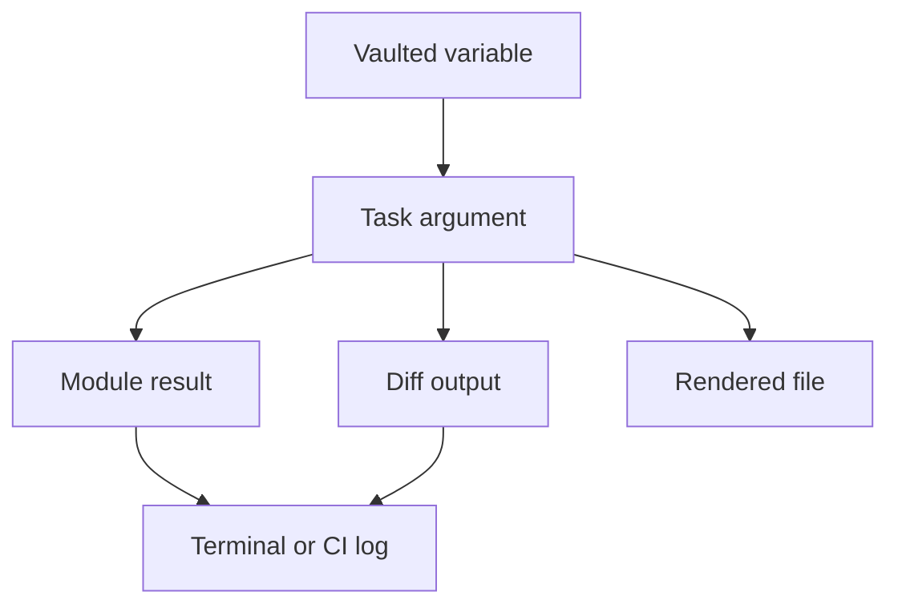

## Table of Contents

1. [Why Secrets Reappear](#why-secrets-reappear)
2. [Output Boundaries](#output-boundaries)
3. [The no_log Setting](#the-no_log-setting)
4. [Diffs and Templates](#diffs-and-templates)
5. [Debugging Without Printing Secrets](#debugging-without-printing-secrets)
6. [Safe Evidence](#safe-evidence)
7. [Putting It All Together](#putting-it-all-together)
8. [What's Next](#whats-next)

## Why Secrets Reappear

The previous article stored the `orders` service secrets in an encrypted Vault file. That protected the file in Git. It did not mean the database password stayed encrypted through the whole playbook run.

Ansible has to decrypt a value before a task can use it. The `orders-api` process cannot connect to the database with encrypted Vault text. It needs the real password in its environment file or another runtime secret source. That means the secret moves from one protected place into several new places.

For the `orders` service, the secret might pass through this path:

```text
group_vars/orders_web.vault.yml
  -> orders_database_password variable
  -> template task argument
  -> rendered /etc/orders-api/orders.env
  -> task result and optional diff output
  -> terminal or CI log
```

The leak usually happens near the end of that path. The vaulted source file is still encrypted. The problem is that a task result, a diff, or a debug message printed the decrypted value.

`no_log` is Ansible's main task-level tool for this. It tells Ansible to hide sensitive task details in normal output. It is not a storage tool like Vault. It is an output boundary.

## Output Boundaries

An output boundary is a place where Ansible turns internal work into something people can read. The boundary might be your terminal, a CI log, a saved callback log, a diff artifact, or an automation platform job page.

The `orders` playbook has both public and secret output. Public output is useful. A reviewer should be able to see that Nginx will proxy to port `8080`, that the systemd unit is enabled, and that the health endpoint returned HTTP 200. Secret output is different. A reviewer does not need to see the database password to know that the environment file was managed.



The diagram has two important lessons. First, the rendered file and the log are separate places. A secret might be valid on the host but invalid in the log. Second, `no_log` belongs near the task that handles the plain value. Hiding an earlier include does not hide a later template result.

## The no_log Setting

Use `no_log: true` on a task when the task arguments or result can contain a secret. The `orders-api` environment file is the simplest example because the template receives secret variables and writes them into a destination file.

```yaml
- name: Render orders-api environment
  ansible.builtin.template:
    src: orders.env.j2
    dest: /etc/orders-api/orders.env
    owner: root
    group: orders-api
    mode: "0640"
  no_log: true
  notify: Restart orders-api
```

The task still runs. It can still change the file. It can still notify the restart handler. The difference is that Ansible censors the details it would normally show about the task result.

Keep the boundary as narrow as the secret path allows. A whole play can use `no_log`, but that makes routine operations hard to understand. If every task is censored, an operator loses useful information about package installation, service status, host reachability, and health checks. Most playbooks are easier to operate when only the secret-bearing tasks are hidden.

There is also a practical limit. `no_log` controls Ansible output for the marked task. It does not make the destination file encrypted. It does not remove secrets from application logs if the service prints them later. It does not make deliberate debugging safe. If someone writes a separate task that prints the secret, that task needs its own boundary or should not exist.

## Diffs and Templates

Diff mode is helpful when a file contains public configuration. If the `orders` team changes the Nginx upstream port, a diff makes the review concrete:

```diff
- proxy_pass http://127.0.0.1:8080;
+ proxy_pass http://127.0.0.1:8081;
```

That diff is useful because it shows exactly what will change and does not expose a credential. The same setting is unsafe for an environment file that contains secrets:

```ini
DATABASE_HOST=orders-db.internal
DATABASE_PASSWORD=generated-production-password
SESSION_SECRET=generated-session-key
```

If diff mode prints that file, the password is now in the review artifact. Vault did not fail. The playbook allowed a secret-bearing template to become output.

For secret-bearing templates, combine `no_log: true` with `diff: false`:

```yaml
- name: Render orders-api environment
  ansible.builtin.template:
    src: orders.env.j2
    dest: /etc/orders-api/orders.env
    owner: root
    group: orders-api
    mode: "0640"
  no_log: true
  diff: false
  notify: Restart orders-api
```

`diff: false` is a useful extra signal for human readers. It says the absence of a diff is intentional, not an accident. It also keeps the task safe when someone runs the playbook with `--diff`.

Do not turn off diff mode everywhere just because one file contains secrets. Public diffs are part of safe review. The better pattern is to show public text changes and hide secret-bearing files.

| File | Show Diff? | Reason |
| --- | --- | --- |
| Nginx site | Yes | Shows public routing behavior |
| systemd unit | Yes | Shows command and service shape |
| orders.env | No | Contains database and session secrets |
| Generated archive | No | Too large or not meaningful as text |

## Debugging Without Printing Secrets

Debug tasks are tempting when a variable is not behaving as expected. They are also one of the easiest ways to leak a secret.

This task is unsafe:

```yaml
- name: Show orders database password
  ansible.builtin.debug:
    var: orders_database_password
```

The task does exactly what it says. It prints the password. A safer task checks the property you actually need to know. For example, the playbook may only need to confirm that the value exists and is long enough to be plausible:

```yaml
- name: Confirm orders database password is loaded
  ansible.builtin.assert:
    that:
      - orders_database_password is defined
      - orders_database_password | length >= 20
    fail_msg: "orders_database_password is missing or too short"
  no_log: true
```

The operator learns whether the password is present without seeing the value. The task uses `no_log` because even assertion output can include values when conditions fail or when verbosity is high.

When you need to compare behavior between environments, prefer names, lengths, checksums of non-secret public files, service status, and health checks. Do not print partial secrets. The first four characters of a token can still help an attacker identify or search for the real value in another system.

## Safe Evidence

Hiding secret output should not leave the team blind. A good playbook replaces secret text with evidence that proves the right thing happened.

For the rendered `orders-api` environment file, metadata is useful:

```yaml
- name: Check orders-api environment metadata
  ansible.builtin.stat:
    path: /etc/orders-api/orders.env
  register: orders_env_file
  changed_when: false

- name: Confirm orders-api environment file permissions
  ansible.builtin.assert:
    that:
      - orders_env_file.stat.exists
      - orders_env_file.stat.pw_name == "root"
      - orders_env_file.stat.gr_name == "orders-api"
      - orders_env_file.stat.mode == "0640"
```

This output proves that the file exists and has restricted ownership. It does not prove the password value, and that is fine. Reviewers need to know that the file is managed safely, not what the password is.

A health check proves the service can use its configuration:

```yaml
- name: Check local orders-api health
  ansible.builtin.uri:
    url: http://127.0.0.1:8080/healthz
    status_code: 200
    return_content: false
  changed_when: false
```

This tells the team that the service started and answered on the expected local port. It is much better evidence than printing the password and hoping the reader infers that the service can connect.

## Putting It All Together

The `orders` team started with a vaulted variable and still risked exposing it in CI output. The reason was movement. Vault protected the stored value, but the template task handled the plain value. Diff output and debug output could make that plain value readable outside the host.

The safer playbook marks the secret-bearing template with `no_log: true` and `diff: false`. It keeps public diffs for public files. It uses metadata and health checks to prove that the file was created correctly and the service works. Reviewers get useful evidence without receiving the database password.

## What's Next

The next article stays with review evidence and looks at `--check` and `--diff`. Those modes can show what Ansible expects to change before a real run, but they have limits that matter when a playbook depends on changed state.

---

**References**

- [Ansible documentation: Logging Ansible output](https://docs.ansible.com/projects/ansible/latest/reference_appendices/logging.html)
- [Ansible documentation: Ansible Vault](https://docs.ansible.com/projects/ansible/latest/vault_guide/vault.html)
- [Ansible documentation: Validating tasks: check mode and diff mode](https://docs.ansible.com/projects/ansible/latest/playbook_guide/playbooks_checkmode.html)
- [Ansible documentation: ansible-playbook command line reference](https://docs.ansible.com/projects/ansible/latest/cli/ansible-playbook.html)
