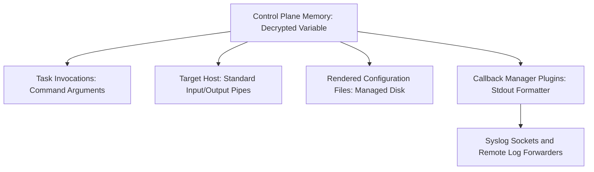
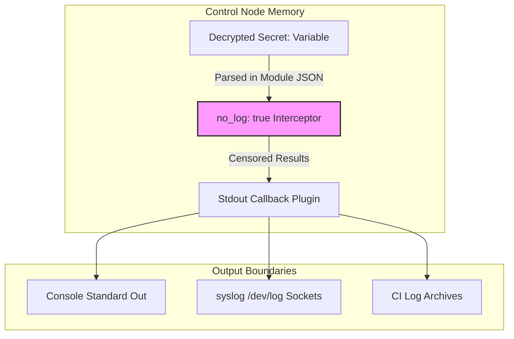

## Table of Contents

1. [The Problem: Decrypted Secrets in Execution Logs](#the-problem-decrypted-secrets-in-execution-logs)
2. [Understanding Output Boundaries](#understanding-output-boundaries)
3. [The no_log System Filter and Masking Mechanics](#the-no_log-system-filter-and-masking-mechanics)
4. [Under the Hood: Intercepting the Python JSON Stream](#under-the-hood-intercepting-the-python-json-stream)
5. [JSON Payload Scrubbing: Before and After](#json-payload-scrubbing-before-and-after)
6. [Tainted Registered Variables and Memory Propagation](#tainted-registered-variables-and-memory-propagation)
7. [Developing Custom Modules: The Argument Specification Boundary](#developing-custom-modules-the-argument-specification-boundary)
8. [The System Limits of no_log Protection](#the-system-limits-of-no_log-protection)
9. [Operating System Process Introspection Leaks](#operating-system-process-introspection-leaks)
10. [Secure Diffs and Configuration Auditing](#secure-diffs-and-configuration-auditing)
11. [Debugging Without Credentials Exposure](#debugging-without-credentials-exposure)
12. [Auditing and Logging Infrastructure Integration](#auditing-and-logging-infrastructure-integration)
13. [Putting It All Together](#putting-it-all-together)
14. [What's Next](#whats-next)

## The Problem: Decrypted Secrets in Execution Logs

`no_log` is an output redaction control, not a secret storage system; it hides task data from logs but does not prevent values from existing in memory or remote files.

When building a secure database infrastructure for processing customer payment refunds, developers face a difficult challenge. The automation playbooks must run seamlessly, installing database engines, rendering system credentials files, and initiating API connections with payment gateways. To perform these actions, the control plane must read encrypted Ansible Vault files, decrypt the sensitive keys in-memory on the control node, and pass the plain-text credentials to the target systems.

The security issue arises during the task execution reporting phase. By default, Ansible reports the success or failure of each task, and optional settings such as higher verbosity, argument display, logging, and diff mode can expose much more detail.

If a task that handles the database password encounters an error, the execution engine prints the entire failed task structure to standard output. This output, including the plain-text database password, is then captured by continuous integration systems, saved in log archives, forwarded to central syslog servers, and exposed on monitoring dashboards.

Vault successfully protected the credential while it was at rest in the repository. However, the lack of secure output boundaries during execution has allowed the plain-text password to leak into the organization's persistent log systems, creating a major vulnerability.

## Understanding Output Boundaries

An output boundary is any point where Ansible might turn internal task data into human-readable text. It includes the terminal, CI logs, callback plugins, syslog forwarding, and diff output.

Example: a decrypted `refund_db_password` can be safe in Vault but leak later if a failed task prints its command arguments to a CI job log. When designing a secure automation system, trace where a secret can become text and protect each path.

A standard refund processor deployment exposes secrets along several parallel paths:



To secure this pipeline, you cannot rely on a single tool. Encrypting the source file only protects the repository. Once the variable is decrypted, you must apply output boundaries to prevent the value from reaching the console, template diffs, or debug streams.

You must also apply restrictive host permissions to secure the variable once it is written to disk. Each of these boundaries has a distinct job, and missing even one will expose your system credentials.



## The no_log System Filter and Masking Mechanics

`no_log: true` is Ansible's task-level output mask. It tells Ansible to censor normal task arguments and result data before they reach console or log callbacks.

Example: a migration task that uses `refund_db_password` should show only a censored task result, not the command string containing the password. The primary mechanism for establishing this execution-level output boundary is the `no_log: true` parameter.

The following task invokes a script that processes database schema migrations for the payment refunds system. It accepts sensitive database credentials as environment variables but uses the `no_log: true` parameter to keep them safe:

```yaml
- name: Execute database refund schema migrations
  ansible.builtin.command:
    cmd: "/opt/refunds/bin/migrate.sh --user database_admin --pass {{ refund_db_password }}"
  no_log: true
```

When this task executes, the engine hides the command arguments and the resulting stdout stream. If the task fails or succeeds, the console output simply reports:

```plain
changed: [database-node-01]
```

Without the `no_log: true` parameter, a failure in `migrate.sh` would cause the command execution engine to print the command arguments, the standard error stream, and the return dictionary to the terminal, exposing the administrative password.

It is best to apply `no_log: true` selectively at the task level rather than globally at the play level. If you censor the entire playbook, operators lose visibility into package installations, service reload triggers, and directory setups, making it difficult to debug genuine environment issues.

## Under the Hood: Intercepting the Python JSON Stream

Ansible modules normally return JSON result data to the control node. `no_log` works by marking the task as sensitive so Ansible scrubs that result dictionary before display and logging plugins receive it.

Example: a remote command can return `cmd`, `stdout`, `stderr`, and `invocation.module_args`; with `no_log: true`, those fields are censored before the terminal output is rendered.

When a task executes, the control plane prepares the module code and its parameters, sends the payload through the selected connection, and runs the module using the target host's supported execution path.

Once the remote module completes its work, it writes its outcomes back to the control plane as a JSON dictionary over the standard output descriptor (stdout). This JSON payload contains fields like `changed`, `failed`, the module arguments, and any registered output strings.

On the control plane, the task execution is managed by the `ansible.executor.task_executor.TaskExecutor` class in the Python runtime. When preparing to run a task, this class checks the `task.no_log` attribute. If it evaluates to true, the executor binds an internal state flag (`_no_log = True`) to the task result tracking object.

When the raw stdout JSON string is received back from the SSH process pipe, the control plane's action plugin loader intercepts it. Before passing the dictionary to any display callback plugins (which write to stdout) or log handlers, it executes a recursive scrubbing routine on the Python dictionary objects in memory.

## JSON Payload Scrubbing: Before and After

JSON payload scrubbing means recursively replacing sensitive result fields with censored values. It protects normal callback output even when the raw module result includes command arguments or error text.

Example: a failed migration command might return `--pass secretPassword123` in `cmd`, but the scrubbed result replaces that data before it reaches logs. Consider the raw JSON return dictionary generated by a failed execution of the command module before scrubbing:

```json
{
  "changed": false,
  "failed": true,
  "cmd": "/opt/refunds/bin/migrate.sh --user database_admin --pass secretPassword123",
  "rc": 1,
  "stdout": "Error: Connection refused for user database_admin",
  "stderr": "FATAL: password authentication failed for database_admin",
  "invocation": {
    "module_args": {
      "cmd": "/opt/refunds/bin/migrate.sh --user database_admin --pass secretPassword123",
      "_uses_shell": false
    }
  }
}
```

If the task does not carry `no_log: true`, this raw JSON block is written directly to the console display.

When `no_log: true` is active, Ansible censors the normal task result before it is sent to the formatter:

```json
{
  "changed": false,
  "failed": true,
  "censored": "the intellectual property sensitive data was muted",
  "invocation": {
    "module_args": {
      "censored": "the intellectual property sensitive data was muted"
    }
  }
}
```

The plain-text credentials and detailed failed output are hidden from normal Ansible result output, so log collectors record the censored task state instead of the raw parameters.

## Tainted Registered Variables and Memory Propagation

Tainted registered variables are registered results that came from a sensitive task. Ansible preserves no-log metadata with those results so normal output paths continue to treat them as sensitive.

Example: if `migration_result` comes from a task marked `no_log: true`, later normal output should not print the raw password-bearing fields from that result.

Under the hood, Ansible marks the registered result so normal display callbacks know it came from a censored task.

This reduces accidental exposure when later tasks pass that registered result through normal Ansible output paths. It does not make deliberate `debug` tasks safe: official Ansible logging guidance warns that `no_log` does not affect debugging output, so never print secret values or secret-bearing registered results during production troubleshooting.

## Developing Custom Modules: The Argument Specification Boundary

An argument specification is the custom module's declaration of accepted parameters and their types. Marking a parameter with `no_log=True` tells Ansible's module utilities that this specific argument is sensitive.

Example: a custom `refund_db_user` module should declare `password=dict(type='str', required=True, no_log=True)` so the password is masked in invocation data. Simply declaring `no_log: true` in the playbook task suppresses control-node output, but it cannot prevent poorly written module code from logging sensitive parameters on the target host before returning.

To secure custom modules, you must configure the module's argument specification using the standard `AnsibleModule` utility library. In the argument definition dictionary, you must explicitly set `no_log=True` for any sensitive parameters:

```python
# Inside a custom Python module: library/refund_db_user.py
from ansible.module_utils.basic import AnsibleModule

def main():
    module = AnsibleModule(
        argument_spec=dict(
            username=dict(type='str', required=True),
            password=dict(type='str', required=True, no_log=True),
            endpoint=dict(type='str', required=True)
        )
    )
    # Module execution logic continues here...
```

By setting `no_log=True` inside the argument specification dictionary, you tell Ansible's module utilities that the parameter is sensitive. The module utility layer can then mask the parameter in invocation data and normal module results, but custom module code must still avoid writing the value to its own logs, exception messages, external commands, or files. The argument spec declaration does not sanitize code paths the module author controls directly.

If a developer fails to set `no_log=True` in the Python argument spec, the parameter can appear in module invocation output or error details, creating an operational leak that bypasses the playbook author's expectations.

## The System Limits of no_log Protection

`no_log` protects Ansible's normal output path, not every place a secret can go. It does not stop external commands, operating systems, custom callbacks, or target applications from writing secrets somewhere else.

Example: if a shell command writes a password to `/var/log/syslog`, `no_log: true` can hide Ansible's task result but cannot erase the target host's log line.

First, `no_log` only controls output generated by the Ansible execution engine. It cannot intercept actions performed outside the Ansible process. For example, if your task runs a command that writes a database password to a public system log file (such as `/var/log/syslog`) via a shell redirect, the `no_log` parameter on the Ansible task will not stop the target host's syslog daemon from writing the credential to disk.

Second, `no_log` does not prevent Python from writing raw memory dumps during a critical interpreter crash. If the control node processes experience an out-of-memory error or receive a `SIGSEGV` signal while holding decrypted variables, the operating system may write a core dump file to the local disk. This core dump contains the raw memory state, exposing plain-text keys to anyone with access to the core dump directory.

Third, `no_log` can be bypassed by custom, third-party callback plugins that do not respect the Ansible execution API. When installing community callback plugins for external monitoring systems, engineers must verify that the plugin strictly honors the internal `no_log` flag before deploying it to production systems.

## Operating System Process Introspection Leaks

Process introspection is the ability to inspect running processes and their command-line arguments. On Linux, tools like `ps` and files under `/proc/<PID>/cmdline` can expose arguments while a process is running.

Example: a task that runs `/opt/refunds/bin/migrate.sh --pass secretPassword123` may expose the password to local users who can inspect the process table during the execution window.

During the execution window, local users with enough permission on the target host may run commands like `ps -ef` or query `/proc/<PID>/cmdline` to view the raw command arguments, exposing the decrypted password in plain text.

To mitigate this OS-level process boundary leak, avoid passing decrypted secrets via command-line arguments. Prefer purpose-built Ansible modules, protected files with strict permissions, standard input where appropriate, or short-lived secret manager tokens. Environment variables can also be visible through process inspection on some systems, so treat them as sensitive rather than automatically safe.

## Secure Diffs and Configuration Auditing

Secure diff auditing means keeping useful before-and-after review output for public files while suppressing diffs for secret-bearing files. Diff mode is excellent for ordinary configuration, but dangerous for rendered credentials.

Example: reviewing `server_name payments-prod.internal` is useful, but showing `DATABASE_PASSWORD=new-vaulted-password` in a diff is a credential leak. During normal configuration runs, administrators use the `--diff` command-line flag to review changes made to target files.

```diff
- server_name payments-dev.internal;
+ server_name payments-prod.internal;
```

However, if a playbook renders a database configuration file or an environment environment file containing secrets, enabling diff mode will print the plain-text secrets directly to the terminal during a change:

```diff
- DATABASE_PASSWORD=old-password;
+ DATABASE_PASSWORD=new-vaulted-password;
```

This output violates your security policy, exposing the credential in the review log. To prevent this, you must explicitly disable diff mode on any task that handles sensitive configurations by setting `diff: false`:

```yaml
- name: Render refund service environment configuration
  ansible.builtin.template:
    src: refund_service.env.j2
    dest: /etc/refunds/refund_service.env
    owner: root
    group: refunds-admin
    mode: "0600"
  no_log: true
  diff: false
```

By explicitly setting `diff: false` alongside `no_log: true`, you keep the task's normal diff and result output censored even when an operator runs the entire playbook with the global `--diff` command-line parameter.

## Debugging Without Credentials Exposure

Safe debugging checks whether a secret exists or has the expected shape without printing the secret itself. Direct `debug` output is unsafe for credential values.

Example: assert that `refund_db_password` is defined and at least 24 characters long, but do not print the password. When a variable fails to resolve correctly, developers are often tempted to insert quick `debug` tasks to print the variable to the screen:

```yaml
- name: Output the database password variable (Unsafe)
  ansible.builtin.debug:
    var: refund_db_password
```

This is a dangerous habit that often leads to credentials leaking into Git branches and CI runs. A secure playbook should validate the state of a variable without displaying the actual secret value.

You should use the `ansible.builtin.assert` module to verify that a variable is present and meets basic structural requirements, while applying the `no_log: true` parameter to mask the assertion parameters if the check fails:

```yaml
- name: Validate that the database credentials are loaded securely
  ansible.builtin.assert:
    that:
      - refund_db_password is defined
      - refund_db_password | length >= 24
    fail_msg: "The refund_db_password variable is missing or does not meet the 24-character security minimum."
  no_log: true
```

This task verifies that the password variable exists and contains a secure, long value. If the assertion fails, the engine raises an error and halts execution, while `no_log: true` keeps the normal task result from printing the sensitive variable context.

## Auditing and Logging Infrastructure Integration

Logging integration sends Ansible run output into durable systems such as local files, syslog, Splunk, or Elasticsearch. That makes redaction more important because a leaked secret can persist long after the terminal session ends.

Example: a CI wrapper that pipes `ansible-playbook deploy.yml` through `tee` can save every uncensored task failure into `/var/log/deploy.log`. In enterprise environments, playbooks do not run in isolation.

When integrating with these platforms, engineers must ensure that the logging pipeline respects the `no_log` boundary. Ansible's normal output paths honor censored task results, but custom callbacks, wrapper scripts, and debug settings require separate review.

If a task is marked `no_log: true`, the engine replaces the log string with:

```plain
ansible-command: [safe log data omitted]
```

This filtering helps local logs remain compliant. However, if you configure a custom wrapper script around the `ansible-playbook` command that redirects standard output to a log forwarder (for example, `ansible-playbook deploy.yml | tee -a /var/log/deploy.log`), a failure in a task that is *not* marked with `no_log` can write secrets directly to the text file.

To maintain compliance, all standard output captures must be treated as sensitive, with access restricted to authorized security administrators.

## Putting It All Together

Securing decrypted variables during playbook runs requires establishing clear output boundaries at every stage of execution. While Ansible Vault protects secrets at rest in your repository, the `no_log: true` parameter is required to protect those secrets from leaking during active execution.

By combining selective logging suppression with secure templates, assertions, and target host file permissions, you establish a multi-layered security boundary:

| Execution State | Leak Vector | Mitigation Tool | Implementation Pattern |
| :--- | :--- | :--- | :--- |
| **Task Outputs** | Console stdout, CI log archives, task failure recaps | `no_log: true` Directive | Intercepts and replaces module JSON return structures with censored blocks in memory. |
| **File Diffs** | Unified diff output during template renders | `diff: false` Parameter | Disables text diff generation for the target task, even during `--diff` runs. |
| **Custom Modules** | Target syslog socket leaks on remote hosts | `no_log=True` Argument Spec | Declares parameter as sensitive inside the remote Python module's argument definition. |
| **Process Introspection** | OS process table queries (`ps -ef` or `/proc`) | Stdin Pipe Transports | Passes credentials via stdin channels instead of shell command arguments. |
| **Registered Results** | Registered variables in downstream tasks | Preserved no-log metadata | Keeps normal result output censored, while still requiring developers to avoid unsafe debug printing. |
| **Operational Validation** | Debug prints during troubleshooting | `ansible.builtin.assert` | Verifies variable presence and minimum length bounds without displaying values. |

By coordinating these execution boundaries, your team can automate complex systems, verify successful deployments, and audit target environments without exposing the credentials that keep your platforms secure.

---

**References**

- [Ansible Documentation: Masking Sensitive Tasks](https://docs.ansible.com/ansible/latest/reference_appendices/logging.html#protecting-sensitive-data-no-log) - Explains the `no_log` directive, what it suppresses, and its documented limitations for debug tasks and callbacks.
- [Managing Secrets and Variable Precedence](https://docs.ansible.com/ansible/latest/playbook_guide/playbooks_variables.html) - Covers Ansible variable precedence, vault integration patterns, and structuring secret variables alongside public configuration.
- [Syslog Socket Configuration and Logging](https://docs.ansible.com/ansible/latest/reference_appendices/logging.html) - Reference for configuring `ANSIBLE_LOG_PATH`, syslog callback integration, and log format behavior.
- [Ansible Task Diffs and Templates](https://docs.ansible.com/ansible/latest/playbook_guide/playbooks_checkmode.html#diff-mode) - Documents how diff mode interacts with template tasks and how to disable diff output on secret-bearing tasks.
