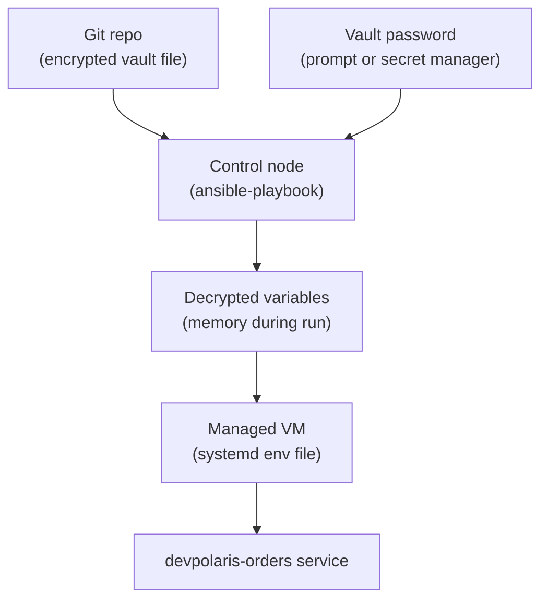

## Table of Contents

1. [The Secret Problem Ansible Has to Solve](#the-secret-problem-ansible-has-to-solve)
2. [What Ansible Vault Protects](#what-ansible-vault-protects)
3. [Where Secrets Belong in the Orders Playbook](#where-secrets-belong-in-the-orders-playbook)
4. [Creating a Vaulted Variables File](#creating-a-vaulted-variables-file)
5. [Using Vaulted Variables in Tasks and Templates](#using-vaulted-variables-in-tasks-and-templates)
6. [Supplying the Vault Password](#supplying-the-vault-password)
7. [The Data-at-Rest Boundary](#the-data-at-rest-boundary)
8. [No Log and Log Leakage](#no-log-and-log-leakage)
9. [Editing, Viewing, and Rekeying Vault Files](#editing-viewing-and-rekeying-vault-files)
10. [Failure Modes to Practice](#failure-modes-to-practice)
11. [A Safe Vault Workflow](#a-safe-vault-workflow)

## The Secret Problem Ansible Has to Solve

Server configuration often needs values that should not be visible in Git. The `devpolaris-orders` API might need a database password, a session signing key, or a token for an internal package registry. The playbook needs those values to render the systemd environment file or application config, but the repository should not show them as plain text.

The simplest mistake is easy to understand:

```yaml
orders_database_password: "prod-password-please-change"
orders_session_secret: "temporary-session-secret"
```

That file is readable by every person and every tool with repository access. If it is pushed to a remote Git server, deleting the line later does not erase it from history. If a CI job prints the file during debugging, the secret may also appear in build logs. Secret handling is mostly about reducing the number of places where plain text appears.

Ansible Vault exists for this exact kind of Ansible content. It lets you encrypt variables or whole files so they can sit near the playbooks that use them without being readable as plain text. At run time, Ansible decrypts the values with a Vault password and uses them like normal variables.

For this article, keep the running service small. `devpolaris-orders` runs on Linux VMs. Nginx proxies traffic to a Node process managed by systemd. An Ansible role configures the VM. Vault will protect the app secrets that the role needs to write an environment file for systemd.



The important part of the diagram is the middle. Vault protects the file in Git. During a playbook run, Ansible must decrypt the values to use them. That boundary matters, and we will return to it before the end.

## What Ansible Vault Protects

Ansible Vault encrypts Ansible data. That can be a variables file under `group_vars/`, a file passed with `vars_files`, a role variable file, an encrypted string inside YAML, or even an entire task file. For a beginner workflow, encrypted variable files are the easiest place to start.

Vault does not replace a secret manager. A secret manager is a service such as AWS Secrets Manager, Azure Key Vault, HashiCorp Vault, or a company internal system that stores and audits secrets centrally. Ansible Vault is file encryption built into Ansible. It is useful when you want encrypted Ansible content in source control and you can manage the Vault password safely.

That tradeoff is fine for many small teams. It keeps the playbook self-contained, reviewable, and portable. It also means the Vault password becomes important. Anyone who has the encrypted file and the password can decrypt the secret.

Here is what a vaulted file looks like on disk:

```text
$ANSIBLE_VAULT;1.2;AES256;prod
6638643434376132396463386162663539376564666430386531663537333134
3165653364333364343464643732383637383239343839326339323936343664
3364346638323135663438333136396632366233613639633531323339366438
```

You cannot read the variable names or values from that encrypted payload. That is useful when the variable names themselves reveal something sensitive, such as `stripe_live_secret_key` or `database_admin_password`.

Vault can also encrypt a single value with `encrypt_string`, but beginners often find whole-file encryption easier to reason about. A whole vaulted file has a clear boundary: everything in this file is sensitive. A mixed file with some plain values and some encrypted strings can be convenient, but it is easier to accidentally expose context around the secret.

## Where Secrets Belong in the Orders Playbook

The orders role already has safe defaults in `roles/orders_app/defaults/main.yml`. That file should contain ordinary values such as ports, paths, users, and local placeholder domains. It should not contain production secrets.

A clean layout separates non-secret environment values from secret values:

```text
ansible/
  group_vars/
    orders_web_prod.yml
    orders_web_prod.vault.yml
    orders_web_staging.yml
    orders_web_staging.vault.yml
  roles/
    orders_app/
      tasks/
        main.yml
      templates/
        orders.env.j2
```

The plain production file can hold values that are safe for review:

```yaml
orders_app_environment: prod
orders_app_domain: orders.devpolaris.example
orders_app_port: 8080
orders_database_host: orders-db.internal
orders_database_name: orders
```

The vaulted production file can hold sensitive values:

```yaml
orders_database_user: orders_app
orders_database_password: REPLACE_WITH_GENERATED_PASSWORD
orders_session_secret: REPLACE_WITH_GENERATED_SECRET
```

The placeholder values above are not secrets. They show the shape only. In a real run, generate new values with your team's approved process, place them in the vaulted file, and avoid pasting them into chat, tickets, or shell history.

This split helps code review. A teammate can review the domain, port, and database host without opening the encrypted file. The encrypted file can change in a separate review where only the fact of rotation matters, not the secret value itself.

## Creating a Vaulted Variables File

The beginner-safe way to create a vaulted file is to let `ansible-vault create` open your editor and write the encrypted file when the editor closes.

```bash
$ ansible-vault create --vault-id prod@prompt group_vars/orders_web_prod.vault.yml
New vault password (prod):
Confirm new vault password (prod):
```

The `prod@prompt` value is a Vault ID. A Vault ID is a label plus a password source. The label helps humans and Ansible distinguish environments such as `staging` and `prod`. The `prompt` source tells Ansible to ask for the password interactively.

Inside the editor, write normal YAML:

```yaml
orders_database_user: orders_app
orders_database_password: REPLACE_WITH_GENERATED_PASSWORD
orders_session_secret: REPLACE_WITH_GENERATED_SECRET
```

When you save and close the editor, the file on disk is encrypted. If you run `sed` or open it without Vault, you see the `$ANSIBLE_VAULT` header and ciphertext, not the YAML values.

You can check the file without exposing it in your terminal by viewing only the first line:

```bash
$ head -n 1 group_vars/orders_web_prod.vault.yml
$ANSIBLE_VAULT;1.2;AES256;prod
```

That proves the file is vaulted and shows the Vault ID label. It does not prove the values are correct. To inspect the decrypted YAML, use `ansible-vault view` in a terminal where nobody else can see the screen, or use `ansible-playbook --check` against a safe target and verify behavior without printing secrets.

If you already created a plain YAML file by mistake, encrypt it immediately:

```bash
$ ansible-vault encrypt --vault-id prod@prompt group_vars/orders_web_prod.vault.yml
```

Then treat the earlier plain text exposure as an incident. If the file was committed, pushed, logged, or shared, rotate the secret. Encryption after exposure does not remove copies that already escaped.

## Using Vaulted Variables in Tasks and Templates

After Ansible decrypts the vaulted file, the variables behave like normal variables. The `orders_app` role can render an environment file for systemd.

The template might look like this:

```ini
NODE_ENV={{ orders_app_environment }}
PORT={{ orders_app_port }}
DATABASE_HOST={{ orders_database_host }}
DATABASE_NAME={{ orders_database_name }}
DATABASE_USER={{ orders_database_user }}
DATABASE_PASSWORD={{ orders_database_password }}
SESSION_SECRET={{ orders_session_secret }}
```

The task that writes it should set restrictive permissions because the rendered file on the VM contains plain text secrets:

```yaml
- name: Render orders environment file
  ansible.builtin.template:
    src: orders.env.j2
    dest: /etc/devpolaris-orders/orders.env
    owner: root
    group: "{{ orders_app_user }}"
    mode: "0640"
  no_log: true
  notify:
    - Restart orders app
```

The `mode: "0640"` value means root can read and write, the app group can read, and everyone else has no access. Use quotes around file modes in YAML so the value is not misread as a decimal number by tooling. The `no_log: true` line matters because the task arguments include decrypted variables after templating.

The systemd unit can read that environment file:

```ini
[Unit]
Description=DevPolaris Orders API
After=network-online.target
Wants=network-online.target

[Service]
User={{ orders_app_user }}
Group={{ orders_app_user }}
WorkingDirectory={{ orders_app_release_dir }}
EnvironmentFile=/etc/devpolaris-orders/orders.env
ExecStart=/usr/bin/node {{ orders_app_release_dir }}/server.js
Restart=on-failure
RestartSec=5

[Install]
WantedBy=multi-user.target
```

Now the systemd unit itself does not contain the secret values. It points to an environment file that the role writes with limited permissions. That is easier to inspect and rotate than hiding secrets inside a long `ExecStart` line.

On the managed VM, a quick permissions check should look like this:

```bash
$ sudo ls -l /etc/devpolaris-orders/orders.env
-rw-r----- 1 root devpolaris-orders 214 Apr 18 10:22 /etc/devpolaris-orders/orders.env
```

The owner and mode are part of the secret story. Vault protects the value before and during delivery from the control side. Linux permissions protect the rendered value after it lands on the VM.

## Supplying the Vault Password

Ansible needs the Vault password whenever it reads vaulted content. For local learning and manual production runs, prompting is clear:

```bash
$ ansible-playbook -i inventory/prod.ini site.yml --vault-id prod@prompt --limit orders-prod-01
Vault password (prod):
```

Prompting avoids putting the password in shell history or a committed config file. It also makes the operator consciously choose the environment password used for the run.

Automation usually cannot type into a prompt. In CI, the safer pattern is to store the Vault password in the CI secret store, write it to a temporary file with restricted permissions, use that file for the run, then remove it. The exact syntax depends on the CI system, but the local shell shape looks like this:

```bash
$ install -m 0600 /dev/null .vault-pass-prod
$ printf "%s" "$ANSIBLE_VAULT_PASSWORD_PROD" > .vault-pass-prod
$ ansible-playbook -i inventory/prod.ini site.yml --vault-id prod@.vault-pass-prod --limit orders-prod-01
$ rm -f .vault-pass-prod
```

Do not commit `.vault-pass-prod`. Add the pattern to `.gitignore` in the repository that owns the Ansible project. The password file is the key to the encrypted data. If the encrypted file and password file both sit in Git, Vault has not helped.

Some teams use a password client script instead of a password file. The script fetches the password from a secret manager and prints it for Ansible. That can be a good bridge when your team already has a central secret store but still uses Ansible Vault for encrypted variable files.

Keep Vault IDs boring and environment-specific:

| Vault ID | Typical Use | Password Source |
|----------|-------------|-----------------|
| `staging` | Staging group vars | Prompt locally or CI staging secret |
| `prod` | Production group vars | Prompt locally or CI production secret |
| `shared` | Low-risk shared lab values | Prompt or team-managed password file |

Do not reuse the production Vault password for local examples. If a learner copies a command into a lab, the lab should not require or expose a real production credential.

## The Data-at-Rest Boundary

The most important Vault limitation is easy to miss: Ansible Vault protects data at rest. Data at rest means the value is sitting in storage, such as a Git working tree, a laptop disk, a backup, or a repository host. Vault encrypts that stored file.

When Ansible runs, it decrypts the value so modules and templates can use it. At that point the secret is data in use. The decrypted value may live in process memory, be written to a managed host, appear in task arguments, or be shown in output if a task prints it. Vault is no longer the thing protecting that plain text.

That boundary explains why this task is risky:

```yaml
- name: Print database password for debugging
  ansible.builtin.debug:
    var: orders_database_password
```

The value came from a vaulted file, but the debug task asks Ansible to print the decrypted variable. Vault did its job for the file in Git. The playbook author still leaked the secret during the run.

A safer diagnostic checks that a value exists without printing it:

```yaml
- name: Confirm database password was supplied
  ansible.builtin.assert:
    that:
      - orders_database_password is defined
      - orders_database_password | length >= 24
    fail_msg: "orders_database_password must be supplied from Vault"
  no_log: true
```

Even here, `no_log: true` is useful because assertion failure output can include evaluated values or task context. For secret-related tasks, assume output needs suppression unless you have proved it cannot include sensitive material.

The same boundary applies on the VM. If the role writes `/etc/devpolaris-orders/orders.env`, that file is plain text on the managed host. Vault is not encrypting it there. Linux permissions, disk encryption, backups policy, SSH access, and service design now matter.

## No Log and Log Leakage

By default, Ansible prints task names, status, module arguments in some contexts, return values, and error messages to standard output. Many teams also save Ansible output to a log file or CI job log. That output can leak secrets if tasks handle decrypted values.

Use `no_log: true` on tasks that expose secrets through arguments, return values, or generated content:

```yaml
- name: Create application config directory
  ansible.builtin.file:
    path: /etc/devpolaris-orders
    state: directory
    owner: root
    group: "{{ orders_app_user }}"
    mode: "0750"

- name: Render orders environment file
  ansible.builtin.template:
    src: orders.env.j2
    dest: /etc/devpolaris-orders/orders.env
    owner: root
    group: "{{ orders_app_user }}"
    mode: "0640"
  no_log: true
```

The directory task does not need `no_log` because it uses no secret values. The template task does because the rendered source includes the database password and session secret.

A log without `no_log` can show too much detail during a failed run:

```text
TASK [orders_app : Render orders environment file] *************************
fatal: [orders-prod-01]: FAILED! => {
  "changed": false,
  "msg": "AnsibleUndefinedVariable: 'orders_database_password' is undefined"
}
```

That example does not print the secret, but it reveals the variable name and confirms a production database password exists. Other module failures can reveal more, especially with command lines, URLs, headers, or JSON bodies.

With `no_log: true`, Ansible hides the result:

```text
TASK [orders_app : Render orders environment file] *************************
fatal: [orders-prod-01]: FAILED! => {
  "censored": "the output has been hidden due to the fact that no_log: true was specified for this result"
}
```

That is safer for logs, but it makes debugging harder. The practical workflow is to debug with safe, non-secret placeholders in a lab or staging environment, fix the task shape there, then keep `no_log: true` for real secret handling.

There is one more caveat: `no_log` does not protect every possible debug path. The official documentation warns that it does not affect debugging output. If you enable deep Ansible debugging or print environment variables in CI, you can still leak data outside normal task output. Treat verbose debugging around secrets as a special-risk activity.

## Editing, Viewing, and Rekeying Vault Files

Vault files need routine maintenance. You may need to view a value during an incident, edit a rotated password, or change the Vault password itself after a teammate leaves the project.

To view without editing:

```bash
$ ansible-vault view --vault-id prod@prompt group_vars/orders_web_prod.vault.yml
Vault password (prod):
```

Use `view` when you need to inspect the content and do not intend to change it. It decrypts for display, so use it only in a private terminal and avoid screen sharing or terminal recording.

To edit in place:

```bash
$ ansible-vault edit --vault-id prod@prompt group_vars/orders_web_prod.vault.yml
Vault password (prod):
```

Ansible decrypts the file to a temporary editor session, then saves and re-encrypts it when you close the editor. Editors can create swap files, backups, or clipboard entries that contain plain text. If your team edits production Vault files often, configure the editor to avoid those extra copies.

To rotate the Vault password for a file:

```bash
$ ansible-vault rekey --vault-id prod@prompt --new-vault-id prod@prompt group_vars/orders_web_prod.vault.yml
Vault password (prod):
New vault password (prod):
Confirm new vault password (prod):
```

Rekeying changes the password that decrypts the Vault file. It does not change the application secret inside the file. If `orders_database_password` was exposed, rekeying the Vault file is not enough. You must rotate the database password itself, update the vaulted value, and deploy the change.

This distinction matters:

| Action | What Changes | When To Use |
|--------|--------------|-------------|
| `ansible-vault edit` | Secret values inside the file | Rotate app password or add a new secret |
| `ansible-vault rekey` | Password that unlocks the Vault file | Teammate leaves or Vault password policy changes |
| Database password rotation | Credential accepted by the database | Secret was exposed or scheduled rotation is due |

The words sound similar, but the operational result is different. Rotate the thing that was exposed.

## Failure Modes to Practice

Secret handling improves when you recognize failure output quickly. Practice these shapes with fake secrets before you handle production values.

The first failure is a missing Vault password:

```bash
$ ansible-playbook -i inventory/prod.ini site.yml --limit orders-prod-01

ERROR! Attempting to decrypt but no vault secrets found
```

The fix is to supply the correct Vault ID and password source:

```bash
$ ansible-playbook -i inventory/prod.ini site.yml --vault-id prod@prompt --limit orders-prod-01
```

The second failure is a wrong Vault password:

```text
ERROR! Decryption failed (no vault secrets were found that could decrypt)
```

Check that you used the right Vault ID for the file and did not mix staging and production passwords. Do not keep retrying random passwords in CI. Stop, inspect the file header, and confirm the expected label.

```bash
$ head -n 1 group_vars/orders_web_prod.vault.yml
$ANSIBLE_VAULT;1.2;AES256;prod
```

The third failure is a plain text secret accidentally committed:

```bash
$ git diff --cached
+orders_database_password: "prod-password-please-change"
```

Do not solve this only by moving the line into a Vault file. If the commit was not pushed, remove it from the commit and rotate the value if anyone else saw it. If it was pushed, treat it as exposed: rotate the real credential, remove the plain text, and check logs or CI output that may have copied it.

The fourth failure is leaking through debug:

```yaml
- name: Show application environment
  ansible.builtin.debug:
    var: orders_app_environment
```

This task is fine because the environment name is not secret. A nearby task that prints all variables is not fine:

```yaml
- name: Show all variables
  ansible.builtin.debug:
    var: vars
```

That can print decrypted Vault values along with everything else. Avoid broad variable dumps in projects that load secrets.

## A Safe Vault Workflow

For `devpolaris-orders`, a safe beginner workflow is mostly a set of habits. Keep secrets in a separate vaulted file. Keep non-secrets in plain group vars. Prompt for the Vault password during manual runs. Use a CI secret store or password client script for automation. Mark secret-handling tasks with `no_log: true`. Check rendered file permissions on the VM.

A production canary run might look like this:

```bash
$ ansible-playbook -i inventory/prod.ini site.yml \
    --vault-id prod@prompt \
    --limit orders-prod-01 \
    --check --diff
```

If the check output is clean and the diff does not expose secret content, run the limited apply:

```bash
$ ansible-playbook -i inventory/prod.ini site.yml \
    --vault-id prod@prompt \
    --limit orders-prod-01
```

Then verify the service without printing secret values:

```bash
$ ssh orders-prod-01
$ sudo systemctl status devpolaris-orders --no-pager
$ sudo ls -l /etc/devpolaris-orders/orders.env
$ curl -fsS http://127.0.0.1:8080/health
ok
```

The verification checks the service state, file permissions, and health endpoint. It does not run `cat /etc/devpolaris-orders/orders.env`, because that would print the secrets you just protected.

Before a full production run, use this checklist:

| Check | Why It Matters |
|-------|----------------|
| Vaulted file starts with `$ANSIBLE_VAULT` | Secrets are not stored as plain YAML. |
| Vault password source is outside Git | The key is not committed beside the lock. |
| Secret tasks use `no_log: true` | Normal output and CI logs are less likely to expose values. |
| Rendered file mode is restrictive | The managed VM does not expose app secrets to every user. |
| Debug tasks do not dump broad variables | Decrypted Vault values stay out of troubleshooting output. |
| Rotation plan is clear | The team knows when to rekey Vault and when to rotate the real app secret. |

Vault is a useful part of the Ansible toolbelt, but it is only one part of secret handling. It protects encrypted files at rest. Your playbook structure, logging choices, password source, rendered file permissions, and rotation process protect the places where the decrypted value appears.

---

**References**

- [Ansible Vault](https://docs.ansible.com/projects/ansible/latest/vault_guide/vault.html) - Official Vault overview, including the warning that Vault protects data at rest and decrypted data needs separate care.
- [Encrypting Content with Ansible Vault](https://docs.ansible.com/projects/ansible/latest/vault_guide/vault_encrypting_content.html) - Official guide to creating, encrypting, viewing, editing, decrypting, and rekeying vaulted files and variables.
- [Logging Ansible Output](https://docs.ansible.com/projects/ansible/latest/reference_appendices/logging.html) - Official logging guide explaining how Ansible output can expose secrets and how `no_log` reduces normal log disclosure.
- [ansible-playbook Command](https://docs.ansible.com/projects/ansible/latest/cli/ansible-playbook.html) - Command reference for `--vault-id`, `--vault-password-file`, `--check`, `--diff`, and other playbook execution options.
