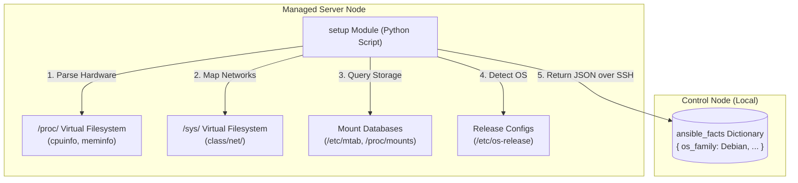

## Table of Contents

1. [The Introspection of Machine States](#the-introspection-of-machine-states)
2. [The Facts and Conditionals Preview](#the-facts-and-conditionals-preview)
3. [Fact Gathering: The Setup Module](#fact-gathering-the-setup-module)
4. [Inventory vs. Facts: Intent vs. Reality](#inventory-vs-facts-intent-vs-reality)
5. [Dynamic Branching: The when Clause](#dynamic-branching-the-when-clause)
6. [Under the Hood: Fact Discovery and Introspection](#under-the-hood-fact-discovery-and-introspection)
7. [Defensive Conditional Coding](#defensive-conditional-coding)
8. [Putting It All Together](#putting-it-all-together)
9. [What's Next](#whats-next)

## The Introspection of Machine States

In system administration and configuration management, host facts are structured data objects containing system details that Ansible discovers from a managed server at fact-gathering time. Instead of hardcoding task branches based on assumptions about your servers, you use host facts to query the machine's observed hardware capabilities, operating system distribution, IP addresses, and kernel architecture. Conditionals are logical statements (like `when` clauses) that evaluate these facts, instructing Ansible to execute specific tasks only when the host matches the required operational parameters.

To see why host introspection is critical for robust automation, consider our scenario. You are managing a configuration playbook that deploys web server software across a mixed server cluster containing both Debian-based (Ubuntu) and Red Hat-based (Rocky Linux) operating systems:

Without fact-gathering and conditional checks, a task that calls `apt` on a Rocky Linux host crashes immediately because that package manager does not exist there. Hardcoding a network interface address works only until a host is reprovisioned with a different IP, at which point the binding fails silently. Without branching, every OS variant requires its own separate playbook file, turning a two-node mixed fleet into a maintenance burden that doubles with every new distribution added.

Ansible solves this by using the `setup` module to discover facts and the `when` keyword to evaluate conditions. This allows a single playbook to adapt dynamically: installing packages via `apt` on Ubuntu nodes, using `dnf` on Rocky Linux nodes, and binding network configurations to whichever active IP address the host reports during the run.

## The Facts and Conditionals Preview

Here is an early, comment-free preview of a playbook task block demonstrating how to utilize gathered facts inside task conditionals to manage packages and templates dynamically across different operating system families:

```yaml
- name: Standardize mixed OS cluster environments
  hosts: cluster_hosts
  gather_facts: true
  tasks:
    - name: Install Nginx on Ubuntu nodes
      ansible.builtin.apt:
        name: nginx
        state: present
      when: ansible_facts["os_family"] == "Debian"

    - name: Install Nginx on Rocky Linux nodes
      ansible.builtin.dnf:
        name: nginx
        state: present
      when: ansible_facts["os_family"] == "RedHat"

    - name: Bind web server configuration to active interface
      ansible.builtin.template:
        src: web_server.conf.j2
        dest: /etc/nginx/nginx.conf
        owner: root
        group: root
        mode: "0644"
```

## Fact Gathering: The Setup Module

When a playbook has `gather_facts: true` (which is the default configuration for almost all Ansible plays), the very first task executed is a hidden system step commonly labeled `Gathering Facts`.

Under the hood, this task executes the built-in `ansible.builtin.setup` module on the managed server:
When a play begins, the control node opens an SSH channel to each target and transfers the setup module as a temporary Python script. The remote Python interpreter executes the script, which reads OS release files, queries the kernel for CPU architecture and memory size, enumerates network interfaces, and collects any mounted filesystem paths. The resulting fact dictionary is serialized as a JSON blob and written back to the control node over the same SSH channel, where Ansible stores it in the host's variable scope for the rest of the play.

While fact gathering is incredibly useful, it is not free. Initiating the setup module, reading operating system data, and transferring the JSON block across the network adds latency.

If you are running a play that performs simple, known administrative actions (such as restarting an application background service or clearing a log path) and does not use any facts or templates, you can optimize your run by setting `gather_facts: false` directly in your play block, skipping the fact-gathering step entirely.

## Inventory vs. Facts: Intent vs. Reality

To write safe conditionals, it helps to understand the operational difference between the variables defined in your inventory and the facts gathered from the remote host.

Here is a quick reference table showing the differences between these two data sources:

| Feature | Inventory Variables | Discovered Host Facts |
| :--- | :--- | :--- |
| **Primary Source** | Defined by the administrator in static/dynamic files. | Gathered from operating system files, commands, and Python helpers. |
| **System Meaning** | **Architectural Intent**: What role *should* this server have? | **Observed Reality**: What did the host report when facts were gathered? |
| **Typical Data** | Service names, group associations, target domains. | Memory limits, IP addresses, CPU cores, OS family. |
| **Drift Risk** | High: A server named `ubuntu-01` might have been rebuilt with Rocky Linux. | Lower, but not zero: facts can be missing, cached, disabled, or become stale during a long run. |
| **Evaluation Timing** | Compiled in memory before the run starts. | Discovered dynamically at the start of the play. |

Relying on physical host facts rather than inventory assumptions protects your systems from host name drifts. If a machine's name implies it is a staging node, but the fact scan reveals it has production network interfaces, a defensive conditional check can immediately halt the run, protecting your systems.

## Dynamic Branching: The when Clause

You implement dynamic conditional branching in Ansible using the `when` keyword. The `when` clause accepts a standard Python-like comparison expression that evaluates variables, host facts, or task outcomes.

```yaml
when: ansible_facts["os_family"] == "Debian"
```

When you write conditionals, you must follow several strict conventions. The `when` clause is already processed inside an active Jinja2 compilation context, so wrapping the condition in double curly braces is a syntax error. You write the variable name directly: `when: my_var` rather than `when: "{{ my_var }}"`. When testing a boolean-like string, pass it through the `bool` filter for predictable evaluation: `when: maintenance_mode | bool`. This ensures that strings like `"true"`, `"yes"`, or `"1"` resolve to a clean Python `True`. You can also combine multiple conditions using standard logical operators: `and` (which can be written as a YAML list of separate conditions), `or`, and `not`.

Each target host evaluates the conditional individually. If the expression resolves to `false`, Ansible skips the task entirely, logging a quiet `skipped` status in stdout and ensuring that the task blast radius is strictly managed.

## Under the Hood: Fact Discovery and Introspection

To appreciate how Ansible gathers this massive dictionary of host specifications, it helps to look at the low-level systems calls and directory scans executed by the `setup` module on the managed server.

When the `setup` module runs on a Linux host, it executes a highly structured set of system introspection scans:

1. **Proc Filesystem Scans**: The script queries the `/proc` virtual directory. It reads `/proc/cpuinfo` to count hardware cores, `/proc/meminfo` to calculate total and available RAM, and `/proc/loadavg` to measure system performance.
2. **Sys Filesystem Scans**: The script scans the `/sys` virtual hierarchy (such as `/sys/class/net/`) to map every active physical and virtual network interface, reading network link speeds, MAC addresses, and operational states.
3. **Partition and Mount Scans**: It parses `/etc/mtab` and `/proc/mounts` to inspect all active mount points, partition sizes, filesystem types, and available storage blocks.
4. **Service Scope Scans**: The script queries standard system utilities (such as running `systemctl` or checking `/etc/init.d/` directories) to detect which service manager is active.
5. **System Release Scans**: It reads system configuration text files (like `/etc/os-release` or `/etc/redhat-release`) to parse the exact distribution name, version string, and OS family.



This operating system introspection makes `ansible_facts` a useful snapshot of what the host reported at gather time. Treat it as stronger evidence than a host name, but still write defensively for missing or stale data.

## Defensive Conditional Coding

Because facts are gathered dynamically from the remote host, you must write your conditionals defensively. If a playbook targets a minimal Docker container, a bare-metal hypervisor, or a legacy network device, certain standard system facts (like `default_ipv4` or `/proc` metadata) might be completely missing.

If a task attempts to read a missing key directly (such as `ansible_facts["default_ipv4"]["address"]`), the Ansible compiler will crash immediately with an `Undefined variable` error.

To prevent these runtime crashes, you write defensive conditionals using Python dictionary get methods:

### 1. Using the `get()` Method
Instead of accessing keys directly, use `get()` to provide a safe fallback value (such as `None` or an empty string) if the key is missing:

```yaml
when: ansible_facts.get("os_family") == "Debian"
```

### 2. Testing Defined Boundaries
You can explicitly check if a nested dictionary key exists using the `defined` test:

```yaml
when: ansible_facts["default_ipv4"] is defined
```

Writing defensive conditionals helps your playbooks execute safely across diverse server environments, skipping tasks cleanly on minimal or restricted hosts instead of crashing the run.

## Putting It All Together

We started by looking at how hardcoding package tasks and network interfaces inside plays limits automation, forcing you to maintain redundant playbooks or risk task crashes across mixed OS fleets.

Ansible solves these problems by linking dynamic fact introspection with logical conditional execution:
- **Introspection Scans**: Plays use the `setup` module to discover host facts, populating the `ansible_facts` namespace.
- **Observed Reality**: We rely on gathered facts rather than inventory names, making tasks match what the machine reported during the run.
- **Horizontal Branching**: We write `when` clauses to implement conditional tasks, skipping execution cleanly on hosts that do not match our logic.
- **Low-Level Introspection**: Under the hood, the setup module queries `/proc`, `/sys`, and system mount directories to map CPU, memory, network interfaces, and OS releases.
- **Defensive Design**: We use `get()` methods and defined tests to protect playbooks from crashing when run on minimal or containerized targets.

Structuring your playbooks around these dynamic fact boundaries makes your automation more adaptive, safe, and resilient.

## What's Next

Now that you have completed Theme 2 and master the mechanics of host inventories, variable precedence scopes, and fact conditionals, the next theme will move into **In-Memory Results, Files, & Roles**. We will start by exploring **Registered Task Results**, showing you how to capture task execution outcomes dynamically to make logical decisions inside subsequent play tasks.

---

**References**

- [Discovering Variables and Facts](https://docs.ansible.com/ansible/latest/playbook_guide/playbooks_vars_facts.html) - Official guide to fact gathering and setup module usage.
- [Ansible Conditionals Reference](https://docs.ansible.com/ansible/latest/playbook_guide/playbooks_conditionals.html) - Technical reference for writing when, changed_when, and failed_when expressions.
- [Linux Proc Filesystem Specification](https://man7.org/linux/man-pages/man5/proc.5.html) - The Linux kernel man-page documenting proc-level introspection metrics.
- [Jinja2 Tests Index](https://jinja.palletsprojects.com/en/3.1.x/templates/#tests) - Reference manual for the defined, undefined, and boolean tests used in conditionals.
