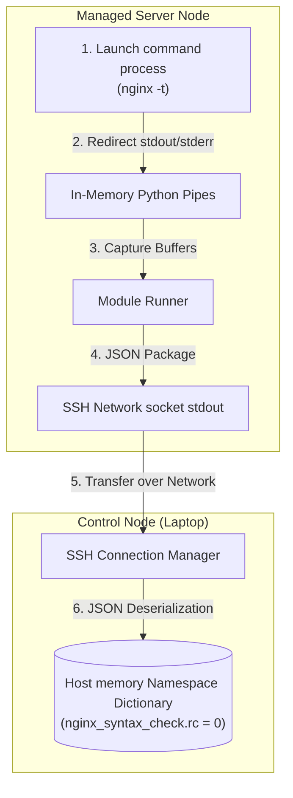

## Table of Contents

1. [Dynamic Observation in Host Executions](#dynamic-observation-in-host-executions)
2. [The Registered Variables Preview](#the-registered-variables-preview)
3. [Anatomy of a Task Return Object](#anatomy-of-a-task-return-object)
4. [Conditional Branching: Making Decisions from Observations](#conditional-branching-making-decisions-from-observations)
5. [Task Overrides: changed_when and failed_when](#task-overrides-changed_when-and-failed_when)
6. [Under the Hood: Standard Out Pipe Redirection and JSON Deserialization](#under-the-hood-standard-out-pipe-redirection-and-json-deserialization)
7. [Defensive Conditional Coding: Managing Skipped and Missing Keys](#defensive-conditional-coding-managing-skipped-and-missing-keys)
8. [Putting It All Together](#putting-it-all-together)
9. [What's Next](#whats-next)

## Dynamic Observation in Host Executions

In system automation, registering task results is the practice of capturing the output dictionary returned by a task and saving it as a variable for that host during the playbook run. Instead of treating every task as a blind fire-and-forget command, registering results allows the playbook to observe the state of a host during the run. This in-memory capture provides a feedback loop, allowing subsequent tasks to parse the saved metadata and make logical, adaptive decisions based on what the host just reported.

To see why capturing task outcomes is an essential practice, consider our scenario. You are managing an application update on a backend server:
- You must run a validation command (like `nginx -t` to check syntax) before reloading the web server.
- You must query a local database service port to verify it is accepting network socket connections before starting the application.
- You must check if a legacy systemd service file is physically present before attempting to enable or manage it.

If you execute these operations blindly without registering outcomes:
- An Nginx configuration file containing a syntax error will be deployed, and the service reload task will attempt to reload Nginx anyway, causing your web server to crash and take your site offline.
- The application server will start before the database is ready to receive sockets, triggering immediate database connection timeouts and application startup failures.
- A task designed to start a system service will crash with a fatal error on hosts where the service software has not yet been installed, aborting the entire playbook execution.

Ansible solves this by using the `register` keyword. By saving the JSON output of one task into a variable, you can inspect command return codes, standard error channels, file metadata, and HTTP statuses. This allows your playbooks to act as smart, adaptive pipelines that observe your hosts, evaluate variables, bypass errors, and protect your system uptime.

## The Registered Variables Preview

Here is an early, comment-free YAML playbook preview demonstrating how to register the outcome of a configuration syntax check and use the saved metadata to conditionally trigger a service reload:

```yaml
- name: Verify and deploy web configuration updates
  hosts: web_servers
  become: true
  tasks:
    - name: Validate Nginx virtual host configuration syntax
      ansible.builtin.command: nginx -t
      register: nginx_syntax_check
      changed_when: false
      failed_when: nginx_syntax_check.rc not in [0, 1]

    - name: Reload Nginx service when syntax is correct
      ansible.builtin.service:
        name: nginx
        state: reloaded
      when: nginx_syntax_check.rc == 0

    - name: Log syntax validation failure details
      ansible.builtin.debug:
        msg: "Nginx syntax check failed with error: {{ nginx_syntax_check.stderr }}"
      when: nginx_syntax_check.rc != 0
```

## Anatomy of a Task Return Object

When an Ansible task executes, its module or action plugin returns a structured result dictionary back to the control node. When you use the `register` keyword, you save that dictionary into a variable of your choice.

The specific keys populated in this dictionary depend entirely on the module you call. Many modules return common fields such as `changed` and `failed`, while command-like modules add process-output fields:

- **`changed`**: A boolean flag (`true` or `false`) indicating whether the module made modifications to the system.
- **`failed`**: A boolean flag indicating whether the task encountered a fatal error and aborted execution on the host.
- **`rc`**: The return code of a command or shell task. An exit code of `0` usually indicates success, while other values represent command-specific outcomes.
- **`stdout`**: The raw text output written by a command-like task to the standard output channel.
- **`stderr`**: The raw error text written by a command-like task to the standard error channel.
- **`stdout_lines` / `stderr_lines`**: Convenient lists of strings, where each item represents a single line of stdout or stderr output.

For example, when you run `ansible.builtin.stat` to check a file's properties, the registered dictionary holds a nested `stat` sub-dictionary containing keys like `exists`, `owner`, `mode`, and `size`. Understanding the anatomy of these return objects allows you to write highly precise conditional expressions.

## Conditional Branching: Making Decisions from Observations

The primary use case for registering task outcomes is driving subsequent task execution via the `when` conditional keyword.

Consider our database cluster scenario, where you must verify if a PostgreSQL database systemd service unit file is present before attempting to configure its startup behaviors:

```yaml
- name: Audit systemd database service file
  ansible.builtin.stat:
    path: /etc/systemd/system/postgresql.service
  register: postgres_unit_file

- name: Keep database running and enabled
  ansible.builtin.service:
    name: postgresql
    state: started
    enabled: true
  when: postgres_unit_file.stat.exists
```

In this pipeline, the first task runs the `stat` module to inspect the host. The second task reads `postgres_unit_file.stat.exists` in its `when` conditional block. If the file is missing, the second task is skipped cleanly, preventing a fatal crash on hosts where the database software has not yet been deployed.

This dynamic branching ensures that your playbooks stay resilient. Each host evaluates the registered variable for itself in isolation, allowing individual cluster nodes to bypass or execute tasks based on their own system status.

## Task Overrides: changed_when and failed_when

By default, Ansible applies simple rules to determine a task's status: if a command or shell task returns an exit code of `0`, it is marked as `changed` (because Ansible cannot tell what system calls the shell script made); if it returns a non-zero exit code, it is marked as `failed`.

Often, these simple default assumptions are incorrect and will mislead your automation. You correct these assumptions by using `changed_when` and `failed_when` overrides:

### 1. Bypassing False Changes
If you run a read-only command to check system health or query a configuration port, the command does not make writes. To prevent it from falsely reporting changes (which would trigger downstream handlers and restart services on every run), you override the change status:

```yaml
- name: Check local database connection health
  ansible.builtin.command: pg_isready -h localhost
  register: db_check
  changed_when: false
```

### 2. Defining Custom Success Boundaries
Sometimes, a non-zero exit code represents a valid, expected observation rather than a system crash. For example, a search tool returns `0` if a string is found, and `1` if the string is missing. Both are valid results. You override the failure criteria to allow both outcomes:

```yaml
- name: Check for database maintenance flag file
  ansible.builtin.command: test -f /var/lib/db_maintenance.flag
  register: maintenance_check
  changed_when: false
  failed_when: maintenance_check.rc not in [0, 1]
```

This override instructs Ansible to only fail the task if the exit code is something completely unexpected (like `127` for a missing binary), keeping your playbooks highly stable.

## Under the Hood: Standard Out Pipe Redirection and JSON Deserialization

To appreciate how task outcomes transition from remote processes to structured in-memory dictionaries on your laptop, it helps to understand the process isolation and stream redirection used by command-like modules.

When you run a command task, the remote Python module runs the requested program directly and captures its output:

1. **Subprocess Spawning**: The remote Python runner launches the requested program. The `shell` module goes through a shell; the `command` module does not.
2. **File Descriptor Redirection**: The script redirects the standard output (`stdout`) and standard error (`stderr`) file descriptors of the child process into in-memory pipelines managed by the parent Python process.
3. **Buffer Capture**: The script reads the raw byte streams from the pipes, unifies them, and decodes the bytes into structured text strings, splitting lines into lists in memory.
4. **JSON Packaging**: It packages the strings, return code, and module status fields into a structured JSON string.
5. **JSON Deserialization**: The bootstrap script writes this JSON string directly to the open SSH socket channel. The control node receives the byte stream, parses the JSON string, and deserializes it into a native Python dictionary in the active host's memory namespace.



This process redirection makes command output available for downstream task logic in a predictable structure.

## Defensive Conditional Coding: Managing Skipped and Missing Keys

Because variables registered inside playbook runs are created dynamically in memory during execution, you must write your downstream conditionals defensively.

A common operational error occurs when a task that registers a variable is skipped because of a previous conditional block:
- If task 1 is skipped, the variable is still registered in memory, but it contains a minimal dictionary containing only `{ "skipped": true }`.
- If task 2 blindly attempts to read a nested key (such as `when: my_variable.stat.exists`), the run will crash immediately with an `Undefined variable` error because the `stat` sub-dictionary was never created.

You prevent these compilation crashes by using defensive coding patterns:

### 1. Checking the skipped State
Always verify that the parent task successfully executed before querying nested keys in downstream tasks:

```yaml
when:
  - my_variable is defined
  - my_variable is not skipped
  - my_variable.stat.exists
```

### 2. Using the get() Method
Use the Python `get()` dictionary query to safely query nested keys with fallbacks, preventing undefined key failures in your templates and conditionals:

```yaml
when: my_variable.get("stat", {}).get("exists")
```

Writing defensive conditionals helps your playbooks execute safely across diverse hosts, skipping downstream tasks cleanly instead of crashing the run.

## Putting It All Together

We started by looking at how blind configuration executions without registered outcomes can lead to service crashes, database startup failures, and aborted playbook runs.

Ansible solves these problems by providing a robust, in-memory variable capture engine:
- **In-Memory Capture**: We use the `register` keyword to capture task output dictionaries, providing during-run feedback loops.
- **Anatomy of Outputs**: We parse module return fields such as `changed`, `failed`, and command-specific fields like `rc`, `stdout`, and `stderr`.
- **Dynamic Branching**: We write defensive `when` conditionals to bind subsequent tasks to registered outcomes, managing execution scopes cleanly.
- **Task Overrides**: We leverage `changed_when` and `failed_when` to bypass false changes and define precise success boundaries.
- **Under-the-Hood Redirection**: The control plane redirects remote subprocess streams through secure pipes, transfers them as JSON packages over SSH, and deserializes them into Python dictionaries in host memory.
- **Defensive Design**: We check the skipped state and use `get()` fallbacks to protect playbooks from crashing when tasks are bypassed.

Following these practices ensures that your playbooks function as intelligent, adaptive, and safe configuration pipelines.

## What's Next

Now that you master registered task results, in-memory variable capturing, stdout redirection, and defensive conditionals, the next article will explore **Files and Templates**. We will look at how Ansible copies files, dynamically renders Jinja2 templates, compares file content, and executes safer file writes.

---

**References**

- [Conditionals: Registering Variables](https://docs.ansible.com/ansible/latest/playbook_guide/playbooks_conditionals.html#registering-variables) - Official reference guide for capturing and evaluating task outputs.
- [Error Handling in Playbooks](https://docs.ansible.com/ansible/latest/playbook_guide/playbooks_error_handling.html) - Documentation for defining changed and failed variables.
- [Python Subprocess Documentation](https://docs.python.org/3/library/subprocess.html) - The standard Python subprocess management specification used by Ansible modules to redirect execution streams.
- [Ansible Built-in Stat Module Reference](https://docs.ansible.com/ansible/latest/collections/ansible/builtin/stat_module.html) - Guide to using stat to capture file system properties.
