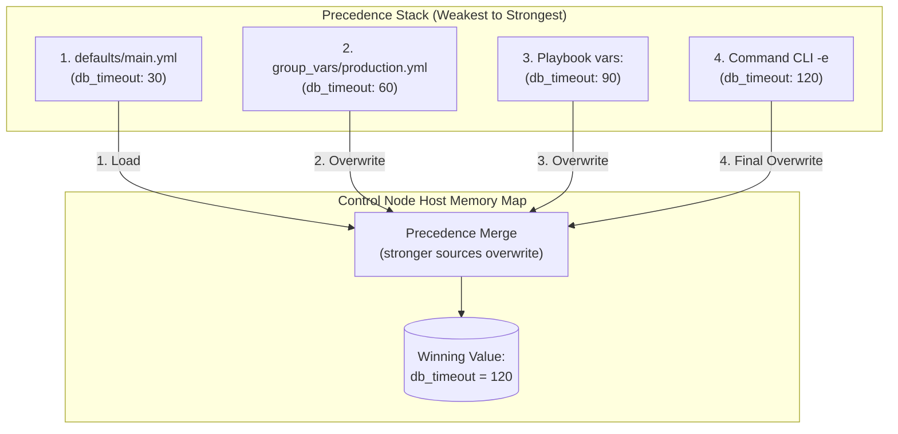

## Table of Contents

1. [The Conflict Resolution Engine](#the-conflict-resolution-engine)
2. [The Precedence Scenarios and Code Preview](#the-precedence-scenarios-and-code-preview)
3. [The Precedence Hierarchy: Mapping the Layers](#the-precedence-hierarchy-mapping-the-layers)
4. [Specificity within Inventories](#specificity-within-inventories)
5. [Under the Hood: Variable Stacking and Memory Merging](#under-the-hood-variable-stacking-and-memory-merging)
6. [Auditing the Winning Value](#auditing-the-winning-value)
7. [Putting It All Together](#putting-it-all-together)
8. [What's Next](#whats-next)

## The Conflict Resolution Engine

Variable precedence is Ansible's ordered conflict-resolution system for deciding which value wins when the same variable is defined in multiple places.

In system automation, variable precedence is the strict hierarchical set of rules that the execution engine uses to resolve conflicts when the exact same variable name is defined in multiple places. Because Ansible compiles configurations from a wide range of sources (including role defaults, inventory files, group variables, host-specific exception files, playbook tasks, and command-line arguments), it is common for a single variable placeholder to receive conflicting values. Precedence is the engine's built-in tie-breaker, determining exactly which value wins for each targeted host during a playbook run.

To see why understanding this conflict resolution engine is critical, consider our scenario. You are executing a database migration task that requires a system timeout value (such as `db_timeout_seconds`) to be set.

Without a clear mental model of precedence, a safe timeout defined in role defaults can be silently overwritten by a stale group variable, causing a production migration to time out while the playbook gives no warning. A host-specific override written in `host_vars` may be ignored entirely because a play-level variable block sits higher in the chain, and when an operator injects an emergency fix via `-e` on the command line, the next automated run reverts it without notice.

Ansible solves this by using a highly structured, 22-level variable precedence hierarchy. By separating values into distinct, predictable tiers (ranging from weak defaults to strong runtime overrides), you can customize host configurations safely, isolate environment differences, and audit exactly which value wins before modifying a single system.

## The Precedence Scenarios and Code Preview

Here is an early, comment-free preview of three different files declaring the exact same variable name `db_timeout_seconds`. This preview demonstrates how different layers of the infrastructure define conflicting values:

### File 1: `roles/database/defaults/main.yml` (Role Defaults - Lowest Precedence)
```yaml
db_timeout_seconds: 30
```

### File 2: `inventory/group_vars/production.yml` (Group Variables - Medium Precedence)
```yaml
db_timeout_seconds: 60
```

### Execution Command (Extra Variables - Highest Precedence)
```bash
ansible-playbook -i inventory/hosts.yml playbooks/deploy.yml \
  -e "db_timeout_seconds=120"
```

When Ansible executes the playbook, the role default (`30`) is overwritten by the production group variable (`60`). During the command execution, the CLI extra variable (`120`) overwrites both, making it the active value.

## The Precedence Hierarchy: Mapping the Layers

The precedence hierarchy is Ansible's ordered list of variable sources from weakest to strongest. A stronger source replaces a weaker value when both define the same variable name.

Example: `db_timeout_seconds: 30` in role defaults can be replaced by `60` in `group_vars/production.yml`, and a one-time `-e "db_timeout_seconds=120"` can replace both during that run. While Ansible documents many distinct precedence levels, you can master variable conflict resolution by grouping the hierarchy into four practical layers, ordered from weakest to strongest:

### 1. Role Defaults (Weakest)
Role defaults (defined in a role's `defaults/main.yml` file) occupy the weakest variable precedence level. They are designed as weak, baseline defaults. Group variables, host variables, play variables, and task-level values can overwrite a role default, allowing callers of the role to customize parameters easily.

### 2. Inventory Variables (Medium)
Inventory variables (defined in your static inventory files, `group_vars/` directories, and `host_vars/` directories) represent your environment configuration. They overwrite role defaults. Within this layer, specificity rules apply: host-specific variables are stronger than child group variables, which are stronger than parent group variables.

### 3. Playbook Variables (Strong)
Playbook variables (declared under `vars` inside a play, imported via `vars_files`, or created during execution with tools such as `set_fact`) represent play-specific logic. They are stronger than inventory variables, so playbooks can enforce local parameters when needed.

### 4. Extra Variables (Strongest)
Extra variables (passed at the command line using `-e` or `--extra-vars`) have the highest precedence among variables. They are a deliberate manual override, so use them carefully and avoid turning them into hidden production configuration.

| Priority | Scope | Example source |
|---|---|---|
| Lowest | Role defaults | `roles/database/defaults/main.yml` |
| Low | Inventory group vars | `group_vars/production.yml` |
| Medium | Inventory host vars | `host_vars/db-node-02.yml` |
| High | Playbook vars / set_fact | `vars:` block or `set_fact` task in the play |
| Highest | Extra vars | `-e "db_timeout_seconds=120"` on the CLI |

## Specificity within Inventories

Inventory specificity means narrower inventory records usually win over broader ones. A host variable is more specific than a child group variable, and a child group variable is more specific than a broad parent group variable.

Example: `group_vars/all.yml` can set a general timeout, `group_vars/production.yml` can raise it for production, and `host_vars/db-node-02.yml` can raise it again for one slow database host.

Consider our database cluster scenario, where we have a broad group named `production` containing two hosts: `db-node-01` and `db-node-02`.

If you declare `db_timeout_seconds` across multiple files:
- **Parent Group**: You set `db_timeout_seconds: 45` in `group_vars/all.yml`. This is the weakest inventory value.
- **Child Group**: You set `db_timeout_seconds: 60` in `group_vars/production.yml`. Because `production` is a specific child group, this value overwrites the global `all` value for all production hosts.
- **Host Variable**: You set `db_timeout_seconds: 90` in `host_vars/db-node-02.yml`. Because this is an individual host record, it represents the highest level of inventory specificity.

During a playbook execution, `db-node-01` receives a timeout of `60` seconds (inherited from the production child group), while `db-node-02` receives `90` seconds (overwritten by its specific host variable exception). This hierarchical resolution allows you to configure general environment baselines while cleanly accommodating individual server exceptions.

## Under the Hood: Variable Stacking and Memory Merging

Variable stacking means Ansible loads candidate values in precedence order and lets stronger sources overwrite weaker ones. The result is one final variable map for each host.

Example: the control node can build a different `db_timeout_seconds` map for `db-node-01` and `db-node-02` even though both hosts run the same playbook. This happens before Jinja2 renders task arguments for each host.

When you trigger a playbook, Ansible's compilation engine constructs a prioritized variable stack in Python memory for each targeted host:

1. **Source Loading**: The engine gathers variables from active sources such as role defaults, inventory, play variables, facts, and command-line extra variables.
2. **Precedence Overwrite**: It combines those values according to Ansible's documented precedence rules, where stronger sources overwrite conflicting keys from weaker sources.
3. **The Dictionary Replacement Trap**: By default, Ansible replaces dictionaries rather than deeply merging them. If a role default defines a dictionary named `db_settings` containing multiple keys, and a group variable defines the same dictionary name with a single key, Ansible replaces the *entire* dictionary. All other default keys disappear from memory, which can trigger task crashes. You must avoid splitting keys of the same dictionary across different precedence layers.
4. **Per-Host Context**: The resulting values are evaluated in the context of each host, so two hosts in the same play can still receive different final values.



This precedence-based merging makes the final value predictable when you know which source is strongest.

## Auditing the Winning Value

Auditing the winning value means printing or inspecting the final value Ansible chose after all precedence rules ran. This is safer than guessing from file names.

Example: if `db-node-02` keeps timing out during a migration, print `db_timeout_seconds` for that host before editing variables. Because values can be overwritten across multiple layers of your repository, guessing which value a host will receive is slow and error-prone.

You can print the resolved value of a specific variable during a playbook execution by inserting a temporary `ansible.builtin.debug` task:

```yaml
- name: Audit active database timeout
  ansible.builtin.debug:
    var: db_timeout_seconds
```

When the playbook runs, the console output displays the exact winning value in memory for each host:

```plain
ok: [db-node-01] => {
    "db_timeout_seconds": 60
}
ok: [db-node-02] => {
    "db_timeout_seconds": 90
}
```

This output is strong evidence of what the play is using for that host at that point in the run. If the value is incorrect, you know you have an override conflict. You search your repository for the variable name in `defaults/main.yml`, `group_vars/`, `host_vars/`, play `vars`, and any `set_fact` tasks to locate the file that is applying the conflicting setting.

## Putting It All Together

We started by looking at how conflicting variable definitions across defaults, inventory groups, host variables, and playbooks can lead to unpredictable timeout failures during critical migrations.

Ansible solves these conflicts by utilizing a disciplined, multi-layered variable precedence engine:
- **Hierarchical Overwrites**: We organize variables into distinct precedence layers, ensuring that role defaults are weak, group variables represent environments, and play variables enforce local logic.
- **Inventory Specificity**: We leverage parent-child groups and host variables to apply fine-grained overrides, allowing individual host exceptions to safely override group baselines.
- **Extra Variable Dominance**: We use CLI extra variables (`-e`) strictly as deliberate manual overrides, keeping production settings committed to files.
- **Under-the-Hood Merging**: The control plane builds host-specific variable contexts where stronger sources replace conflicting keys from weaker sources.
- **Debug Auditing**: We insert `ansible.builtin.debug` tasks to verify winning variables per host, removing all configuration uncertainty.

Following these override rules keeps your variable configurations more consistent, auditable, and safe.

## What's Next

Now that you understand variable precedence, hierarchical overrides, and per-host variable merging, the next article will explore **Facts and Conditionals**. We will look at how Ansible gathers host specifications from operating system data, and how to use conditional blocks (`when`) to execute tasks dynamically based on what the host reports about itself.

---

**References**

- [Ansible Variable Precedence Rules](https://docs.ansible.com/ansible/latest/playbook_guide/playbooks_variables.html#variable-precedence-where-should-i-put-a-variable) - Official reference for the 22 precedence levels and overwrite behaviors.
- [Ansible Special Variables Index](https://docs.ansible.com/ansible/latest/reference_appendices/special_variables.html) - Catalog of reserved configuration names.
- [Ansible Debug Module Documentation](https://docs.ansible.com/ansible/latest/collections/ansible/builtin/debug_module.html) - Technical guide for using the debug utility to audit active variables.
- [Python Dictionary update() Specification](https://docs.python.org/3/library/stdtypes.html#dict.update) - Technical specification for the dictionary merging logic used by the Ansible engine.
