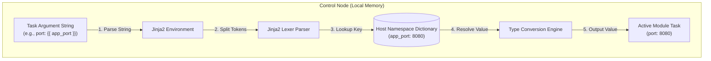

## Table of Contents

1. [Dynamic Values in Configuration Declarations](#dynamic-values-in-configuration-declarations)
2. [The Playbook and Variable Preview](#the-playbook-and-variable-preview)
3. [Role Defaults: Defining the Interface Contract](#role-defaults-defining-the-interface-contract)
4. [Play-Level Variables: Playbook-Scoped Settings](#play-level-variables-playbook-scoped-settings)
5. [Command-Line Overrides: Runtime Extra Variables](#command-line-overrides-runtime-extra-variables)
6. [Jinja2 Interpolation Syntax: Compiling Dynamic Strings](#jinja2-interpolation-syntax-compiling-dynamic-strings)
7. [Under the Hood: Jinja2 Tokenization and Safe String Rendering](#under-the-hood-jinja2-tokenization-and-safe-string-rendering)
8. [Putting It All Together](#putting-it-all-together)
9. [What's Next](#whats-next)

## Dynamic Values in Configuration Declarations

In computer programming and configuration management, a variable is a named placeholder that stores a dynamic value, which can be referenced and evaluated during the execution of a program. Instead of hardcoding concrete data strings (such as specific IP addresses, application listening ports, or file system paths) directly inside your playbook files, you use variables to represent these parameters. When Ansible runs a task, it dynamically retrieves the specific value assigned to the current host, allowing you to run the exact same playbook across different teams, servers, and environments without changing a single line of task logic.

To see why separating task logic from configuration data is a critical practice, consider our scenario. You are managing a configuration playbook that deploys a backend application server across staging, preview, and production environments.

If you hardcode all configuration settings inside your playbooks and templates:
- You must maintain three separate copies of Nginx configuration files, one for each environment domain, leading to massive configuration drift.
- An update to the Nginx security block requires you to manually copy-paste the edits across three files, increasing the risk of syntax errors.
- Developers cannot spinning up temporary, custom preview environments because the listening ports and upstream endpoints are baked directly into the templates.
- Secret tokens and credentials will be hardcoded in plaintext, violating security standards.

Ansible solves this by using dynamic variables. The playbook contains the stable structural tasks, configuration templates use variable placeholders, and the inventory or variable files carry the specific environment-specific data. This clean separation ensures that your automation stays dry, reviewable, and highly flexible.

## The Playbook and Variable Preview

Here is an early, comment-free YAML task block and Jinja2 template preview. It demonstrates how to reference variable placeholders inside playbook tasks and evaluate them dynamically inside configuration files:

### File: `playbooks/deploy_app.yml`
```yaml
- name: Deploy application environment
  hosts: app_servers
  vars:
    app_log_verbosity: "info"
  tasks:
    - name: Render virtual host configuration
      ansible.builtin.template:
        src: app.conf.j2
        dest: /etc/nginx/sites-available/app.conf
        owner: root
        group: root
        mode: "0644"
```

### File: `templates/app.conf.j2`
```jinja2
server {
    listen {{ app_listening_port }};
    server_name {{ app_domain_name }};

    location / {
        proxy_pass http://127.0.0.1:{{ app_backend_port }};
        proxy_set_header X-Log-Level {{ app_log_verbosity }};
    }
}
```

## Role Defaults: Defining the Interface Contract

Role defaults (defined inside `defaults/main.yml` within an Ansible role directory structure) are the baseline variable values that establish the default interface contract for your automation. They represent the safe, ordinary parameters the role will use if the caller does not provide custom values.

Typical examples of valid role defaults include:
- Default service port numbers (such as `app_backend_port: 8080`).
- Non-sensitive file paths (such as `app_log_dir: /var/log/app`).
- Shared timeouts and verbosity thresholds (such as `app_timeout_seconds: 30`).

You must design role defaults to be highly generic and completely free of production secrets or custom environment values. Think of defaults as a readable API contract: anyone opening the role can read the default variable file to instantly see exactly what parameters the tasks depend on and what baseline values they will receive. Because role defaults occupy the lowest level in Ansible's variable precedence hierarchy, they are incredibly easy for group variables, host variables, or play variables to override, providing maximum flexibility.

## Play-Level Variables: Playbook-Scoped Settings

Play-level variables (declared under the `vars` key directly inside a play block in a playbook) are parameters that apply to every task in that play, regardless of which host is executing them.

```yaml
- name: Standardize developer workspace
  hosts: workspaces
  vars:
    workspace_timeout: 45
    workspace_banner_color: "blue"
```

You use play-level variables when the values are tightly bound to the behavior of the play itself and do not belong in the inventory or the role contract. For example, a setting that controls a specific system test limit or a local display color is a reasonable fit for the play.

The main caveat is that play-level variables are highly rigid. Because they are declared inside the playbook file itself, you cannot easily modify them without changing the playbook. If a staging host needs a different timeout than a production host, defining `workspace_timeout` at the play level will block your inventory from applying host-specific differences, forcing you to write messy conditions. When values change by environment, they belong in inventory scopes.

## Command-Line Overrides: Runtime Extra Variables

Command-line extra variables (passed using the `--extra-vars` or `-e` flag at execution time) are runtime overrides that apply globally to the entire playbook run.

```bash
ansible-playbook -i inventory/hosts.yml playbooks/deploy.yml \
  -e "app_backend_port=9000 app_log_verbosity=debug"
```

Extra variables are highly powerful because they have the highest precedence among Ansible variables. They can override defaults, group variables, host variables, and play-level variables for the current run.

Be careful with the input format. Simple `key=value` extra variables are easy for quick strings, but JSON or YAML form is safer when you need booleans, lists, dictionaries, or numbers to keep their intended type.

You use extra variables for:
- One-time diagnostic audits (such as raising a service timeout to `60` seconds during an incident).
- Dynamic pipeline triggers (such as passing a specific build release tag like `release_version=v2.1.0` from a CI/CD runner).
- One-off testing overrides inside local development sandboxes.

You must never use extra variables as the primary home for standard system configurations. Because CLI arguments are not committed to your version control repository, relying on them for routine deployments makes your runs hard to replicate and audit, creating operational uncertainty.

## Jinja2 Interpolation Syntax: Compiling Dynamic Strings

Ansible uses the **Jinja2** template engine to evaluate variables and compile dynamic strings during execution. To reference a variable inside a playbook or file template, you wrap the variable name in double curly braces:

```yaml
dest: /var/www/{{ app_name }}/index.html
```

When writing these placeholders, you must adhere to several strict naming and syntax rules:
- **Jinja2 Context**: A variable reference inside a task argument must be quoted as a complete string if it starts with the curly braces. Writing `dest: {{ app_path }}` will trigger a YAML syntax error because curly braces represent inline dictionaries in YAML. You must write `dest: "{{ app_path }}"`.
- **Lowercase Namespacing**: You must write variable names in lowercase and separate words with underscores (snake_case). Short, generic names like `port` or `user` should be completely avoided because they will collide when you merge multiple roles. You namespace variables by prefixing them with the service name: `app_listening_port`, `db_listening_port`.
- **Reserved Names**: You must never use variable names that conflict with Ansible's internal special variables, such as `groups`, `hostvars`, or `play_hosts`. You should also avoid confusing names that shadow common Python or Jinja2 built-ins and types, such as `list`, `dict`, or `string`.

## Under the Hood: Jinja2 Tokenization and Safe String Rendering

To appreciate how variables transition from text brackets to active system parameters, it helps to look at the compilers and tokenization engines running inside the control plane memory space during execution.

Many Ansible values are rendered in the context of the task and host that use them:

1. **Jinja2 Parsing**: When a task executes, Ansible identifies arguments or template files that contain Jinja2 expressions.
2. **Lexical Tokenization**: The Jinja2 lexer scans the string, splitting it into literal text tokens and variable placeholders (enclosed by the `{{` and `}}` markers).
3. **Context Lookup**: The compiler queries the active host's memory namespace dictionary, searching for the key matching the variable name.
4. **Type Handling**: Ansible keeps native types when values are defined as YAML or JSON structures, while fully rendered strings remain strings.
5. **Output Redaction**: If the task is flagged with `no_log: true`, Ansible redacts task output from normal logs. This protects console output, but it is not a complete secret-containment boundary for files, external services, custom module behavior, or debug tasks that print values elsewhere.



This runtime rendering lets the same playbook adapt to each host while keeping the value lookup rules visible and debuggable.

## Putting It All Together

We started by looking at how hardcoding system environments, domains, and ports directly inside templates and plays limits reuse, triggers configuration drift, and risks secret leaks.

Ansible solves these problems by providing a clear, dynamic variable model:
- **Dry Playbooks**: Playbooks contain stable tasks, templates represent structural blueprints, and variables customize environments dynamically.
- **Interface Defaults**: We use role defaults in `defaults/main.yml` to define safe baseline parameters and document the role contract.
- **Scoped Plays**: We restrict play-level variables to rigid, play-scoped settings that do not change by environment.
- **Runtime Overrides**: We leverage command-line extra variables (`-e`) strictly for temporary, manual overrides and pipeline metadata injection.
- **Jinja2 Compilation**: Under the hood, the engine tokenizes variables dynamically during task execution, resolving namespaces in memory and enforcing secure log redaction.

Following this variable model ensures that your automation stays modular, clean, and secure across all your environments.

## What's Next

Now that you master variables, role defaults, play-level parameters, and Jinja2 templating, the next article will explore **Variable Precedence**. We will look at the strict hierarchical rules Ansible uses to resolve conflicts when the same variable name is declared in multiple places, showing you exactly how to structure your overrides.

---

**References**

- [Ansible Variables Reference](https://docs.ansible.com/ansible/latest/playbook_guide/playbooks_variables.html) - Official documentation on variable scopes, syntax, and settings.
- [Jinja2 Template Engine Documentation](https://jinja.palletsprojects.com/en/3.1.x/) - Comprehensive guide to the Python Jinja2 designer syntax.
- [Creating Reusable Ansible Roles](https://docs.ansible.com/ansible/latest/playbook_guide/playbooks_reuse_roles.html) - Best practices for organizing defaults and variables in roles.
- [Ansible Special Variables](https://docs.ansible.com/ansible/latest/reference_appendices/special_variables.html) - The official catalog of reserved internal variable names.
