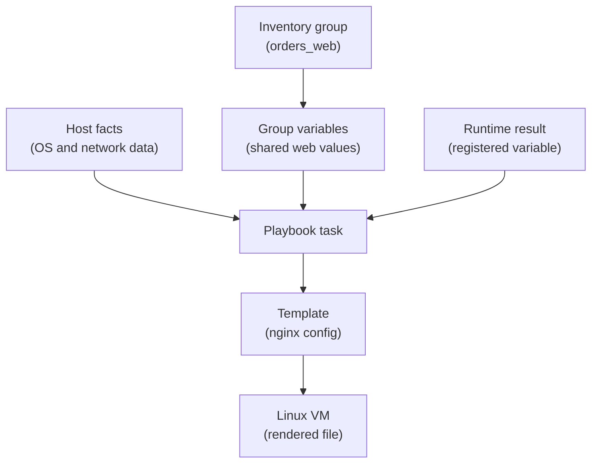

## Table of Contents

1. [Values Need a Home](#values-need-a-home)
2. [Inventory Variables Describe Hosts and Groups](#inventory-variables-describe-hosts-and-groups)
3. [Play Variables and Vars Files](#play-variables-and-vars-files)
4. [Facts Are Data From the Host](#facts-are-data-from-the-host)
5. [Templates Use Variables Carefully](#templates-use-variables-carefully)
6. [Registering Task Results](#registering-task-results)
7. [Precedence Without Surprises](#precedence-without-surprises)
8. [Conditionals With Variables and Facts](#conditionals-with-variables-and-facts)
9. [Debugging the Value Ansible Chose](#debugging-the-value-ansible-chose)
10. [A Beginner Review Checklist](#a-beginner-review-checklist)

## Values Need a Home

A playbook becomes hard to reuse when every path, port, timeout, and service name is typed directly into tasks. One Linux VM may listen on port `8080`, another may use `8081`, and production may need a longer Nginx timeout than staging. Copying the whole playbook for each environment makes the next change harder to review.

Ansible variables are named values that a playbook can use while it runs. A variable might hold a string such as `devpolaris-orders`, a number such as `8080`, a boolean such as `true`, a list of package names, or a dictionary of related settings. Variables exist so one playbook can keep the shared workflow while each host or environment supplies the values that differ.

Variables fit between inventory and tasks. Inventory says which hosts exist and which groups they belong to. Tasks say what should be true on those hosts. Variables carry the host-specific or environment-specific choices into those tasks.

In this article, the `devpolaris-orders` service runs on Linux VMs behind Nginx. The same playbook configures staging and production, but the hosts do not use every value exactly the same way. Staging might proxy to port `8080` with a short timeout. Production might use the same port but a longer timeout and a different upstream hostname.

Here is the value flow:



The important idea is that not all values come from the same place. Some values are written by you. Some values are discovered from the remote host. Some values are produced by earlier tasks. Precedence rules decide what happens when more than one place defines the same variable name.

The skill is not memorizing a long precedence chart. The practical skill is choosing clear homes for values so the chart rarely surprises you.

## Inventory Variables Describe Hosts and Groups

Inventory is usually the first place a beginner sees variables. The inventory names hosts and groups, and it can attach values to either one. A group variable applies to every host in that group. A host variable applies to one host.

For `devpolaris-orders`, the production inventory might look like this:

```ini
[orders_web]
orders-web-01 ansible_host=10.20.4.11
orders-web-02 ansible_host=10.20.4.12

[orders_web:vars]
ansible_user=ubuntu
orders_service_name=devpolaris-orders
orders_app_port=8080
orders_nginx_server_name=orders.devpolaris.internal
orders_nginx_timeout_seconds=30
```

The `[orders_web]` group gives Ansible two hosts. The `ansible_host` value tells Ansible which address to connect to for each inventory name. The `[orders_web:vars]` section gives shared values to every host in the group.

Now a playbook can use the variables instead of literal values:

```yaml
- name: Configure orders nginx site
  hosts: orders_web
  become: true

  tasks:
    - name: Install nginx site config
      ansible.builtin.template:
        src: templates/orders.nginx.conf.j2
        dest: "/etc/nginx/sites-available/{{ orders_service_name }}.conf"
        owner: root
        group: root
        mode: "0644"
```

The destination path uses `{{ orders_service_name }}`. The double curly braces are Jinja2 variable syntax, which Ansible uses for template expressions. At runtime, Ansible replaces that expression with the host's value.

Inventory variables are a good fit for values that describe where a host lives or how Ansible should connect to it. Connection user, private address, environment group, application port, and service-specific hostnames often make sense there.

Host variables should be used sparingly. They are useful when one host is genuinely different. If every host in the group repeats the same host variable, the value belongs on the group.

```ini
[orders_web]
orders-web-01 ansible_host=10.20.4.11 orders_canary=true
orders-web-02 ansible_host=10.20.4.12 orders_canary=false
```

That canary flag is host-specific. It says the team wants `orders-web-01` to receive a first test change before `orders-web-02`. The value should be visible because it changes rollout behavior.

As the inventory grows, many teams move variables into `group_vars` and `host_vars` files instead of keeping everything inside one `.ini` file. The idea stays the same, but the files are easier to review.

```text
inventory/
  prod.ini
  group_vars/
    orders_web.yml
  host_vars/
    orders-web-01.yml
```

The group file might hold the shared web values:

```yaml
orders_service_name: devpolaris-orders
orders_app_port: 8080
orders_nginx_server_name: orders.devpolaris.internal
orders_nginx_timeout_seconds: 30
```

This structure keeps the inventory readable. The host list stays focused on host names and addresses. The group variables file holds the service settings for that group.

## Play Variables and Vars Files

Variables can also live inside a play. A play variable is visible to tasks in that play. This is useful for values that belong to the playbook's workflow rather than to a particular host.

For example, the playbook may need to know where the template should be written and which Linux package should exist:

```yaml
- name: Configure devpolaris orders web hosts
  hosts: orders_web
  become: true

  vars:
    nginx_package_name: nginx
    nginx_site_dir: /etc/nginx/sites-available
    nginx_enabled_dir: /etc/nginx/sites-enabled

  tasks:
    - name: Install nginx
      ansible.builtin.apt:
        name: "{{ nginx_package_name }}"
        state: present

    - name: Install nginx site config
      ansible.builtin.template:
        src: templates/orders.nginx.conf.j2
        dest: "{{ nginx_site_dir }}/{{ orders_service_name }}.conf"
        mode: "0644"
```

The play variables are not secret, and they are not environment-specific. They are named constants for this playbook. Naming them once can reduce repeated strings and make the tasks easier to scan.

When a play has several related values, a `vars_files` entry can keep the top of the play clean:

```yaml
- name: Configure devpolaris orders web hosts
  hosts: orders_web
  become: true

  vars_files:
    - vars/nginx.yml

  tasks:
    - name: Install nginx
      ansible.builtin.apt:
        name: "{{ nginx_package_name }}"
        state: present
```

The file can be ordinary YAML:

```yaml
nginx_package_name: nginx
nginx_site_dir: /etc/nginx/sites-available
nginx_enabled_dir: /etc/nginx/sites-enabled
```

Use play variables when the value belongs to this playbook. Use inventory variables when the value describes a host, group, environment, or connection. That boundary is more important than the exact file layout.

Do not put secrets directly in these files as plain text. Ansible has encrypted variable workflows, and many teams use an external secret manager. For this beginner article, the safe rule is simple: if a value is a password, token, private key, or credential, do not commit it as ordinary YAML.

## Facts Are Data From the Host

Variables are not only values you write. Ansible can gather facts from each managed node before tasks run. A fact is data Ansible discovers from the host, such as operating system family, distribution name, IP addresses, memory, CPU details, mount points, and service-related information.

Facts matter because Linux hosts are not always identical. A task may need to install packages differently on Debian-family and Red Hat-family systems. A template may need the host's default IPv4 address. A safety check may need to know whether a disk has enough space before copying an artifact.

When fact gathering is enabled, Ansible stores discovered data under `ansible_facts`. A debug task can show what is available:

```yaml
- name: Show selected facts
  ansible.builtin.debug:
    msg:
      os_family: "{{ ansible_facts['os_family'] }}"
      distribution: "{{ ansible_facts['distribution'] }}"
      default_ipv4: "{{ ansible_facts['default_ipv4']['address'] | default('unknown') }}"
```

On an Ubuntu VM, the output might look like this:

```text
ok: [orders-web-01] => {
    "msg": {
        "default_ipv4": "10.20.4.11",
        "distribution": "Ubuntu",
        "os_family": "Debian"
    }
}
```

Now the playbook can make a decision based on the host, not on a guess. For example, the `apt` task should run only on Debian-family systems:

```yaml
- name: Install nginx on Debian family systems
  ansible.builtin.apt:
    name: nginx
    state: present
    update_cache: true
  when: ansible_facts["os_family"] == "Debian"
```

The `when` line is a conditional. It is a raw Jinja2 expression, so it does not need double curly braces. Ansible evaluates the condition for each host. If it is true for a host, the task runs on that host. If it is false, the task is skipped for that host.

Facts are useful, but they are not a replacement for inventory. If every production orders host should use the same app port, write that value as an inventory or group variable. Do not try to infer business decisions from the operating system. Facts are best for host reality; variables are best for team intent.

This distinction keeps playbooks readable:

| Value Type | Good Home | Example |
|------------|-----------|---------|
| Host address | Inventory | `ansible_host=10.20.4.11` |
| Service port chosen by team | Group vars | `orders_app_port: 8080` |
| OS family discovered from host | Facts | `ansible_facts["os_family"]` |
| Template destination path | Play vars | `nginx_site_dir` |
| Result of a validation command | Registered variable | `nginx_config_test` |

When a value has the right home, the reader knows whether it was chosen by the team, discovered from the host, or produced by a task.

## Templates Use Variables Carefully

Templates are where variables become real files on a server. An Ansible template is usually a Jinja2 file on the control machine. Ansible renders it for each host and writes the rendered result to the managed node.

For the orders web hosts, the Nginx template might look like this:

```nginx
server {
    listen 80;
    server_name {{ orders_nginx_server_name }};

    access_log /var/log/nginx/{{ orders_service_name }}.access.log;
    error_log /var/log/nginx/{{ orders_service_name }}.error.log;

    location / {
        proxy_pass http://127.0.0.1:{{ orders_app_port }};
        proxy_http_version 1.1;
        proxy_set_header Host $host;
        proxy_set_header X-Forwarded-For $proxy_add_x_forwarded_for;
        proxy_read_timeout {{ orders_nginx_timeout_seconds }}s;
    }
}
```

The template uses variables for the values that differ by service or environment. It does not use variables for every single Nginx directive. Over-parameterizing a template can make it harder to read than the file it replaces.

The playbook task renders the template:

```yaml
- name: Install nginx site config
  ansible.builtin.template:
    src: templates/orders.nginx.conf.j2
    dest: "{{ nginx_site_dir }}/{{ orders_service_name }}.conf"
    owner: root
    group: root
    mode: "0644"
    validate: "nginx -t -c %s"
  notify: Reload nginx
```

The `validate` line matters because templates can render valid text that is invalid Nginx configuration. Ansible renders a temporary file, runs the validation command against that file, and writes the destination only if validation succeeds.

YAML quoting is one of the first variable gotchas. If a YAML value starts with a variable expression, quote the whole value:

```yaml
dest: "{{ nginx_site_dir }}/{{ orders_service_name }}.conf"
```

Without quotes, YAML can misread the curly braces as the start of a different structure. Quoting the value keeps it as a string that Ansible can render.

Not every variable needs quotes in every context, but a beginner-safe habit is to quote values that are template expressions or combine variables with text. For booleans and numbers that need to stay booleans or numbers, define them as real YAML values in vars files, then use them in a place that expects that type.

Here is a bad pattern:

```yaml
orders_nginx_timeout_seconds: "30 seconds"
```

The Nginx template already adds the `s` suffix. A string like `"30 seconds"` would render `proxy_read_timeout 30 secondss;`, which is invalid. Keep the variable's meaning narrow:

```yaml
orders_nginx_timeout_seconds: 30
```

Good variable names carry units when units matter. `orders_nginx_timeout_seconds` is clearer than `timeout` because the template author knows whether to render `s`, `ms`, or nothing.

## Registering Task Results

Some values are only known after a task runs. Ansible can store a task result in a registered variable with `register`. This is useful for validation commands, status checks, and decisions based on earlier results.

For example, the playbook can test the rendered Nginx configuration and save the result:

```yaml
- name: Test nginx configuration
  ansible.builtin.command: nginx -t
  register: nginx_config_test
  changed_when: false
```

The registered variable is a dictionary-like structure. It can contain fields such as `changed`, `failed`, `rc`, `stdout`, `stderr`, `stdout_lines`, and `stderr_lines`. The exact fields depend on the module, but command-style modules usually include return code and output fields.

You can print useful parts while debugging:

```yaml
- name: Show nginx validation error
  ansible.builtin.debug:
    var: nginx_config_test.stderr_lines
  when: nginx_config_test is failed
```

A failed run might show:

```text
ok: [orders-web-01] => {
    "nginx_config_test.stderr_lines": [
        "nginx: [emerg] invalid number of arguments in \"proxy_pass\" directive in /etc/nginx/sites-enabled/devpolaris-orders.conf:8",
        "nginx: configuration file /etc/nginx/nginx.conf test failed"
    ]
}
```

That output gives the file and line number that Nginx rejected. The registered variable did not fix the issue, but it carried the evidence into a readable Ansible result.

Registered variables are host-level variables for the current playbook run. If the task runs on two hosts, each host gets its own result. That matches how Ansible thinks: the same task can succeed on `orders-web-01` and fail on `orders-web-02`.

You can also use registered variables in conditions:

```yaml
- name: Check local health endpoint
  ansible.builtin.uri:
    url: "http://127.0.0.1:{{ orders_app_port }}/health"
    status_code: 200
  register: orders_health
  changed_when: false

- name: Show health response status
  ansible.builtin.debug:
    msg: "orders health status was {{ orders_health.status }}"
  when: orders_health is succeeded
```

The health task is a check, so `changed_when: false` is appropriate. It reads service state but does not change the host. If the endpoint fails, Ansible fails the task and the play recap shows the failure.

Use registered variables when the later task truly needs the result. Do not register everything by habit. Too many temporary variables make a playbook feel like a script with hidden state.

## Precedence Without Surprises

Variable precedence is Ansible's rule for choosing one value when the same variable name is defined in more than one place. It exists because Ansible can load variables from inventory, group files, host files, play vars, vars files, roles, included files, facts, registered results, and extra vars.

The full precedence list is long. A beginner does not need to memorize it before writing useful playbooks. You need the practical shape: more specific and more explicit values usually override broader defaults, and extra vars passed with `-e` are very high precedence.

Here is a simplified model for common beginner sources:

| Source | Typical Use | Precedence Shape |
|--------|-------------|------------------|
| Role defaults | Safe overridable defaults | Low |
| Group vars | Shared values for a group | Overrides defaults |
| Host vars | One host's special value | Overrides group vars |
| Facts | Discovered host data | Host-scoped data |
| Play vars and vars files | Values for this play | More explicit than inventory in many cases |
| Registered variables | Results from earlier tasks | Current run, host-scoped |
| Extra vars with `-e` | Runtime override | Very high |

The safest way to handle precedence is to avoid defining the same variable in many places. If `orders_app_port` belongs to the `orders_web` group, define it in `group_vars/orders_web.yml` and do not redefine it in play vars. If one host must differ, put that one exception in `host_vars/orders-web-01.yml` and name why in the pull request.

Here is a simple group value:

```yaml
orders_app_port: 8080
orders_nginx_timeout_seconds: 30
```

Here is a host-specific override:

```yaml
orders_nginx_timeout_seconds: 45
```

If that host override lives in `host_vars/orders-web-01.yml`, then `orders-web-01` receives `45`, while the rest of the group receives `30`. This is useful when a canary host temporarily needs a longer timeout while the team investigates slow startup.

The risk is that the override can become forgotten configuration. Six months later, someone wonders why only one host behaves differently. A host override should have a short life or a clear reason.

Extra vars are even sharper:

```bash
$ ansible-playbook -i inventory/prod.ini playbooks/orders-web.yml -e "orders_nginx_timeout_seconds=90"
```

That command can override the value from files for this run. It is useful for controlled experiments and emergency changes, but it can hide the real desired state from the repository. If the value should remain, commit it to the correct vars file after review. Do not let a one-off command become the only record.

When you feel tempted to rely on precedence, pause and ask whether the variable has the right name. Sometimes two values are not the same concept. A global `timeout` variable is vague. `orders_nginx_timeout_seconds` and `orders_healthcheck_timeout_seconds` can safely differ without fighting for the same name.

## Conditionals With Variables and Facts

Conditionals let a task run only when a value makes that task appropriate. Ansible uses the `when` keyword for task-level conditions. The expression is evaluated separately for each host, so the same task can run on one host and skip another.

A simple OS-family condition looks like this:

```yaml
- name: Install nginx on Debian family systems
  ansible.builtin.apt:
    name: nginx
    state: present
    update_cache: true
  when: ansible_facts["os_family"] == "Debian"
```

This task should not run on a Red Hat-family host because `apt` is not its package manager. The condition prevents an obvious failure and documents the assumption behind the task.

Variables can also control optional behavior. Suppose only one host should act as a canary during a rollout:

```yaml
- name: Print canary marker
  ansible.builtin.debug:
    msg: "{{ inventory_hostname }} is the canary orders web host"
  when: orders_canary | default(false) | bool
```

The `default(false)` filter handles hosts where `orders_canary` is not defined. The `bool` filter converts string-like truthy values into a boolean decision. This matters because inventory values can arrive as strings depending on where and how they are written.

Registered task results can drive conditions too:

```yaml
- name: Check whether orders service unit exists
  ansible.builtin.stat:
    path: /etc/systemd/system/devpolaris-orders.service
  register: orders_unit

- name: Start orders service when unit exists
  ansible.builtin.systemd_service:
    name: devpolaris-orders
    state: started
    enabled: true
  when: orders_unit.stat.exists
```

The first task uses the `stat` module to inspect a file. The second task starts the service only if the unit file exists. That condition is readable because the registered variable name matches the thing being checked.

Conditionals can make a playbook safer, but too many conditions can make it hard to understand. If every task has a long `when` expression, the playbook may be mixing too many host types or responsibilities. Separate plays, groups, or roles may be clearer.

Use this table while reviewing conditions:

| Condition Source | Good Use | Watch For |
|------------------|----------|-----------|
| Fact | OS-specific package task | Facts missing on unusual hosts |
| Inventory variable | Environment or role behavior | String booleans without `| bool` |
| Registered result | Later task depends on inspection | Hidden script-like flow |
| Extra var | Temporary run choice | Overrides not captured in Git |

The best conditions explain why a task is safe for this host. They should not become a maze that only the original author can follow.

## Debugging the Value Ansible Chose

Variable bugs usually feel confusing because the task looks right but Ansible used a different value than you expected. The fix is to make Ansible print the value and the host receiving it. Start with the smallest useful debug task.

```yaml
- name: Show orders nginx values
  ansible.builtin.debug:
    msg:
      host: "{{ inventory_hostname }}"
      service: "{{ orders_service_name }}"
      app_port: "{{ orders_app_port }}"
      server_name: "{{ orders_nginx_server_name }}"
      timeout_seconds: "{{ orders_nginx_timeout_seconds }}"
```

The output might show the problem:

```text
ok: [orders-web-01] => {
    "msg": {
        "app_port": 8080,
        "host": "orders-web-01",
        "server_name": "orders.devpolaris.internal",
        "service": "devpolaris-orders",
        "timeout_seconds": 90
    }
}
```

If you expected `30` but got `90`, search the inventory and vars tree for the variable name:

```bash
$ rg "orders_nginx_timeout_seconds" inventory playbooks roles
inventory/group_vars/orders_web.yml
4:orders_nginx_timeout_seconds: 30

inventory/host_vars/orders-web-01.yml
2:orders_nginx_timeout_seconds: 90
```

Now you know where the override lives. The next question is whether that host-specific value is intentional. If it was temporary, remove it in a reviewed change. If it is intentional, rename or document the reason in the surrounding pull request so the next person does not treat it as drift.

You can also ask Ansible to show all variables for a host with the `debug` module, but that output can be large and may include sensitive values. Prefer printing a focused set of non-secret variables. If a value might be secret, do not print it into logs.

When a template renders wrong, inspect the rendered destination on the host:

```bash
$ ssh ubuntu@orders-web-01
$ sudo sed -n '1,40p' /etc/nginx/sites-available/devpolaris-orders.conf
server {
    listen 80;
    server_name orders.devpolaris.internal;
    location / {
        proxy_pass http://127.0.0.1:8080;
        proxy_read_timeout 90s;
    }
}
```

That file is the final result of variables, facts, templates, and precedence. If the rendered file is wrong, work backward: template expression, variable value, variable source, precedence. This path is more reliable than guessing from the playbook alone.

Here is a practical debugging sequence:

```text
1. Print the exact variable value for the affected host.
2. Search for the variable name in inventory, playbooks, vars files, and roles.
3. Check host vars before group vars when only one host differs.
4. Check the run command for `-e` extra vars.
5. Inspect the rendered file or task result on the host.
6. Move the value to the clearest long-term home.
```

That sequence keeps the problem concrete. You are not trying to remember the whole precedence table. You are proving where the chosen value came from.

## A Beginner Review Checklist

When you review variables in an Ansible change, start with ownership. Every value should have a clear home. Host identity and connection values belong in inventory. Shared service settings usually belong in group vars. Workflow constants can live in play vars or vars files. Values discovered from a host should come from facts. Values produced by a task should be registered only when later tasks need them.

Next, check names. A good variable name includes the service or domain when the value is not universal. `orders_app_port` is clearer than `port`. `orders_nginx_timeout_seconds` is clearer than `timeout`. Specific names reduce accidental precedence fights because unrelated settings are less likely to share a name.

Then check template safety. Values that start with `{{ ... }}` should be quoted in YAML. Units should be clear. Templates should be validated when the target tool supports validation. For Nginx, `nginx -t` is a useful guard before a reload.

Check conditions for readability. A condition should explain why the task applies to a host. If several tasks share the same condition, a separate play or group may be easier to understand. If a boolean can come from inventory, use `| bool` when the source might be a string.

Finally, check overrides. Host vars and extra vars are useful, but they should not hide normal configuration. If one host has a different timeout, the pull request should explain why. If a value is passed with `-e` during an emergency, the durable value should move into Git if the change remains.

Here is a compact review record for the orders web variables:

```text
Service values:
  orders_service_name: group_vars/orders_web.yml
  orders_app_port: group_vars/orders_web.yml
  orders_nginx_timeout_seconds: group_vars/orders_web.yml

Host exceptions:
  orders_canary: host_vars/orders-web-01.yml

Facts used:
  ansible_facts["os_family"] for package manager selection

Registered results:
  nginx_config_test for validation output
  orders_health for local health endpoint status

Runtime overrides:
  none expected in normal production runs
```

This record makes the playbook easier to operate because the team knows where to look when a value changes. The point of variables is flexibility, but flexibility without traceability turns into surprise. Good Ansible variable design lets the playbook adapt while still letting a reviewer answer one plain question: "where did this value come from?"

---

**References**

- [Using variables](https://docs.ansible.com/ansible/latest/playbook_guide/playbooks_variables.html) - Official guide to variable syntax, quoting, locations, registration, scope, and precedence.
- [Discovering variables: facts and magic variables](https://docs.ansible.com/ansible/latest/playbook_guide/playbooks_vars_facts.html) - Explains gathered facts, `ansible_facts`, `hostvars`, and magic variables.
- [Conditionals](https://docs.ansible.com/ansible/latest/playbook_guide/playbooks_conditionals.html) - Shows how `when` works with facts, variables, registered results, and boolean filters.
- [Return Values](https://docs.ansible.com/ansible/latest/reference_appendices/common_return_values.html) - Defines common task result fields used in registered variables.
- [Controlling how Ansible behaves: precedence rules](https://docs.ansible.com/ansible/latest/reference_appendices/general_precedence.html) - Documents the broader precedence model across configuration, command-line options, keywords, and variables.
