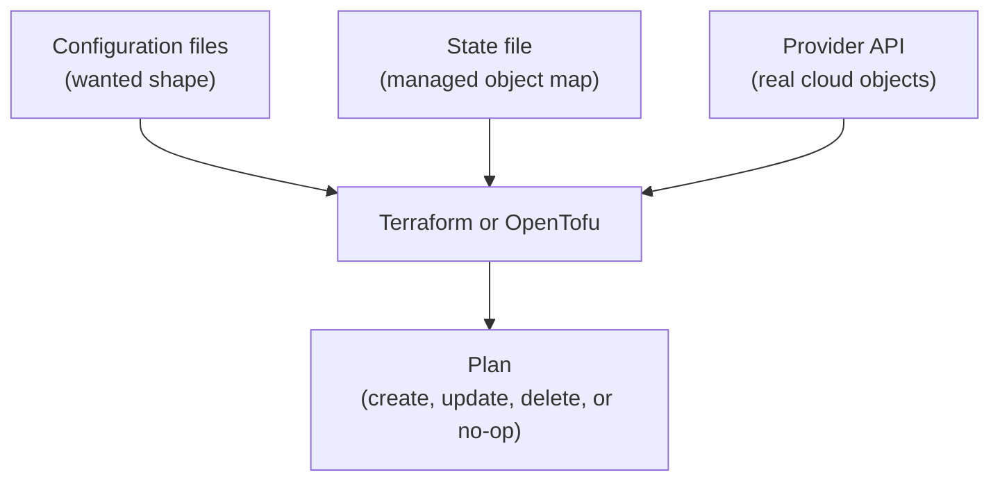

## Table of Contents

1. [What Desired State Means](#what-desired-state-means)
2. [The Shape You Describe and the Shape That Exists](#the-shape-you-describe-and-the-shape-that-exists)
3. [Idempotency: Safe Repeated Runs](#idempotency-safe-repeated-runs)
4. [Terraform Desired State](#terraform-desired-state)
5. [Ansible Desired State](#ansible-desired-state)
6. [When Desired State Still Needs Judgment](#when-desired-state-still-needs-judgment)
7. [Imperative Escape Hatches](#imperative-escape-hatches)
8. [Reading an Idempotent Run](#reading-an-idempotent-run)

## What Desired State Means

Infrastructure work feels easier when you can describe the final shape instead of remembering every step that builds it. You do not want a runbook that says "open this page, click this tab, choose the second dropdown, then paste this value." You want a file that says "the orders API needs a private storage bucket, a role that can write invoices, and a service endpoint that is reachable through HTTPS."

That final shape is called desired state. Desired state means the state you want the system to have after the tool finishes. The tool compares that wanted shape with reality, decides what is missing or different, and makes only the required changes. In a cloud provisioning tool, the desired state may be resources and their settings. In a server configuration tool, the desired state may be packages, files, services, users, and permissions.

The reason this idea exists is operational memory. Humans are good at understanding intent, but poor at repeating long sequences exactly. Tools are good at comparing structured data and repeating the same operation the same way. IaC puts those strengths together: humans write and review the intended shape, then the tool handles the mechanical work of reaching it.

Desired state sits at the center of both Terraform and Ansible, but the tools use it differently. Terraform and OpenTofu usually manage infrastructure resources by talking to provider APIs. Ansible usually manages machines by connecting to them and running modules against the operating system. The shared mental model is still the same: describe the outcome, let the tool inspect reality, and change only what needs changing.

For this article, keep using the `devpolaris-orders` API. The team wants a production invoice bucket and an Nginx configuration on a web host. Terraform is a good fit for the bucket. Ansible is a good fit for the Nginx file. The same team may use both tools in one operating model.

## The Shape You Describe and the Shape That Exists

Every IaC run has two shapes in mind. The first shape is written in your files. The second shape is the real infrastructure that exists right now. Most of the work is the comparison between those shapes.

Here is the desired shape for a storage bucket, written in Terraform style:

```hcl
resource "aws_s3_bucket" "orders_invoices" {
  bucket = "dp-orders-invoices-prod"

  tags = {
    service     = "orders-api"
    environment = "prod"
    owner       = "platform"
  }
}
```

That file does not say "click Create bucket" or "call this API endpoint first." It says the bucket should exist with a specific name and tags. Terraform works out whether the bucket is missing, already present in state, or different from the file.

Here is the desired shape for a service configuration, written in Ansible style:

```yaml
- name: Configure orders web host
  hosts: orders_web
  become: true
  tasks:
    - name: Render nginx site config
      ansible.builtin.template:
        src: orders-api.conf.j2
        dest: /etc/nginx/sites-available/orders-api.conf
        mode: "0644"

    - name: Enable nginx
      ansible.builtin.service:
        name: nginx
        state: started
        enabled: true
```

This file says the config file should have content generated from a template, the file mode should be `0644`, and Nginx should be started and enabled at boot. It does not say "only do this if the file changed." The Ansible modules check that for you.

The comparison has three common outcomes:

| Comparison Result | What The Tool Does |
|-------------------|--------------------|
| Desired state already matches reality | Reports no change and exits successfully. |
| Something is missing | Creates or installs the missing thing. |
| Something differs | Updates the real system to match the file. |

The fourth outcome is the dangerous one: the desired state asks for something that would replace or destroy an existing resource. That may be exactly what the team wants, or it may be a sign that a name, identity, or dependency changed by accident. Plans and safe-change review exist for that moment, and the next article covers it directly.

## Idempotency: Safe Repeated Runs

Idempotency means an operation can run more than once and still produce the same final result. If a tool creates a bucket the first time, then runs again and creates a second bucket with a slightly different name, it is not idempotent. If a tool installs the same package every time and reports a change every time, it is not behaving well for operations. A good IaC tool should be able to say, "nothing to do; the system already matches the file."

You already know this idea from application code. An HTTP `GET /orders/123` request should be safe to repeat because reading the same order does not create another order. An HTTP `POST /orders` request usually creates a new order each time, so repeating it can produce duplicates. IaC work should feel more like the first case when the desired state already exists.

Idempotency matters because infrastructure runs are often repeated. A CI job may run validation on every pull request. A production apply may be retried after a network timeout. An Ansible playbook may run nightly to keep servers aligned. If each run creates more resources, appends duplicate lines, restarts healthy services, or changes permissions unnecessarily, the automation becomes a source of drift instead of a defense against it.

Here is a simple idempotent expectation:

```text
First run:
  create bucket dp-orders-invoices-prod
  attach policy orders-api-write-invoices
  result: changed

Second run:
  bucket already exists and matches configuration
  policy already exists and matches configuration
  result: no changes
```

The second run is the proof. The tool checked the system and found that the desired state was already true.

An idempotent run is also easier to trust in automation. If a playbook reports `changed=0` on the second run, the operator knows the server stayed stable. If a Terraform plan shows no changes after an apply, the operator knows the stored configuration, state, and provider view are aligned enough for the tool to proceed without action.

Idempotency does not mean "no risk." A file can idempotently describe a bad security rule. A playbook can idempotently enforce a wrong config value. A Terraform module can idempotently keep a database publicly reachable if the file says so. Idempotency gives repeatability; review gives judgment.

## Terraform Desired State

Terraform and OpenTofu use provider plugins to manage infrastructure through APIs. A provider is the bridge between the tool and a platform such as AWS, Azure, GCP, GitHub, Cloudflare, or Kubernetes. You write resources in configuration files. The tool asks the provider what exists, compares that with the configuration and state, then proposes actions.

The state file is important. State is Terraform's record of which real-world object belongs to which resource address in your code. For example, the address `aws_s3_bucket.orders_invoices` may map to the real bucket `dp-orders-invoices-prod`. Without state, Terraform would see the file but would not know which existing cloud object it is responsible for.

Think of state like a careful inventory sheet. The file says what the team wants. The cloud provider says what exists. State says which existing objects are managed by this configuration. When those three line up, the tool can make careful decisions.



A simple Terraform workflow usually has three commands:

```bash
$ terraform init
$ terraform plan
$ terraform apply
```

`init` prepares the working directory and downloads providers. `plan` compares desired state with reality and shows what would change. `apply` carries out the approved change. OpenTofu uses the same style of workflow with `tofu init`, `tofu plan`, and `tofu apply`.

Here is a small plan-style output, simplified for reading:

```text
Terraform will perform the following actions:

  # aws_s3_bucket.orders_invoices will be created
  + resource "aws_s3_bucket" "orders_invoices" {
      + bucket = "dp-orders-invoices-prod"
      + tags   = {
          + "environment" = "prod"
          + "owner"       = "platform"
          + "service"     = "orders-api"
        }
    }

Plan: 1 to add, 0 to change, 0 to destroy.
```

The plan is the moment where desired state becomes reviewable operational evidence. The file shows intent. The plan shows the tool's interpretation of that intent. A reviewer should inspect both.

## Ansible Desired State

Ansible usually works differently because it does not keep a Terraform-style state file for every managed object. Instead, Ansible connects to hosts from an inventory and runs modules that know how to inspect and change the host. The inventory tells Ansible which machines are targets. The playbook tells Ansible what state those machines should reach.

For example, this task says the `nginx` package should be installed:

```yaml
- name: Install nginx
  ansible.builtin.apt:
    name: nginx
    state: present
```

If Nginx is missing, the task installs it and reports `changed`. If Nginx is already installed, the task reports `ok` with no change. The module handles the check. The playbook author does not need to write shell logic like `if ! dpkg -l nginx; then apt-get install nginx; fi`.

That difference matters. Ansible can be idempotent when you use modules that understand state. It becomes less reliable when you use raw shell commands for work that a module could do. A shell command like this may report change every time, even if the line already exists:

```yaml
- name: Add custom line by shell
  ansible.builtin.shell: echo "client_max_body_size 20m;" >> /etc/nginx/nginx.conf
```

That task appends a line. Run it ten times and you may get ten copies. The better approach is to use a module that manages a specific line or template:

```yaml
- name: Set upload size in nginx config
  ansible.builtin.lineinfile:
    path: /etc/nginx/nginx.conf
    regexp: "^client_max_body_size"
    line: "client_max_body_size 20m;"
```

Now Ansible can check whether the line exists, update it if needed, and leave it alone when it already matches. The desired state is the line content, not the act of appending text.

Ansible also has check mode and diff mode. Check mode asks Ansible to predict changes without applying them. Diff mode shows content differences for supported modules. They are not a perfect replacement for a real test environment, but they give operators a way to preview server changes before touching production.

```bash
$ ansible-playbook -i inventory.ini site.yml --check --diff
```

A healthy Ansible habit is to run small, targeted changes first. Use an inventory group, a `--limit`, or a canary host instead of pointing an untested playbook at every production server at once. Desired state is useful, but target selection still controls blast radius.

## When Desired State Still Needs Judgment

Desired state tools are careful, but they are not wise by themselves. They do not know whether a production database should be replaced today. They do not know whether a public endpoint is acceptable for your company. They do not know whether an instance type is too expensive or too small. The files express human decisions, and the tools execute those decisions.

One common beginner mistake is assuming that a green plan is the same as a good change. A plan can be syntactically valid and still dangerous:

```text
Plan: 2 to add, 1 to change, 1 to destroy.
```

That summary requires attention. The destroy may be harmless, such as replacing a temporary test rule. It may be serious, such as replacing a database, deleting a log archive, or recreating a load balancer with a new DNS name. The tool is telling you what it intends to do, not whether the business risk is acceptable.

Another mistake is treating "no changes" as proof that everything is healthy. A no-change plan means the tool sees no difference between the configuration, state, and provider view that it manages. It does not prove the application is passing health checks. It does not prove the database has recent backups. It does not prove a manually created resource outside this configuration is safe.

For Ansible, a clean second run is a good sign, but it does not prove the service is serving traffic. The playbook may start Nginx successfully while the upstream application is down. You still need service checks, logs, metrics, and application-level verification.

Use this mental split:

| Question | IaC Tool Can Help? | What Else You Need |
|----------|--------------------|--------------------|
| Does this resource match the file? | Yes | Review the file and plan. |
| Is the service healthy for users? | Partly | Health checks, logs, metrics, and tests. |
| Is this permission safe? | Partly | Security review and least-privilege reasoning. |
| Is this cost acceptable? | Partly | Budget, usage, and business context. |
| Is now the right time to apply? | No | Release coordination and incident awareness. |

The tool gives evidence. The team makes the decision.

## Imperative Escape Hatches

Desired state tools still allow imperative commands. Imperative means "do these steps in this order." Declarative means "make the final shape look like this." Both styles can be useful, but they have different risks.

Terraform has escape hatches such as provisioners and local commands. Ansible has `shell` and `command` modules. These are sometimes necessary. You may need to run a database migration command, call an internal API, or execute a vendor tool that has no better module. The risk is that imperative commands often hide whether the desired state already exists.

Compare these two Ansible tasks:

```yaml
- name: Create app directory with shell
  ansible.builtin.shell: mkdir /opt/orders-api
```

```yaml
- name: Create app directory with file module
  ansible.builtin.file:
    path: /opt/orders-api
    state: directory
    mode: "0755"
```

The first task fails if the directory already exists unless you add extra shell logic. The second task expresses the desired state directly. The directory should exist, and it should have mode `0755`. If it already exists correctly, Ansible reports no change.

For Terraform, a provisioner that runs a script on a newly created machine may feel convenient. The operational problem is that the script becomes part of infrastructure creation but may not be represented clearly in the plan. If the script half-succeeds, the resource may exist while its internal configuration is broken. Many teams prefer to use images, cloud-init, configuration management, or container deployment steps instead of relying heavily on Terraform provisioners.

This does not mean every command is bad. It means commands need a reason. Before adding an imperative escape hatch, ask:

| Question | Why It Matters |
|----------|----------------|
| Can a native resource or module express this state? | Native resources usually give better diff and idempotency. |
| What happens on the second run? | Repeated runs should not duplicate work or corrupt state. |
| How will the tool know it succeeded? | Hidden side effects are hard to review and recover. |
| How will failure be retried? | Half-finished commands can leave awkward systems behind. |
| Can this move to CI/CD or app deployment instead? | Not every operational step belongs inside IaC. |

The safest IaC files read more like descriptions than scripts. When a file becomes a long list of clever shell commands, future maintainers have to mentally execute it to understand the result.

## Reading an Idempotent Run

The fastest way to build judgment is to read tool output carefully. Do not only look for "success." Look for what changed, what did not change, and whether the result matches the story in the pull request.

For Terraform or OpenTofu, a good first apply might end like this:

```text
Plan: 1 to add, 0 to change, 0 to destroy.

aws_s3_bucket.orders_invoices: Creating...
aws_s3_bucket.orders_invoices: Creation complete after 3s

Apply complete! Resources: 1 added, 0 changed, 0 destroyed.
```

The follow-up plan should be quiet:

```text
No changes. Your infrastructure matches the configuration.
```

That no-change result means the desired state and managed reality agree. If you immediately get another planned change, investigate before moving on. It may be a harmless computed value, but it may also mean the configuration is fighting a provider default or an external process.

For Ansible, a first run might look like this:

```text
PLAY RECAP
orders-web-01 : ok=6 changed=3 unreachable=0 failed=0 skipped=0 rescued=0 ignored=0
```

The second run should usually show fewer changes:

```text
PLAY RECAP
orders-web-01 : ok=6 changed=0 unreachable=0 failed=0 skipped=0 rescued=0 ignored=0
```

`changed=0` is what you want after the host already matches the playbook. If the same task reports changed every time, the playbook may be non-idempotent. Common causes include shell commands, templates with timestamps, tasks that always restart services, and commands that do not have a stable check condition.

A useful review habit is to ask for the second-run evidence when a playbook is meant to enforce ongoing configuration. The first run proves the tool can make the change. The second run proves the playbook can leave a correct system alone.

Desired state and idempotency are the quiet mechanics that make IaC useful. They let you move from "I hope this run does the right thing" to "the tool can explain what differs, change what differs, and leave matching systems alone." That is the foundation you need before reading Terraform plans or Ansible play recaps in production.

---

**References**

- [Terraform workflow for provisioning infrastructure](https://developer.hashicorp.com/terraform/cli/run) - Explains how Terraform evaluates configuration and produces plans before apply.
- [Terraform state](https://developer.hashicorp.com/terraform/language/state) - Describes how Terraform maps configuration to real infrastructure objects.
- [OpenTofu state commands](https://opentofu.org/docs/cli/state/) - Gives operational guidance for treating state carefully in OpenTofu.
- [Ansible playbooks](https://docs.ansible.com/ansible/latest/playbook_guide/playbooks_intro.html) - Introduces playbooks, tasks, and idempotent modules.
- [Ansible check mode and diff mode](https://docs.ansible.com/ansible/latest/playbook_guide/playbooks_checkmode.html) - Covers previewing supported playbook changes before applying them.
