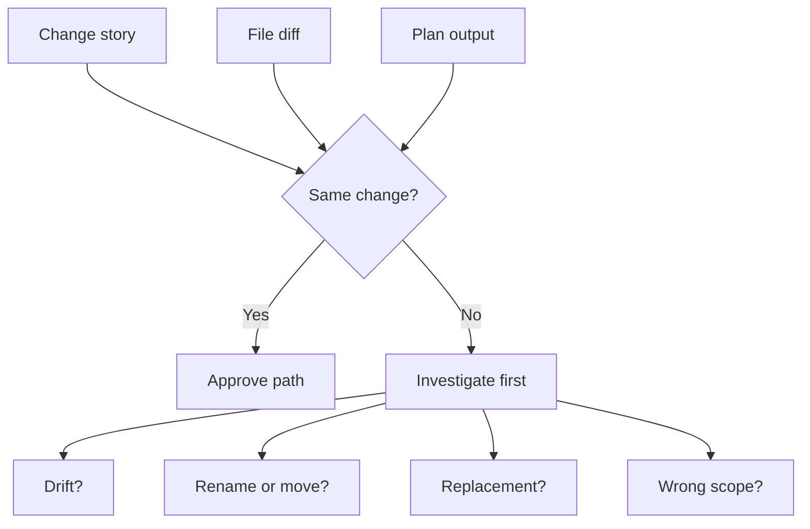
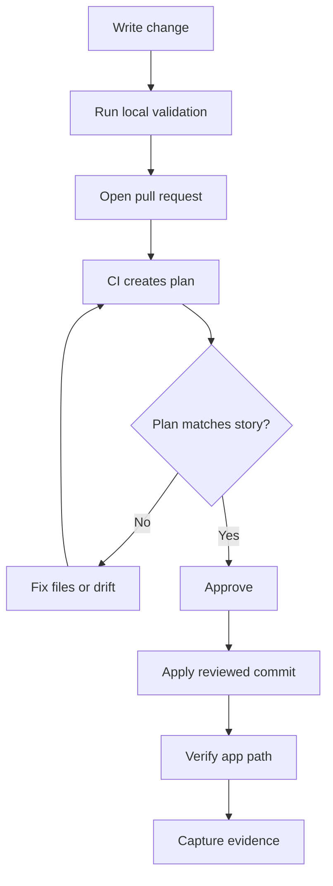

## Table of Contents

1. [The Problem](#the-problem)
2. [Plans](#plans)
3. [Drift](#drift)
4. [Review](#review)
5. [Blast Radius](#blast-radius)
6. [Imports](#imports)
7. [CI Checks](#ci-checks)
8. [Apply](#apply)
9. [Verify](#verify)
10. [Sample Change Routine](#sample-change-routine)
11. [Putting It All Together](#putting-it-all-together)

## The Problem

The orders team now has infrastructure files and understands desired state. A developer opens a pull request to add invoice export storage. The change looks small: one bucket, one app role permission, and one log retention setting.

The plan says something else.

```text
Plan: 2 to add, 1 to change, 1 to destroy.
```

The two additions may be right. The change may be fine. The destroy is the reason to stop and read.

- Maybe the plan is removing an old public SSH rule that should disappear.
- Maybe the plan is deleting a production bucket because a resource name changed.
- Maybe someone changed the console last week, and the files no longer match reality.
- Maybe the tool wants to replace a resource because a field cannot be updated in place.

IaC is safest when the team treats every infrastructure change as a proposal first. A plan or dry run is the proposal. Drift checks explain when reality stopped matching the files. Blast radius habits keep one mistake from changing too much at once.

## Plans

A plan is a preview of the actions an IaC tool believes it will take. Terraform and OpenTofu use `plan` as a first-class command. Ansible has check mode and diff mode for supported modules. Different tools expose different details, but the review habit is the same: inspect the proposed change before applying it to a shared system.

A plan is not a promise that nothing can go wrong. Provider APIs can fail. Permissions can be missing. A resource can change between plan and apply. A dependent service can behave unexpectedly. The plan is still valuable because it catches many mistakes while they are still text.

Read plans at two levels.

| Level | Question |
| --- | --- |
| Summary | Do the counts match the pull request story? |
| Resource detail | Do the exact resources and fields match what the team intended? |

If the pull request says "add invoice exports" and the plan says `2 to add, 0 to change, 0 to destroy`, the summary is plausible. If the plan says it will replace the database, the summary conflicts with the story. The reviewer should ask why before approval.

Symbols and wording vary, but the action types are usually familiar:

| Action | Meaning | Review posture |
| --- | --- | --- |
| Add | A missing object will be created | Confirm name, location, owner, tags, and access. |
| Change | Existing object settings will be updated | Confirm the changed fields and runtime impact. |
| Replace | Old object will be destroyed and recreated | Treat as high risk until proven safe. |
| Destroy | Managed object will be removed | Require a clear reason and recovery plan. |
| No change | Managed object already matches | Useful evidence when no change is expected. |

The plan should be read with the pull request, not apart from it. The file diff explains intent. The plan explains what the tool thinks that intent means in reality.

## Drift

Drift happens when reality no longer matches the IaC files or the tool's state. Drift is common because real systems are touched by people, automation, providers, and incidents.

Imagine a production outage. Someone opens the console and increases a database size to stop an immediate problem. That may be the right emergency move. If the change never returns to the IaC files, the next plan may try to undo it, ignore it, or show confusing differences. The system has drifted.

Drift can also happen without a dramatic incident:

| Drift source | Example |
| --- | --- |
| Manual console edit | A security group rule is added for debugging. |
| Emergency hotfix | A database class is increased during an outage. |
| Provider default | A new default field appears in API responses. |
| External automation | A lifecycle rule or tag is changed by another job. |
| Unmanaged resource | A bucket exists, but the IaC tool has never imported it. |

Drift is not always bad. Sometimes reality changed for a good reason and the files need to catch up. Sometimes reality changed accidentally and should be corrected. The unhealthy habit is ignoring drift until an apply surprises the team.

The better habit is to run plans regularly, especially before sensitive changes, and treat unexpected differences as design questions. Should the file change? Should reality change back? Should the resource be imported? Should the tool stop managing that field?

## Review

Infrastructure review should connect three pieces of evidence: the human story, the file diff, and the plan.

The human story says why the change exists. The file diff shows what the engineer edited. The plan shows what the tool expects to do to the real system. If those three disagree, approval should pause.



This diagram adds information that a checklist hides: the plan is not reviewed alone. It must agree with the reason for the work and the exact files changed.

For the invoice export change, a reviewer might ask:

| Evidence | Healthy sign |
| --- | --- |
| Story | The change says invoices need private export storage. |
| File diff | The diff adds a bucket, blocks public access, and narrows app write permission. |
| Plan summary | The plan adds the expected resources and does not touch unrelated systems. |
| Plan detail | Names, regions, tags, retention, and permissions match the intended environment. |

If any line looks wrong, the answer is not "never apply." The answer is "make the proposal explain itself before production changes."

## Blast Radius

Blast radius is the amount of damage a bad change can cause. IaC gives teams leverage, which means a bad IaC change can also have leverage. A single apply may touch many resources if the project is too broad.

Smaller blast radius makes plans easier to read and failures easier to recover from. It does not mean every resource needs its own repository. It means the unit of change should be understandable.

Common blast radius controls include:

| Control | What it protects |
| --- | --- |
| Separate environments | A development apply cannot accidentally change production. |
| Smaller root modules or stacks | One plan does not include unrelated networks, databases, and apps. |
| State locking | Two applies do not race against the same managed objects. |
| Protected resources | Deletion protection and lifecycle rules slow down destructive mistakes. |
| Narrow credentials | CI for one environment cannot administer every environment. |
| Approval gates | Sensitive applies require human review before execution. |

There is a tradeoff. Too many tiny stacks can make dependencies hard to follow. One huge stack can make every change feel dangerous. The useful question is: can a reviewer understand what this apply is allowed to change?

## Imports

Existing resources need special care. A team may already have buckets, databases, networks, and roles that were created manually before IaC arrived. Writing a matching resource block in a file does not automatically make the tool understand that the existing object is the same one.

Without import or adoption, the tool may try to create a duplicate, fail because a name is already taken, or plan a destructive replacement. Import connects an existing real resource to a resource address in the IaC tool's management state.

The safe adoption habit has three steps:

1. Describe the existing resource in files as accurately as possible.
2. Import or adopt the existing resource into the tool's state.
3. Run a plan and reduce unexpected differences before allowing routine applies.

Import is not glamorous, but it is one of the places where careful teams avoid damage. The goal is to bring existing reality under review without pretending the resource was newly created by the files.

## CI Checks

Infrastructure changes benefit from the same review automation as application code, but the checks answer infrastructure-specific questions.

A simple pull request pipeline might run:

| Check | Question it answers |
| --- | --- |
| Format | Are the files written in the expected style? |
| Validate or lint | Can the tool parse the files and basic schema? |
| Security policy checks | Is the proposal violating obvious rules, such as public storage or broad admin access? |
| Plan or check mode | What does the tool expect to change? |
| Artifact upload | Can reviewers read the plan without rerunning the job locally? |

CI should not turn infrastructure review into a rubber stamp. A green validation check only says the files are understandable. A plan artifact still needs a human or policy system to decide whether the proposed change is appropriate.

For higher-risk environments, teams often separate "plan" from "apply." The pull request produces the plan. A protected workflow, environment approval, or release process performs the apply after review.

## Apply

Apply is when the proposal becomes real. By this point, the team should know what the tool intends to change and which environment is being targeted.

Safe apply habits are intentionally plain:

| Habit | Why it matters |
| --- | --- |
| Use the reviewed commit | The applied files should match what reviewers approved. |
| Lock shared state | Concurrent applies can corrupt assumptions. |
| Target the intended environment | Wrong workspace, project, subscription, account, or region can be worse than a syntax error. |
| Avoid casual targeted applies | Forcing only part of the graph can hide dependencies. |
| Keep logs and artifacts | Apply output becomes operational evidence. |

Targeted applies and one-off flags can be useful during recovery, but they deserve caution. They often bypass the normal graph or review path. If a team uses them, the follow-up should bring the regular files and state back to a calm, explainable place.

## Verify

The change is not finished when the tool exits successfully. IaC tools can tell you that an API accepted a resource change or a host reported a task as changed. They do not always prove that the application still works.

Verification should match the change.

| Change | Useful verification |
| --- | --- |
| Add bucket and role permission | App can write a test invoice object through its normal identity. |
| Change load balancer routing | Health checks pass and a real request reaches the expected service. |
| Update database size | Database is available, metrics are healthy, and backups still meet policy. |
| Change server config | Service restarted only if needed and responds on the expected port. |

Verification closes the loop between infrastructure intent and user impact. The apply changed resources. Verification proves the system still behaves.

## Sample Change Routine

Here is a compact routine for the orders team's invoice export change.



The routine is deliberately ordinary. Its strength is not drama. It is that every risky moment has a place to pause: before review, before apply, and after apply.

## Putting It All Together

The orders team opened a small pull request and saw a plan that included a destroy. The safe response was not panic and not blind approval. It was to compare the story, diff, and plan.

- Plans preview the tool's proposed actions before real systems change.
- Drift explains why reality may differ from the files or state.
- Review connects the human reason, file diff, and plan output.
- Blast radius controls keep one mistake from touching too much.
- Imports let existing resources become managed without pretending they are new.
- CI checks make the evidence repeatable.
- Apply and verify finish the change by proving both infrastructure and application behavior.

That is the foundation for the rest of the IaC roadmap. Terraform, OpenTofu, Ansible, modules, state backends, inventories, roles, and rollout patterns all build on the same habit: make infrastructure changes visible before they become real.

---

**References**

- [Terraform plan command](https://developer.hashicorp.com/terraform/cli/commands/plan)
- [Terraform state](https://developer.hashicorp.com/terraform/language/state)
- [OpenTofu core workflow](https://opentofu.org/docs/intro/core-workflow/)
- [Ansible check mode](https://docs.ansible.com/ansible/latest/playbook_guide/playbooks_checkmode.html)
